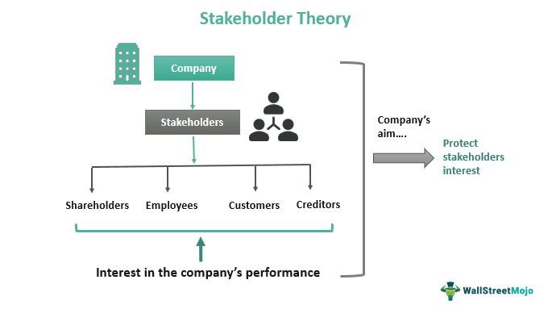

The investment world consistently undergoes transformation driven by the advent of innovative strategies and technological advancements. A detailed examination of dividend suspension, shareholding decisions, and algorithmic trading reveals unique insights that are pivotal for constructing a comprehensive investment strategy. Each of these components plays a distinct role and, when effectively integrated, can offer optimized returns.

Dividend suspension often signals important changes within a company, necessitating a careful analysis of its financial health and future growth prospects. Shareholding decisions require periodic assessment, guided by market conditions and corporate announcements, to ensure alignment with investment goals. Meanwhile, algorithmic trading utilizes advanced technology to enhance the speed and accuracy of trade execution, thus facilitating more systematic and efficient market operations.



By incorporating dividend strategies and algorithmic trading within a unified investment framework, investors can achieve significant benefits. This integration allows for the balancing of stable income from dividends with potential capital growth, supported by the tactical insights provided by algorithmic trading. The exploration of these components underscores their potential for creating a robust and adaptable investment strategy. Through careful consideration and strategic alignment, investors can harness these elements to navigate and capitalize on the evolving financial landscape.

## Table of Contents

## Dividend Suspension: Impacts and Strategies

Dividend suspension is often an indicator of significant financial shifts within a company, suggesting either a strategic financial restructuring or a response to broader economic challenges. When a company announces a dividend suspension, it can signal to investors that the company is prioritizing cash conservation to navigate uncertain financial conditions or invest in core business operations. This decision often leads investors to scrutinize the underlying reasons carefully, as it may reflect deeper issues within the company's financial health.

Understanding the implications of dividend suspension requires a multifaceted approach. Investors typically begin by analyzing the company's recent financial performance and strategic direction. This includes examining the balance sheet, income statement, and cash flow statement to assess the company's ability to generate profits and maintain liquidity. A critical aspect of this evaluation involves understanding whether the suspension is part of a temporary measure to weather economic downturns or a more permanent shift in company policy due to structural changes in the business model.

Upon the suspension announcement, investors are faced with the decision of whether to hold or sell their shares. This decision is influenced by the company's rationale behind the suspension and the prevailing market conditions. An investor might consider holding the stock if the suspension is accompanied by a credible plan for growth and recovery, signaling potential for future dividend reinstatement and capital appreciation. Alternatively, if the suspension points to underlying financial distress without a clear turnaround strategy, selling might be a more prudent option.

Reassessing the stock's intrinsic value and future growth potential is paramount following a dividend suspension. The intrinsic value of a stock is typically recalibrated based on revised expectations of future cash flows. Investors might employ valuation models, such as the Discounted Cash Flow (DCF) analysis, to estimate the present value of expected future cash flows, adjusting for any changes in growth projections or risk profile. The DCF formula is represented as:

$$
DCF = \sum_{t=1}^{n} \frac{CF_t}{(1 + r)^t}
$$

where $CF_t$ is the cash flow in year $t$, $r$ is the discount rate, and $n$ is the number of years projected.

Additionally, scrutinizing financial statements provides valuable insights into both the quality of earnings and the likelihood of future dividend distributions. Key metrics such as the current ratio, debt-to-equity ratio, and interest coverage ratio offer a snapshot of the company's financial health and its capacity to weather periods without dividend payouts.

Ultimately, dividend suspension is not just a reflection of a company's immediate circumstances but a signal for investors to employ diligent analysis and strategic decision-making. By understanding the nuances of financial health and market conditions, investors can make informed decisions, balancing the risks and potential rewards associated with a suspended dividend.

## Shareholding Decisions in Changing Market Conditions

Investors frequently encounter pivotal moments when deciding whether to buy, hold, or sell their shares. These shareholding decisions are often dictated by fluctuating market conditions and significant corporate announcements. To navigate these changes effectively, understanding the intrinsic value and market potential of a stock is crucial.

Intrinsic value represents the perceived true value of a stock, based on an objective evaluation of its assets, earnings, and growth prospects. This valuation process often involves discounted cash flow (DCF) analysis, which estimates the present value of expected future cash flows:

$$

DCF = \sum \frac{CF_t}{(1 + r)^t} 
$$

where $CF_t$ is the cash flow in year $t$ and $r$ is the discount rate. Determining a stock's intrinsic value helps investors make informed decisions, distinguishing between market price fluctuations driven by sentiment and those reflecting changes in underlying fundamentals.

Market dynamics differ for long-term investors compared to short-term traders. Long-term investors typically prioritize [fundamental analysis](/wiki/fundamental-analysis), focusing on a company’s financial health, competitive position, and historical performance. This approach involves scrutinizing financial statements, assessing revenue growth, profitability, and debt levels to determine the stock’s long-term viability and sustainability.

In contrast, short-term traders are often more responsive to market trends and technical indicators. These investors leverage chart patterns, price movements, and trading volumes to capitalize on short-term price fluctuations. Tools like moving averages and the relative strength index (RSI) are commonly employed to gauge market [momentum](/wiki/momentum) and overbought or oversold conditions.

A comprehensive strategy accounts for both external market signals and internal company valuations. External signals can include macroeconomic indicators, fiscal policy changes, and industry trends. Internal valuations focus on a company’s earnings reports, strategic initiatives, and management effectiveness.

The decision-making process is further influenced by behavioral finance, which examines the psychological factors affecting investors' choices. Cognitive biases, such as overconfidence and herd behavior, can lead to suboptimal decisions. A disciplined and structured approach that combines rational analysis with an understanding of these biases is essential for sound shareholding decisions.

Thus, balancing the intrinsic value assessment with market dynamics and psychological insights equips investors to adapt to evolving market conditions, optimizing their portfolio's performance over time.

## Algorithmic Trading: Revolutionizing Investment Strategies

Algorithmic trading represents a technological transformation in how trades are executed within financial markets. By leveraging computer algorithms, trades can be performed with remarkable speed and precision, far surpassing human capabilities. These algorithms are pre-programmed to consider a plethora of data points, enabling optimal trade decisions based on predefined criteria.

An essential advantage of [algorithmic trading](/wiki/algorithmic-trading) is its ability to minimize human error, thus increasing the overall efficiency of trade executions. Human traders are prone to emotional decision-making and fatigue, which can lead to inconsistent trading behavior. In contrast, algorithms operate with unwavering consistency, adhering strictly to their programming regardless of market conditions.

Algorithmic trading also plays a crucial role in enhancing market [liquidity](/wiki/liquidity-risk-premium). By facilitating frequent and rapid transactions, it ensures that there are more buyers and sellers actively participating in the market. This not only stabilizes prices but also narrows bid-ask spreads, making markets more efficient and less volatile.

Furthermore, algorithmic trading empowers traders to identify and capitalize on market inefficiencies. These inefficiencies, often fleeting and difficult for human traders to catch, can be systematically exploited using algorithms. Various strategies such as [arbitrage](/wiki/arbitrage), [trend following](/wiki/trend-following), and [market making](/wiki/market-making) are deployed to take advantage of discrepancies in pricing, ensuring profit generation in a manner imperceptible to manual trading methods.

Integrating algorithms with traditional trading strategies also offers significant benefits. Algorithms can analyze vast amounts of historical and real-time data, providing enhanced insights that can inform strategic decision-making. For instance, combining algorithmic trend analysis with fundamental evaluation of company performance can yield a more comprehensive understanding of a stock's potential.

The intersection of advanced technologies and conventional investment approaches presents a formidable strategy for modern traders. Utilizing algorithms allows for the efficient implementation of systematic trading approaches, ensuring that decisions are made based on data-driven insights, free from emotional bias. 

In conclusion, the revolution brought forth by algorithmic trading significantly refines investment strategies by ensuring high-speed execution, reducing errors, and facilitating market liquidity. Traders who adapt to and employ these technologies gain a substantial edge, navigating through market complexities with enhanced capability and insight.

## Integrating Dividends and Algorithmic Trading

Integrating traditional dividend analysis with modern algorithmic trading presents a comprehensive approach that enhances investment outcomes. This synergy leverages advanced computational techniques to assess the sustainability of dividends and forecast potential growth, facilitating more informed and strategic investment decisions.

Algorithms can process large volumes of financial data to evaluate dividend sustainability. By analyzing historical dividend trends, cash flows, earnings reports, and economic indicators, algorithms can predict whether a company is likely to maintain or increase its dividend payouts. For example, an algorithm might use linear regression to predict future dividends based on historical data, such as:

```python
import numpy as np
from sklearn.linear_model import LinearRegression

# Historical data of dividends
years = np.array([1, 2, 3, 4, 5]).reshape(-1, 1)
dividends = np.array([2.0, 2.1, 2.3, 2.5, 2.7])

# Fit the model
model = LinearRegression().fit(years, dividends)

# Predict next year's dividend
predicted_dividend = model.predict(np.array([[6]]))
print(f"Predicted Dividend: {predicted_dividend[0]:.2f}")
```

By integrating dividend yield analysis—considering the ratio of dividends per share to the market price per share—with algorithmic trends, investors can achieve a balanced approach that captures both income stability and growth potential. Algorithmic trading can identify market inefficiencies and execute trades based on calculated trends, allowing investors to capitalize on these insights while maintaining a steady income from dividend-paying stocks.

This integration optimizes investment strategies by allowing investors to adjust more swiftly to market dynamics. Through algorithms, investors can swiftly analyze how macroeconomic changes, interest rates, and market [volatility](/wiki/volatility-trading-strategies) affect dividend stability and stock prices. This adaptability ensures that portfolios are aligned with current market conditions, providing the dual benefit of generating income through dividends and achieving capital appreciation.

By harmonizing traditional and technology-driven methods, investors position themselves to maximize returns in a complex and rapidly changing financial landscape. This approach not only augments immediate trading decisions but also fortifies long-term investment strategies that seek to balance steady income streams with the potential for capital growth.

## Conclusion

Combining dividend suspension analysis, strategic shareholding, and algorithmic trading offers a comprehensive approach to enhancing investment strategies. Each component plays a crucial role:

1. **Dividend Suspension Analysis:** Understanding the reasons behind dividend suspension allows investors to reassess the financial stability of a company. This analysis aids in determining whether a company's long-term prospects align with an investor’s goals, ensuring informed decision-making.

2. **Strategic Shareholding Decisions:** Evaluating when to buy, hold, or sell shares based on changing market conditions and corporate insights is essential. This strategic decision-making helps maintain a portfolio's alignment with market dynamics, offering a path to sustained growth and risk management.

3. **Algorithmic Trading:** Leveraging technology to execute trades rapidly with high accuracy introduces a significant advantage. Algorithms can interpret vast datasets to capitalize on market inefficiencies, offering enhanced precision and speed in investment execution.

Through the combination of these elements, investors can build a robust strategy that remains adaptable to changing markets. Leveraging both technology and traditional analytics provides a means to balance risk with potential returns, maximizing both income stability and capital growth opportunities. Investors who embrace this integrated approach position themselves to capitalize effectively on a variety of opportunities presented by diverse market conditions. Continuous learning and adaptation are key in this rapidly evolving financial landscape, underscoring the importance of staying informed and responsive to new innovations and trends.

## References & Further Reading

[1]: ["Advances in Financial Machine Learning"](https://www.amazon.com/Advances-Financial-Machine-Learning-Marcos/dp/1119482089) by Marcos Lopez de Prado

[2]: ["Evidence-Based Technical Analysis: Applying the Scientific Method and Statistical Inference to Trading Signals"](https://www.amazon.com/Evidence-Based-Technical-Analysis-Scientific-Statistical/dp/0470008741) by David Aronson

[3]: ["Machine Learning for Algorithmic Trading"](https://github.com/stefan-jansen/machine-learning-for-trading) by Stefan Jansen

[4]: ["Quantitative Trading: How to Build Your Own Algorithmic Trading Business"](https://www.amazon.com/Quantitative-Trading-Build-Algorithmic-Business/dp/1119800064) by Ernest P. Chan

[5]: Fuller, R. J., & Goldstein, M. A. (2004). ["Dividend Policy and Market Reactions."](https://papers.ssrn.com/sol3/papers.cfm?abstract_id=437700) Financial Analysts Journal.

[6]: Poterba, J. M., & Summers, L. H. (1984). ["New Evidence that Taxes Affect the Valuation of Dividends."](https://www.jstor.org/stable/2327734) Journal of Finance, 39(5), 1397-1415.