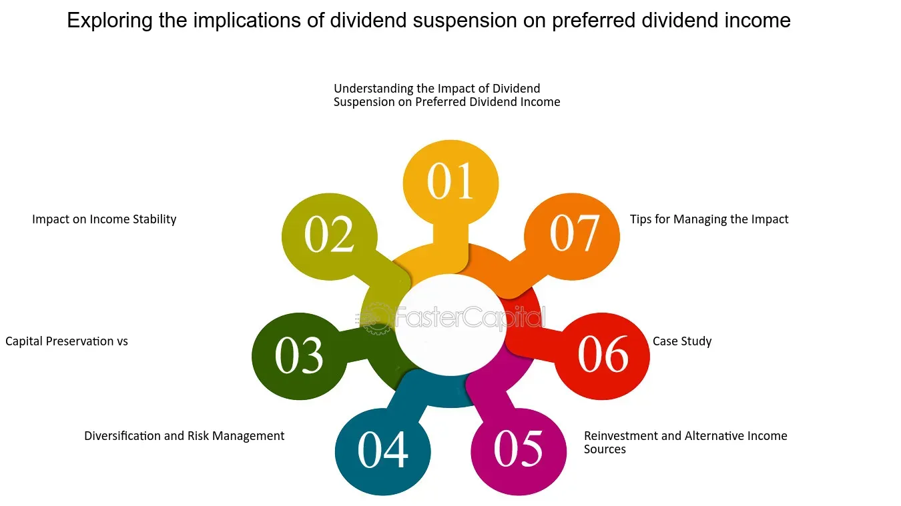

## Table of Contents

## What is a dividend?

A dividend is a payment that a company gives to its shareholders from its profits. When a company makes money, it can choose to share some of that money with the people who own its stock. This payment is usually given out in cash, but sometimes it can be in the form of more stock.

Dividends are often paid regularly, like every three months or once a year. Not all companies pay dividends, though. Some companies, especially newer ones, might decide to use all their profits to grow the business instead of paying dividends. For shareholders, dividends can be a nice way to earn some extra money from their investments.

## Why do companies suspend dividends?

Companies might suspend dividends when they are facing financial difficulties. If a company is not making enough money, it might need to keep all its profits to stay afloat instead of sharing them with shareholders. This can happen during tough economic times or if the company is not doing well in its industry. By suspending dividends, the company can use the money to pay off debts or invest in areas that might help it recover.

Another reason a company might suspend dividends is to save money for future growth. Sometimes, a company might see a big opportunity to expand or start a new project, but it needs more money to do so. Instead of borrowing money or selling more stock, the company might decide to stop paying dividends temporarily. This way, it can use the money that would have gone to shareholders to fund its growth plans.

## How does dividend suspension affect a company's stock price?

When a company decides to stop paying dividends, its stock price often goes down. This happens because many people buy stocks because they want to get those regular dividend payments. If the company stops the dividends, these investors might sell their shares, which can make the stock price drop. Also, when a company suspends dividends, it can make people worried about the company's financial health. They might think the company is in trouble if it can't afford to pay dividends anymore, and this worry can also push the stock price down.

However, the effect on the stock price isn't always bad. Sometimes, if the company explains that it's stopping dividends to invest in something big and promising, investors might see this as a good sign. They might believe that the company is making a smart move for future growth, and this could actually make the stock price go up. So, whether the stock price goes up or down after a dividend suspension can depend a lot on why the company is doing it and how investors feel about the company's future.

## What are the immediate financial impacts on shareholders when dividends are suspended?

When a company stops paying dividends, shareholders immediately lose the money they were expecting to get from those dividends. This can be a big deal for people who depend on dividend payments as part of their income. They might have been using the money to pay bills or save for the future, so when the dividends stop, they have less money coming in.

The other big impact is on the value of the shareholders' investment. When dividends are suspended, the stock price often goes down because investors might sell their shares. This means that if shareholders want to sell their stock right after the dividend suspension, they might get less money for it than they would have before. So, not only do they miss out on the dividend payments, but the value of their investment could also drop.

## How can dividend suspension influence an investor's decision to buy or sell shares?

When a company stops paying dividends, it can make investors think twice about buying its shares. People who like to get regular money from their investments might not want to buy the stock anymore because they won't get those payments. Also, if the company says it's stopping dividends because it's having money problems, investors might worry that the company isn't doing well. This worry can make them decide not to buy the stock or even to sell the shares they already have.

On the other hand, some investors might still want to buy the shares even after dividends are suspended. If the company explains that it's stopping dividends to invest in something big that could help it grow, some investors might see this as a good thing. They might think the company is making a smart move for the future and decide to buy the stock. But, it all depends on why the company is stopping the dividends and how much trust investors have in the company's plans.

## What are the long-term effects of dividend suspension on shareholder value?

When a company stops paying dividends for a long time, it can change how much the company is worth to its shareholders. If the company is having money problems and can't pay dividends, shareholders might lose trust in the company. They might think the company is not doing well and this can make the stock price go down. If the stock price stays low for a long time, shareholders might not see their investment grow as much as they hoped. They might even lose money if they decide to sell their shares when the price is low.

On the other hand, if the company stops dividends to spend money on something that helps it grow, it could be good for shareholders in the long run. If the company's big plans work out, it might start making more money and the stock price could go up. This could make the company more valuable and shareholders might see their investment grow. But, it all depends on if the company's plans work out and how long it takes for them to start making a difference.

## How do different types of investors (e.g., income vs. growth) react to dividend suspension?

Income investors, who rely on regular dividend payments to support their income, often react negatively to dividend suspension. They might depend on these payments for their living expenses, so when a company stops the dividends, it can be a big problem for them. They might feel forced to sell their shares, even if the stock price is low, because they need the money. This can make them lose trust in the company and look for other investments that still pay dividends.

Growth investors, on the other hand, might have a different reaction. They are usually more interested in a company's potential to grow and increase its stock price than in getting regular dividend payments. If a company stops paying dividends to invest in something that could help it grow, growth investors might see this as a good sign. They might believe that the company is making a smart move for the future and decide to keep their shares or even buy more, hoping that the stock price will go up in the long run.

However, both types of investors can be affected by the reasons behind the dividend suspension. If the company is stopping dividends because it's having financial problems, both income and growth investors might worry and decide to sell their shares. But if the company has a clear plan for using the money to grow and explains it well, growth investors might stay positive, while income investors might still be unhappy because they're losing their regular income.

## What are the tax implications for shareholders when dividends are suspended?

When a company stops paying dividends, it means shareholders don't have to pay taxes on those dividend payments anymore. Usually, when you get dividends, you have to pay taxes on them as part of your income. So, if the dividends stop, you won't have that extra tax to pay, which can save you some money.

But, if you decide to sell your shares because the dividends stopped, you might have to pay capital gains tax. This tax depends on how much money you make from selling your shares compared to what you paid for them. If you sell your shares for more than you paid, you have to pay tax on the profit. If the stock price went down after the dividend suspension, you might not make as much profit, or you might even lose money, so you might not have to pay as much tax or any tax at all on the sale.

## How does the market typically react to announcements of dividend suspension?

When a company says it will stop paying dividends, the market often reacts by making the company's stock price go down. This happens because many people buy stocks to get those regular dividend payments. If the company stops the dividends, these investors might sell their shares, which can make the stock price drop. Also, when a company stops paying dividends, it can make people worried about the company's money problems. They might think the company is in trouble if it can't afford to pay dividends anymore, and this worry can also push the stock price down.

However, the market's reaction isn't always the same. Sometimes, if the company explains that it's stopping dividends to invest in something big and promising, investors might see this as a good sign. They might believe that the company is making a smart move for future growth, and this could actually make the stock price go up. So, whether the stock price goes up or down after a dividend suspension can depend a lot on why the company is doing it and how investors feel about the company's future.

## What role does the reason for dividend suspension play in shaping investor behavior?

The reason a company gives for stopping dividends can really change how investors act. If a company says it's stopping dividends because it's having money problems, investors might get worried. They might think the company is not doing well and decide to sell their shares. This can make the stock price go down. People who were counting on the dividends for their income might be especially upset and need to sell their shares to get money, even if the price is low.

On the other hand, if a company says it's stopping dividends to spend money on something that could help it grow, some investors might see this as a good thing. They might believe the company is making a smart move for the future and decide to keep their shares or even buy more. This could make the stock price go up if enough people think the company's plans will work out. So, the reason behind the dividend suspension can make a big difference in how investors feel and what they decide to do with their shares.

## How can companies communicate effectively about dividend suspension to maintain shareholder trust?

When a company decides to stop paying dividends, it's really important for them to talk clearly to their shareholders about why they're doing it. If the company is having money problems, they should be honest about it and explain what they're doing to fix things. This can help shareholders understand the situation and feel more okay with the decision, even if they're not happy about it. If the company is stopping dividends to invest in something big that could help it grow, they should explain the plan and why it's a good idea. This can make shareholders feel more confident about the company's future, even without the dividends.

Good communication can also help keep shareholders from getting too worried or upset. The company should use simple language and be clear about what's going on. They can hold meetings, send out letters, or use their website to keep everyone updated. By being open and honest, the company can show that they care about their shareholders and are thinking about the long-term health of the business. This can help maintain trust, even when tough decisions like stopping dividends have to be made.

## What are the strategic alternatives to dividend suspension that companies might consider, and how do these impact shareholder decisions?

Instead of stopping dividends, a company might choose to lower the amount of the dividend payments. This way, shareholders still get some money, but the company can save some cash too. This can be a good middle ground because shareholders might not be as upset as they would be if the dividends stopped completely. They might see it as a sign that the company is trying to balance its needs with keeping shareholders happy. But, if the cut is too big, some shareholders might still sell their shares, especially if they need the money from dividends.

Another option is for the company to pay dividends in the form of more stock instead of cash. This is called a stock dividend. It can help the company keep its cash while still giving something to shareholders. Some investors might like this because they get more shares without spending more money. But others might not like it because they were counting on the cash to use for their own needs. So, it can make some shareholders happy and others unhappy, depending on what they want from their investments.

A third choice is for the company to start a share buyback program. This means the company uses its money to buy back its own shares from the market. This can make the stock price go up because there are fewer shares available. Shareholders might like this because their shares could be worth more money. But, if they were relying on dividend payments for income, they might not be happy because they're not getting any cash directly. So, a buyback program can be good for shareholders who want their investment to grow in value, but not as good for those who need regular income.

## What are the impacts and strategies related to dividend suspension?

Dividend suspension is often an indicator of significant financial shifts within a company, suggesting either a strategic financial restructuring or a response to broader economic challenges. When a company announces a dividend suspension, it can signal to investors that the company is prioritizing cash conservation to navigate uncertain financial conditions or invest in core business operations. This decision often leads investors to scrutinize the underlying reasons carefully, as it may reflect deeper issues within the company's financial health.

Understanding the implications of dividend suspension requires a multifaceted approach. Investors typically begin by analyzing the company's recent financial performance and strategic direction. This includes examining the balance sheet, income statement, and cash flow statement to assess the company's ability to generate profits and maintain liquidity. A critical aspect of this evaluation involves understanding whether the suspension is part of a temporary measure to weather economic downturns or a more permanent shift in company policy due to structural changes in the business model.

Upon the suspension announcement, investors are faced with the decision of whether to hold or sell their shares. This decision is influenced by the company's rationale behind the suspension and the prevailing market conditions. An investor might consider holding the stock if the suspension is accompanied by a credible plan for growth and recovery, signaling potential for future dividend reinstatement and capital appreciation. Alternatively, if the suspension points to underlying financial distress without a clear turnaround strategy, selling might be a more prudent option.

Reassessing the stock's intrinsic value and future growth potential is paramount following a dividend suspension. The intrinsic value of a stock is typically recalibrated based on revised expectations of future cash flows. Investors might employ valuation models, such as the Discounted Cash Flow (DCF) analysis, to estimate the present value of expected future cash flows, adjusting for any changes in growth projections or risk profile. The DCF formula is represented as:

$$
DCF = \sum_{t=1}^{n} \frac{CF_t}{(1 + r)^t}
$$

where $CF_t$ is the cash flow in year $t$, $r$ is the discount rate, and $n$ is the number of years projected.

Additionally, scrutinizing financial statements provides valuable insights into both the quality of earnings and the likelihood of future dividend distributions. Key metrics such as the current ratio, debt-to-equity ratio, and interest coverage ratio offer a snapshot of the company's financial health and its capacity to weather periods without dividend payouts.

Ultimately, dividend suspension is not just a reflection of a company's immediate circumstances but a signal for investors to employ diligent analysis and strategic decision-making. By understanding the nuances of financial health and market conditions, investors can make informed decisions, balancing the risks and potential rewards associated with a suspended dividend.

## What are the shareholding decisions to consider in changing market conditions?

Investors frequently encounter pivotal moments when deciding whether to buy, hold, or sell their shares. These shareholding decisions are often dictated by fluctuating market conditions and significant corporate announcements. To navigate these changes effectively, understanding the intrinsic value and market potential of a stock is crucial.

Intrinsic value represents the perceived true value of a stock, based on an objective evaluation of its assets, earnings, and growth prospects. This valuation process often involves discounted cash flow (DCF) analysis, which estimates the present value of expected future cash flows:

$$

DCF = \sum \frac{CF_t}{(1 + r)^t} 
$$

where $CF_t$ is the cash flow in year $t$ and $r$ is the discount rate. Determining a stock's intrinsic value helps investors make informed decisions, distinguishing between market price fluctuations driven by sentiment and those reflecting changes in underlying fundamentals.

Market dynamics differ for long-term investors compared to short-term traders. Long-term investors typically prioritize [fundamental analysis](/wiki/fundamental-analysis), focusing on a company’s financial health, competitive position, and historical performance. This approach involves scrutinizing financial statements, assessing revenue growth, profitability, and debt levels to determine the stock’s long-term viability and sustainability.

In contrast, short-term traders are often more responsive to market trends and technical indicators. These investors leverage chart patterns, price movements, and trading volumes to capitalize on short-term price fluctuations. Tools like moving averages and the relative strength index (RSI) are commonly employed to gauge market [momentum](/wiki/momentum) and overbought or oversold conditions.

A comprehensive strategy accounts for both external market signals and internal company valuations. External signals can include macroeconomic indicators, fiscal policy changes, and industry trends. Internal valuations focus on a company’s earnings reports, strategic initiatives, and management effectiveness.

The decision-making process is further influenced by behavioral finance, which examines the psychological factors affecting investors' choices. Cognitive biases, such as overconfidence and herd behavior, can lead to suboptimal decisions. A disciplined and structured approach that combines rational analysis with an understanding of these biases is essential for sound shareholding decisions.

Thus, balancing the intrinsic value assessment with market dynamics and psychological insights equips investors to adapt to evolving market conditions, optimizing their portfolio's performance over time.

## References & Further Reading

[1]: ["Advances in Financial Machine Learning"](https://www.amazon.com/Advances-Financial-Machine-Learning-Marcos/dp/1119482089) by Marcos Lopez de Prado

[2]: ["Evidence-Based Technical Analysis: Applying the Scientific Method and Statistical Inference to Trading Signals"](https://www.amazon.com/Evidence-Based-Technical-Analysis-Scientific-Statistical/dp/0470008741) by David Aronson

[3]: ["Machine Learning for Algorithmic Trading"](https://github.com/stefan-jansen/machine-learning-for-trading) by Stefan Jansen

[4]: ["Quantitative Trading: How to Build Your Own Algorithmic Trading Business"](https://www.amazon.com/Quantitative-Trading-Build-Algorithmic-Business/dp/1119800064) by Ernest P. Chan

[5]: Fuller, R. J., & Goldstein, M. A. (2004). ["Dividend Policy and Market Reactions."](https://papers.ssrn.com/sol3/papers.cfm?abstract_id=437700) Financial Analysts Journal.

[6]: Poterba, J. M., & Summers, L. H. (1984). ["New Evidence that Taxes Affect the Valuation of Dividends."](https://www.jstor.org/stable/2327734) Journal of Finance, 39(5), 1397-1415.