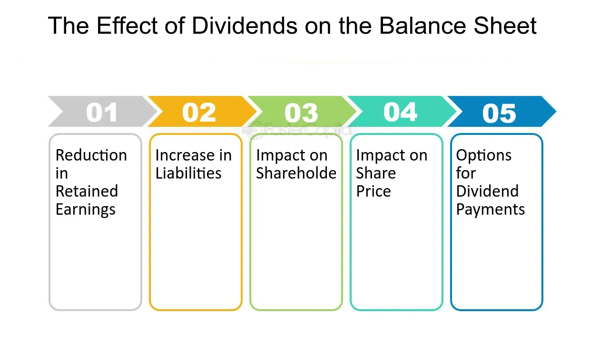

## Table of Contents

## What is a dividend?

A dividend is money that a company pays to its shareholders. When a company makes a profit, it can choose to share some of that profit with the people who own its stock. This payment is called a dividend. Shareholders usually get dividends a few times a year, depending on the company's policy.

Dividends are important because they can provide investors with a regular income. For example, if you own 100 shares of a company that pays a $1 dividend per share, you would get $100 every time the company issues a dividend. This can be a good way to earn money, especially for people who are retired and looking for steady income from their investments.

## How are dividends recorded on a balance sheet?

Dividends are not directly shown on a company's balance sheet. Instead, they affect the balance sheet indirectly through the retained earnings account, which is part of the equity section. When a company decides to pay dividends, it first declares them. This declaration reduces the retained earnings because the money that could have been kept in the company is now going to be paid out to shareholders.

After the dividends are paid, the cash account on the balance sheet goes down by the amount of the dividends paid. This is because the company uses its cash to make these payments. So, while dividends themselves don't appear as a line item on the balance sheet, their payment affects both the cash and retained earnings accounts, showing a decrease in both.

## What is the effect of paying dividends on a company's cash balance?

When a company pays dividends, it uses its cash to give money to its shareholders. This means the company's cash balance goes down by the amount of the dividends paid. For example, if a company pays out $1 million in dividends, its cash account will decrease by $1 million.

This decrease in cash can affect the company's overall financial health. If the company doesn't have enough cash left after paying dividends, it might struggle to pay for other important things like salaries, supplies, or investments in new projects. So, companies need to be careful about how much they pay in dividends to make sure they keep enough cash for their operations.

## How does the declaration of dividends affect retained earnings?

When a company declares dividends, it means they are going to pay some of their profits to shareholders. This decision affects the company's retained earnings, which is the money they have kept from past profits. When dividends are declared, the company sets aside the money needed for the dividends, and this reduces the retained earnings. It's like taking money out of a savings account to give to shareholders.

This reduction in retained earnings is shown on the balance sheet. Before the company actually pays the dividends, the amount of the declared dividends is subtracted from retained earnings. This shows that the money is no longer available for the company to use for other things like growing the business or paying off debts. Once the dividends are paid, the cash account also goes down, but the initial impact on retained earnings happens when the dividends are declared.

## Can dividends impact a company's liabilities?

When a company declares dividends, it creates a new liability called "dividends payable." This is because the company now owes money to its shareholders. This liability appears on the balance sheet until the dividends are actually paid out. So, in this way, dividends can increase a company's liabilities temporarily.

Once the company pays the dividends, the "dividends payable" liability goes away. The cash account goes down by the same amount, and the balance sheet reflects this change. So, while dividends do affect liabilities when they are declared, the impact is only temporary and goes away once the payment is made.

## What are the differences between cash dividends and stock dividends on the balance sheet?

When a company pays cash dividends, it gives actual money to its shareholders. This means the company's cash account goes down by the amount of the dividends paid. On the balance sheet, you'll see the cash decrease and the retained earnings also go down because the company is using its profits to pay shareholders. Before the payment, a liability called "dividends payable" appears on the balance sheet, but it goes away once the cash is paid out.

On the other hand, stock dividends involve giving shareholders more shares instead of cash. When a company issues stock dividends, it doesn't affect the cash account because no money is leaving the company. Instead, the total number of shares goes up, which means each share is worth a little less. On the balance sheet, the retained earnings still go down, but now the equity part goes up because of the new shares. There's no "dividends payable" liability because no money is owed.

So, cash dividends directly reduce the company's cash and create a temporary liability, while stock dividends increase the number of shares and affect the equity without touching the cash account. Both types of dividends lower retained earnings, but they have different impacts on the rest of the balance sheet.

## How do dividends influence a company's equity?

When a company pays dividends, it affects its equity because dividends are paid out of the company's profits. These profits are part of the company's equity, specifically in the retained earnings account. When dividends are declared, the retained earnings go down because the money that could have stayed in the company is now going to shareholders. This means the total equity of the company decreases because retained earnings are a big part of equity.

For cash dividends, the company uses its cash to pay shareholders, so the cash account goes down, and so does the retained earnings. This directly reduces the company's equity. With stock dividends, the company gives more shares to shareholders instead of cash. This doesn't affect the cash account, but it still reduces retained earnings. The total equity stays the same right after stock dividends because the new shares increase the equity by the same amount that retained earnings go down. So, dividends, whether cash or stock, always lower retained earnings and can change the total equity in different ways.

## What are the long-term effects of regular dividend payments on a company's financial health?

Regular dividend payments can have both good and bad effects on a company's financial health over time. On the positive side, paying regular dividends can make shareholders happy because they get money regularly. This can make the company's stock more attractive to investors who want steady income. Happy shareholders might keep their money in the company, which can help keep the stock price stable or even make it go up. This can also make it easier for the company to raise money in the future because investors trust that the company will keep paying dividends.

On the other hand, regular dividend payments can also be risky if the company doesn't manage its money well. If a company pays out too much in dividends, it might not have enough cash left to grow the business or handle unexpected problems. This can make the company weaker over time because it can't invest in new projects or technology. If the company runs into financial trouble, it might have to cut or stop paying dividends, which can upset shareholders and make the stock price go down. So, it's important for a company to balance paying dividends with keeping enough money to stay strong and grow in the long run.

## How do dividend policies affect a company's balance sheet in different economic cycles?

Dividend policies can affect a company's balance sheet differently depending on whether the economy is doing well or not. In good economic times, when a company is making a lot of money, it might decide to pay bigger dividends to its shareholders. This can make the shareholders happy and keep the stock price high. On the balance sheet, you'll see the cash go down because the company is using it to pay dividends, and the retained earnings will also go down because the company is giving away some of its profits. But because the company is doing well, it can still have enough money left to invest in new projects or save for the future.

In tough economic times, when a company is not making as much money, it might have to cut back on dividends or stop paying them altogether. This can upset shareholders, but it's important for the company to keep enough cash to survive the hard times. On the balance sheet, you'll see the cash and retained earnings stay higher because the company is not paying out as much money. This can help the company stay strong and be ready to grow again when the economy gets better. So, a company's dividend policy needs to change with the economic cycle to keep the balance sheet healthy.

## What are the tax implications of dividends on a company's balance sheet?

When a company pays dividends, it doesn't directly affect its balance sheet because of taxes. The company itself doesn't pay taxes on the dividends it pays out. Instead, the shareholders who receive the dividends have to pay taxes on them. This means the company's cash goes down when it pays dividends, and its retained earnings go down too, but these changes are because of the dividend payment, not because of any taxes the company has to pay.

However, the tax situation can affect how much money the company decides to pay in dividends. If the shareholders are going to pay a lot of taxes on the dividends, they might not be as happy with high dividend payments. This could make the company think twice about paying big dividends, especially if it means they won't have enough money left for other important things. So, while the company's balance sheet doesn't show the tax effects of dividends directly, the taxes that shareholders have to pay can influence the company's dividend policy and how it manages its cash and retained earnings.

## How do international accounting standards treat dividends on balance sheets?

International accounting standards, like those set by the International Financial Reporting Standards (IFRS), treat dividends on balance sheets in a similar way to how they are treated under other accounting systems. When a company declares dividends, it creates a liability called "dividends payable" on its balance sheet. This shows that the company owes money to its shareholders. The amount of the declared dividends is taken out of the retained earnings, which is part of the company's equity. This means the company's equity goes down because it's using its profits to pay shareholders.

Once the company actually pays the dividends, the "dividends payable" liability goes away, and the cash account goes down by the same amount. This is because the company uses its cash to make the payments. So, the balance sheet shows less cash and less equity after the dividends are paid. The main idea is that dividends reduce the company's retained earnings and cash, but they don't directly show up as a separate item on the balance sheet. Instead, their effects are seen through changes in other accounts.

## What advanced financial ratios should be considered when analyzing the impact of dividends on balance sheets?

When looking at how dividends affect a company's balance sheet, it's helpful to use some advanced financial ratios. One important ratio is the dividend payout ratio. This tells you what part of the company's earnings is being paid out as dividends. If the ratio is high, it means the company is giving a lot of its profits to shareholders, which can make the cash and retained earnings on the balance sheet go down. A low ratio means the company is keeping more of its profits, which can help it grow or save for the future.

Another useful ratio is the dividend coverage ratio. This shows if the company has enough earnings to pay its dividends. If the ratio is high, it means the company can easily afford to pay dividends without hurting its financial health. If it's low, the company might be using too much of its cash to pay dividends, which can make the cash balance on the balance sheet go down quickly. Both ratios help investors understand how dividends are affecting the company's money and its ability to keep paying dividends in the future.

## What is Understanding Dividends?

Dividends are distributions of a company's earnings to its shareholders, representing a form of income to investors and a reflection of the company’s financial health. They serve as a reward to investors for their capital investment, signaling a company’s profitability and stability. Dividends can significantly influence an investor's portfolio, especially in income-focused investment strategies. 

Dividends are primarily distributed in two main forms: cash dividends and stock dividends. Cash dividends are the most common type, where shareholders receive a specified dollar amount per share owned. This type has a direct impact on an investor's immediate income. Conversely, stock dividends involve distributing additional shares to shareholders, increasing the number of shares owned without immediate tax consequences but often diluting the share value.

The issuance of dividends affects a company's balance sheet. When a cash dividend is declared, it reduces the company's retained earnings—a component of shareholders' equity— and its cash reserves. For instance, if a company declares a $1 million cash dividend, both retained earnings and cash in the balance sheet will decrease by $1 million. Stock dividends, however, do not impact cash flows but adjust shareholders' equity by transferring an amount from retained earnings to common stock and additional paid-in capital.

To assess dividend sustainability, investors often rely on key metrics such as the dividend payout ratio. This ratio indicates the proportion of earnings paid to shareholders in the form of dividends, calculated as:

$$
\text{Dividend Payout Ratio} = \left( \frac{\text{Dividends Per Share}}{\text{Earnings Per Share}} \right) \times 100
$$

A high payout ratio might suggest a high return to investors but could also indicate insufficient reinvestment in the business for future growth. Conversely, a low payout ratio may suggest ample reinvestment opportunities but could be a sign of insufficient distribution to shareholders. Evaluating this ratio helps determine if a company can sustain or grow its dividend payment over time. Analysis of dividends, therefore, provides investors with insights into a company's financial practices, stability, and future growth potential.

## How do dividends affect the balance sheet?

A balance sheet is a fundamental financial statement that offers a snapshot of a company's financial position at a specific point in time. It is comprised of three primary components: assets, liabilities, and shareholders' equity. Assets represent what a company owns and are typically divided into current assets, which are expected to be converted into cash within a year, and non-current assets, which yield benefits beyond one year. Liabilities are obligations that the company must settle in the future, including both current liabilities, due within a year, and long-term liabilities that mature after one year. Shareholders' equity is the residual interest in the assets of the entity after deducting liabilities, essentially signifying the net worth attributable to owners and shareholders.

Cash dividends have a direct impact on the balance sheet by reducing both retained earnings and cash. When a dividend is declared, retained earnings decrease, reflecting the distribution of a portion of a company's earnings to shareholders. Correspondingly, cash is reduced when the dividend is paid out. For instance, if a company with $1,000,000 in retained earnings declares a cash dividend of $100,000, the retained earnings on the balance sheet will decrease to $900,000, and its cash balance will decrease by the same amount.

Stock dividends, unlike cash dividends, do not involve cash outlay but rather involve the distribution of additional shares of stock to shareholders. They increase the number of shares outstanding and result in a reallocation within shareholders' equity without reducing retained earnings. Though retained earnings decrease by the market value of the issued shares, an equal amount is added to common stock and additional paid-in capital, maintaining the overall equity balance. For example, if a company announces a 10% stock dividend, and an investor owns 100 shares, they will receive an additional 10 shares. The value of these shares will be transferred from retained earnings to the respective equity accounts.

To assess a dividend's sustainability, one commonly used metric is the dividend payout ratio, calculated as:

$$
\text{Dividend Payout Ratio} = \frac{\text{Dividends Paid}}{\text{Net Income}}
$$

This ratio indicates the proportion of earnings distributed as dividends, providing insight into whether a company can maintain its dividend payments without compromising its growth prospects. A payout ratio above 100% suggests that a company is paying more in dividends than it earns, possibly threatening future payouts.

Retained earnings can be determined by using the formula:

$$
\text{Retained Earnings} = \text{Beginning Retained Earnings} + \text{Net Income} - \text{Dividends Paid}
$$

Understanding how dividends influence the balance sheet is crucial for investors and analysts, as it reflects a company's financial strategy and its ability to return profits to shareholders.

## References & Further Reading

[1]: Damodaran, A. (2002). ["Investment Valuation: Tools and Techniques for Determining the Value of Any Asset."](https://archive.org/details/investmentvaluat0000damo_n6k9) Wiley Finance.

[2]: Bodie, Z., Kane, A., & Marcus, A. J. (2014). ["Investments."](https://www.mheducation.com/highered/product/Investments-Bodie.html) McGraw-Hill Education.

[3]: Hull, J. C. (2012). ["Options, Futures, and Other Derivatives."](https://www.semanticscholar.org/paper/Options%2C-Futures%2C-and-Other-Derivatives-Hull/89bdee500c8623864fc9eb7a471546aa713acc44) Pearson.

[4]: Treynor, J. L., & Black, F. (1973). ["How to Use Security Analysis to Improve Portfolio Selection."](https://www.jstor.org/stable/2351280) The Journal of Business, 46(1), 66-86.

[5]: Poterba, J. M., & Summers, L. H. (1984). ["The Economic Effects of Dividend Taxation."](https://www.nber.org/papers/w1353) NBER Working Papers 1353.