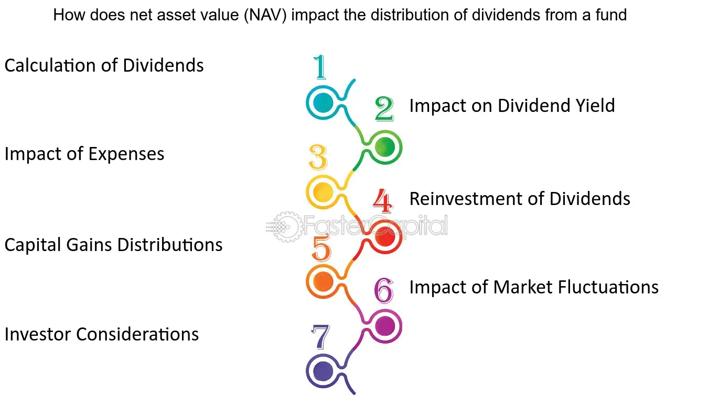

## Table of Contents

## What is a dividend?

A dividend is money that a company pays to its shareholders. When a company makes a profit, it can choose to share some of that profit with the people who own its stock. This payment is called a dividend. Shareholders usually get dividends a few times a year, depending on what the company decides.

Not all companies pay dividends. Some companies, especially new ones, might use all their profit to grow the business instead of paying it out. Companies that do pay dividends often do so because they want to reward their shareholders and attract more investors. Dividends can be a good way for people to earn some extra money from their investments.

## What is a mutual fund?

A mutual fund is a way for many people to pool their money together to invest in a variety of stocks, bonds, or other assets. When you buy into a mutual fund, you're not buying a single stock or bond. Instead, you're buying a piece of a big collection of investments. This collection is managed by a professional who decides what to buy and sell to try to make the fund grow.

Mutual funds can be a good choice for people who don't have the time or knowledge to pick individual stocks. By spreading money across many different investments, mutual funds can help reduce the risk that comes with investing in just one or two things. However, it's important to know that even mutual funds come with some risk, and they might charge fees for managing the fund.

## What is Net Asset Value (NAV) of a mutual fund?

Net Asset Value, or NAV, is the value of one share of a mutual fund. It's calculated by taking the total value of all the investments the fund holds, subtracting any liabilities like fees or debts, and then dividing that number by the total number of shares that investors own in the fund. So, if a mutual fund has investments worth $100 million and 10 million shares, the NAV would be $10 per share.

NAV is important because it tells you what each share of the mutual fund is worth at the end of each trading day. When you want to buy or sell shares of a mutual fund, you'll do so at the NAV price that's set after the market closes. This way, everyone gets a fair price based on the actual value of the fund's assets.

## How are dividends distributed in mutual funds?

When a mutual fund earns dividends from the stocks it owns, it usually passes those dividends on to its investors. The fund collects all the dividends from the companies it has invested in and then divides this money among its shareholders. How much each investor gets depends on how many shares they own in the mutual fund. This way, everyone gets a fair share based on their investment.

Mutual funds typically distribute dividends either monthly, quarterly, or annually. The exact timing depends on the fund's policy. When it's time to pay out the dividends, the fund will usually give investors the option to either take the money as cash or reinvest it back into the fund to buy more shares. Reinvesting can help grow your investment over time, but taking the cash can provide you with extra income.

## What happens to the NAV of a mutual fund when it pays out dividends?

When a mutual fund pays out dividends, the Net Asset Value (NAV) of the fund usually goes down. This is because the dividend payment is money leaving the fund, which reduces the total value of the assets the fund holds. For example, if a fund's NAV was $10 per share before paying out a $1 dividend, the NAV would drop to $9 per share after the payment.

However, this drop in NAV doesn't mean your investment has lost value. If you choose to reinvest the dividends, you'll get more shares at the new, lower NAV. So, even though the price per share goes down, the total number of shares you own goes up, which can help your investment grow over time.

## Can reinvesting dividends affect the NAV of a mutual fund?

Reinvesting dividends doesn't directly change the NAV of a mutual fund. When dividends are paid out, the NAV drops because money leaves the fund. But if you choose to reinvest those dividends, you're using that money to buy more shares of the fund at the new, lower NAV. This doesn't change the NAV itself; it just means you own more shares.

Over time, though, reinvesting dividends can have an indirect effect on the NAV. As more investors choose to reinvest, the fund gets more money to invest in new assets. If these new investments do well, they can increase the total value of the fund's assets, which can lead to a higher NAV. So while reinvesting dividends doesn't change the NAV right away, it can help grow the fund's value in the long run.

## How do dividend policies of the underlying securities impact the mutual fund's NAV?

The dividend policies of the companies that a mutual fund invests in can affect the fund's Net Asset Value (NAV). When these companies pay out dividends, the mutual fund receives that money. This money can increase the total value of the fund's assets, which might lead to a higher NAV. But, when the mutual fund then pays out these dividends to its own investors, the NAV usually goes down because money leaves the fund.

Over time, the impact of these dividend policies can be more complex. If the companies keep paying good dividends, it can make the fund's investments more valuable, helping to keep the NAV stable or even grow it. But if the companies change their dividend policies and start paying less, it could mean less money coming into the fund, which might make it harder for the NAV to grow. So, the dividend policies of the underlying securities play a big role in how the mutual fund's NAV changes.

## What are the tax implications of dividend distributions on mutual fund NAV?

When a mutual fund pays out dividends, it can affect the taxes you have to pay. The dividends you get from the mutual fund are usually considered taxable income. This means you need to report them on your tax return and pay taxes on them. The tax rate depends on whether the dividends are qualified or non-qualified. Qualified dividends are taxed at a lower rate, similar to long-term capital gains, while non-qualified dividends are taxed as ordinary income, which can be higher.

The tax implications can also influence the mutual fund's NAV indirectly. When the fund pays out dividends, the NAV drops because money leaves the fund. If investors decide to sell their shares because of the tax burden, it might lead to more shares being sold, which can put downward pressure on the NAV. However, if investors choose to reinvest their dividends, they might not feel the tax impact right away, but they'll still need to pay taxes on those reinvested dividends when they file their taxes. So, the tax implications of dividend distributions can affect both your personal taxes and the overall dynamics of the mutual fund's NAV.

## How do different types of mutual funds (e.g., equity, bond) handle dividend impacts on NAV differently?

Different types of mutual funds handle dividend impacts on their NAV in slightly different ways because of what they invest in. Equity mutual funds invest in stocks, so when the companies they own pay dividends, the fund gets that money. When the equity fund then pays out these dividends to its investors, the NAV goes down because money leaves the fund. But if the companies keep paying good dividends, it can help the fund's investments grow, which might help keep the NAV stable or even increase it over time.

Bond mutual funds, on the other hand, invest in bonds, which often pay interest instead of dividends. This interest is like a dividend, and when the bond fund pays it out to investors, the NAV drops in the same way. But bond funds might have more predictable income because bond interest payments are usually more regular than stock dividends. This can make the NAV of a bond fund more stable, even though it still goes down when the interest is paid out.

Both types of funds need to manage these dividend or interest payments carefully. The way they handle these payments can affect how much the NAV changes and how attractive the fund is to investors. For example, if an equity fund's companies cut their dividends, it could make the fund's NAV more volatile. On the other hand, a bond fund's NAV might be more predictable but still affected by changes in interest rates or bond issuers' financial health.

## What are the strategies fund managers use to manage the impact of dividends on NAV?

Fund managers use different strategies to manage how dividends affect the NAV of their mutual funds. One common strategy is to reinvest the dividends the fund receives into more stocks or bonds. This can help keep the fund's assets growing, which might offset the drop in NAV when dividends are paid out to investors. Another approach is to carefully choose which companies or bonds to invest in, focusing on those that have a history of paying steady dividends or interest. This can help make the fund's income more predictable and help keep the NAV from dropping too much.

Another strategy is to use dividend capture, where the fund manager buys stocks just before they pay dividends and then sells them shortly after. This can help the fund earn more dividends without changing its overall investment strategy too much. Fund managers might also adjust the timing of dividend payouts to their investors, trying to balance the need to pay out dividends with keeping the NAV stable. By using these strategies, fund managers try to minimize the impact of dividends on the NAV, making the fund more attractive to investors.

## How does the timing of dividend payments influence the NAV and overall performance of a mutual fund?

The timing of dividend payments can really affect a mutual fund's NAV and how well it does overall. When a mutual fund gets dividends from the stocks it owns, it usually pays those dividends out to its investors. This happens at certain times, like monthly, quarterly, or yearly. When the fund pays out these dividends, the NAV goes down because money is leaving the fund. So, if the timing of these payments is not managed well, it can make the NAV drop more than investors might like.

But, the timing can also help the fund. If the fund manager times the dividend payments well, they can make sure the fund's assets keep growing. For example, if the fund gets dividends and quickly reinvests them into more stocks or bonds, it can help the fund's value grow over time. This can make the fund more attractive to investors because even though the NAV might drop when dividends are paid out, the overall performance of the fund might be better if the timing is right.

## What advanced metrics or models can be used to predict the impact of dividends on mutual fund NAV?

To predict how dividends might affect a mutual fund's NAV, experts use some advanced math tools and models. One common tool is called a dividend discount model (DDM). This model helps figure out how much the dividends a fund gets will be worth in the future. By looking at things like how often dividends are paid and how much they might grow, the DDM can help guess how the NAV might change when the fund pays out those dividends. Another useful model is the Gordon Growth Model, which is a type of DDM that assumes dividends will grow at a steady rate forever. This can help predict the long-term impact of dividends on the fund's NAV.

Another way to predict the impact of dividends is by using something called Monte Carlo simulation. This method runs lots of different scenarios to see how dividends might affect the NAV under different conditions. For example, it can show what might happen if dividends go up or down, or if they are paid out at different times. By looking at all these different possibilities, investors can get a better idea of how the NAV might change. These advanced metrics and models help investors make smarter choices about when to buy or sell shares in a mutual fund, and how to manage the impact of dividends on their investments.

## What is the relationship between understanding dividends and Net Asset Value (NAV)?

Dividends are payments made by a corporation to its shareholders, representing a portion of the company's earnings. When it comes to mutual funds, dividends play a significant role in influencing the Net Asset Value (NAV), though the implications might not immediately indicate a change in the investor's financial position.

The Net Asset Value (NAV) of a mutual fund is a critical measure that represents the per-share value of the fund. It is calculated with the formula:

$$
\text{NAV} = \frac{\text{Total Assets} - \text{Liabilities}}{\text{Number of Outstanding Shares}}
$$

The NAV is updated daily based on the market value of the fund's holdings. Understanding how dividends affect NAV is crucial for potential and current investors in mutual funds. When dividends are distributed, the NAV of the mutual fund temporarily decreases. This decrease reflects the transfer of value from the fund to its shareholders as a dividend payment, not a loss in the fund’s actual value.

Consider an example: if a mutual fund has a NAV of $20 per share and pays a $1 dividend, the NAV will adjust to $19 per share on the dividend payment date. However, the total value of the investment remains the same if dividends are reinvested. This adjustment happens because the cash or additional shares equivalent to the dividend replace the funds distributed, thereby maintaining the investor's overall value.

Investors need to consider other metrics along with NAV to have a comprehensive understanding of a fund's performance. Metrics such as Total Return, which considers both the capital appreciation and dividends received, provide a more holistic view of the investment's performance. Additionally, metrics like the fund's expense ratio, turnover rate, and the benchmark's performance relative to index funds help in assessing the effectiveness and management quality of the mutual fund.

In summary, dividends and NAV are interlinked financial concepts in mutual funds. A drop in NAV due to dividend distribution should not be apprehended as a loss, but rather as a reflection of the reallocation of earnings. To effectively assess a mutual fund's performance and potential, investors should employ a multi-faceted approach encompassing NAV and supplementary metrics.

## References & Further Reading

1. **Dividends and Mutual Funds**:
   - Lintner, J. (1956). "Distribution of Incomes of Corporations Among Dividends, Retained Earnings, and Taxes." _The American Economic Review_, 46(2), 97-113. This paper presents foundational insights into dividend distribution strategies and their implications for corporate earnings and mutual fund performance.
   - Sharpe, W. F. (1994). "The Sharpe Ratio." _The Journal of Portfolio Management, 21_(1), 49-58. Explore performance metrics like the Sharpe Ratio that complement NAV when assessing mutual fund returns.
   - https://www.investopedia.com/articles/mutualfund/05/mfreport.asp offers a comprehensive guide on evaluating mutual fund reports, emphasizing dividends and NAV.

2. **Net Asset Value (NAV) Analysis**:
   - "Net Asset Value of Mutual Funds: An Analysis of Calculation and Impact" in _Journal of Finance and Investment Analysis_, Vol. 2, no. 1, 2016. This article discusses the mathematical intricacies and impact of NAV on mutual fund valuation.
   - Marcuse, Warren. "NAV: Its Role and Relevance in Mutual Fund Evaluation." _Financial Analysts Journal_, 58(4), 2002. Offers an academic perspective on the significance of NAV calculations.
   - Python scripts for NAV calculation can be found on: https://github.com/navcalc/examples

3. **Algorithmic Trading**:
   - Aldridge, Irene. _High-Frequency Trading: A Practical Guide to Algorithmic Strategies and Trading Systems_. Wiley, 2013. A detailed exploration of algorithmic trading, offering insights into execution efficiencies and associated risks.
   - Hasbrouck, J., & Saar, G. (2013). "Low-latency trading." _Journal of Financial Markets, 16_(4), 646-679. Analyze the implications of speed in algorithmic trading and its impact on market dynamics.
   - A practical introduction to implementing algorithmic trading strategies in Python can be explored at https://www.quantinsti.com/blog/algorithmic-trading-python.

4. **Technological Innovation Reports**:
   - Narayanan, A., et al. _Bitcoin and Cryptocurrency Technologies: A Comprehensive Introduction_. Princeton University Press, 2016. Understand blockchain's role in transforming NAV transparency and accuracy.
   - AI-driven financial solutions are elaborated upon in the report "Artificial Intelligence in Financial Services" by the World Economic Forum, available at https://www.weforum.org/reports/artificial-intelligence-financial-services.
   - "Future of Investing: Technological Innovations and Automation," a study by Deloitte, examines technology's transformative influence on the financial sector. Available on Deloitte's website: https://www2.deloitte.com.

These resources provide a broad spectrum of knowledge essential for understanding dividends, NAV calculations, mutual fund strategies, and the emerging role of technology in modern finance.

