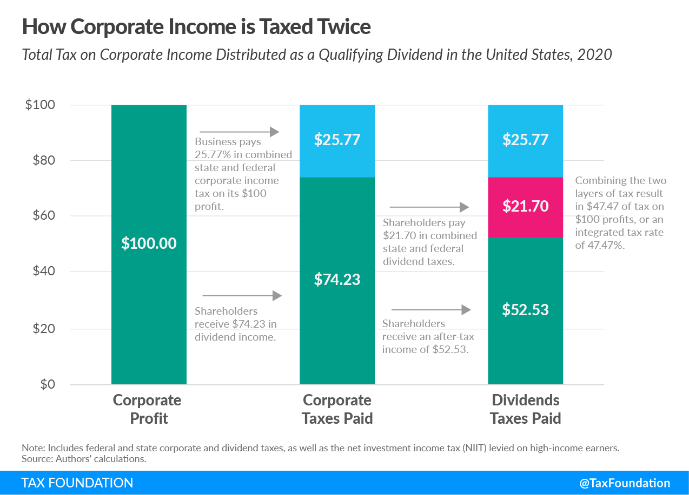

## Table of Contents

## What is double taxation?

Double taxation happens when the same income is taxed twice. This can occur when money is taxed at both the corporate level and then again when it is distributed to shareholders as dividends. For example, a company makes a profit and pays taxes on that profit. Then, when the company gives some of that profit to its shareholders, the shareholders also have to pay taxes on the money they receive.

This situation can be frustrating for people because it feels like they are being taxed twice on the same money. Some countries have ways to reduce or avoid double taxation, like giving tax credits or having treaties with other countries. These measures help to make sure that people and businesses are not unfairly burdened by paying taxes twice on the same income.

## How does double taxation affect corporations?

Double taxation can make things harder for corporations. When a corporation earns money, it has to pay taxes on that money. Then, if the corporation wants to share some of that money with its shareholders as dividends, the shareholders also have to pay taxes on those dividends. This means the same money is taxed twice, which can reduce the amount of money the corporation and its shareholders get to keep. This can make it less attractive for people to invest in the corporation because they know they will have to pay taxes twice.

To deal with double taxation, some countries have special rules or agreements. These rules can help reduce the impact of double taxation. For example, a country might give a tax credit to shareholders so they don't have to pay as much tax on their dividends. Or, countries might have treaties with each other to avoid taxing the same income twice. These measures can help corporations by making it easier for them to share profits with shareholders without losing too much money to taxes.

## What are corporate dividends and why are they important?

Corporate dividends are payments that a company makes to its shareholders from its profits. When a company does well and makes money, it can choose to share some of that money with the people who own its stock. This sharing of profits is called a dividend. Dividends can be paid out in cash, or sometimes in more shares of the company.

Dividends are important for a few reasons. First, they give shareholders a way to earn money from their investment without having to sell their shares. This can be really helpful for people who want to get regular income from their investments. Second, dividends can show that a company is doing well and has enough money to share with its owners. This can make the company's stock more attractive to investors, which can help the company grow.

## How does double taxation influence a company's decision to pay dividends?

Double taxation can make a company think twice about paying dividends. When a company makes money, it has to pay taxes on that money. If the company then decides to give some of that money to its shareholders as dividends, the shareholders also have to pay taxes on those dividends. This means the same money is taxed twice, which can make the company and its shareholders end up with less money. Because of this, a company might decide to keep more of its profits instead of paying them out as dividends, to avoid the extra tax hit for its shareholders.

On the other hand, some companies still choose to pay dividends even with double taxation. They might do this because their shareholders really want the regular income that dividends provide. Also, paying dividends can show that the company is doing well and has enough money to share. To help with the double taxation problem, some countries have rules or agreements that can reduce the tax burden on dividends. These measures can make it easier for companies to pay dividends without their shareholders losing too much money to taxes.

## Can you explain the difference between corporate tax and dividend tax?

Corporate tax is the tax that a company has to pay on the money it makes. When a company earns profits, it has to pay a part of those profits to the government as tax. This is called corporate tax. It's like the company's own tax bill for making money.

Dividend tax is different. It's the tax that shareholders have to pay on the money they get from the company as dividends. When a company decides to share some of its profits with its shareholders, those shareholders have to pay tax on the money they receive. So, dividend tax is the tax on the money that shareholders get from the company, not on the company's profits directly.

## What strategies can corporations use to minimize the impact of double taxation on dividends?

Corporations can use a few smart strategies to make double taxation less of a problem when paying dividends. One way is to keep more profits inside the company instead of giving them out as dividends. By doing this, the company only has to pay corporate tax once, and shareholders don't have to pay dividend tax. This can help the company grow and maybe increase the value of its stock, which can be good for shareholders in the long run.

Another strategy is to use tax credits. Some countries let shareholders get a tax credit for the corporate tax the company already paid. This means shareholders can reduce their dividend tax by the amount of corporate tax the company paid, so they don't get taxed twice on the same money. Also, some countries have special agreements with each other called tax treaties. These treaties can help avoid double taxation by making sure the same income isn't taxed in both countries. By using these strategies, companies can make sure their shareholders get more money from dividends without losing too much to taxes.

## How do different countries' tax systems affect corporate dividend policies?

Different countries have different tax systems, and these can really change how companies decide to pay dividends. In some countries, the tax on dividends is high, which can make companies think twice about giving out dividends. They might decide to keep more money inside the company to avoid the extra tax that shareholders would have to pay. On the other hand, some countries have lower taxes on dividends or give tax credits to shareholders. This can make it easier for companies to pay dividends because shareholders won't lose as much money to taxes.

Also, some countries have special agreements with each other called tax treaties. These treaties can help avoid double taxation, which is when the same money gets taxed twice. If a company knows that its shareholders won't have to pay a lot of extra taxes, it might be more willing to pay dividends. So, the tax rules in different countries can make a big difference in whether a company decides to share its profits with shareholders or keep the money to grow the business.

## What is the effect of double taxation on shareholders' investment decisions?

Double taxation can make shareholders think twice before investing in a company. When a company makes money and pays taxes on it, then gives some of that money to shareholders as dividends, the shareholders also have to pay taxes on those dividends. This means the same money is taxed twice, which can make shareholders end up with less money. Because of this, shareholders might decide to invest in companies that pay fewer dividends or keep more money inside the company to avoid the extra tax.

On the other hand, some shareholders really like getting regular income from dividends. Even with double taxation, they might still choose to invest in companies that pay good dividends. Some countries have rules or agreements that can help reduce the tax burden on dividends. These measures can make it easier for shareholders to get more money from their investments, even if the same money is taxed twice. So, while double taxation can affect how shareholders make their investment choices, other factors like the need for regular income and tax relief options also play a big role.

## How have historical changes in tax laws influenced corporate dividend payout trends?

Over the years, changes in tax laws have had a big impact on how much companies decide to pay out in dividends. When tax laws make dividends more expensive because of higher taxes, companies often choose to pay less in dividends. For example, if the government raises the tax on dividends, shareholders get less money after taxes, so companies might decide to keep more profits inside the company instead of giving them out. This can lead to a trend where companies pay fewer dividends because they want to help their shareholders avoid the extra tax.

On the other hand, when tax laws become more friendly to dividends, companies might start paying more of them. If the government lowers the tax on dividends or gives tax credits to shareholders, it can make dividends more attractive. Shareholders get to keep more of the money they receive, so companies might feel more comfortable sharing their profits. This can lead to a trend where companies increase their dividend payouts because the tax burden is lighter, and shareholders are happier with the money they get.

## What are the long-term economic implications of double taxation on corporate growth and dividend policies?

Double taxation can slow down a company's growth over the long term. When a company makes money, it has to pay taxes on that money. If the company then gives some of that money to its shareholders as dividends, the shareholders also have to pay taxes on those dividends. This means the same money is taxed twice, which can make the company and its shareholders end up with less money. Because of this, companies might decide to keep more of their profits inside the business instead of paying them out as dividends. This can help them grow, but it might also make them less attractive to investors who want regular income from dividends. So, double taxation can make it harder for companies to expand and attract new investors.

In the long run, double taxation can also change how companies decide to pay dividends. If taxes on dividends are high, companies might choose to pay fewer dividends to help their shareholders keep more money. This can lead to a trend where companies keep more profits inside to avoid the extra tax hit for shareholders. On the other hand, if the government makes tax laws more friendly to dividends, like giving tax credits or lowering the tax rate, companies might start paying more dividends. This can make shareholders happier because they get to keep more of the money they receive. So, the way taxes are set up can really influence how companies share their profits and plan for the future.

## How do multinational corporations navigate double taxation treaties to optimize their dividend strategies?

Multinational corporations often use double taxation treaties to make their dividend strategies work better. These treaties are agreements between countries that help avoid taxing the same money twice. When a company operates in different countries, it can use these treaties to lower the taxes its shareholders have to pay on dividends. For example, if a company in one country pays dividends to shareholders in another country, the treaty might let the shareholders claim a tax credit. This means they can reduce their dividend tax by the amount of corporate tax the company already paid, so they keep more money.

By using these treaties, multinational corporations can make their dividend payouts more attractive to investors. If shareholders know they won't lose too much money to taxes, they might be more willing to invest in the company. This can help the company grow because it can attract more investors from different countries. So, understanding and using double taxation treaties can be a smart way for multinational corporations to share their profits and keep their shareholders happy.

## What are the current debates and proposed reforms regarding double taxation and its impact on corporate dividends?

There are a lot of debates and ideas about how to fix double taxation on corporate dividends. Some people think that double taxation is not fair because it makes shareholders pay taxes twice on the same money. They want to change the tax laws to make it easier for companies to pay dividends without shareholders losing too much money to taxes. One idea is to give bigger tax credits to shareholders so they can reduce their dividend tax by the amount of corporate tax the company already paid. Another idea is to have more and better tax treaties between countries to avoid double taxation. These changes could help companies share their profits with shareholders without worrying so much about double taxation.

Other people think that double taxation is okay because it helps the government get more money to spend on important things like schools and roads. They worry that if we change the tax laws too much, the government might not have enough money. Some of them suggest smaller changes, like lowering the tax rate on dividends a little bit instead of getting rid of double taxation completely. They think this would still help shareholders but not hurt the government's budget too much. So, there are a lot of different ideas about how to handle double taxation, and people are still trying to figure out the best way to make things fair for everyone.

## What is the impact of double taxation on corporate dividends?

Double taxation poses a notable challenge to corporations, particularly with regard to the distribution of profits as dividends. When a corporation earns profits, it is subject to corporate income tax. Subsequently, when these profits are distributed to shareholders as dividends, they are taxed again at the individual level, leading to the phenomenon of double taxation. This dual imposition affects corporate decisions on profit distribution and influences shareholder value and corporate financial strategies.

### Impact on Shareholder Value and Corporate Strategy

High dividend taxes can serve as a disincentive for corporations to distribute profits as dividends. Instead, companies may opt to retain earnings and reinvest them into the business to avoid the tax implications. Retained earnings can be used for research and development, mergers and acquisitions, or other corporate initiatives that may yield higher returns in the long term. This strategy, while potentially beneficial for future growth, can reduce immediate shareholder satisfaction, particularly for those who rely on dividend income. 

The impact on shareholder value can be conceptualized by examining the after-tax dividend received by shareholders. If the corporate tax rate is $t_c$ and the dividend tax rate at the individual level is $t_d$, the after-tax dividend for a shareholder receiving a dividend $D$ is calculated as:

$$
\text{After-tax dividend} = D \times (1 - t_d)
$$

Given this scenario, shareholders may find reinvestment unattractive if the reduced payout and subsequent impact on stock price appreciation do not meet their income objectives or risk profiles. 

### Methods to Mitigate Double Taxation Effects

Corporations have several potential strategies to mitigate the effects of double taxation on dividends. 

1. **Tax Credits and Deductions**: Some jurisdictions offer tax credits or deductions to alleviate the burden of double taxation. For instance, implementing systems that allow shareholders to reclaim part of the taxes paid by the corporation can enhance shareholder value.

2. **Dividend Reinvestment Plans (DRIPs)**: These plans allow shareholders to reinvest cash dividends to purchase additional shares, often at a discount and without paying brokerage fees. While not directly mitigating taxes, DRIPs can enhance long-term shareholder growth potential.

3. **Corporate Structure Adjustments**: Certain business structures, such as Real Estate Investment Trusts (REITs) or Master Limited Partnerships (MLPs), may enable tax efficiencies where income is typically not taxed at the corporate level, thus minimizing double taxation.

4. **Strategic Financial Planning**: Companies may also adopt strategic financial planning to time dividend payments in tax-advantageous circumstances or to engage in share buybacks which offer an alternate means of returning value to shareholders without the same tax implications as dividends.

Ultimately, navigating the complexities of double taxation requires careful planning and a nuanced understanding of both domestic and international tax laws. By aligning dividend policies with broader corporate strategies and leveraging available tax relief measures, corporations can better manage the financial impact on both the company and its shareholders.

## References & Further Reading

[1]: Auerbach, A. J. (2006). ["Who Bears the Corporate Tax? A Review of What We Know."](https://www.nber.org/system/files/chapters/c0065/c0065.pdf) Tax Policy and the Economy, 20, 1-40.

[2]: ["The Theory and Practice of Dividend Taxation"](https://www.academia.edu/57702054/Dividend_Policy_A_Review_of_Theories_and_Empirical_Evidence) by Juan Carlos Suárez Serrato in *National Bureau of Economic Research*.

[3]: Brennan, M. J. (1970). ["Taxes, Market Valuation and Corporate Financial Policy"](https://www.jstor.org/stable/41792223?item_view=read_online). The Journal of Finance, 25(3), 425-437.

[4]: ["Taxation and Corporate Decision Making"](https://www.scribd.com/presentation/340704352/Chapter-4) edited by Michael J. Gombola in *Journal of Business Finance & Accounting*.

[5]: Poterba, J. M., & Summers, L. H. (1985). ["The Economic Effects of Dividend Taxation"](https://www.nber.org/papers/w1353). In Advantage of National Bureau of Economic Research Cambridge.

[6]: Ian Domowitz & Benn Steil (1999). ["Automation, Trading Costs, and the Structure of the Trading Services Industry"](https://www.nomurafoundation.or.jp/en/wordpress/wp-content/uploads/2014/09/19971011_Ian_Domowitz_-_Benn_Steil.pdf) in Journal of Finance.

[7]: Scholes, M. S., Wolfson, M. A., Erickson, M., Maydew, E. L., & Shevlin, T. (2005). ["Taxes and Business Strategy: A Planning Approach"](https://www.jstor.org/stable/pdf/41788986.pdf) (3rd ed.). Prentice Hall.