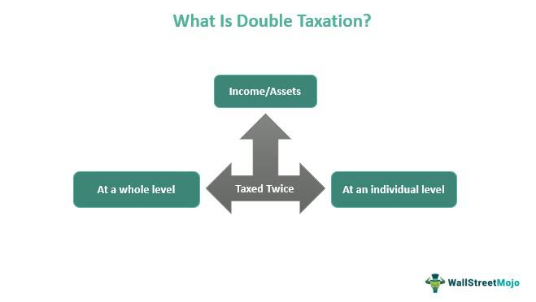

In today's dynamic financial landscape, understanding the nuances of taxation is crucial for investors and corporates alike. Taxation affects every corner of the economy, influencing corporate decision-making, individual investment strategies, and even the methodologies of modern trading. One area that often causes confusion and concern is the issue of double taxation, particularly as it pertains to corporate dividends. Double taxation occurs when income is taxed at both the corporate and personal levels, a process that can impact the distribution of profits and shareholder returns. This complexity underscores the need for effective tax strategies to optimize financial outcomes for all stakeholders involved.

Meanwhile, algorithmic trading, with its growing prevalence, adds another layer of complexity to the tax landscape. By employing advanced algorithms and automated trading systems, market participants execute trades at lightning speeds, capitalizing on market inefficiencies. However, the rapid pace and varied strategies inherent in algorithmic trading bring forward unique challenges, especially concerning capital gains and transaction taxes. Understanding how these activities intersect with tax regulations is essential for traders looking to maximize profitability and ensure compliance.



This article aims to explore the impact of double taxation on corporate dividends and its implications for algorithmic traders. By examining these issues, we seek to provide valuable insights for both corporate decision-makers and individual investors. Corporate executives can benefit from understanding how double taxation might impact their financial strategies, particularly in terms of dividend distribution versus reinvestment. Investors and traders, on the other hand, can better align their tactics with tax-efficient processes, ultimately optimizing their returns.

By shedding light on these topics, we hope to provide valuable insights for both corporate decision-makers and individual investors. Navigating the complexities of taxation requires a well-rounded understanding of both the potential pitfalls and the strategies available to minimize financial disadvantages. Let's explore the intricate world of taxation and trading to understand the broader financial implications, equipping all readers with the knowledge necessary to navigate and thrive in this challenging environment.

## Table of Contents

## Understanding Double Taxation

Double taxation arises when the same earning source is subject to taxation more than once, creating a financial burden for corporations and their shareholders. For corporations, this involves a two-level tax burden on income distributed as dividends to its shareholders. Initially, the corporation itself is subject to corporate income tax on its earnings. Upon distributing a portion of these profits as dividends, shareholders must then pay personal income tax on the dividends received, effectively taxing the same earnings twice.

### Corporate Taxes and Shareholder Dividends

To illustrate, consider a corporation that earns a profit of $1,000,000. Assume that the corporate tax rate is 30%. The corporation would first pay $300,000 in taxes, resulting in net income of $700,000. If it decides to distribute all $700,000 as dividends, shareholders then face the tax obligation on this received amount. If the dividend tax rate is 20%, shareholders collectively would pay an additional $140,000 in taxes. Thus, out of the initial $1,000,000 in profit, $440,000 ends up in taxes through this sequential taxation.

### Global Variations in Handling Double Taxation

Across different jurisdictions, approaches to mitigating double taxation vary. Some countries, like the United States, maintain this classic two-tier taxation but offer mechanisms to alleviate the burden. For instance, qualified dividends might be taxed at a reduced rate. Other countries, such as Australia, utilize what's known as an imputation system. This system provides shareholders with tax credits for the taxes already paid by the corporation, offsetting their personal tax liabilities on received dividends partially or entirely.

In contrast, the United Kingdom employs an approach where the corporate tax paid is deducted from the dividends taxable income, effectively lowering the shareholder’s tax base. Each method reflects differing national policy priorities and economic philosophies, illustrating the complexity of international taxation systems. 

### Implications for Corporations

The prospect of double taxation influences corporate financial strategies significantly. Companies might retain excess profits instead of distributing them, favoring reinvestment or stock buybacks as methods to return value to shareholders without incurring additional tax burdens.  
Understanding these diverse taxation frameworks is essential for global corporations striving to optimize financial outcomes and develop strategies that minimize tax impacts while remaining compliant across jurisdictions. The complexity of double taxation demands a nuanced approach, especially for multinational entities operating in varied economic environments.

## The Impact of Double Taxation on Corporate Dividends

Double taxation poses a notable challenge to corporations, particularly with regard to the distribution of profits as dividends. When a corporation earns profits, it is subject to corporate income tax. Subsequently, when these profits are distributed to shareholders as dividends, they are taxed again at the individual level, leading to the phenomenon of double taxation. This dual imposition affects corporate decisions on profit distribution and influences shareholder value and corporate financial strategies.

### Impact on Shareholder Value and Corporate Strategy

High dividend taxes can serve as a disincentive for corporations to distribute profits as dividends. Instead, companies may opt to retain earnings and reinvest them into the business to avoid the tax implications. Retained earnings can be used for research and development, mergers and acquisitions, or other corporate initiatives that may yield higher returns in the long term. This strategy, while potentially beneficial for future growth, can reduce immediate shareholder satisfaction, particularly for those who rely on dividend income. 

The impact on shareholder value can be conceptualized by examining the after-tax dividend received by shareholders. If the corporate tax rate is $t_c$ and the dividend tax rate at the individual level is $t_d$, the after-tax dividend for a shareholder receiving a dividend $D$ is calculated as:

$$
\text{After-tax dividend} = D \times (1 - t_d)
$$

Given this scenario, shareholders may find reinvestment unattractive if the reduced payout and subsequent impact on stock price appreciation do not meet their income objectives or risk profiles. 

### Methods to Mitigate Double Taxation Effects

Corporations have several potential strategies to mitigate the effects of double taxation on dividends. 

1. **Tax Credits and Deductions**: Some jurisdictions offer tax credits or deductions to alleviate the burden of double taxation. For instance, implementing systems that allow shareholders to reclaim part of the taxes paid by the corporation can enhance shareholder value.

2. **Dividend Reinvestment Plans (DRIPs)**: These plans allow shareholders to reinvest cash dividends to purchase additional shares, often at a discount and without paying brokerage fees. While not directly mitigating taxes, DRIPs can enhance long-term shareholder growth potential.

3. **Corporate Structure Adjustments**: Certain business structures, such as Real Estate Investment Trusts (REITs) or Master Limited Partnerships (MLPs), may enable tax efficiencies where income is typically not taxed at the corporate level, thus minimizing double taxation.

4. **Strategic Financial Planning**: Companies may also adopt strategic financial planning to time dividend payments in tax-advantageous circumstances or to engage in share buybacks which offer an alternate means of returning value to shareholders without the same tax implications as dividends.

Ultimately, navigating the complexities of double taxation requires careful planning and a nuanced understanding of both domestic and international tax laws. By aligning dividend policies with broader corporate strategies and leveraging available tax relief measures, corporations can better manage the financial impact on both the company and its shareholders.

## Algorithmic Trading and Taxation

Algorithmic trading, characterized by using complex algorithms and automated systems, has become an integral part of modern financial markets. Its rise has brought about significant tax challenges, especially concerning capital gains and transaction taxes. Algo traders leverage high-speed data processing and sophisticated algorithms to make split-second trading decisions, often executing volumes that are impossible for human traders to match.

One major tax consideration for algorithmic traders is capital gains tax. The rapid buying and selling activities intrinsic to [algorithmic trading](/wiki/algorithmic-trading) can result in numerous short-term capital gains, which are typically taxed at a higher rate than long-term gains. In many jurisdictions, short-term capital gains, resulting from holding assets for less than one year, are taxed as ordinary income. This tax treatment can significantly impact the net profitability of trading strategies, especially those that rely on high-frequency trading methods.

Moreover, transaction taxes can further impact algorithmic trading. Some countries impose a financial transaction tax (FTT) on trades of equities, bonds, and derivatives. These taxes, designed to curtail excessive trading and generate revenue, can add friction to the high-speed trades characteristic of algorithmic trading strategies, thus affecting the cost-efficiency of these operations. For example, in Europe, the proposed EU-wide FTT, although not yet implemented, has raised concerns about its potential dampening effect on market [liquidity](/wiki/liquidity-risk-premium) and trading volumes.

Taxation also complicates cross-border algorithmic trading activities. Traders operating across multiple jurisdictions must navigate varying tax regimes, which can impact their overall tax liabilities and the structuring of their trading operations. Differences in tax treatment of financial instruments, withholding taxes on international transactions, and compliance costs necessitate careful planning and execution.

Understanding these tax implications is crucial for algorithmic traders to optimize their strategies. By considering the tax liabilities that arise from different trading activities, traders can potentially adjust their approaches to minimize tax burdens. For instance, a strategy that evaluates the tax impact of trade timing and holding periods can help in managing exposure to higher tax rates on short-term gains. Additionally, choosing trading venues and instruments wisely, taking into account their associated tax implications, can further enhance profitability.

In conclusion, while algorithmic trading offers opportunities for efficiency and profit, it requires diligent consideration of taxation issues. Traders who integrate tax planning into their algorithmic strategies can improve their net returns and maintain a competitive edge in an increasingly automated and regulated financial market.

## Intersection of Corporate Dividends and Algorithmic Trading

Algorithmic traders frequently target dividend-paying stocks due to their potential for consistent income streams and the [volatility](/wiki/volatility-trading-strategies) surrounding dividend announcements. These traders employ strategies such as dividend capture, where they buy stocks before the ex-dividend date and sell them shortly afterward to capture the dividend with minimal stock holding period. However, the taxation of dividends, particularly when exacerbated by double taxation, can significantly affect the profitability of such strategies.

Double taxation occurs when corporate profits are taxed at the company level and then again at the individual shareholder level when dividends are received. This can lead to diminished net returns for both corporations and traders who focus on dividend strategies. For algorithmic traders, understanding how dividend tax policies affect their net gains is crucial for optimizing trading models.

Taxation of dividends can influence algorithmic trading strategies in several ways:
1. **Impact on Returns**: The tax burden on dividends affects the post-tax return calculation, making some dividend-paying stocks less attractive. This may lead algorithmic traders to adjust their models to factor in tax-adjusted returns rather than relying solely on gross dividends.

2. **Strategy Timing**: Algorithms might need to incorporate tax-related timing into their decision-making process. For example, tax rates are sometimes adjusted based on the duration of stock ownership, encouraging a longer holding period for optimal tax efficiency. 

3. **Risk Management and Hedging**: To mitigate the impact of dividend taxation, traders might use derivative products like options to hedge against potential tax-related losses. By constructing strategies that involve options, traders can offset some of the adverse effects of dividend taxation.

The intersection of double taxation and algorithmic trading requires sophisticated modeling to maximize efficiency. For instance, Python libraries such as NumPy and Pandas can be used to simulate scenarios and determine the tax-adjusted returns of different trading strategies. Here's an illustrative example:

```python
import numpy as np
import pandas as pd

# Sample data for illustration
dividend_yield = np.array([0.03, 0.04, 0.025])  # Example dividend yields
stock_prices = np.array([100, 150, 200])        # Example stock prices

# Assume a tax rate of 30%
tax_rate = 0.30

# Calculate after-tax dividend income
after_tax_dividends = dividend_yield * stock_prices * (1 - tax_rate)

# Creating a DataFrame for better visualization
df = pd.DataFrame({
    'Stock Price': stock_prices,
    'Dividend Yield': dividend_yield,
    'After-Tax Dividends': after_tax_dividends
})

print(df)
```

In this Python example, traders can quickly calculate after-tax dividends to assess the adjusted profitability of potential trades. Furthermore, by integrating such computations into trading algorithms, they can automate the process of selecting stocks based on after-tax returns.

Ultimately, algorithmic traders need to continuously adapt strategies to align with evolving tax policies. By doing so, they can enhance portfolio returns and achieve strategic objectives. Future modifications in tax legislation or automation technology can further influence these strategies, making ongoing analysis essential for maintaining a competitive edge in algorithmic trading of dividend-paying stocks.

## Strategies to Mitigate Tax Impact

To address the challenges of double taxation effectively, both corporations and traders can implement a variety of strategies to minimize tax burdens, thereby optimizing their financial outcomes.

Tax-efficient investment structures play a crucial role in reducing the liability associated with double taxation. Corporations can utilize structures such as Real Estate Investment Trusts (REITs) or Master Limited Partnerships (MLPs), which typically pass income directly to shareholders, avoiding the corporate level of tax. Implementing these structures can significantly lower the overall tax rate on distributed profits.

Derivatives also offer strategic opportunities for tax optimization. Instruments such as options or futures contracts can be used to hedge against tax liabilities or to restructure investments in a more tax-efficient manner. For example, equity options can be employed to generate synthetic dividends or to defer taxation to future periods, aligning tax events with anticipated lower personal tax rates.

One approach is leveraging tax credits and incentives provided by various jurisdictions. By optimizing operational or capital investment decisions around these incentives, firms can offset tax liabilities significantly. For instance, some countries offer preferential tax treatments for income derived from intellectual property, which can be a strategic consideration for R&D-focused corporations.

Cross-border investments can introduce opportunities for reducing double taxation through international tax treaties. Corporations engaged in global operations should evaluate treaty provisions that mitigate tax burdens by lowering withholding tax rates on dividends or enabling tax credits in home countries. Maximizing these benefits often involves working with legal and tax advisors to structure operations to align with treaty benefits effectively.

Algorithmic traders, in particular, can take advantage of tax-loss harvesting strategies to offset capital gains with losses recognized from trading activities. This strategy involves selling securities at a loss to reduce taxable income, while simultaneously maintaining a market position through replacement securities, thus preserving the overall trading strategy while benefiting from a lower tax bill.

It is also beneficial to consider the timing of transactions. Both corporations and traders can execute trades or structure dividends distributions in a manner that takes advantage of preferential tax rates at different times of the fiscal year. Understanding the tax calendar and aligning financial strategies accordingly can lead to significant tax savings.

By integrating these strategies, both corporate management and individual traders can gain a more favorable tax position, enhancing profitability and providing a competitive advantage in their respective fields.

## Conclusion

Double taxation of corporate dividends, combined with the intricacies of algorithmic trading, creates a multifaceted challenge for modern investors and businesses. Addressing these issues requires a deep understanding of both taxation systems and trading dynamics to ensure financial optimization. Recognizing the effect double taxation has on diminishing shareholder value and potentially hindering corporate dividend policies empowers investors and corporations to implement effective tax mitigation strategies. Such strategies may include leveraging tax-efficient investment vehicles, exploring alternative financial instruments, or adopting thorough tax planning methodologies.

Algorithmic trading poses its own unique set of tax challenges, particularly with rapid trade executions and capital gains considerations. Traders adept at navigating these tax implications can make more informed, strategic decisions that enhance profitability. The synergy between a thorough comprehension of double taxation and the complexities of algorithmic trading is paramount to capitalizing on potential financial opportunities.

As the financial ecosystem evolves in response to regulatory changes and technological advancements, staying informed about taxation is critical. Continuous learning and adaptation are necessary for investors and business entities to maintain resilience and drive success. Future explorations will focus on specific strategies and case studies, offering further insights and guidance for navigating this intricate landscape.

## References & Further Reading

[1]: Auerbach, A. J. (2006). ["Who Bears the Corporate Tax? A Review of What We Know."](https://www.nber.org/system/files/chapters/c0065/c0065.pdf) Tax Policy and the Economy, 20, 1-40.

[2]: ["The Theory and Practice of Dividend Taxation"](https://www.academia.edu/57702054/Dividend_Policy_A_Review_of_Theories_and_Empirical_Evidence) by Juan Carlos Suárez Serrato in *National Bureau of Economic Research*.

[3]: Brennan, M. J. (1970). ["Taxes, Market Valuation and Corporate Financial Policy"](https://www.jstor.org/stable/41792223?item_view=read_online). The Journal of Finance, 25(3), 425-437.

[4]: ["Taxation and Corporate Decision Making"](https://www.scribd.com/presentation/340704352/Chapter-4) edited by Michael J. Gombola in *Journal of Business Finance & Accounting*.

[5]: Poterba, J. M., & Summers, L. H. (1985). ["The Economic Effects of Dividend Taxation"](https://www.nber.org/papers/w1353). In Advantage of National Bureau of Economic Research Cambridge.

[6]: Ian Domowitz & Benn Steil (1999). ["Automation, Trading Costs, and the Structure of the Trading Services Industry"](https://www.nomurafoundation.or.jp/en/wordpress/wp-content/uploads/2014/09/19971011_Ian_Domowitz_-_Benn_Steil.pdf) in Journal of Finance.

[7]: Scholes, M. S., Wolfson, M. A., Erickson, M., Maydew, E. L., & Shevlin, T. (2005). ["Taxes and Business Strategy: A Planning Approach"](https://www.jstor.org/stable/pdf/41788986.pdf) (3rd ed.). Prentice Hall.