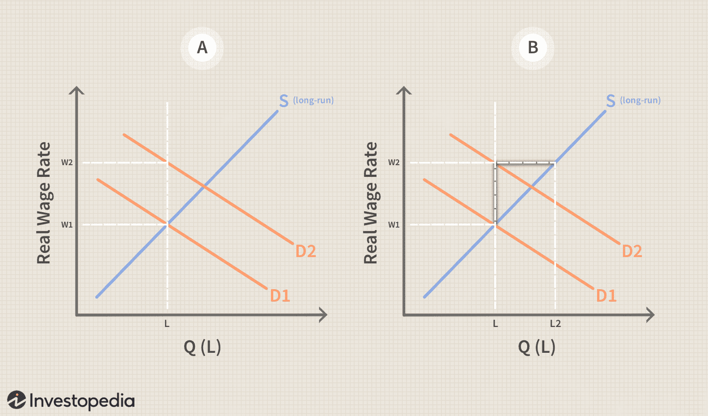

The convergence of education and technology has given rise to a new frontier in finance known as algorithmic trading (algo trading). This innovative approach combines rigorous training, a deep understanding of economic principles, and technological expertise to transform how financial markets operate. Algorithmic trading employs computer programs and algorithms to execute trades based on pre-defined strategies and criteria, allowing for efficient, accurate, and rapid execution that surpasses traditional manual trading methods.

The interplay between education and technological advancement is pivotal in developing the skill set necessary for success in algorithmic trading. Economic education forms the backbone for understanding market dynamics, economic indicators, and the impact of geopolitical events on financial markets. This foundational knowledge is crucial as traders and analysts craft strategies that leverage technological tools to optimize performance and minimize risk.



Technology further complements this educational base by offering platforms and software that automate complex trading processes. The integration of sophisticated algorithms, artificial intelligence (AI), and machine learning has revolutionized capabilities in data analysis, trend prediction, and decision-making, opening new prospects for both novice and experienced traders.

In this article, we explore how education in the evolving economy is key to empowering individuals to excel in algorithmic trading. Understanding the role of education helps to highlight the opportunities it presents, such as enhanced analytical abilities and strategic thinking. Moreover, it sheds light on the challenges faced, including the need for continuous learning and adaptation to technological advances that regularly redefine industry standards.

Readers are invited to examine the dynamics of training within economic education and its substantial impact on the world of algo trading. As the field grows in complexity and sophistication, equipping oneself with the appropriate educational tools and technological insights becomes essential. This synthesis of knowledge and technology not only enriches the individual trader but also enhances the resilience and efficiency of the financial markets as a whole.

## Table of Contents

## The Importance of Training in Economic Education

Economic education provides a crucial understanding of financial markets and principles, serving as an indispensable foundation for those engaging in algorithmic trading. It fosters enhanced analytical thinking, enabling traders to interpret market trends and data effectively. Training in economics equips individuals with critical skills such as decision-making, risk assessment, and quantitative analysis, which are essential in navigating the complex and fast-paced environment of algorithmic trading.

1. **Analytical Thinking**: A comprehensive economic education sharpens one’s ability to analyze market trends, price movements, and financial data. This analytical prowess is vital for developing trading strategies that utilize algorithms to execute trades. By using concepts such as supply and demand, market equilibrium, and elasticity, traders can better predict market behaviors and identify profitable opportunities.

2. **Skill Development**: Economic training enhances skills like quantitative analysis, crucial for calculating metrics such as moving averages, volatility, and covariance. These metrics form the basis for algorithmic calculations that aim to forecast potential price movements. For instance, understanding the Capital Asset Pricing Model (CAPM) helps traders assess risks and returns in their investment portfolios:
$$
   E(R_i) = R_f + \beta_i (E(R_m) - R_f)

$$

   Where $E(R_i)$ is the expected return of the investment, $R_f$ is the risk-free rate, $\beta_i$ is the beta of the investment, and $E(R_m)$ is the expected market return.

3. **Economic Environment Navigation**: Engaging with the dynamic nature of financial markets requires a strong grounding in economic principles. Concepts such as inflation rates, interest rate fluctuations, and macroeconomic indicators are imperative in algorithmic trading, as they influence trading algorithms' decision logic.

4. **Educational Programs and Certifications**: Specialized programs, such as Chartered Financial Analyst (CFA) and Financial Risk Manager (FRM) certifications, provide structured training essential for economic comprehension. These certifications prepare future traders by offering rigorous curricula that encompass financial analysis, portfolio management, and risk assessment techniques. They also provide a recognized benchmark of skills that enhances credibility and employability in the trading industry. 

In summary, economic education not only lays the groundwork for interpreting markets and data but also fortifies individuals with the analytical tools and competencies necessary to thrive in the rapidly evolving landscape of [algorithmic trading](/wiki/algorithmic-trading). Aspiring traders benefit significantly from ongoing educational development, ensuring they possess the nuanced understanding required for informed decision-making and strategic trade execution.

## The Role of Technology in Education and Trading

Technology is fundamental to both contemporary education and algorithmic trading. It provides essential tools and platforms that enhance learning and trading execution. Online courses and training modules have significantly increased the accessibility and flexibility of economic education, enabling learners worldwide to gain valuable financial insights. This democratization of education allows individuals to tailor their learning experience to their specific needs, whether they are novices or experienced traders seeking to refine their skills.

One of the key benefits of technology in education is its ability to facilitate self-paced and personalized learning. Platforms like Coursera, edX, and Khan Academy offer courses in economics, finance, and data science, which are crucial for algorithmic trading. These platforms often incorporate interactive elements such as quizzes, simulations, and real-time feedback to reinforce learning outcomes.

In algorithmic trading, technology underpins the automation of trades based on predefined criteria and mathematical models. Coding languages such as Python are frequently employed to develop algorithms that automate trading processes. For instance, Python libraries like NumPy, Pandas, and scikit-learn are commonly used to perform data manipulation, statistical analysis, and [machine learning](/wiki/machine-learning)—all of which are pivotal in crafting efficient trading strategies. An example of a simple trading algorithm in Python might look like this:

```python
import numpy as np
import pandas as pd

# Load historical price data
data = pd.read_csv('price_data.csv')
data['Returns'] = data['Close'].pct_change()

# Define a moving average strategy
short_window = 40
long_window = 100

data['Short_MA'] = data['Close'].rolling(window=short_window, min_periods=1).mean()
data['Long_MA'] = data['Close'].rolling(window=long_window, min_periods=1).mean()

data['Signal'] = 0
data['Signal'][short_window:] = np.where(data['Short_MA'][short_window:] > data['Long_MA'][short_window:], 1, 0)
data['Position'] = data['Signal'].diff()

# Print trading signals
print(data[['Close', 'Short_MA', 'Long_MA', 'Signal', 'Position']].tail())
```

Advancements in [artificial intelligence](/wiki/ai-artificial-intelligence) and machine learning have augmented algorithmic trading by allowing traders to analyze vast datasets to extract actionable insights. Techniques such as natural language processing can parse news articles and earnings reports to gauge market sentiment, while machine learning models can predict price movements based on historical data patterns.

The integration of technology and education creates a synergistic effect that enhances the overall efficiency of trading approaches. By providing robust educational resources, technology empowers traders to stay updated with cutting-edge developments and fine-tune their strategies accordingly. This ongoing education enables traders to adapt swiftly to market changes, optimize their algorithms, and maintain a competitive edge in the financial markets.

## Developing Skills for Successful Algo Trading

Success in algorithmic trading is largely contingent on the practitioner's ability to effectively apply economic concepts while navigating a dynamic and complex market environment. Integral to this success are several critical skills.

Foremost among these is a solid foundation in programming. Proficiency in languages such as Python, R, or C++ is essential for developing, testing, and implementing trading algorithms. These languages offer libraries and frameworks that facilitate statistical computation, data manipulation, and even real-time decision-making processes. For example, Python's `pandas` library is instrumental in handling large datasets, enabling traders to perform efficient data analysis and [backtesting](/wiki/backtesting) of strategies.

```python
import pandas as pd

# Example: Calculating moving averages
def moving_average(data, window_size):
    return data.rolling(window=window_size).mean()

# Simulated price data
price_data = pd.Series([100, 101, 102, 103, 102, 101, 100])
ma = moving_average(price_data, window_size=3)
print(ma)
```

Equally important is statistical analysis, which is foundational for interpreting market data and identifying actionable insights. Traders must understand statistical concepts such as regression, correlation, and time-series analysis to make informed predictions about market trends. These analytical techniques enable traders to quantify risk and optimize their algorithms based on historical data patterns.

A comprehensive understanding of market mechanics is also vital. This involves grasping the intricacies of different asset classes, market behavior during various economic cycles, and the impact of geopolitical events on financial markets. Knowledge of these factors allows traders to anticipate market movements and adjust their strategies accordingly.

Given the rapid evolution of financial markets, continuous education is crucial. Traders must stay abreast of emerging market trends and technological innovations to remain competitive. Engaging in workshops, webinars, and collaborative projects with industry experts provides invaluable practical insights and fosters skill development. Such interactions often reveal advanced trading strategies and facilitate the sharing of best practices.

Finally, developing a robust trading algorithm necessitates a deep understanding of financial markets coupled with computational expertise. This includes leveraging machine learning techniques to enhance model accuracy and performance. For instance, implementing algorithms that learn from data to predict asset price movements can significantly boost trading efficiency.

In conclusion, aspiring algorithmic traders must focus on enhancing these key skills through concentrated educational efforts and practical engagement. By cultivating these proficiencies, traders can effectively exploit market opportunities and achieve success in algorithmic trading.

## The Future of Training in the Economy and Trading

The landscape of economic education is evolving rapidly, driven by the integration of new technologies and innovative teaching methodologies. As algorithmic trading gains prominence across financial markets, there is a corresponding increase in demand for specialized training programs designed to equip individuals with the necessary skills to thrive in this field.

Educational institutions and trading firms are increasingly collaborating to close the gap between theoretical knowledge and practical application in algorithmic trading. This collaboration is evident in the development of curriculum content that not only covers traditional economic theories but also incorporates real-world trading scenarios and advanced computational techniques. Such partnerships ensure that learners are well-prepared to tackle the complexities of the financial markets with practical competence.

Future trends in economic education may see the adoption of immersive learning environments, leveraging technologies such as virtual reality (VR) to simulate trading floors and market scenarios. These environments offer an experiential learning approach, allowing learners to engage interactively and apply their knowledge in simulated settings that mimic real-world market dynamics. Additionally, machine learning is increasingly utilized for creating personalized learning paths. These adaptive learning systems analyze a learner's progress and customize educational experiences to address individual strengths and weaknesses, thereby enhancing learning outcomes.

To illustrate, consider a machine learning model that helps tailor economic education. This model collects user data, such as test scores and interaction patterns, then adjusts future learning content to suit the user's learning pace and style. For example, using Python, a simple machine learning algorithm to predict the next best learning module could be set up as follows:

```python
from sklearn.ensemble import RandomForestClassifier
from sklearn.model_selection import train_test_split

# Sample dataset with user engagement data
data = [
    {'hours_studied': 5, 'test_score': 75, 'module_difficulty': 2},
    {'hours_studied': 3, 'test_score': 60, 'module_difficulty': 3},
    # more data points...
]

# Labels for the next recommended module, for example, integers representing module IDs
labels = [1, 2]

# Splitting dataset
X_train, X_test, y_train, y_test = train_test_split(data, labels, test_size=0.2)

# Training the model
model = RandomForestClassifier(n_estimators=100)
model.fit(X_train, y_train)

# Predicting the next best module
predictions = model.predict(X_test)
```

Adapting and evolving educational strategies to respond to emerging market needs will be crucial for success in the field of algorithmic trading. As technology continues to transform both education and trading, the ability to integrate these advancements effectively into educational programs will be essential. By staying ahead of these trends, aspiring traders can better position themselves to leverage the opportunities presented by the evolving landscape of algorithmic trading.

## Conclusion

Economic education is a critical element in equipping individuals for the challenges presented by algorithmic trading. The fusion of thorough training and a strong grasp of technology forms the backbone of successful careers in this increasingly automated sector. Algorithmic trading requires traders to have a clear understanding of economic principles to make informed decisions in the market. This foundation allows them to interpret complex data and market dynamics effectively, which is crucial for developing and executing successful trading strategies.

As markets become more sophisticated, continuous learning becomes imperative. The rapid pace of technological advancements, particularly in areas such as artificial intelligence and machine learning, necessitates that traders keep their knowledge up-to-date. These technologies offer powerful tools to analyze historical data, predict market trends, and optimize trading algorithms, thus staying current with these innovations can provide a competitive edge.

Moreover, the industry’s evolving nature implies that adapting educational strategies to meet new challenges is essential. This adaptability involves integrating new technologies and teaching methods into economic education, which could include using virtual reality for an immersive learning experience or adopting machine learning for personalized education. Thus, ongoing education and training are crucial for traders aiming to maintain their competitiveness.

Investing in education offers significant opportunities within the financial markets. Aspiring algorithmic traders who prioritize their education and skill development are better positioned to capitalize on market opportunities. This investment not only enhances their understanding and execution capabilities but also equips them with the tools to innovate and thrive in an ever-changing financial landscape. By embracing both economic theory and technological proficiency, traders can effectively navigate the complexities of algorithmic trading and achieve long-term success.

## References & Further Reading

[1]: Bergstra, J., Bardenet, R., Bengio, Y., & Kégl, B. (2011). ["Algorithms for Hyper-Parameter Optimization."](https://papers.nips.cc/paper/4443-algorithms-for-hyper-parameter-optimization) Advances in Neural Information Processing Systems 24.

[2]: ["Advances in Financial Machine Learning"](https://www.amazon.com/Advances-Financial-Machine-Learning-Marcos/dp/1119482089) by Marcos Lopez de Prado

[3]: ["Evidence-Based Technical Analysis: Applying the Scientific Method and Statistical Inference to Trading Signals"](https://www.amazon.com/Evidence-Based-Technical-Analysis-Scientific-Statistical/dp/0470008741) by David Aronson

[4]: ["Machine Learning for Algorithmic Trading"](https://github.com/stefan-jansen/machine-learning-for-trading) by Stefan Jansen

[5]: ["Quantitative Trading: How to Build Your Own Algorithmic Trading Business"](https://www.amazon.com/Quantitative-Trading-Build-Algorithmic-Business/dp/1119800064) by Ernest P. Chan