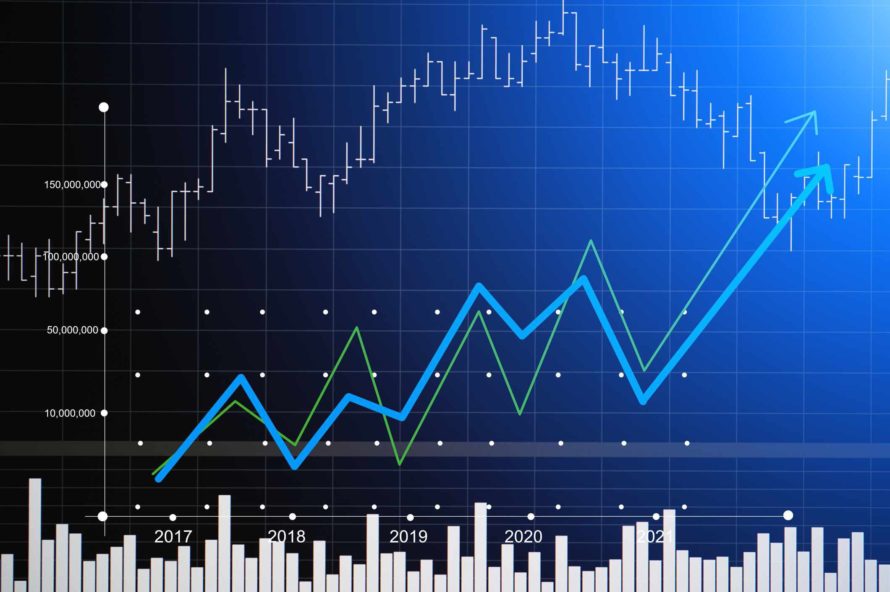

The concept of efficient markets is pivotal in contemporary financial theory and practice. Central to this idea is the Efficient Market Hypothesis (EMH), which postulates that stock prices fully incorporate and reflect all available information. This suggests that it is not feasible to consistently achieve returns that exceed average market returns on a risk-adjusted basis, as any new information that might affect a security's price is quickly and accurately incorporated into its current price.

This exploration examines the ramifications of efficient market theory on investor behavior and market dynamics, with a particular focus on algorithmic trading. Algorithmic trading, enabled by technological advancements, uses computer algorithms to execute trades based on pre-set conditions and has emerged as a powerful instrument in financial markets. It has significantly influenced how prices are determined and has had a profound impact on investor strategies. The ability to process vast amounts of information at unprecedented speeds provides algorithmic traders with a strategic advantage, reinforcing the principles of market efficiency.

Furthermore, this analysis investigates how these factors shape the contemporary investment landscape. The interaction between market efficiency, investor behaviors, the impact of markets, and algorithmic trading creates a complex ecosystem for investors. This ecosystem carries both challenges—such as navigating increased market volatility—and opportunities to leverage technological advancements for enhanced decision-making.

As financial technologies evolve, investors and regulators must continuously adapt to keep pace with the rapid shifts in market structure and dynamics. Understanding these interactions offers valuable insights into the operational efficiencies of financial markets and informs more effective investment decisions. Consequently, the balance of market efficiency theory, psychological aspects of investor behavior, and technological impacts from algorithmic trading remains an essential area of study for those navigating the financial markets today.

## Table of Contents

## Understanding Efficient Markets

The Efficient Market Hypothesis (EMH) asserts that financial markets are 'informationally efficient,' suggesting that stock prices fully reflect all available information. This fundamental concept, introduced by Eugene Fama in the 1970s, implies that it is impossible to consistently achieve returns exceeding average market returns without incurring additional risk. The EMH is categorized into three forms: weak, semi-strong, and strong, each reflecting varying degrees of information inclusion in stock prices.

1. **Weak Form Efficiency**: This form suggests that current stock prices incorporate all historical trading information, such as past prices and volume. Therefore, technical analysis, which relies on historical price patterns, cannot consistently yield excess returns. 

2. **Semi-Strong Form Efficiency**: According to this form, stock prices adjust rapidly to all publicly available information, not just past prices. This implies that neither fundamental analysis nor technical analysis can consistently outperform the market since any new, relevant public information is quickly incorporated into the stock prices.

3. **Strong Form Efficiency**: This extreme version posits that stock prices reflect all information, public and private. In such a market, even insider information would not provide a trading advantage, as it is supposedly already reflected in the prices.

Despite the theoretical foundations of EMH, critics highlight anomalies and inefficiencies as evidence that markets might not be perfectly efficient. For instance, market anomalies such as price bubbles and crashes challenge the assertion that prices always reflect intrinsic values. The dot-com bubble of the late 1990s serves as a compelling historical case. During this period, excessive speculation in internet-based companies led to prices that greatly exceeded those companies' intrinsic values, culminating in a market crash when the bubble burst.

Moreover, behavioral finance offers explanations on how psychological biases and irrational behaviors can result in market inefficiencies, suggesting deviations from EMH's assumptions. Factors such as overconfidence, herd behavior, and loss aversion can lead investors to make decisions that do not align with rational market expectations, thereby impacting price efficiency.

In the context of investing, the EMH is foundational for passive investment strategies. Passive investing, which includes strategies like index fund investing, is grounded in the belief that outperforming the market over the long term is infeasible. Instead, passive investors aim to match market performance and benefit from the market's long-term trend of appreciation.

In summary, while the Efficient Market Hypothesis provides a robust framework for understanding market dynamics, its applicability in real-world scenarios is often debated given observed market anomalies and behavioral biases. Nonetheless, it remains a cornerstone in the development of investment strategies and financial theory.

## Investor Behavior in Efficient Markets

In an efficient market, the emphasis for investors transitions from attempting to outperform the market through stock [picking](/wiki/asset-class-picking) towards optimizing overall portfolio performance using diversification and asset allocation. This strategy aligns with the Efficient Market Hypothesis (EMH), which posits that it is improbable to consistently achieve higher returns without accepting additional risk, as all available information is reflected in asset prices.

However, the field of behavioral finance introduces a counterpoint to the EMH by examining how psychological factors and emotional responses can lead investors to act irrationally, thereby impacting market efficiency. Common cognitive biases such as herd behavior and overconfidence can create and exacerbate market anomalies. Herd behavior occurs when investors collectively follow the majority, often regardless of their own analysis or the intrinsic value of investments. This can lead to exaggerated market movements and bubbles. Similarly, overconfidence can cause investors to overestimate their knowledge or predictive ability, leading to excessive trading and suboptimal investment decisions.

Understanding these psychological drivers is essential for creating strategies that address such inefficiencies and human error. Investors can mitigate irrational decision-making by acknowledging their cognitive biases and incorporating systematic, rational analysis into their investment processes. This can involve employing quantitative models and following a disciplined investment strategy that emphasizes long-term goals and risk management.

Balancing cognitive biases with rational analysis requires a conscious effort to maintain objectivity and rely on empirical data rather than intuition. Techniques such as maintaining a diversified portfolio, utilizing automated investment tools, and adhering to pre-defined investment plans can help in counteracting the influence of emotional biases.

In conclusion, while efficient markets propose a challenging environment for outperforming benchmarks through stock selection, acuity in recognizing and managing behavioral biases can lead to improved decision-making. This approach not only minimizes potential pitfalls but also enhances the alignment of investment choices with risk tolerance and financial objectives.

## Market Impact of Algorithmic Trading

Algorithmic trading utilizes computer algorithms to execute trades based on pre-established parameters, significantly influencing contemporary financial markets. It enhances market efficiency through increased speed and accuracy, allowing for rapid transaction execution and swift adaptation to new information. The prompt processing of trades helps integrate information into asset prices more swiftly, supporting the principles of the Efficient Market Hypothesis (EMH). Consequently, [algorithmic trading](/wiki/algorithmic-trading) contributes to a more precise reflection of available information in security prices.

Nevertheless, the proliferation of algorithmic trading raises concerns regarding market stability. High-frequency trading ([HFT](/wiki/high-frequency-trading-strategies)), a subset of algorithmic trading, can potentially lead to flash crashes—sudden, extreme drops in security prices followed by quick recoveries. One notable example is the May 6, 2010, incident, where the U.S. stock market faced a rapid plunge and rebound due to automated trading. Such events underscore the unintended consequences of algorithmic trading on market [volatility](/wiki/volatility-trading-strategies) and investor confidence. 

Algorithmic trading affects [liquidity](/wiki/liquidity-risk-premium) and market depth, crucial aspects of trading that determine the ease of buying and selling securities. Algorithms often act as liquidity providers by constantly placing buy and sell orders, thus reducing bid-ask spreads and enhancing transaction efficiency. However, algorithmic traders may withdraw liquidity during periods of heightened market stress, amplifying volatility and making it more challenging for investors to execute trades.

Regulators play a pivotal role in addressing the dual-edged nature of algorithmic trading. They are tasked with implementing regulations that harness the efficiency benefits of algorithmic trading while mitigating the risks related to market volatility and systemic instability. Measures such as circuit breakers, which temporarily halt trading in response to drastic price movements, are examples of regulatory efforts aimed at stabilizing markets without stifling innovation.

In summary, while algorithmic trading strengthens market efficiency by speeding up the incorporation of information into prices, it also poses challenges that require careful regulatory oversight to safeguard market integrity and stability.

## Conclusion

The interplay between efficient markets, investor behavior, and algorithmic trading is nuanced and dynamic. Efficient market theory posits that consistently achieving extraordinary returns is challenging because stock prices reflect all available information. This principle reinforces the difficulty in outperforming the market without assuming additional risk. However, understanding market dynamics, such as the influence of investor psychology and trading technologies, can provide critical insights. 

Algorithmic trading has revolutionized the investment landscape, offering unprecedented speed and efficiency. This technological advancement allows for rapid adjustments to new data, which enhances market efficiency. Nonetheless, it also introduces challenges, such as heightened volatility and risks of flash crashes. As a result, both investors and regulators must continuously adapt to these evolving circumstances.

Investors who acknowledge the limitations and potential of market efficiency are better equipped to develop robust strategies. These strategies should integrate both traditional methods, such as diversification, and modern insights derived from technological advancements. For example, an investor might use algorithmic trading strategies to optimize portfolio rebalancing, thereby minimizing transaction costs and responding swiftly to market changes.

Ongoing research and technological innovation promise to further transform the investment landscape. As financial markets continue to evolve, they present new opportunities to leverage technological advancements, behavioral insights, and economic theories. This evolution requires investors, traders, and regulators to engage with these changes actively, fostering strategies that are adaptable and fit for the complexities of future markets.

## References & Further Reading

[1]: Fama, E. F. (1970). ["Efficient Capital Markets: A Review of Theory and Empirical Work."](https://www.jstor.org/stable/2325486) The Journal of Finance, 25(2), 383-417.

[2]: Barberis, N., & Thaler, R. (2003). ["A Survey of Behavioral Finance."](https://www.semanticscholar.org/paper/A-Survey-of-Behavioral-Finance-Barberis-Thaler/a4ab7d7161deac0f532d121b1614cf7b97d90e78) In Handbook of the Economics of Finance (Vol. 1, pp. 1053-1128).

[3]: Lo, A. W. (2005). ["Reconciling Efficient Markets with Behavioral Finance: The Adaptive Markets Hypothesis."](http://www.empirical.net/wp-content/uploads/2014/12/Andrew-Lo-Reconciling-Efficient-Markets-with-Behavioral-Finance.pdf) The Journal of Investment Consulting, 7(2), 21-44.

[4]: Aldridge, I. (2013). ["High-Frequency Trading: A Practical Guide to Algorithmic Strategies and Trading Systems."](https://www.ahmetbeyefendi.com/wp-content/uploads/2020/07/High-Frequency-Trading-Irene-Aldridge.pdf) Wiley.

[5]: Hendershott, T., Jones, C. M., & Menkveld, A. J. (2011). ["Does Algorithmic Trading Improve Liquidity?"](https://onlinelibrary.wiley.com/doi/full/10.1111/j.1540-6261.2010.01624.x) Journal of Financial Economics, 103(1), 1-28.