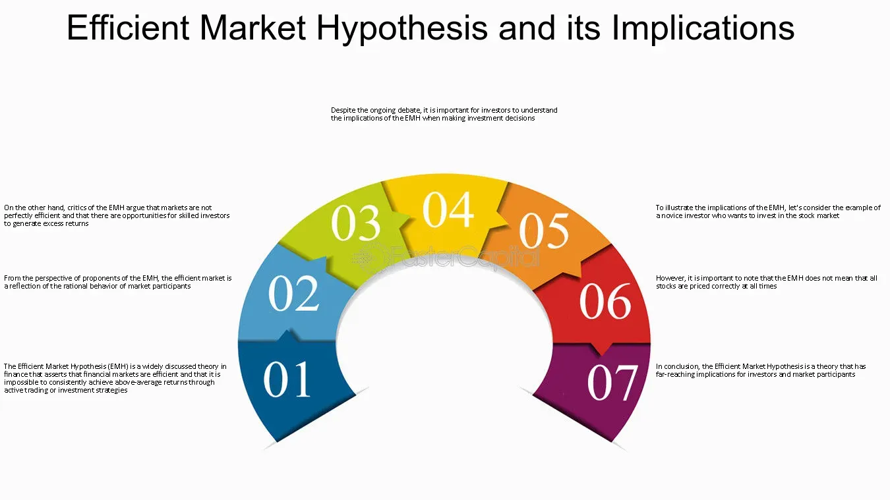

## Table of Contents

## What is an efficient market?

An efficient market is a place where all the information that people know about something, like a stock or a product, is already included in its price. This means that if you want to buy or sell something, the price you see is a fair one because it takes into account everything everyone knows about it. For example, if a company is doing well and everyone knows it, the price of its stock will be high. If the company is doing poorly, the price will be low.

In an efficient market, it's hard to make a lot of money quickly by just guessing or using tricks, because the prices are already set based on all the information available. This idea is important for investors because it means they need to do a lot of research and make smart decisions, rather than trying to outsmart the market. However, not all markets are perfectly efficient, and sometimes people can find ways to make money if they spot something others have missed.

## How do efficient markets affect individual investors?

In an efficient market, individual investors need to be careful and smart. Since the prices of stocks and other investments already include all the information people know, it's hard to make a quick profit just by guessing. If you want to do well, you have to do a lot of research and understand the companies or products you're investing in. This means looking at financial reports, news, and other data to make informed decisions.

However, efficient markets can also help individual investors. Because prices reflect all available information, you can trust that the price you see is a fair one. This means you don't have to worry about being tricked by hidden information. If you take the time to learn and make smart choices, you can still make money over time. It's all about being patient and sticking to a good investment plan.

## What are the different levels of market efficiency?

There are three levels of market efficiency: weak, semi-strong, and strong. Weak form efficiency means that past prices of stocks cannot help you predict future prices. If a market is weak form efficient, looking at old stock prices won't give you an advantage because all that information is already in the current price. Semi-strong form efficiency goes a step further. It says that all public information, like news and financial reports, is also included in stock prices. So, if you read the news and then buy a stock, you won't beat the market because everyone else has that information too.

Strong form efficiency is the highest level. It means that all information, even secret or insider information, is already in the stock price. In a strongly efficient market, no one can make money by using information that others don't have because all information is already priced in. Most people believe that markets are at least weak form efficient, and many think they are semi-strong form efficient. But it's hard to say if any market is truly strong form efficient because that would mean no one could ever use insider information to make money, which doesn't always seem to be the case.

## Can investors beat the market in an efficient market?

In an efficient market, it's really hard for investors to beat the market. This is because the prices of stocks and other investments already include all the information that people know. If you try to use past prices or public news to make money, you won't have an advantage because everyone else has that information too. It's like trying to win a race where everyone starts at the same time and knows the same path.

However, some investors still try to beat the market. They might do a lot of research and find small pieces of information that others miss. Or they might use special strategies that work better in certain situations. But overall, in a truly efficient market, it's very tough to do better than the market average over a long time. Most people end up doing just as well as the market, not better.

## What is the role of information in efficient markets?

In an efficient market, information is super important. It's like the building blocks that help set the prices of stocks and other things people want to buy or sell. When everyone knows something, like a company doing well or having problems, that information quickly gets into the price. So, if a company makes a lot of money, the price of its stock goes up because everyone knows about it. If the company is doing badly, the price goes down. This means that the prices you see are fair because they include everything people know.

But not all information is the same. Some markets use past prices, some use public news, and some even use secret information. In a weak form efficient market, only past prices matter. In a semi-strong form efficient market, public news and reports are also important. And in a strong form efficient market, even secret information is included in the price. This means that the more information a market uses, the harder it is to make money by knowing something others don't. In the end, information helps make sure that prices are fair and that everyone has a chance to make smart choices.

## How do efficient markets influence investment strategies?

In an efficient market, it's hard to make a lot of money quickly by guessing or using tricks. This is because the prices of stocks and other investments already include all the information people know. So, if you want to do well, you need to be patient and stick to a good plan. Many investors choose to put their money in a mix of different things, like stocks and bonds, to spread out the risk. This way, if one thing doesn't do well, the others might help balance it out. It's like not putting all your eggs in one basket.

Another strategy is to use index funds, which are a type of investment that follows the overall market. Since it's hard to beat the market in an efficient one, many people find it easier and safer to just go along with it. They buy a piece of the whole market instead of trying to pick individual stocks. This way, they can still make money over time without trying to outsmart everyone else. In the end, efficient markets push investors to be smart, patient, and to focus on long-term growth rather than quick wins.

## What are the implications of the Efficient Market Hypothesis for portfolio management?

The Efficient Market Hypothesis (EMH) suggests that it's hard to beat the market because all the information people know is already in the prices of stocks and other investments. For people who manage portfolios, this means they need to be careful and not try to make quick money by guessing or using tricks. Instead, they should focus on building a mix of different investments, like stocks and bonds, to spread out the risk. This way, if one thing doesn't do well, the others might help balance it out. It's like not putting all your eggs in one basket.

Another big idea from EMH for portfolio managers is to use index funds. These are investments that follow the overall market. Since it's hard to beat the market in an efficient one, many managers find it easier and safer to just go along with it. They buy a piece of the whole market instead of trying to pick individual stocks. This way, they can still make money over time without trying to outsmart everyone else. In the end, EMH pushes portfolio managers to be smart, patient, and to focus on long-term growth rather than quick wins.

## How do transaction costs and taxes impact investing in efficient markets?

In an efficient market, transaction costs and taxes can make it even harder to beat the market. Transaction costs are the fees you pay when you buy or sell something, like a stock. These costs can add up, especially if you trade a lot. If you're trying to make money by buying and selling quickly, these fees can eat into your profits. Taxes also play a role. When you make money from your investments, you have to pay taxes on those gains. The more you trade, the more often you might have to pay taxes, which can reduce your overall returns.

Because of these costs, many investors in efficient markets choose to hold onto their investments for a long time. By doing this, they can avoid paying a lot in transaction fees and might also benefit from lower tax rates on long-term investments. This approach fits well with the idea of efficient markets, where it's hard to beat the market by trading a lot. Instead, investors focus on building a diverse portfolio and letting it grow over time, which can help them keep more of their money in the long run.

## What are the criticisms of the Efficient Market Hypothesis?

Some people don't fully agree with the Efficient Market Hypothesis (EMH). They say that markets aren't always as smart as EMH thinks. For example, sometimes people get too excited or too scared about certain stocks, which can make prices go up or down a lot, even if the real value of the company hasn't changed. This is called a bubble or a crash. Also, some investors believe they can find stocks that are priced wrong and make money by buying or selling them before the market figures it out. This goes against the idea that all information is already in the price.

Another criticism is that not everyone has the same information. Some people might know secret things about a company that others don't, and they can use this to make money. This is called insider trading, and it shows that markets might not be as fair as EMH says. Also, some people think that professional investors, like those who manage big funds, can do better than the market because they have more resources and can do more research. This suggests that it's possible to beat the market, which goes against what EMH says.

## How do behavioral finance theories challenge the concept of market efficiency?

Behavioral finance theories say that people don't always make smart choices when they invest. They can get too excited or too scared, which can make stock prices go up or down a lot, even if the real value of the company hasn't changed. This is different from what the Efficient Market Hypothesis (EMH) says, which is that all information is already in the price. If people's feelings can change prices, then markets might not be as efficient as EMH thinks.

Another way behavioral finance challenges EMH is by showing that people often make the same mistakes over and over. For example, they might hold onto losing stocks too long, hoping they'll go back up, or sell winning stocks too soon. These mistakes can lead to prices that don't match the real value of the stocks. If people's behavior can mess up prices, then it's harder to say that markets are always efficient.

## What empirical evidence supports or refutes the Efficient Market Hypothesis?

Some studies support the Efficient Market Hypothesis (EMH). For example, research shows that it's hard for most investors to beat the market over a long time. If you look at the performance of professional money managers, many of them do about as well as the market, not better. This fits with what EMH says: that all information is already in the prices, so it's tough to do better than average. Also, studies on how quickly stock prices change after new information comes out, like a company's earnings report, show that prices adjust very fast. This suggests that markets are good at using new information, which is a big part of EMH.

But other studies challenge EMH. Some research shows that certain strategies can beat the market. For example, looking at things like how much a company pays in dividends or how cheap a stock is compared to its earnings can help investors find stocks that do better than the market. This goes against EMH because it means some information isn't fully in the price yet. Also, there are times when markets seem to go crazy, like during big bubbles or crashes. If people's feelings can make prices go up or down a lot, even when the real value of companies hasn't changed, then markets might not be as efficient as EMH says.

## How do global market efficiencies vary and what does this mean for international investors?

Global market efficiencies can be different in different countries. Some markets, like the U.S. stock market, are thought to be very efficient. This means that the prices of stocks and other investments in these markets include all the information people know. But in other places, like some smaller or less developed countries, markets might not be as efficient. In these markets, it can be easier to find stocks that are priced wrong because not all information is in the price yet. This is because there might be fewer people watching the market, less information available, or other reasons that make it harder for prices to reflect all the information.

For international investors, this means they need to be careful and do a lot of research. If they invest in a very efficient market, like the U.S., they should expect that it will be hard to beat the market. They might want to use strategies like index funds, which follow the overall market, to make money over time. But if they invest in a less efficient market, they might have a chance to find stocks that are underpriced and make more money. However, these markets can also be riskier because the prices can change a lot and there might be more things that can go wrong. So, international investors need to think about both the chances to make money and the risks in different markets around the world.

## References & Further Reading

[1]: Fama, E. F. (1970). ["Efficient Capital Markets: A Review of Theory and Empirical Work."](https://www.jstor.org/stable/2325486) The Journal of Finance, 25(2), 383-417.

[2]: Barberis, N., & Thaler, R. (2003). ["A Survey of Behavioral Finance."](https://www.semanticscholar.org/paper/A-Survey-of-Behavioral-Finance-Barberis-Thaler/a4ab7d7161deac0f532d121b1614cf7b97d90e78) In Handbook of the Economics of Finance (Vol. 1, pp. 1053-1128).

[3]: Lo, A. W. (2005). ["Reconciling Efficient Markets with Behavioral Finance: The Adaptive Markets Hypothesis."](http://www.empirical.net/wp-content/uploads/2014/12/Andrew-Lo-Reconciling-Efficient-Markets-with-Behavioral-Finance.pdf) The Journal of Investment Consulting, 7(2), 21-44.

[4]: Aldridge, I. (2013). ["High-Frequency Trading: A Practical Guide to Algorithmic Strategies and Trading Systems."](https://www.ahmetbeyefendi.com/wp-content/uploads/2020/07/High-Frequency-Trading-Irene-Aldridge.pdf) Wiley.

[5]: Hendershott, T., Jones, C. M., & Menkveld, A. J. (2011). ["Does Algorithmic Trading Improve Liquidity?"](https://onlinelibrary.wiley.com/doi/full/10.1111/j.1540-6261.2010.01624.x) Journal of Financial Economics, 103(1), 1-28.