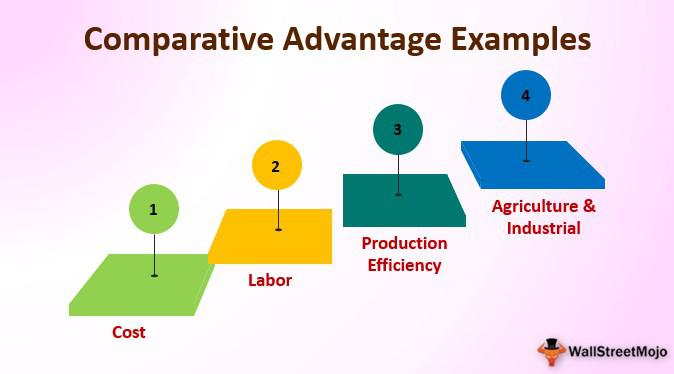

The world of economics and finance encompasses a vast array of theories and models that aim to clarify the mechanisms of trade and production. Among these, the factor endowment theory prominently connects with the principle of comparative advantage, forming a foundational element in international economics. Factor endowment theory suggests that the resources a country possesses—such as land, labor, and capital—significantly influence its production capabilities and trade behaviors. This theory posits that differing resource endowments result in varying opportunity costs for producing goods, which consequently impacts trade and specialization patterns among countries.

Comparative advantage complements this by asserting that countries benefit when specializing in the production of goods for which they have the lowest opportunity cost, thereby maximizing efficiency. Together, these theories provide a lens through which to examine how countries optimize their productive capacities and engage with global markets.



In contemporary settings, these economic principles extend to modern practices such as algorithmic trading, where understanding factor endowments and comparative advantage can inform algorithmic strategies. Algorithmic trading uses complex algorithms to analyze market data and execute trades. By considering economic theories, these algorithms may improve trade outcomes, predicting market trends through the analysis of economic indicators and resource distributions.

This interconnectedness between traditional economic theories and modern financial strategies highlights their enduring relevance. As global markets shift and evolve, mastery of factor endowments and comparative advantage remains crucial for developing effective international trade policies and investment strategies, influencing national economies and fostering continued global integration.

## Table of Contents

## Understanding Factor Endowments

Factor endowments are fundamental to understanding a country's economic capabilities and their positioning in the global market. These endowments are essentially the resources that a nation possesses, which can be categorized into three primary types: land, labor, and capital. Each of these factors contributes uniquely to a country’s ability to produce goods and services, shaping its economic activities and trade practices.

**Land** refers to all natural resources available in a country, such as minerals, forests, and agricultural territory. The abundance or scarcity of these resources determines which sectors a country can excel in. For example, countries with fertile land might focus on agriculture, while those rich in minerals may develop strong mining industries.

**Labor** encompasses the human resource aspect—both the quantity and the quality of the labor force. This means not only the number of people available for work but also their education, skills, and productivity levels. A nation with a skilled workforce can produce complex goods, such as electronics or specialized machinery, more efficiently than a country where the workforce has lower skill levels.

**Capital** involves the tools, machinery, and infrastructure necessary for production. It includes financial resources for investments in technology and innovation. A high level of capital allows for the enhancement of production processes, increasing efficiency and output quality, which is important for sustaining competitive industries in international markets.

The combination and interaction of these factors determine a country's production capabilities. Nations with abundant resources in one or multiple areas can produce specific goods more efficiently, often leading to specialization. For instance, countries like Saudi Arabia with substantial oil reserves can produce petroleum-related products at a lower cost compared to those without such endowments. Similarly, nations rich in labor like Vietnam can specialize in labor-intensive manufacturing industries.

These disparities in [factor](/wiki/factor-investing) endowments influence national economic growth and trade patterns. By focusing on goods that capitalize on their abundant resources, countries can enhance their economic growth through efficient resource utilization and increased export activities. The efficiency with which these resources are utilized can often be discerned through production functions, denoted in economic terms as:

$$
Q = f(L, K)
$$

Where $Q$ represents the output, $L$ is labor, and $K$ is capital. Variations in these factors result in different outputs, affecting economic strategies and trade policies.

Understanding factor endowments is crucial for policy-makers to formulate effective economic strategies that align with national strengths, thereby fostering a competitive edge in the global market.

## Theory of Comparative Advantage

The theory of comparative advantage posits that countries gain by specializing in the production of goods where they have a lower opportunity cost than their trading partners. This principle allows for more efficient global production and consumption patterns. The comparative advantage is distinct from absolute advantage, which refers only to the ability to produce more of a good with the same resources, without considering opportunity costs.

The Heckscher-Ohlin (H-O) model extends this theory by linking it directly to a country's factor endowments. According to the H-O model, countries will export goods that utilize their abundant and cheap factors of production, while importing goods that use factors in which they are scarce. The model emphasizes the roles of capital and labor as primary factors, suggesting that a country rich in capital will export capital-intensive goods, whereas a labor-rich country will export labor-intensive goods.

Mathematically, the comparative advantage can be illustrated with a simple example involving two countries and two goods. Assume countries A and B produce goods X and Y. Let the opportunity cost of producing one unit of X be $OC_A(X)$ in country A and $OC_B(X)$ in country B. If $OC_A(X) < OC_B(X)$, then A has a comparative advantage in producing X. Conversely, if $OC_B(Y) < OC_A(Y)$, then B has a comparative advantage in producing Y.

In more formal terms, the output of each good in each country can be evaluated using a production possibility frontier (PPF), which illustrates the trade-offs between two or more goods. The opportunity cost is represented by the slope of the tangent to the PPF. Specialization occurs when each country focuses on producing the good for which their opportunity cost is lower, maximizing their efficiency and potential gains from trade.

Python can be utilized to model these economic concepts. By simulating variations in factor endowments, one can visualize the shifts in comparative advantage and resultant trade flows. The following Python snippet demonstrates a basic setup for modeling two countries' production capabilities:

```python
import numpy as np
import matplotlib.pyplot as plt

# Define production possibility frontiers
def ppf_country_a(x):
    return 100 - x  # Simplified linear PPF for country A

def ppf_country_b(x):
    return 150 - 0.5 * x  # Simplified linear PPF for country B

x_values = np.linspace(0, 100, 100)

plt.plot(x_values, ppf_country_a(x_values), label='Country A PPF')
plt.plot(x_values, ppf_country_b(x_values), label='Country B PPF')
plt.xlabel('Good X')
plt.ylabel('Good Y')
plt.title('Production Possibility Frontiers')
plt.legend()
plt.grid()
plt.show()
```

This visualization helps to understand the comparative advantages visually. Country A might specialize more in Good Y due to its steeper PPF slope, indicating a lower opportunity cost for Y, while Country B might focus on Good X. Over time, these comparative advantages guide the global distribution of labor and capital, resulting in specific nations gaining prominence in particular industries.

## Applications in International Trade

Countries harness their factor endowments to enhance their competitive advantage in global trade. This approach is grounded in the Heckscher-Ohlin theory, which posits that nations will export goods that utilize their abundant factors most efficiently, thereby defining their economic engagements in specific industries.

Consider Saudi Arabia, a nation endowed with substantial oil reserves. This natural resource endowment allows Saudi Arabia to specialize in the production and export of petroleum products. As a pivotal player in the global energy market, Saudi Arabia capitalizes on its abundant oil resources to maintain a dominant presence. This strategic specialization not only bolsters Saudi Arabia's economic standing but also influences global oil prices and energy supply chains.

Conversely, countries like Vietnam have leveraged their abundant labor resources to pivot towards manufacturing industries. Vietnam's workforce availability has enabled it to become a significant hub for manufacturing goods, from textiles to electronics. This transition has facilitated Vietnam's integration into global supply chains, fostering economic growth and attracting foreign investments. By focusing on labor-intensive manufacturing, Vietnam exemplifies how the Heckscher-Ohlin theory manifests in practical trade applications.

These examples signify how strategic economic decisions based on factor endowments translate into tangible trade practices. In aligning their production capacities with their resource strengths, countries optimize their economic outputs and engage more effectively in international markets. This alignment underscores the practical implementation of economic theories in shaping global trade dynamics.

## The Role of Algorithmic Trading in Economic Theory

Algorithmic trading utilizes advanced technology to perform trades by employing intricate algorithms. These algorithms can draw upon economic theories, such as the theory of comparative advantage, to enhance their operations. By analyzing extensive market data and various economic indicators, [algorithmic trading](/wiki/algorithmic-trading) systems are capable of forecasting market trends and optimizing their trade strategies. 

The core principle of comparative advantage suggests that countries or entities can gain by specializing in goods or services where they hold a relative efficiency. Algorithmic trading systems, leveraging this theory, can adjust strategies to focus on assets or markets where they have an advantage in processing speed, data access, or analytical capability. By focusing on these areas, trading algorithms enhance their efficiency, potentially leading to profitable outcomes. 

The understanding of economic resources and factor endowments is critical to refining these algorithms. For instance, if an algorithm can recognize that a particular region has an abundance of a specific resource (e.g., natural gas in Russia or technology-intensive labor in Silicon Valley), it can factor this information into its trading decisions. As a result, algorithms not only execute trades but do so with an informed perspective on global economic dynamics.

Moreover, algorithmic trading can be enhanced through the application of [machine learning](/wiki/machine-learning) models. These models can process large datasets to identify patterns correlating economic indicators with asset performance. Consider the following Python code snippet, which uses a simple linear regression model to predict future asset prices based on economic indicators:

```python
import numpy as np
from sklearn.linear_model import LinearRegression

# Sample economic data (e.g., GDP growth, interest rates) and corresponding asset prices.
X = np.array([[2.5, 1.5], [3.0, 1.7], [3.5, 2.0], [2.8, 1.6]])  # Economic indicators
y = np.array([90, 95, 100, 92])  # Asset prices

# Create and train the model
model = LinearRegression()
model.fit(X, y)

# Predict future asset prices based on new economic indicators
new_data = np.array([[3.2, 1.8]])
predicted_price = model.predict(new_data)
print("Predicted asset price:", predicted_price)
```

In the context of factor endowments, algorithms that incorporate data such as resource availability or shifts in labor markets can identify opportunities or risks more effectively. They can adjust their trading patterns to align with changes in global supply and demand dynamics, thus yielding better performance.

In conclusion, the incorporation of economic theories, including comparative advantage and an understanding of factor endowments, enriches the capabilities of algorithmic trading systems. By integrating these theories with advanced computational techniques, traders can develop strategies that are not only data-driven but also economically informed, potentially leading to greater efficiencies and gains in the financial markets.

## Case Studies: Economic Growth through Resource Specialization

China's economic development exemplifies the strategic utilization of factor endowments to achieve rapid and sustained growth. Historically, China's economy was predominantly labor-intensive, capitalizing on its vast labor force to drive manufacturing and exports. This approach aligned with the theory of comparative advantage, as China's abundant labor supply provided a competitive edge in the production of labor-intensive goods.

However, over the past few decades, China's economic model has evolved significantly. The nation has strategically shifted towards a more capital- and technology-intensive economy. This transformation has been driven by substantial investments in education, infrastructure, and technology development, enabling China to leverage its growing capital resources. The transition illustrates how a country can adapt its economic strategy to changing factor endowments, aligning with the Heckscher-Ohlin model, which predicts that countries will export products that utilize their abundant and cheap factors of production.

China's focus on high-tech industries, such as telecommunications, electronics, and green technology, highlights the impact of resource specialization on economic growth. By prioritizing industries that align with its evolving factor endowments, China has not only increased its GDP and improved living standards but also established itself as a leader in global markets.

Studying economies like China provides valuable insights into the potential for economic specialization based on factor endowments. For instance, South Korea's transition from agrarian products to advanced manufacturing, particularly in the automotive and electronics sectors, mirrors the success seen in China. These examples emphasize the importance of adapting to and leveraging specific economic resources to foster prosperity and development.

The impact of factor endowments and comparative advantage extends beyond individual countries, shaping national and global economic strategies. By aligning production and investment strategies with available resources, nations can enhance their competitiveness, stimulate innovation, and ensure long-term economic sustainability. As global markets continue to evolve, the ability to intelligently harness factor endowments will remain a crucial determinant of economic success.

## Conclusion: Future Implications

As global markets continue to evolve, the importance of understanding factor endowments and comparative advantage becomes increasingly significant. These economic principles form the foundation upon which nations can build and maintain competitive edges in international trade. Countries are confronted with the necessity to adapt to shifting economic landscapes and the varying availability of resources. This adaptability is crucial for nations striving to optimize their production and trade strategies, ensuring sustained economic growth and competitiveness.

The dynamic nature of factor endowments necessitates ongoing assessment and adjustment in a country's economic strategies. Nations with abundant natural resources, for example, may need to diversify their economies or invest in human capital and technology to respond to changes in global demand or fluctuations in resource prices. Conversely, countries with limited resources might focus on developing niche markets or investing in sectors where they can achieve a comparative advantage, thereby enhancing their economic resilience.

The integration of algorithmic trading with economic theories represents a transformative influence on global trade and investment landscapes. By leveraging advanced technologies, algorithmic trading systems can analyze vast amounts of market data and economic indicators, allowing for more informed decision-making. These systems can incorporate principles of comparative advantage and factor endowments to optimize trade strategies, identifying opportunities that align with a country's strengths and capabilities.

Economies that successfully merge algorithmic trading with traditional economic theories can achieve greater efficiency and responsiveness in their trade activities. For instance, real-time market analysis facilitated by algorithms can help identify shifts in demand or supply conditions, enabling quicker adaptation to global economic trends. Furthermore, this integration facilitates strategic investment decisions, where countries allocate resources to sectors or projects that promise the highest returns based on comparative advantage.

Looking towards the future, the continued interplay between economic theories and technological advancements will likely shape the global competitive landscape. As nations harness both factor endowments and cutting-edge technologies, their ability to remain competitive and foster economic prosperity will depend on a keen understanding of these foundational economic concepts. The strategic application of these principles will not only enhance trade and investment strategies but also drive innovation and sustainable growth in a continually evolving global economy.

## References & Further Reading

[1]: Heckscher, E., & Ohlin, B. (1991). ["Heckscher-Ohlin Trade Theory"](https://www.semanticscholar.org/paper/Heckscher-Ohlin-Trade-Theory-Heckscher-Ohlin/c17f6387cf84a14def54d80047022a954f084f73) The MIT Press.

[2]: Krugman, P. R., & Obstfeld, M. (2006). ["International Economics: Theory and Policy"](https://archive.org/details/internationaleco0008krug) Pearson.

[3]: Romer, D. (2012). ["Advanced Macroeconomics"](https://archive.org/details/AdvancedMacroeconomicsRomer) McGraw-Hill Education.

[4]: Mankiw, N. G. (2014). ["Principles of Economics"](https://books.google.com/books/about/Principles_of_Economics.html?id=KQfFDwAAQBAJ) Cengage Learning.

[5]: Milgrom, P., & Roberts, J. (1992). ["Economics, Organization and Management"](https://books.google.com/books/about/Economics_Organization_and_Management.html?id=3xK7AAAAIAAJ) Prentice Hall.

[6]: Porter, M. E. (1998). ["The Competitive Advantage of Nations"](https://hbr.org/1990/03/the-competitive-advantage-of-nations) Free Press.

[7]: Fama, E. F. (1970). ["Efficient Capital Markets: A Review of Theory and Empirical Work"](https://onlinelibrary.wiley.com/doi/abs/10.1111/j.1540-6261.1970.tb00518.x) Journal of Finance, 25(2), 383-417.

[8]: Samuelson, P. A. (1948). ["International Trade and the Equalisation of Factor Prices"](https://academic.oup.com/ej/article-abstract/58/230/163/5259961) The Economic Journal, 58(230), 163-184.