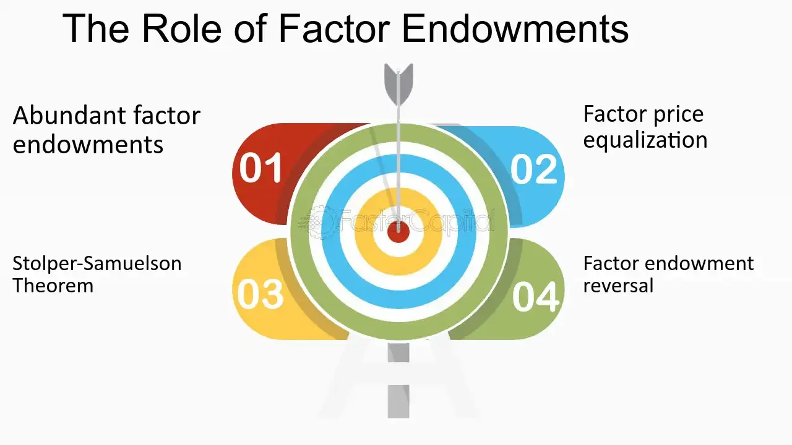

## Table of Contents

## What are factor endowments?

Factor endowments refer to the different amounts and types of resources that a country has. These resources can include things like land, labor, and capital. Each country has its own unique mix of these factors, which can influence what kinds of goods and services it can produce efficiently. For example, a country with a lot of fertile land might be good at farming, while a country with a lot of educated workers might be good at technology.

These endowments play a big role in international trade. Countries tend to export goods that use their abundant resources and import goods that require resources they don't have much of. This idea is part of the Heckscher-Ohlin model, which helps explain why countries trade with each other. By focusing on what they are good at, countries can benefit from trade and improve their overall economy.

## What is comparative advantage?

Comparative advantage is when a country can produce a good or service at a lower opportunity cost than another country. Opportunity cost means what you give up to produce something. For example, if a country can make cars more easily than another country, it has a comparative advantage in making cars.

This idea is important for trade between countries. If each country focuses on what it's best at, they can trade with each other and both be better off. For example, if one country is good at making wine and another is good at making cloth, they can trade wine for cloth. This way, both countries can have more wine and cloth than if they tried to make both on their own.

## How do factor endowments influence a country's production capabilities?

Factor endowments are the different amounts and types of resources a country has, like land, labor, and capital. These resources affect what a country can make well. For example, a country with a lot of farmland can grow crops more easily than a country with less land. A country with many skilled workers might be good at making technology or other complex things. So, the resources a country has shape what it can produce and do well.

Because of factor endowments, countries tend to focus on making things they have a lot of resources for. This makes them more efficient and better at those things. For example, a country with a lot of oil might focus on oil production and export it to other countries. By doing this, they can trade their oil for other things they need, like food or technology. This helps countries use their resources in the best way and can make their economies stronger.

## Can you explain the Heckscher-Ohlin model in relation to factor endowments?

The Heckscher-Ohlin model is a way to understand why countries trade with each other. It says that countries will export goods that use their abundant resources and import goods that use resources they don't have much of. For example, if a country has a lot of land but not many workers, it might be good at farming because farming uses a lot of land but not many people. On the other hand, a country with a lot of workers but not much land might be good at making things like clothes, because making clothes uses a lot of labor.

This model is based on the idea of factor endowments, which are the different amounts and types of resources a country has. These resources can be things like land, labor, and capital. The Heckscher-Ohlin model says that because countries have different factor endowments, they will specialize in making different things. By focusing on what they are good at and trading with other countries, everyone can benefit. This helps explain why countries trade and how they can use their resources in the best way to make their economies stronger.

## What role do labor and capital play in determining comparative advantage?

Labor and capital are important parts of what makes a country good at making certain things. Labor means the workers in a country, and capital means things like machines and buildings. If a country has a lot of workers, it might be good at making things that need a lot of people, like clothes or electronics. On the other hand, if a country has a lot of machines and buildings, it might be good at making things that need a lot of capital, like cars or big factories.

These resources help decide a country's comparative advantage. Comparative advantage is when a country can make something at a lower cost than other countries. For example, if a country has a lot of workers and not many machines, it might be cheaper for them to make clothes than cars. By focusing on what they are good at, countries can trade with each other and both be better off. This way, they can use their labor and capital in the best way to help their economy grow.

## How do natural resources as factor endowments affect trade patterns?

Natural resources are things like oil, gas, minerals, and fertile land that a country has. These resources can change how countries trade with each other. If a country has a lot of a certain natural resource, like oil, it will probably focus on getting that resource out of the ground and selling it to other countries. This means the country will export a lot of oil because it has more than it needs and can make money by selling it. On the other hand, countries that don't have much oil will need to buy it from countries that do, so they will import oil.

This pattern of trading based on natural resources helps countries use what they have best. For example, a country with a lot of fertile land might grow a lot of food and sell it to other countries. Countries without much good land will buy this food. By focusing on what they are good at because of their natural resources, countries can trade with each other and both get what they need. This can make their economies stronger and help them grow.

## What is the difference between factor abundance and factor intensity?

Factor abundance means how much of a resource, like land, labor, or capital, a country has compared to other countries. If a country has a lot more of one resource than others, it is said to be abundant in that factor. For example, if a country has a lot of oil but not much farmland, it is abundant in oil. This abundance can affect what the country is good at making and what it trades with other countries.

Factor intensity, on the other hand, is about how much a certain resource is needed to make a product. If making a product uses a lot of one resource, like labor or capital, it is said to be intensive in that factor. For example, making cars might need a lot of machines and factories, so it is capital-intensive. Making clothes might need a lot of workers, so it is labor-intensive. The factor intensity of a product helps decide if a country with a lot of that resource should make it.

## How do changes in factor endowments over time impact a country's comparative advantage?

Changes in a country's factor endowments over time can change what it is good at making. Factor endowments are things like land, labor, and capital that a country has. If a country gets more of one resource, like more educated workers, it can become better at making things that need those workers, like technology or medicine. On the other hand, if a country loses a resource, like if its oil runs out, it might not be as good at making things that use oil anymore. So, as the resources a country has change, what it can make well also changes.

These changes can make a country's comparative advantage different over time. Comparative advantage means what a country can make at a lower cost than other countries. If a country's resources change, it might find new things it is good at making. For example, if a country invests a lot in education and gets more skilled workers, it might start making more complex products and trade those with other countries. This can help the country's economy grow by focusing on what it is good at now, even if that is different from before.

## Can factor endowments explain the entire basis of comparative advantage, or are there other factors at play?

Factor endowments are a big part of why countries have a comparative advantage in making certain things. They are the resources a country has, like land, labor, and capital. If a country has a lot of farmland, it might be good at growing crops. If it has a lot of workers, it might be good at making things that need a lot of people, like clothes. The Heckscher-Ohlin model says that countries will focus on making things they have a lot of resources for and trade with other countries for things they don't have much of. This can help explain why countries trade and what they are good at making.

But factor endowments are not the only reason for comparative advantage. Other things can also affect what a country is good at. For example, technology can make a big difference. If a country has new machines or ways of doing things, it can make things better and cheaper than other countries. Also, government policies like taxes and rules can change what a country is good at making. And sometimes, even things like culture or how good a country is at working together can matter. So, while factor endowments are important, they are not the whole story. Other things also play a role in deciding a country's comparative advantage.

## How do technological advancements interact with factor endowments to shape comparative advantage?

Technological advancements can change how a country uses its factor endowments to create a comparative advantage. Factor endowments are things like land, labor, and capital that a country has. When a country gets new technology, it can make better use of these resources. For example, if a country has a lot of workers but not many machines, new technology can help those workers be more productive. This means the country can make more things or make them better, even if it doesn't have a lot of machines. So, technology can help a country turn its resources into a bigger advantage over other countries.

But technology can also change what resources are important. If a new way of farming uses less land but more machines, a country with a lot of land might not be as good at farming anymore. Instead, it might need to focus on something else. Or, if new technology makes it easier to find oil, a country with a lot of oil might become even better at selling it. So, technology doesn't just help countries use their resources better; it can also change which resources matter most. This means a country's comparative advantage can shift as technology changes, making some resources more valuable and others less so.

## What empirical evidence supports the theory that factor endowments drive comparative advantage?

There is a lot of evidence that shows factor endowments are important for a country's comparative advantage. For example, studies have looked at how countries trade and found that countries with a lot of land tend to export things like food and raw materials. Countries with a lot of workers often export things like clothes and shoes that need a lot of people to make. This matches what the Heckscher-Ohlin model says about how countries will use their resources to make and sell things.

Another piece of evidence comes from looking at how countries change over time. If a country gets more of a certain resource, like more educated workers, it often starts making and exporting different things. For example, when South Korea invested a lot in education and technology, it went from making simple things to making complex electronics and cars. This shows that as a country's factor endowments change, so does what it is good at making and trading.

## How do global economic policies and trade agreements modify the impact of factor endowments on comparative advantage?

Global economic policies and trade agreements can change how factor endowments affect a country's comparative advantage. These policies and agreements can make it easier or harder for countries to use their resources to make and sell things. For example, if a trade agreement lowers taxes on things a country is good at making, that country can sell more of those things to other countries. This can make its comparative advantage even stronger. On the other hand, if a policy makes it hard to use certain resources, like putting limits on how much oil a country can sell, it can weaken the country's advantage in making things that use oil.

Also, trade agreements can help countries work together and share resources. If countries agree to work together, they can use each other's resources better. For example, one country might have a lot of workers, and another might have a lot of machines. By working together, they can make things that use both workers and machines well. This can change what each country is good at making and help them both grow their economies. So, global economic policies and trade agreements can change how countries use their factor endowments and shape their comparative advantage.

## What is Understanding Factor Endowments?

Factor endowments are fundamental to understanding a country's economic capabilities and their positioning in the global market. These endowments are essentially the resources that a nation possesses, which can be categorized into three primary types: land, labor, and capital. Each of these factors contributes uniquely to a country’s ability to produce goods and services, shaping its economic activities and trade practices.

**Land** refers to all natural resources available in a country, such as minerals, forests, and agricultural territory. The abundance or scarcity of these resources determines which sectors a country can excel in. For example, countries with fertile land might focus on agriculture, while those rich in minerals may develop strong mining industries.

**Labor** encompasses the human resource aspect—both the quantity and the quality of the labor force. This means not only the number of people available for work but also their education, skills, and productivity levels. A nation with a skilled workforce can produce complex goods, such as electronics or specialized machinery, more efficiently than a country where the workforce has lower skill levels.

**Capital** involves the tools, machinery, and infrastructure necessary for production. It includes financial resources for investments in technology and innovation. A high level of capital allows for the enhancement of production processes, increasing efficiency and output quality, which is important for sustaining competitive industries in international markets.

The combination and interaction of these factors determine a country's production capabilities. Nations with abundant resources in one or multiple areas can produce specific goods more efficiently, often leading to specialization. For instance, countries like Saudi Arabia with substantial oil reserves can produce petroleum-related products at a lower cost compared to those without such endowments. Similarly, nations rich in labor like Vietnam can specialize in labor-intensive manufacturing industries.

These disparities in [factor](/wiki/factor-investing) endowments influence national economic growth and trade patterns. By focusing on goods that capitalize on their abundant resources, countries can enhance their economic growth through efficient resource utilization and increased export activities. The efficiency with which these resources are utilized can often be discerned through production functions, denoted in economic terms as:

$$
Q = f(L, K)
$$

Where $Q$ represents the output, $L$ is labor, and $K$ is capital. Variations in these factors result in different outputs, affecting economic strategies and trade policies.

Understanding factor endowments is crucial for policy-makers to formulate effective economic strategies that align with national strengths, thereby fostering a competitive edge in the global market.

## References & Further Reading

[1]: Heckscher, E., & Ohlin, B. (1991). ["Heckscher-Ohlin Trade Theory"](https://www.semanticscholar.org/paper/Heckscher-Ohlin-Trade-Theory-Heckscher-Ohlin/c17f6387cf84a14def54d80047022a954f084f73) The MIT Press.

[2]: Krugman, P. R., & Obstfeld, M. (2006). ["International Economics: Theory and Policy"](https://archive.org/details/internationaleco0008krug) Pearson.

[3]: Romer, D. (2012). ["Advanced Macroeconomics"](https://archive.org/details/AdvancedMacroeconomicsRomer) McGraw-Hill Education.

[4]: Mankiw, N. G. (2014). ["Principles of Economics"](https://books.google.com/books/about/Principles_of_Economics.html?id=KQfFDwAAQBAJ) Cengage Learning.

[5]: Milgrom, P., & Roberts, J. (1992). ["Economics, Organization and Management"](https://books.google.com/books/about/Economics_Organization_and_Management.html?id=3xK7AAAAIAAJ) Prentice Hall.

[6]: Porter, M. E. (1998). ["The Competitive Advantage of Nations"](https://hbr.org/1990/03/the-competitive-advantage-of-nations) Free Press.

[7]: Fama, E. F. (1970). ["Efficient Capital Markets: A Review of Theory and Empirical Work"](https://onlinelibrary.wiley.com/doi/abs/10.1111/j.1540-6261.1970.tb00518.x) Journal of Finance, 25(2), 383-417.

[8]: Samuelson, P. A. (1948). ["International Trade and the Equalisation of Factor Prices"](https://academic.oup.com/ej/article-abstract/58/230/163/5259961) The Economic Journal, 58(230), 163-184.