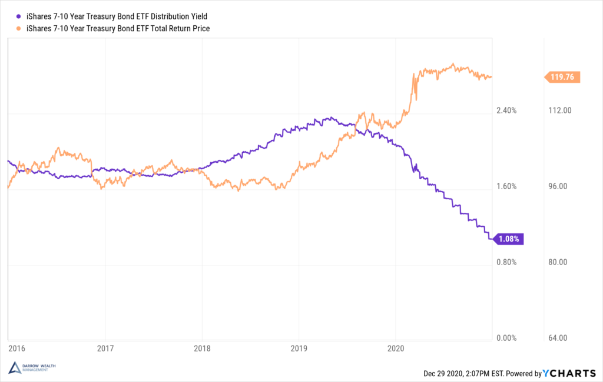

## Table of Contents

## What is a bond?

A bond is like a loan that you give to a company or the government. When you buy a bond, you are lending them money. In return, they promise to pay you back the money you lent them, plus some extra money as a thank you. This extra money is called interest. Bonds are a way for companies and governments to borrow money from people like you to help them grow or do important work.

Bonds have a set time when they will be paid back, which is called the maturity date. Until that date, you get interest payments usually every six months or once a year. The interest rate, or the amount of extra money you get, is decided when you buy the bond and stays the same until it matures. Bonds are seen as safer investments than stocks because they are more predictable, but they usually offer lower returns.

## What is par value in the context of bonds?

Par value, also known as face value, is the amount of money that the bond issuer agrees to pay back to the bondholder when the bond reaches its maturity date. For example, if you buy a bond with a par value of $1,000, you will get $1,000 back from the issuer when the bond matures. This is important because it tells you the exact amount you will receive at the end of the bond's term.

The par value also helps determine the bond's interest payments. The interest rate, or coupon rate, is usually a percentage of the par value. So, if a bond has a par value of $1,000 and a coupon rate of 5%, you will receive $50 in interest each year until the bond matures. Understanding the par value is key because it directly affects both the final payout and the regular interest you earn from the bond.

## How are bond prices determined?

Bond prices are determined by what people are willing to pay for them in the market. This can change over time and depends on a few things, like how safe the bond is seen to be, how long it has until it matures, and what interest rates are doing. If people think the bond is very safe, they might be willing to pay more for it. If the bond has a long time until it matures, the price can change more because there's more time for things to happen that might affect it.

Interest rates play a big role in bond prices. When interest rates go up, new bonds that are issued will have higher interest rates, making older bonds with lower rates less attractive. So, the price of those older bonds might go down because people won't want to pay as much for them. On the other hand, if interest rates go down, the older bonds with higher rates become more valuable, and their prices might go up. This seesaw effect between bond prices and interest rates is something to keep an eye on if you're thinking about buying or selling bonds.

## What does it mean when bond prices fall?

When bond prices fall, it means that the value of the bond in the market has gone down. This can happen for a few reasons, but one big reason is when interest rates go up. When new bonds are issued with higher interest rates, the older bonds with lower rates become less attractive to investors. So, people are willing to pay less for those older bonds, which makes their prices drop.

Falling bond prices can affect you if you want to sell your bond before it matures. You might get less money back than you paid for it. But if you hold onto the bond until it matures, you will still get the par value, which is the amount promised when you bought the bond. So, even though the price of the bond goes down, the amount you get at the end stays the same, as long as you don't sell it early.

## How does the fall in bond prices affect the par value of a bond?

When bond prices fall, it doesn't change the par value of the bond. The par value, or face value, is the amount the bond issuer promises to pay back when the bond matures. So, even if the price of the bond goes down in the market, the par value stays the same. If you bought a bond with a par value of $1,000, you will still get $1,000 back when the bond reaches its maturity date.

The fall in bond prices only affects you if you want to sell the bond before it matures. If you sell it when the price is lower, you might get less money than you originally paid for it. But if you keep the bond until it matures, you will receive the full par value, no matter what the market price was in the meantime. So, the par value is like a promise that doesn't change, even when bond prices go up and down.

## What is the relationship between bond prices and interest rates?

Bond prices and interest rates have an opposite relationship. When interest rates go up, bond prices go down. This happens because new bonds that are issued will have higher interest rates, making the older bonds with lower rates less attractive to investors. So, people are willing to pay less for those older bonds, which makes their prices drop.

On the other hand, when interest rates go down, bond prices go up. This is because the older bonds with higher interest rates become more valuable compared to the new bonds with lower rates. Investors are willing to pay more for those older bonds because they offer better returns. This seesaw effect between bond prices and interest rates is important to understand if you're thinking about buying or selling bonds.

## Can the par value of a bond change after issuance?

The par value of a bond does not change after it is issued. When you buy a bond, the par value is set, and it stays the same until the bond matures. This is the amount of money the bond issuer promises to pay you back at the end of the bond's term. So, even if the price of the bond goes up or down in the market, the par value remains the same.

This is important because it means you know exactly how much money you will get back when the bond matures, no matter what happens to the bond's price in the meantime. The par value is like a promise that doesn't change, which helps make bonds a more predictable investment compared to stocks.

## How does the concept of yield to maturity relate to falling bond prices and par value?

Yield to maturity (YTM) is the total interest rate you would earn if you held a bond until it matures. It takes into account the bond's current market price, its par value, and the interest payments you get over time. When bond prices fall, the yield to maturity goes up. This is because you're buying the bond for less than its par value, but you'll still get the full par value when it matures. So, the return on your investment is higher because you paid less for it.

Even though the bond's price might go up and down, the par value stays the same. The par value is the amount the bond issuer promises to pay back at the end. So, if you buy a bond when its price is low and hold it until it matures, you'll get the par value, which means a higher yield to maturity. But if you sell the bond before it matures, you might not get the full par value and your actual return could be different from the yield to maturity you calculated.

## What are the implications of falling bond prices for bondholders at maturity?

Falling bond prices don't change what you get at the end when your bond matures. The par value, which is the amount promised to you when you bought the bond, stays the same no matter what happens to the price. So, if you bought a bond with a par value of $1,000, you will still get $1,000 back when the bond reaches its maturity date. This means that if you hold onto your bond until it matures, the fall in bond prices won't affect the money you get back.

However, if you want to sell your bond before it matures, falling prices can affect you. If the bond's price has gone down, you might get less money than you paid for it if you sell it early. But if you can wait until the bond matures, you'll get the full par value, no matter what the market price was in the meantime. So, for bondholders at maturity, the key thing is to hold onto the bond until it matures to get the promised par value, even if the price falls along the way.

## How do investors typically react to falling bond prices in terms of their investment strategies?

When bond prices fall, investors often think about what to do next. Some might decide to hold onto their bonds until they mature. They know that even though the price went down, they will still get the full par value at the end. This can be a good choice if they don't need the money right away and believe the bond is still safe. Holding onto the bond means they can still get the interest payments and the promised amount when it matures.

Other investors might see falling bond prices as a chance to buy more bonds. If they think the prices will go back up or if they want to lock in a higher yield to maturity, they might buy bonds when the prices are low. This can be a smart move if they believe the market will recover and the bond prices will rise again. But it's a bit riskier because they are betting on the future, and things might not go as planned.

Some investors might decide to sell their bonds when prices fall, especially if they need cash or think the prices will keep going down. Selling at a lower price means they will get less money than they paid, which can be a loss. But if they need the money or think it's better to get out before things get worse, selling might be the right choice for them. Each investor has to think about their own needs and what they believe will happen in the market.

## What are the broader economic impacts of a sustained fall in bond prices?

When bond prices keep falling for a long time, it can affect the whole economy. One big reason bond prices fall is because interest rates are going up. When interest rates go up, it costs more for people and businesses to borrow money. This can slow down spending and investment because loans are more expensive. Companies might not want to start new projects or expand if they have to pay more to borrow money. This can lead to less growth in the economy because businesses are not investing as much.

Also, falling bond prices can make people feel less confident about the economy. If people see that their investments in bonds are losing value, they might worry about what's happening with the economy. This can make them save more and spend less, which can slow down economic activity even more. Governments might also find it harder to borrow money because they have to offer higher interest rates on their bonds. This means they might have to cut back on spending or raise taxes, which can also slow down the economy. So, a sustained fall in bond prices can lead to less spending, less investment, and slower growth overall.

## How can financial models be used to predict the impact of falling bond prices on par value and overall bond portfolio performance?

Financial models help investors understand how falling bond prices might affect their bond portfolio. These models use math to predict what might happen to the value of bonds over time. One important thing they look at is the yield to maturity, which is the total interest you would earn if you held the bond until it matures. When bond prices fall, the yield to maturity goes up because you're buying the bond for less but will still get the full par value at the end. So, financial models can show how changes in bond prices affect the overall return on your investment, helping you decide whether to hold onto your bonds or sell them.

Another thing financial models do is look at how falling bond prices might affect the par value at maturity. The par value is the amount of money the bond issuer promises to pay back when the bond matures. Even if the bond price falls, the par value stays the same. So, if you hold onto the bond until it matures, you will still get the full par value. Financial models can help you see how holding onto your bonds until they mature can protect your investment from the impact of falling prices. They can also show you how selling bonds before they mature might lead to a loss if you sell them when the price is low.

## What is the relationship between bond prices and par value?

A bond's par value, also known as its face value, represents the amount the issuer agrees to repay at the bond's maturity. Typically set at standard denominations such as $1,000 or $100, par value is critical in determining both the coupon interest a bond will pay and the amount investors will receive at maturity. Despite its predefined value, a bond's market price can vary significantly over its lifespan, influenced largely by prevailing interest rates.

Bond prices fluctuate due to multiple factors, with changes in market interest rates being the most significant aspect. When market interest rates rise, existing bonds with lower coupon rates become less attractive to investors, leading to a decrease in their market prices. Conversely, if interest rates fall, existing bonds with higher coupon rates become more desirable, resulting in an increase in their market prices. This inverse relationship between bond prices and interest rates can be expressed mathematically as:

$$
P = \frac{C}{(1 + r)^1} + \frac{C}{(1 + r)^2} + \ldots + \frac{C + F}{(1 + r)^n}
$$

where:
- $P$ is the bond price,
- $C$ is the annual coupon payment,
- $r$ is the market interest rate,
- $F$ is the face value of the bond, and
- $n$ is the number of years to maturity.

This formula illustrates how the present value of a bond's future cash flows, including both periodic interest payments and the return of principal at maturity, are affected by changes in interest rates.

Beyond interest rates, bond prices can also be impacted by changes in credit quality of the issuer, shifts in inflation expectations, and changes in [liquidity](/wiki/liquidity-risk-premium) conditions. Credit rating downgrades or upgrades can alter investor perceptions regarding the risk of a bond, thus influencing its price. Similarly, inflation erodes the real return of a bond, generally causing long-term bonds to drop in value when inflation expectations rise.

Understanding these dynamics is crucial for investors looking to navigate the bond market effectively. As market conditions fluctuate, the ability to assess how bond prices respond to such changes allows for informed investment decisions. Recognizing the factors influencing bond pricing, investors can better manage portfolio risk and capitalize on opportunities presented by market movements.

## What are the economics of bond pricing?

Bond pricing is intricately linked to interest rates, which are pivotal in determining both the bond's price and its yield. The yield represents the return an investor can expect from holding the bond, expressed as a percentage. When market interest rates change, they affect the attractiveness of existing bonds, which subsequently influences their market prices.

### Interest Rate and Bond Price Relationship

The fundamental relationship between bond prices and interest rates is inverse. When interest rates rise, the prices of existing bonds typically fall. Conversely, when interest rates decrease, existing bond prices usually increase. This inverse relationship is due to the fixed nature of a bond's coupon payments. When new bonds are issued at higher rates due to increased market rates, the older bonds with lower coupon rates become less attractive, necessitating a decrease in their market price to offer a competitive yield.

### Mathematical Representation

The price of a bond can be expressed using the following formula:

$$
P = \sum_{t=1}^{n} \frac{C}{(1 + r)^t} + \frac{F}{(1 + r)^n}
$$

- $P$ = Price of the bond
- $C$ = Coupon payment
- $r$ = Market interest rate (or yield to maturity)
- $F$ = Face value of the bond
- $n$ = Total number of periods until maturity

As interest rates ($r$) rise, the present value of future cash flows (both coupon payments and principal repayment) diminishes, leading to a decrease in the bond's price.

### Discount and Premium Bonds

Bonds can trade at a discount or premium relative to their par value based on the prevailing market interest rates:

- **Discount Bonds**: These bonds are priced below their par value. This situation occurs when the coupon rate of the bond is less than the current market interest rates. Investors purchase these bonds at a lower price to align the yield with prevailing rates.

- **Premium Bonds**: These bonds are priced above their par value. This situation occurs when the bond's coupon rate is higher than the current market interest rates. Investors are willing to pay more for such bonds to capture the higher returns.

### Impact of Interest Rate Changes

Understanding the implications of [interest rate](/wiki/interest-rate-trading-strategies) movements is crucial for investors:

- **Rising Interest Rates**: Bonds with lower coupon rates will see a sharp decrease in their prices. This makes them less attractive as new issuances offer higher returns.

- **Falling Interest Rates**: Existing bonds with higher coupon rates than the new prevailing rates become more valuable, leading to price increases.

The sensitivity of a bond's price to changes in interest rates is captured by a measure called "duration." Duration estimates the percentage change in a bond's price for a 1% change in interest rates, helping investors assess interest rate risk.

By understanding these economic dynamics, investors can make informed decisions about bond investments, considering potential interest rate scenarios and their impact on bond valuations.

## References & Further Reading

[1]: ["Advances in Financial Machine Learning"](https://www.amazon.com/Advances-Financial-Machine-Learning-Marcos/dp/1119482089) by Marcos Lopez de Prado

[2]: Bergstra, J., Bardenet, R., Bengio, Y., & Kégl, B. (2011). ["Algorithms for Hyper-Parameter Optimization."](https://dl.acm.org/doi/10.5555/2986459.2986743) Advances in Neural Information Processing Systems 24.

[3]: ["Machine Learning for Algorithmic Trading"](https://github.com/stefan-jansen/machine-learning-for-trading) by Stefan Jansen

[4]: ["Quantitative Trading: How to Build Your Own Algorithmic Trading Business"](https://www.amazon.com/Quantitative-Trading-Build-Algorithmic-Business/dp/1119800064) by Ernest P. Chan

[5]: ["Evidence-Based Technical Analysis: Applying the Scientific Method and Statistical Inference to Trading Signals"](https://www.amazon.com/Evidence-Based-Technical-Analysis-Scientific-Statistical/dp/0470008741) by David Aronson