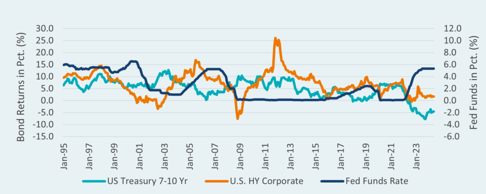

## Table of Contents

## What is the Federal Funds Rate?

The Federal Funds Rate is the interest rate at which banks lend money to each other overnight. It's set by the Federal Reserve, which is like the central bank of the United States. This rate is important because it helps control the amount of money circulating in the economy. When the Federal Reserve changes this rate, it can make borrowing money more or less expensive for banks, which in turn affects the rates they charge their customers.

When the Federal Funds Rate goes up, it usually means that borrowing money becomes more expensive. This can slow down spending and help control inflation, which is when prices for things like food and gas go up too quickly. On the other hand, if the Federal Funds Rate goes down, borrowing money becomes cheaper, which can encourage people and businesses to spend more and help the economy grow. The Federal Reserve adjusts this rate to keep the economy balanced and healthy.

## How does the Federal Funds Rate affect the economy?

The Federal Funds Rate is a big deal for the economy because it changes how much it costs for banks to borrow money from each other. When the Federal Reserve, which is like the boss of money in the U.S., makes the rate higher, banks have to pay more to borrow money. This makes them charge higher interest rates to people and businesses who want loans. When loans are more expensive, people might not want to borrow as much, so they spend less. This can slow down the economy and help stop prices from going up too fast, which is called inflation.

On the flip side, if the Federal Reserve lowers the Federal Funds Rate, it's cheaper for banks to borrow money. This means banks can offer lower interest rates to people and businesses. When loans are cheaper, more people might want to borrow money to buy things like houses or cars, or to start businesses. This can make the economy grow faster because more money is moving around. So, the Federal Funds Rate is a tool the Federal Reserve uses to keep the economy balanced, trying to avoid both too much inflation and too slow growth.

## What is a bond portfolio?

A bond portfolio is a collection of bonds that an investor owns. Bonds are like IOUs where you lend money to a government or a company, and they promise to pay you back with interest over time. When you have a bond portfolio, you're spreading your money across different bonds to reduce risk. This way, if one bond doesn't do well, the others might still be okay.

Having a bond portfolio can help you earn steady income from the interest payments, which are usually more predictable than stock dividends. It's also a way to keep your money safe because bonds are generally less risky than stocks. By choosing a mix of different types of bonds, like government bonds and corporate bonds, you can balance the potential returns with the level of risk you're comfortable with.

## How do interest rate changes impact bond prices?

When interest rates go up, bond prices usually go down. This happens because new bonds start paying higher interest, making the older bonds with lower interest rates less attractive. Imagine you have a bond that pays 2% interest, but now you can buy a new bond that pays 3%. People would rather buy the new bond, so to sell the old one, you might have to lower its price.

On the flip side, when interest rates go down, bond prices tend to go up. If you have a bond paying 3% interest and new bonds are only paying 2%, your bond looks pretty good to other people. They might be willing to pay more to buy your bond because it gives them a better return than the new ones. So, the price of your bond goes up.

## What is the relationship between bond yields and the Federal Funds Rate?

The Federal Funds Rate is the rate at which banks lend money to each other overnight, and it's set by the Federal Reserve. When the Federal Reserve changes this rate, it affects the whole economy, including bond yields. Bond yields are the return you get from a bond, and they move in the opposite direction of bond prices. When the Federal Funds Rate goes up, it often leads to higher yields on new bonds because the cost of borrowing money goes up for everyone, including the government and companies that issue bonds.

Here's how it works: When the Federal Funds Rate rises, new bonds need to offer higher yields to attract investors, who can now get better returns from other investments like savings accounts. This makes existing bonds with lower yields less attractive, so their prices drop, which in turn pushes their yields up to match the market. On the other hand, when the Federal Funds Rate goes down, new bonds can offer lower yields because borrowing money is cheaper. This makes existing bonds with higher yields more attractive, so their prices go up, and their yields go down. So, the Federal Funds Rate and bond yields are closely connected, with changes in the Federal Funds Rate often leading to changes in bond yields.

## How can an increase in the Federal Funds Rate affect the value of existing bonds?

When the Federal Funds Rate goes up, it makes borrowing money more expensive for everyone, including banks. This means that new bonds that are issued will have to offer higher interest rates to attract investors. If you have an existing bond that pays a lower interest rate than these new bonds, it becomes less attractive to other people. To sell your old bond, you might have to lower its price. This is because people would rather buy the new bonds with higher interest rates.

So, when the Federal Funds Rate increases, the prices of existing bonds usually go down. This happens because the bond market adjusts to the new, higher interest rates. When bond prices fall, the yield on those bonds goes up. Yield is like the return you get from the bond, and it moves in the opposite direction of the bond's price. In simple terms, an increase in the Federal Funds Rate can make your existing bonds worth less money, but they might give you a higher return if you hold onto them until they mature.

## What strategies can bond portfolio managers use to mitigate the risks of Federal Funds Rate increases?

Bond portfolio managers can use a strategy called duration management to help deal with the risks of the Federal Funds Rate going up. Duration is a measure of how sensitive a bond's price is to changes in interest rates. Bonds with longer durations are more affected by interest rate changes, so managers might choose to shorten the duration of their portfolio. This means they would sell bonds that have a long time until they mature and buy bonds that will mature sooner. By doing this, they can reduce the impact of rising rates on their portfolio's value.

Another strategy is to diversify the types of bonds in the portfolio. Managers might include a mix of different bonds, like government bonds, corporate bonds, and even bonds from different countries. This way, if the Federal Funds Rate goes up and affects one type of bond more than others, the portfolio won't be hit as hard. They might also look into floating-rate bonds, which have interest rates that change along with market rates. These bonds can help protect the portfolio's value because their interest payments go up when rates rise, making them less sensitive to changes in the Federal Funds Rate.

## How does duration affect a bond portfolio's sensitivity to Federal Funds Rate changes?

Duration is a measure that tells you how much a bond's price will change when interest rates move. It's like a scale that shows how sensitive a bond is to changes in the Federal Funds Rate. If a bond has a long duration, its price will go down a lot when the Federal Funds Rate goes up. That's because long-duration bonds take longer to pay back the money you lent, so they're more affected by changes in interest rates over time. On the other hand, bonds with short durations don't change in price as much when rates go up because they'll pay you back sooner, so you don't have to worry about high rates for as long.

Bond portfolio managers use duration to manage the risk of the Federal Funds Rate changing. If they think the Federal Funds Rate is going to go up, they might choose to lower the overall duration of their portfolio. They do this by selling bonds that will take a long time to mature and buying bonds that will mature sooner. By keeping the duration short, the portfolio won't lose as much value if interest rates rise. This way, managers can protect the portfolio from big swings in value caused by changes in the Federal Funds Rate.

## What are the historical impacts of Federal Funds Rate hikes on bond portfolios?

When the Federal Reserve raises the Federal Funds Rate, it usually makes bond prices go down. This is because new bonds start paying higher interest, so the old bonds with lower interest rates become less attractive. People who own these older bonds might have to sell them for less money. For example, during the early 1980s, the Federal Funds Rate went up a lot to fight high inflation. This caused bond prices to drop a lot, and people who had bond portfolios saw their value go down. But if they held onto their bonds until they matured, they still got the interest payments, which were higher than what new bonds were offering at the time.

Another time this happened was in the late 1990s and early 2000s. The Federal Reserve raised rates to cool down a fast-growing economy. Bond prices fell, and bond portfolio managers had to deal with lower values. But some managers used strategies like shortening the duration of their portfolios to reduce the impact. They sold long-term bonds and bought short-term ones, which helped them lose less money when rates went up. Over time, as rates stabilized, bond prices started to recover, showing that while rate hikes can hurt bond portfolios in the short term, smart management can help protect their value.

## How do different types of bonds (e.g., government, corporate, municipal) react differently to Federal Funds Rate increases?

When the Federal Reserve raises the Federal Funds Rate, different types of bonds like government, corporate, and municipal bonds can react differently. Government bonds, like U.S. Treasury bonds, are often seen as safer because they're backed by the government. But they still feel the impact of rate hikes. When rates go up, the prices of existing government bonds usually go down because new bonds start paying higher interest. Investors might sell their old government bonds to buy the new ones with better returns, pushing the prices of the old bonds down. However, because these bonds are seen as low risk, the drop in price might not be as sharp as with other types of bonds.

Corporate bonds, which are issued by companies, can be more sensitive to Federal Funds Rate increases. These bonds are riskier than government bonds because companies can go bankrupt, so they usually offer higher interest rates to attract investors. When the Federal Funds Rate goes up, the cost of borrowing money increases for companies, which can make their bonds less attractive. If investors think companies will struggle to pay back their debts with higher rates, they might sell corporate bonds, causing their prices to fall more than government bonds. This means corporate bond prices can drop more when rates rise, and the impact can be bigger for bonds from companies that are already struggling.

Municipal bonds, which are issued by local governments or agencies, can also react to Federal Funds Rate hikes but in a more varied way. These bonds are used to fund public projects like schools or roads. When rates go up, the cost of borrowing for these projects increases, which can affect the bond's price. However, municipal bonds often have tax advantages, like being free from federal income tax, which can make them more attractive even when rates rise. So, while their prices might go down like other bonds, the impact can be less severe because of these tax benefits. Investors might hold onto their municipal bonds longer, cushioning the price drop compared to corporate or government bonds.

## What role does the yield curve play in anticipating Federal Funds Rate changes and managing bond portfolios?

The yield curve is a graph that shows the interest rates of bonds with different times until they mature. It's like a map that helps people guess what might happen with the Federal Funds Rate. When the yield curve is going up, with long-term bonds paying more interest than short-term ones, it usually means people think the economy will keep growing and the Federal Funds Rate might go up too. But if the yield curve starts to flatten or even turn upside down, with long-term bonds paying less interest than short-term ones, it can be a warning sign. It might mean people think the economy could slow down or even go into a recession, and the Federal Reserve might cut the Federal Funds Rate to help.

Bond portfolio managers use the yield curve to make smart choices about which bonds to buy or sell. If they see the yield curve sloping up, they might buy more long-term bonds to get higher interest payments, but they also know these bonds will lose more value if the Federal Funds Rate goes up. So, they have to balance the risk and reward. On the other hand, if the yield curve is flat or inverted, managers might decide to buy more short-term bonds to protect their portfolio from big losses if the Federal Funds Rate goes down. By watching the yield curve, managers can try to guess what the Federal Reserve might do next and adjust their bond portfolios to be ready for changes in the Federal Funds Rate.

## How can advanced financial instruments, like interest rate swaps, be used to hedge against Federal Funds Rate increases in a bond portfolio?

Interest rate swaps are like financial agreements where two parties decide to swap interest payments. One party might pay a fixed interest rate, and the other pays a variable rate that changes with market interest rates. If you're managing a bond portfolio and you think the Federal Funds Rate is going to go up, you can use an interest rate swap to protect your portfolio. You could agree to pay a fixed rate and receive a variable rate. If the Federal Funds Rate goes up, the variable rate you receive will go up too, which can help offset the losses you might see from your bonds losing value because of higher rates.

By using interest rate swaps, you can balance out the risk of the Federal Funds Rate increasing. When the Federal Funds Rate goes up, it makes the interest payments on your bonds less attractive, and their prices go down. But with the swap, you're getting more money from the variable rate payments, which can help make up for the drop in bond prices. This way, you're not as worried about the Federal Funds Rate going up because you've got a plan to deal with it. Interest rate swaps are a smart tool that bond portfolio managers can use to keep their portfolios safe when interest rates change.

## What is the Federal Funds Rate and how is it understood?

The federal funds rate is a pivotal component of the U.S. financial system, representing the interest rate at which banks lend reserves to one another on an overnight basis. As a primary instrument of monetary policy, the Federal Reserve utilizes this rate to steer economic conditions towards desired outcomes, such as controlling inflation and fostering employment. It plays an integral role in shaping the broader economic landscape.

Changes in the federal funds rate have a widespread impact on the economy. When the Federal Reserve adjusts this rate, it influences other interest rates, including those for mortgages, savings accounts, and commercial loans. A hike in the federal funds rate often signals higher borrowing costs for consumers and businesses, which can lead to reduced spending and investment. Conversely, a reduction indicates lower borrowing costs, potentially stimulating economic activity.

The predictability of bond prices and yields is deeply intertwined with understanding the federal funds rate. Since bonds offer fixed interest payments, the attractiveness of these instruments changes when the prevailing interest rates fluctuate. If the federal funds rate increases, new bonds are likely issued at these higher rates, making existing bonds with lower rates less appealing, thus decreasing their market prices. This inverse relationship can be quantitatively expressed as:

$$
\text{Price} = \frac{C}{(1 + r)^1} + \frac{C}{(1 + r)^2} + \ldots + \frac{C + F}{(1 + r)^n}
$$

Where:
- $C$ is the coupon payment,
- $r$ is the yield to maturity,
- $F$ is the face value of the bond,
- $n$ is the number of periods.

Understanding the mechanics of the federal funds rate is crucial for investors, as it provides insights into future economic condition shifts, aiding in strategic decision-making regarding bond investment. This knowledge allows investors to anticipate changes in bond yields and adjust their portfolios accordingly to optimize performance and manage risk.

## What is the relationship between interest rates and bond yields?

Bond prices and yields maintain an inverse relationship primarily due to the mechanism of [interest rate](/wiki/interest-rate-trading-strategies) adjustments. When market interest rates rise, new bonds are issued with higher coupon rates, making existing bonds with lower interest payments less attractive to investors. Consequently, the price of existing bonds falls to adjust their effective yield to the new market conditions.

This inverse relationship can be explained by considering the mathematical fundamentals of bond pricing. A bond's price is calculated as the present value of its future cash flows, which are discounted back to the present using the current market interest rate. Mathematically, the price $P$ of a bond is given by the formula:

$$
P = \sum_{t=1}^{n} \frac{C}{(1 + r)^t} + \frac{F}{(1 + r)^n}
$$

where:
- $C$ is the coupon payment.
- $r$ is the current market interest rate.
- $F$ is the face value of the bond.
- $n$ is the number of periods until maturity.

As $r$ increases, the denominator in each term of the summation increases, leading to a decrease in $P$, the bond price.

The sensitivity of bonds to changes in interest rates is predominantly influenced by their duration and maturity. Duration measures a bond's sensitivity to interest rate changes and is an important [factor](/wiki/factor-investing) for investors managing interest rate risk. It reflects the weighted average time until a bondholder receives the bond's cash flows. Bonds with longer durations tend to exhibit greater price [volatility](/wiki/volatility-trading-strategies) in response to interest rate movements.

To comprehend this sensitivity, the concept of modified duration can be useful. Modified duration provides an approximation of the percentage change in a bond's price for a 1% change in interest rates. The formula for modified duration $D^*$ is:

$$
D^* = \frac{D}{(1 + y)}
$$

where:
- $D$ is the Macaulay duration of the bond.
- $y$ is the yield to maturity.

Longer maturity bonds generally possess higher Macaulay and modified durations, indicating that they will experience more substantial price fluctuations with interest rate changes than shorter-term bonds. Therefore, investors often adjust their bond portfolio's duration as part of managing interest rate risk. By opting for bonds with shorter durations, they can reduce the impact of interest rate hikes on their portfolio's value.

## How can one manage interest rate risk in bond portfolios?

Investors can manage interest rate risk within their bond portfolios through strategic adjustments and diversification. One effective method is modifying the duration of their bond holdings. Duration measures a bond's sensitivity to interest rate changes, expressed in years. Bonds with shorter durations are less affected by rising interest rates. This is because shorter-duration bonds have their cash flows occurring sooner, providing stability in fluctuating rate environments.

For example, consider a bond with a duration of 5 years facing a 1% increase in interest rates. The bond's price would decrease approximately by 5%, demonstrating the mathematics behind this sensitivity:

$$
\Delta P \approx -D \times \Delta i
$$

where:
- $\Delta P$ = change in bond price,
- $D$ = duration of the bond,
- $\Delta i$ = change in interest rate.

Beyond adjusting duration, diversifying across different bonds certainly aids in risk management. Diversification involves holding different types of bonds such as government securities, corporate bonds, and municipal bonds, which can react differently to interest rate changes due to varying credit ratings and [liquidity](/wiki/liquidity-risk-premium) features.

Additionally, investors employ hedging strategies, including floating-rate bonds, which provide interest payments that reset periodically based on current market rates. This feature allows them to better align with prevailing rates, thus buffering the impact of rate hikes.

Algorithmic trading significantly enhances these strategies by leveraging technology to react swiftly to market fluctuations. Algorithms execute trades based on predefined criteria, enabling dynamic portfolio adjustments when changes in interest rates occur. For instance, algorithms can be programmed to automatically rebalance portfolios to shorten duration in anticipation of a rate hike:

```python
def rebalance_portfolio(portfolio, target_duration):
    total_value = sum(bond['value'] for bond in portfolio)
    for bond in portfolio:
        bond['allocation'] = (bond['value'] / total_value) * target_duration / bond['duration']
    return portfolio

# Example portfolio with bonds, each having 'value' and 'duration'
example_portfolio = [
    {'value': 10000, 'duration': 3},
    {'value': 15000, 'duration': 7},
    {'value': 8000, 'duration': 5},
]

# Target duration to minimize interest rate risk
target_duration = 4

rebalanced_portfolio = rebalance_portfolio(example_portfolio, target_duration)
print(rebalanced_portfolio)
```

In conclusion, managing interest rate risk involves understanding the interplay between bond characteristics and market conditions. With precise adjustments to bond durations, diversification, and technological advancements like [algorithmic trading](/wiki/algorithmic-trading), investors can mitigate risks and position themselves for stable returns even amid rising interest rates.

## References & Further Reading

[1]: Fabozzi, F. J. (2007). ["Fixed Income Analysis"](https://books.google.com/books/about/Fixed_Income_Analysis.html?id=lujLawVLS3YC). John Wiley & Sons.

[2]: Hull, J. C. (2018). ["Options, Futures, and Other Derivatives"](https://www.semanticscholar.org/paper/Options%2C-Futures%2C-and-Other-Derivatives-Hull/89bdee500c8623864fc9eb7a471546aa713acc44). Pearson.

[3]: ["Advances in Financial Machine Learning"](https://www.amazon.com/Advances-Financial-Machine-Learning-Marcos/dp/1119482089) by Marcos Lopez de Prado.

[4]: ["Handbook of Fixed-Income Securities"](https://www.mhebooklibrary.com/doi/book/10.1036/9781260473902?contentTab=true) by Frank J. Fabozzi.

[5]: ["Quantitative Trading: How to Build Your Own Algorithmic Trading Business"](https://github.com/LucindaYa/quant-resources/blob/master/Quantitative%20Trading%20How%20to%20Build%20Your%20Own%20Algorithmic%20Trading%20Business.pdf) by Ernest P. Chan.

[6]: ["Algorithmic Trading: Winning Strategies and Their Rationale"](https://www.wiley.com/en-us/Algorithmic+Trading%3A+Winning+Strategies+and+Their+Rationale-p-9781118460146) by Ernest P. Chan.