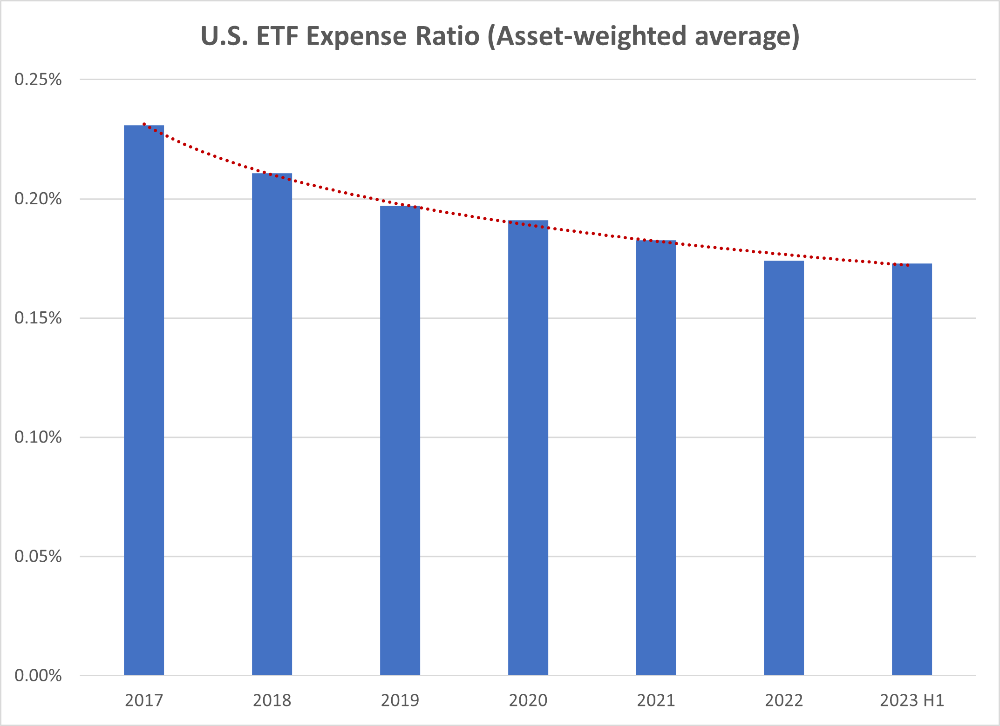

## Table of Contents

## What is an ETF?

An ETF, or Exchange-Traded Fund, is a type of investment that works a lot like a mutual fund but trades on a stock exchange like a stock. It's a basket of securities, like stocks or bonds, that you can buy or sell throughout the day at market prices. This makes ETFs very flexible because you can trade them whenever the market is open.

ETFs are popular because they let you invest in a whole bunch of different things all at once, which can help spread out your risk. For example, if you buy an ETF that tracks the S&P 500, you're basically investing in 500 big companies all at the same time. This can be a lot easier and cheaper than buying each of those stocks on your own.

There are many different kinds of ETFs, so you can find one that fits what you're looking for. Some follow a specific market index, while others might focus on a particular industry, like technology or healthcare. This variety means you can tailor your investments to match your goals and how much risk you're willing to take.

## What are management fees in the context of ETFs?

Management fees for ETFs are what you pay to the company that runs the [ETF](/wiki/etf-trading-strategies). This fee is usually a small percentage of the total amount of money you have invested in the ETF. It's how the company makes money for managing the ETF, which includes things like choosing which stocks or bonds to include and making sure everything is running smoothly.

These fees are taken out of the ETF's assets, so they can affect how much your investment grows over time. Even though the fees are usually small, like around 0.1% to 0.5% a year, they can add up over many years. That's why it's a good idea to look at the management fee when you're choosing an ETF, because a lower fee means more of your money stays invested and working for you.

## How do ETFs generate revenue for their managers?

ETFs generate revenue for their managers mainly through management fees. These fees are a small percentage of the total assets in the ETF, and they are charged annually. For example, if you have $10,000 invested in an ETF with a 0.2% management fee, the manager would earn $20 from your investment each year. This fee covers the costs of running the ETF, like choosing the right stocks or bonds to include and making sure everything is working well.

Besides management fees, some ETFs might also make money from securities lending. This happens when the ETF lends out some of its holdings to other investors, usually for a short period of time. The ETF gets a fee for lending these securities, which adds a bit more to the revenue for the managers. While this isn't as common as management fees, it's another way that ETFs can generate income for those who manage them.

## What is fee compression?

Fee compression is when the fees that investment managers charge for running ETFs and other funds start to go down. This happens because more people want to invest in ETFs, so more companies start offering them. To get more customers, these companies lower their fees to be more competitive. It's like when stores have a sale to attract more shoppers.

As more investors choose ETFs with lower fees, other fund managers have to lower their fees too, or they might lose customers. This competition is good for investors because it means they get to keep more of their money. Over time, fee compression can make a big difference in how much your investments grow, since you're paying less to the managers and more of your money stays invested.

## Why is fee compression happening in the ETF industry?

Fee compression in the ETF industry is happening because more and more people want to invest in ETFs. As more investors look for ETFs, more companies start offering them. To get more customers, these companies lower their fees to make their ETFs more attractive. It's like when stores have a sale to get more people to buy their stuff. When one company lowers its fees, others have to do the same to keep their customers, which leads to overall lower fees in the industry.

This competition is good for investors because it means they pay less to the companies managing their ETFs. When fees go down, more of the investor's money stays in the ETF and can grow over time. Lower fees can make a big difference in how much money you end up with, especially over many years. So, fee compression helps investors keep more of their money and makes ETFs a more popular choice for saving and investing.

## How does fee compression affect the profitability of ETF management?

Fee compression can make it harder for ETF managers to make money. When they lower their fees to stay competitive, they earn less money from each investor. If an ETF has a lot of money invested in it, the lower fees might still add up to a good amount of money. But for smaller ETFs, lower fees can really hurt how much profit the managers make. They have to find a balance between charging enough to cover their costs and keeping their fees low enough to attract investors.

Even though lower fees can squeeze profits, having more investors can help. When more people invest in an ETF because of its low fees, the total amount of money in the ETF grows. This can make up for the lower fees per investor. So, while fee compression might make each investor less profitable, having a bigger and more popular ETF can still be good for business. It's all about getting more investors to make up for the money lost from lower fees.

## What strategies can ETF managers use to cope with fee compression?

ETF managers can cope with fee compression by focusing on growing the total amount of money in their ETFs. When more people invest because of the lower fees, the overall size of the ETF can increase. This means that even though they earn less from each investor, the total money they make can still go up. It's like selling more items at a lower price but still making more money overall. To do this, they might spend more on marketing to attract new investors and make sure their ETFs are easy to buy and understand.

Another strategy is to offer new types of ETFs that stand out from the competition. By creating ETFs that focus on specific industries or use unique investment strategies, managers can attract investors who are looking for something different. This can help them charge slightly higher fees for these specialized products, which can offset the lower fees on their more common ETFs. It's like offering a premium product that some people are willing to pay more for, while still keeping the basic products affordable.

Lastly, ETF managers can try to cut their own costs. By using technology to make their operations more efficient, they can save money on things like trading and managing the ETF. This means they can still make a profit even with lower fees. It's all about finding ways to do more with less, so they can keep their business running smoothly and profitably even as fees go down.

## How does fee compression impact the competitive landscape of the ETF market?

Fee compression makes the ETF market more competitive. When one company lowers its fees, others have to do the same to keep their customers. This means that companies are always trying to find ways to offer the lowest fees to attract more investors. It's like a race to the bottom where everyone is trying to be the cheapest. This competition can make it hard for new companies to enter the market because they need to offer even lower fees to stand out.

At the same time, fee compression can help bigger companies stay on top. If they already have a lot of money in their ETFs, they can afford to lower their fees and still make a good profit. Smaller companies might struggle because they don't have as much money coming in, so lowering fees can hurt them more. This can lead to a market where a few big companies control most of the ETFs, making it harder for smaller players to compete.

## What are the long-term implications of fee compression on ETF product development?

Fee compression pushes ETF managers to come up with new and different kinds of ETFs. Since they can't make as much money from fees, they need to find other ways to attract investors. This means they might create ETFs that focus on specific industries or use special investment strategies. These new ETFs can help them charge a bit more because they offer something unique that investors want. So, in the long run, fee compression can lead to more variety in the types of ETFs available, giving investors more choices.

On the other hand, fee compression can also make it harder for smaller ETF companies to keep up. Big companies with lots of money can lower their fees and still make a profit, but smaller companies might struggle. This can lead to fewer new ETFs from smaller companies because they can't afford to compete on price. Over time, this might mean that the ETF market becomes dominated by a few big players, which could limit the variety of new products coming into the market.

## How do investors benefit from fee compression in ETFs?

Investors benefit from fee compression in ETFs because it means they pay less to the companies that manage their investments. When fees go down, more of the investor's money stays in the ETF and can grow over time. This is important because even small differences in fees can add up to a lot of money over many years. So, fee compression helps investors keep more of their money and see their investments grow faster.

Another way investors benefit is that fee compression pushes ETF companies to offer better products. To attract investors with lower fees, companies create new types of ETFs that focus on specific industries or use special strategies. This gives investors more choices and helps them find ETFs that fit their goals and how much risk they want to take. So, fee compression not only saves investors money but also gives them more options to invest in.

## Can fee compression lead to a race to the bottom in ETF fees, and what are the risks associated with this?

Yes, fee compression can lead to a race to the bottom in ETF fees. This happens when companies keep lowering their fees to attract more investors. It's like a competition where everyone tries to be the cheapest. If this keeps going, fees might get so low that it's hard for companies to make any money at all. This can make it tough for new companies to start up because they need to offer even lower fees to stand out.

The risks of this race to the bottom are big. If fees get too low, companies might cut corners to save money. They might not spend as much on research or managing the ETF well, which could hurt the performance of the ETF. Also, if only a few big companies can keep going with very low fees, it might mean less choice for investors. This could make the ETF market less competitive and less innovative, which isn't good for investors in the long run.

## What advanced metrics should ETF managers monitor to assess the impact of fee compression on their business?

ETF managers should keep an eye on the total amount of money in their ETFs, which is called assets under management (AUM). When fees go down, they need to see if more investors are coming in to make up for the lower fees. If the AUM grows, it means more people are investing, which can help the business stay profitable even with lower fees. They should also look at the net inflows and outflows of money, which shows how much new money is coming in and how much is leaving. If more money is coming in than going out, it's a good sign that the lower fees are working to attract investors.

Another important thing to watch is the expense ratio, which is the total cost of running the ETF divided by the AUM. As fees get smaller, ETF managers need to make sure they are still making enough money to cover their costs. They can do this by finding ways to be more efficient, like using technology to save on trading and management costs. Also, they should look at the turnover rate, which shows how often the stocks or bonds in the ETF are bought and sold. A high turnover rate can mean more costs, so keeping it low can help keep expenses down and make the ETF more attractive to investors looking for low fees.

## References & Further Reading

[1]: Bogle, J. C. (2017). ["The Little Book of Common Sense Investing: The Only Way to Guarantee Your Fair Share of Stock Market Returns."](https://www.amazon.com/Little-Book-Common-Sense-Investing/dp/1119404509) John Wiley & Sons.

[2]: Sharpe, W. F. (1966). ["Mutual Fund Performance."](https://www.jstor.org/stable/2351741) Journal of Business, 39(1), 119-138.

[3]: ["The ETF Book: All You Need to Know About Exchange-Traded Funds"](https://www.amazon.com/ETF-Book-About-Exchange-Traded-Funds/dp/0470537469) by Richard A. Ferri

[4]: BlackRock. (2023). ["ETFs vs Mutual Funds."](https://www.ishares.com/us/investor-education/etf-education/etfs-vs-mutual-funds) Retrieved from BlackRock Website.

[5]: Poterba, J. M., & Shoven, J. B. (2002). ["Exchange-Traded Funds: A New Investment Option for Taxable Investors."](https://www.nber.org/papers/w8781) American Economic Review, 92(2), 422-427.

[6]: Cheatle, J., & Kinlaw, W. (2022). ["Understanding ETF Fee Compression."](https://insights.windhamlabs.com/list-of-publications) Research Affiliates.