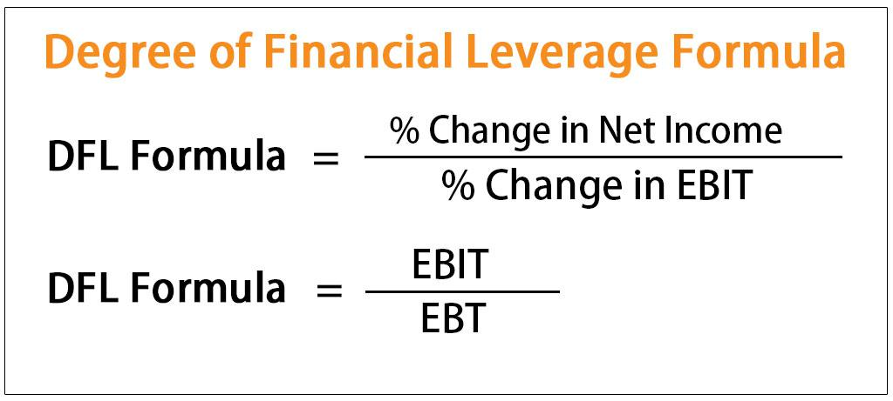

The global financial market is a complex entity where various factors interplay to influence the performance of companies and, subsequently, the investments in these companies. Among these critical elements, the degree of financial leverage (DFL) and its impact on earnings per share (EPS) stand out as pivotal considerations for investors and analysts alike. This article examines the intricate relationships between DFL, EPS, financial leverage, and algorithmic trading, offering valuable insights for investors seeking to optimize returns while managing risk.

Financial leverage plays a prominent role in a company's ability to amplify returns through the strategic use of debt. It introduces a layer of risk that directly impacts financial metrics such as EPS. Understanding how DFL, an important measure within financial leverage analysis, affects EPS is essential for making informed investment decisions. By analyzing how DFL magnifies earnings volatility relative to changes in operating income or earnings before interest and taxes (EBIT), investors can anticipate potential risks and returns across various financial scenarios.



Algorithmic trading, a powerful force in contemporary markets, further complicates this landscape. Algorithms utilize financial metrics like EPS and DFL to construct trading strategies that navigate market fluctuations. As a result, understanding the interaction between these elements equips investors with the tools necessary to make strategic financial decisions. This article offers a comprehensive analysis, enabling readers to gain a deeper insight into the relationships between DFL, EPS, and algorithmic trading, ultimately improving portfolio management and mitigating risk exposure.

We begin by unpacking the concept of degree of financial leverage, its calculation, and its importance in influencing financial metrics like EPS. This exploration sets the groundwork for understanding how these financial components interact and shape strategic financial decisions.

## Table of Contents

## Understanding Degree of Financial Leverage (DFL)

Degree of Financial Leverage (DFL) is a pivotal financial ratio that quantifies the sensitivity of a company's earnings per share (EPS) relative to changes in its operating income, commonly referred to as earnings before interest and taxes (EBIT). This measure provides insight into the extent to which a company is leveraging its use of debt in its capital structure, specifically highlighting how fluctuations in EBIT can influence EPS. The core formula to compute DFL is expressed as:

$$
\text{DFL} = \frac{\text{EBIT}}{\text{EBIT} - \text{Interest Expense}}
$$

This formula indicates the proportionate change in EPS for a given change in EBIT, assuming no changes in taxes or preference dividends. A higher DFL suggests that a company has significant interest obligations, hence any [volatility](/wiki/volatility-trading-strategies) in EBIT will have a magnified effect on EPS. Consequently, a firm with a high DFL might experience substantial swings in its reported earnings per share with even minor alterations in its operating income.

Understanding DFL is critical for companies as they navigate strategic decisions towards capital structuring. High financial leverage can amplify both potential returns and losses. Thus, an accurate assessment of DFL aids firms in determining how much debt they can effectively manage without disproportionately increasing their financial risk. The analysis of DFL allows companies to align their financial strategies with broader goals, ensuring they leverage financial instruments effectively to achieve optimal profitability while moderating associated risks.

By continually assessing their DFL, firms can better manage their investment, financing, and operational strategies to sustain financial stability and growth. As such, the DFL serves as an essential analytical tool, guiding corporate management in making informed decisions regarding debt and equity adjustments to optimize financial performance and align with long-term strategic objectives.

## Earnings Per Share (EPS) and Its Relationship with DFL

Earnings Per Share (EPS) is a crucial financial metric that provides insight into a company's profitability by indicating the amount of net income attributable to each outstanding share of common stock. The formula for calculating EPS is straightforward: 

$$
\text{EPS} = \frac{\text{Net Income} - \text{Preferred Dividends}}{\text{Weighted Average Shares Outstanding}}
$$

This measure helps investors understand the value they can gain from holding the company's shares, making it an important indicator of company performance.

The relationship between EPS and the Degree of Financial Leverage (DFL) is vital for analysts and investors as it highlights the sensitivity of EPS to changes in operating income, or earnings before interest and taxes (EBIT). The DFL is expressed as:

$$
\text{DFL} = \frac{\text{EBIT}}{\text{EBIT} - \text{Interest Expense}}
$$

A higher DFL indicates that EPS is more volatile with changes in EBIT. This volatility arises because, with higher financial leverage, a larger portion of a company's capital structure is composed of debt, leading to higher interest obligations. Consequently, any fluctuation in EBIT directly impacts the net income available to shareholders, thereby affecting EPS.

Understanding how DFL influences EPS is critical for investors and corporate management, as it allows them to anticipate potential risks and returns across different financial scenarios. For instance, in a high-leverage scenario, an increase in EBIT will cause a greater than proportional rise in EPS. This relationship can be expressed by considering a scenario where a 10% increase in EBIT, with a high DFL, may cause EPS to increase by a much larger percentage, amplifying potential returns. Conversely, a decrease in EBIT in a high-leverage situation can lead to significant declines in EPS, posing substantial risks to investors.

For companies, assessing this relationship is essential for financial planning and capital structuring. By understanding the effects of leverage, companies can make strategic decisions on managing their debt levels to align with their risk tolerance and growth objectives. Similarly, investors can use DFL analysis to gauge the stability of a company’s earnings and the potential for dividend payouts, aiding them in constructing a diversified and resilient investment portfolio.

## The Role of Financial Leverage in Company Strategies

Financial leverage is a strategic tool employed by companies to increase their potential return on investment through the use of debt. This approach can yield substantial returns; however, it concurrently heightens the financial risk a company might face. At its core, leverage functions as a double-edged sword, amplifying both potential gains and potential losses. 

Companies engage in financial leverage by utilizing various instruments and methods, such as bonds, loans, and other debt securities. The primary objective is to escalate returns on equity by using borrowed funds to finance growth and expansion initiatives that could lead to higher profitability. When employed judiciously, financial leverage enables businesses to capitalize on available opportunities without diluting ownership through equity issuance.

The balance between debt and equity is critical in leveraging these financial instruments effectively. Companies aim to maximize shareholder value by calibrating their capital structure to manage costs of capital efficiently. The optimal mix of debt and equity minimizes the weighted average cost of capital (WACC), enhancing the firm's value and competitive position. This involves a careful assessment of the level of debt that can be sustained without compromising financial stability.

The degree of financial leverage (DFL) plays an instrumental role in these strategies. It measures the extent to which a company's earnings per share (EPS) are sensitive to changes in operating income (EBIT). A higher DFL indicates that the EPS is more volatile and sensitive to changes in EBIT. Companies with a significant DFL can potentially generate superior returns during periods of economic growth or favorable market conditions; however, they are also more vulnerable to downturns or economic disruptions.

By calculating and analyzing DFL, companies can align their strategic objectives with investor expectations and market conditions. For instance, during economic expansions, a high DFL strategy might be pursued to amplify returns, whereas in a volatile market or during economic contractions, a company might reduce leverage to lower exposure to interest obligations.

Mathematical modeling and financial forecasting are often employed to estimate the outcomes of leveraging strategies. Companies engage in scenario analysis to anticipate potential changes in EBIT and their subsequent impact on EPS. This quantitative approach enables firms to prepare for both economic upturns and potential downturns, ensuring that their leveraging strategies remain adaptive and resilient.

In sum, the strategic use of financial leverage, supported by a well-calculated DFL, empowers companies to enhance their returns while concurrently preparing for varying market conditions. This balancing act between maximizing returns and managing financial risk is crucial in aligning with investor expectations and achieving long-term financial objectives.

## Algorithmic Trading and Financial Leverage

Algorithmic trading represents a sophisticated approach in financial markets, where computer algorithms autonomously execute trades based on specific, pre-defined criteria. This method not only enhances trading efficiency but also enables the implementation of complex trading strategies that can precisely respond to market conditions. One of the critical advantages of [algorithmic trading](/wiki/algorithmic-trading) is its ability to integrate crucial financial metrics, such as Earnings Per Share (EPS) and Degree of Financial Leverage (DFL), into trading strategies.

By incorporating EPS and DFL, algorithms are designed to optimize trading decisions, taking into account leverage-related risks and maximizing potential returns. For example, an algorithm might adjust its trading positions based on fluctuations in EPS predictions, which could be influenced by changes in a company's DFL. These fluctuations are essential as they can significantly affect the valuation of equities, thereby impacting the trading strategy's success. 

The implementation of financial leverage within algorithmic frameworks allows for calculated risks. High financial leverage can lead to greater returns during favorable conditions if correctly anticipated by the algorithm, but it also raises the stakes, adding potential risks during downturns. Algorithms can be programmed to assess the volatility and sensitivity introduced by the DFL, adjusting trading parameters dynamically in response to shifts in market [liquidity](/wiki/liquidity-risk-premium) and inherent risks.

Algorithmic trading's ability to execute rapid trades can exploit short-term market volatilities. By leveraging the analysis of DFL, these algorithms can anticipate movements in asset prices that are driven by changes in companies' capital structures. This enables [scalping](/wiki/gamma-scalping) trades or longer-term strategies that consider how leveraged positions might affect overall portfolio risk and potential returns.

Below is an example of a simple algorithmic trading strategy in Python that considers EPS and DFL:

```python
import pandas as pd

# Sample data: company financials
data = {'Company': ['A', 'B', 'C'],
        'EPS': [2.5, 1.8, 3.2],  # Earnings Per Share
        'EBIT': [10, 8, 12],     # Earnings Before Interest and Taxes
        'Interest_Expense': [2, 1.5, 3]}

df = pd.DataFrame(data)

# Calculate DFL for each company
df['DFL'] = df['EBIT'] / (df['EBIT'] - df['Interest_Expense'])

# Define trading strategy
def trading_strategy(row):
    if row['DFL'] > 2 and row['EPS'] > 2:
        return 'Buy'
    elif row['DFL'] < 1.5:
        return 'Sell'
    else:
        return 'Hold'

# Apply the strategy
df['Trading_Recommendation'] = df.apply(trading_strategy, axis=1)

print(df[['Company', 'DFL', 'Trading_Recommendation']])
```

This simplified example demonstrates a hypothetical scenario where the algorithm evaluates whether to buy, sell, or hold a position based on calculated DFL and reported EPS. The key takeaway is that algorithmic trading systems leverage financial metrics like DFL not just to automate but to enhance trading efficiency and sophistication, ensuring decisions align with strategic financial goals and market conditions.

## Case Studies and Examples

To illustrate the application of the degree of financial leverage (DFL) in real-world scenarios, we can examine several companies that have effectively managed or, in some cases, struggled with financial leverage, leading to notable fluctuations in their earnings per share (EPS) due to changes in their earnings before interest and taxes (EBIT).

### Successful Utilization of Financial Leverage

**Case Study: Company A**
Company A, a technology conglomerate, strategically increased its financial leverage by taking on significant debt to finance a major acquisition. The firm had calculated a favorable DFL, indicating that additional debt would amplify their earnings potential without disproportionately increasing risk. Following the acquisition, Company A experienced an increase in EBIT due to synergies and enhanced market share, which, due to the high DFL, translated into a substantial improvement in EPS. This example underscores how strategic leverage, when paired with growth in EBIT, can enhance shareholder value.

### Adverse Outcomes of High Financial Leverage

**Case Study: Company B**
Company B, operating in the manufacturing sector, illustrates the risks of excessive financial leverage. Initially, Company B took on debt to upgrade its production facilities, anticipating a significant rise in operating income. However, due to unforeseen market downturns and operational inefficiencies, EBIT remained stagnant. The high DFL in this scenario made the company's EPS exceptionally sensitive to any reduction in EBIT. Consequently, with stagnant revenue and high-interest expenses, EPS declined sharply, disappointing investors and leading to a reevaluation of their financial strategy. This highlights the potential pitfalls of high leverage when market conditions and EBIT projections do not align with expectations.

### Balance of Financial Leverage

**Case Study: Company C**
Company C, a well-established firm in the consumer goods industry, offers a balanced approach to financial leverage. By maintaining a moderate DFL, Company C has managed fluctuations in EBIT without incurring the risks of extreme EPS volatility. This strategy involves continuously monitoring market conditions and adjusting capital structure to align with long-term business objectives. Through prudent financial management, Company C has achieved consistent EPS growth, maintaining investor confidence and sustaining its market position. 

These case studies demonstrate the critical importance of understanding and managing the degree of financial leverage. For investors and company managers, the ability to evaluate how changes in operating income can affect EPS through leverage aids in making strategic decisions that optimize financial performance while managing risk effectively.

## Strategies for Managing Financial Leverage

Managing financial leverage effectively is crucial for companies aiming to optimize their financial performance while safeguarding against the risks of high interest payments and market volatility. Here are some strategies that businesses can implement:

1. **Adjusting Capital Structure**:
   Refinancing existing high-interest debt can significantly reduce interest obligations, consequently lowering the degree of financial leverage (DFL). By securing loans with lower interest rates or issuing bonds at favorable terms, companies can decrease their debt servicing costs. Additionally, companies might consider paying off debt using equity issuance, thereby improving their debt-to-equity ratio and reducing financial leverage.

2. **Optimizing Revenue Streams**:
   Stabilizing earnings before interest and taxes (EBIT) is vital for managing financial leverage. Companies should focus on enhancing their core business operations to generate stable and predictable revenue streams. Diversification of products or services and expanding market reach can help in achieving consistent EBIT, which in turn mitigates the impact of high financial leverage.

3. **Maintaining a Balanced Mix of Equity and Debt**:
   A well-balanced capital structure is essential for effective leverage management. Companies should regularly assess their financial positioning and adjust the proportion of equity to debt according to changing market conditions and business goals. A strategic balance minimizes the risk associated with excessive debt while leveraging the benefits of equity financing, such as retained earnings reinvestment and reduced dependency on external financing.

4. **Implementing Cost Controls**:
   Effective cost management can directly influence EBIT and enhance the overall financial health of a company. By scrutinizing and optimizing operational expenditures, companies can improve profitability. Techniques like lean management, process automation, and strategic sourcing can lead to significant cost savings.

5. **Risk Management Practices**:
   Companies should adopt comprehensive risk management frameworks to insulate themselves from financial uncertainties. This includes conducting regular financial health assessments, stress testing under various economic scenarios, and utilizing hedging strategies to mitigate [interest rate](/wiki/interest-rate-trading-strategies) risks. Derivatives such as interest rate swaps or options can be employed to lock in favorable rates or protect against volatility.

By applying these strategies, companies can manage their financial leverage more effectively, aligning with long-term financial objectives and maintaining resilience against economic fluctuations. Continual assessment and refinement of these practices are essential, especially in dynamic financial environments.

## Conclusion

DFL plays a pivotal role in determining a company's EPS, significantly affecting strategic financial decisions. The degree of financial leverage (DFL) is a crucial component in understanding how variations in operating income can translate into larger fluctuations in earnings per share (EPS). By grasping the intricate balance of financial leverage, companies can optimize their capital structures, striving for enhanced financial performance while strategically navigating risks associated with high-interest obligations.

For investors, the analysis of DFL alongside EPS becomes an invaluable tool in crafting more informed financial decisions. Recognizing the sensitivity of EPS to changes in EBIT enables them to predict potential risks and returns from investments with varying leverage, leading to more optimized portfolios. This analysis helps in balancing risk exposure, ensuring that investments align with both market conditions and investment objectives.

Furthermore, the evolution of algorithmic trading continues to reshape how these financial metrics influence market behavior. Algorithmic models incorporate DFL and EPS data to guide trading strategies, ensuring that leverage risks are addressed while maximizing potential returns. This automation emphasizes the importance of continual learning and adaptation within financial strategies, as algorithms must evolve with changing market dynamics to maintain efficiency and profitability. As markets become increasingly influenced by algorithmic decisions, understanding financial leverage's impact becomes essential for all market participants, emphasizing a need for ongoing education and flexibility in financial strategy development.

## References & Further Reading

[1]: Bergstra, J., Bardenet, R., Bengio, Y., & Kégl, B. (2011). ["Algorithms for Hyper-Parameter Optimization."](https://dl.acm.org/doi/10.5555/2986459.2986743) Advances in Neural Information Processing Systems 24.

[2]: ["Advances in Financial Machine Learning"](https://www.amazon.com/Advances-Financial-Machine-Learning-Marcos/dp/1119482089) by Marcos Lopez de Prado

[3]: ["Evidence-Based Technical Analysis: Applying the Scientific Method and Statistical Inference to Trading Signals"](https://www.amazon.com/Evidence-Based-Technical-Analysis-Scientific-Statistical/dp/0470008741) by David Aronson

[4]: ["Machine Learning for Algorithmic Trading"](https://github.com/stefan-jansen/machine-learning-for-trading) by Stefan Jansen

[5]: ["Quantitative Trading: How to Build Your Own Algorithmic Trading Business"](https://www.amazon.com/Quantitative-Trading-Build-Algorithmic-Business/dp/1119800064) by Ernest P. Chan