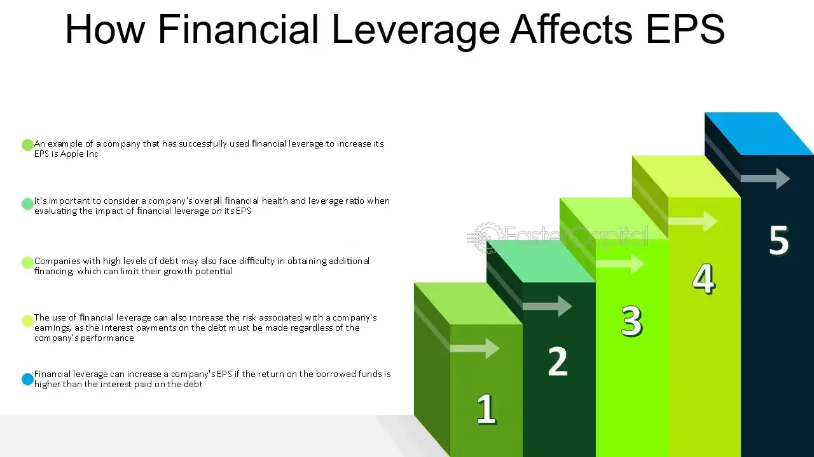

## Table of Contents

## What is financial leverage?

Financial leverage is when a company uses borrowed money to try to make more money. Imagine you want to buy a house but don't have enough money. You can take a loan from the bank. If the house price goes up, you make more money than if you had just used your own money. But if the price goes down, you lose more money too. Companies do the same thing, borrowing money to invest in their business, hoping to earn more than they have to pay back in interest.

Using financial leverage can be risky. If a company's investments don't do well, it still has to pay back the loans, which can lead to big problems. On the other hand, if the investments do well, the company can make a lot more money than if it had just used its own money. It's like a seesaw: the potential for bigger gains comes with the risk of bigger losses. So, companies need to be careful and think about how much debt they can handle.

## How is earnings per share (EPS) calculated?

Earnings per share (EPS) is a way to figure out how much money a company made for each share of its stock. To calculate it, you take the company's total earnings, or profit, and divide it by the number of shares that are out there. For example, if a company made $100 million in profit and has 50 million shares, the EPS would be $2 per share. This number helps investors see how well the company is doing and how much of the profit they might get if they own a share.

There are two types of EPS: basic and diluted. Basic EPS uses the number of shares that are currently out there. Diluted EPS takes into account any other shares that could be created, like from stock options or convertible bonds. This gives a more complete picture because it shows what might happen if all those extra shares were turned into real shares. Both numbers are important, but diluted EPS is often seen as a more conservative estimate because it considers the possibility of more shares diluting the value of each share.

## What is the basic relationship between financial leverage and EPS?

Financial leverage can affect a company's earnings per share (EPS) in a big way. When a company uses borrowed money to invest in its business, it's hoping to make more money than it has to pay back in interest. If the investments do well, the company's profits go up. Since EPS is calculated by dividing the company's total earnings by the number of shares, higher profits mean a higher EPS. So, if financial leverage helps the company make more money, it can lead to a higher EPS.

But financial leverage also comes with risks. If the company's investments don't do well, it still has to pay back the loans, which can eat into its profits. If the profits go down because of this, the EPS will also go down. So, while financial leverage can boost EPS when things go well, it can also lower EPS if things don't go as planned. It's like a double-edged sword: it can help the company make more money, but it can also make things worse if the investments don't pay off.

## Can you explain the degree of financial leverage (DFL)?

The degree of financial leverage (DFL) is a way to measure how sensitive a company's earnings per share (EPS) are to changes in its operating income. It tells you how much the EPS will change if the company's earnings before interest and taxes (EBIT) go up or down. To calculate DFL, you take the EBIT and divide it by the EBIT minus the interest expenses. A higher DFL means that small changes in EBIT can lead to big changes in EPS, which shows that the company is using a lot of debt.

Using DFL can help investors and managers understand the risks and rewards of using debt. If a company has a high DFL, it means it's using a lot of borrowed money, which can be risky. If the company's operating income goes down, the EPS can drop a lot because the company still has to pay interest on its debt. On the other hand, if the operating income goes up, the EPS can increase a lot too. So, DFL is a useful tool to see how much financial leverage a company is using and how it might affect its earnings.

## How does increasing debt affect a company's EPS?

When a company takes on more debt, it can affect its earnings per share (EPS) in two ways. If the company uses the borrowed money wisely and makes more money from its investments than it has to pay in interest, its profits will go up. Since EPS is calculated by dividing the company's total profits by the number of shares, higher profits mean a higher EPS. So, if the company's investments do well, increasing debt can lead to a higher EPS.

But there's a risk too. If the company's investments don't do well, it still has to pay back the debt and the interest on it. This can eat into the company's profits, making them lower. When profits go down, the EPS goes down too. So, while increasing debt can boost EPS if things go well, it can also lower EPS if the investments don't pay off. It's like a gamble: the company is betting that it can make more money than it has to pay back, but if it's wrong, the EPS can suffer.

## What are the risks associated with high financial leverage?

When a company uses a lot of borrowed money, it's called high financial leverage. This can be risky because the company has to pay back the money it borrowed, plus interest. If the company's business doesn't do well, it might not make enough money to pay back the loans. This can lead to big problems, like not being able to pay its bills or even going bankrupt. High financial leverage makes a company more sensitive to ups and downs in the economy, so if things go bad, the company can get into trouble quickly.

Another risk is that high financial leverage can make it hard for a company to get more money if it needs it. If a company already owes a lot, banks and investors might not want to lend it more money because they're worried about getting paid back. This can limit the company's options and make it harder to grow or deal with unexpected problems. So, while using a lot of debt can help a company grow faster, it also comes with big risks that can hurt the company if things don't go as planned.

## How does the cost of debt influence the impact of leverage on EPS?

The cost of debt is how much a company has to pay to borrow money. When a company uses debt, it hopes to make more money from its investments than it has to pay in interest. If the cost of debt is low, the company can borrow money cheaply, which means it has a better chance of making more money than it spends on interest. This can make the company's profits go up, and since earnings per share (EPS) is calculated by dividing the company's total profits by the number of shares, a higher profit can lead to a higher EPS. So, when the cost of debt is low, using leverage can have a positive impact on EPS.

On the other hand, if the cost of debt is high, it can be risky for the company. When a company has to pay a lot of interest, it needs to make a lot more money from its investments just to break even. If the company's investments don't do well, the high interest payments can eat into its profits, making them lower. When profits go down, the EPS goes down too. So, a high cost of debt can make the impact of leverage on EPS negative, because the company has to pay more to borrow money and might not make enough to cover those costs.

## In what scenarios might financial leverage increase EPS?

Financial leverage can increase EPS when a company uses borrowed money to make investments that bring in more money than the interest it has to pay on the debt. Imagine a company borrows money at a low [interest rate](/wiki/interest-rate-trading-strategies) and uses it to buy new equipment that helps it make more products and sell them for a profit. If the profit from the new equipment is higher than the interest on the loan, the company's total earnings go up. Since EPS is calculated by dividing the company's total earnings by the number of shares, higher earnings mean a higher EPS.

Another scenario where financial leverage can increase EPS is when a company uses debt to expand its business during good economic times. If the economy is doing well, the company might see more demand for its products or services. By borrowing money to open new stores or increase production, the company can take advantage of this demand and make more money. As long as the extra money the company makes is more than the interest it has to pay on the debt, its profits will go up, leading to a higher EPS.

## How does financial leverage affect EPS during economic downturns?

During economic downturns, financial leverage can make things harder for a company's earnings per share (EPS). When the economy is not doing well, people and businesses might not buy as much, so the company's sales and profits can go down. If the company has a lot of debt, it still has to pay back the money it borrowed, plus interest. If the company's profits are lower because of the downturn, the interest payments can take a bigger bite out of what's left, making the profits even smaller. Since EPS is calculated by dividing the company's total profits by the number of shares, lower profits mean a lower EPS.

But it's not just about lower profits. During tough economic times, it can be harder for a company to get more money if it needs it. If a company already owes a lot, banks and investors might not want to lend it more money because they're worried about getting paid back. This can limit the company's options and make it harder to deal with the downturn. So, if a company has a lot of debt and the economy goes bad, its EPS can go down a lot because it has less money to work with and more trouble getting help.

## What are the tax implications of using financial leverage on EPS?

When a company uses financial leverage, it means they're borrowing money. One good thing about borrowing money is that the interest they pay on the debt can be taken off their taxes. This is called a tax shield. It's like getting a discount on their taxes. If the company can lower its taxes, it keeps more of its money. This can make the company's profits go up. Since earnings per share (EPS) is calculated by dividing the company's total profits by the number of shares, higher profits can mean a higher EPS.

But there's a catch. If the company borrows too much money, the interest payments can be really high. Even though they can lower their taxes, if the interest payments are bigger than the tax savings, the company's profits can still go down. When profits go down, the EPS goes down too. So, while using financial leverage can help with taxes and boost EPS if done right, it can also hurt EPS if the company borrows too much and can't make enough money to cover the interest.

## How can a company optimize its capital structure to maximize EPS?

A company can optimize its capital structure to maximize EPS by finding the right mix of debt and equity. This means using just enough borrowed money to help the company grow and make more profit, but not so much that the interest payments eat into the profits. If the company can borrow at a low interest rate and use that money to make investments that bring in more money than the interest, its profits will go up. Since EPS is calculated by dividing the company's total profits by the number of shares, higher profits mean a higher EPS. So, the key is to use debt wisely to boost profits and EPS.

But it's not just about using debt. The company also needs to think about how many shares it has out there. If the company issues more shares to get money instead of borrowing, it can dilute the value of each share. This means that even if the company's total profits go up, the EPS might not go up as much because there are more shares to divide the profits by. So, the company needs to balance using debt to increase profits with keeping the number of shares low enough to keep the EPS high. By carefully managing both debt and equity, a company can find the best way to maximize its EPS.

## What advanced models or theories explain the impact of financial leverage on EPS?

One important theory that explains how financial leverage affects EPS is the Modigliani-Miller theorem. This theory says that, in a perfect world with no taxes or bankruptcy costs, the way a company mixes debt and equity doesn't change its total value or EPS. But in the real world, things like taxes and the risk of going bankrupt make a big difference. When a company uses debt, it can lower its taxes because the interest payments are tax-deductible. This can make the company's profits go up, which means a higher EPS. But if the company uses too much debt, the risk of not being able to pay it back can scare away investors and make the company's value and EPS go down.

Another model that helps explain this is the trade-off theory. This theory says that a company should balance the benefits of using debt, like the tax shield, with the costs, like the risk of bankruptcy. If a company can find the right balance, it can use debt to increase its profits and EPS. But if it uses too much debt, the risk of not being able to pay it back can hurt the company's profits and EPS. So, the trade-off theory helps companies figure out how much debt to use to get the best EPS without taking on too much risk.

## What is the Degree of Financial Leverage (DFL) and how can it be understood?

Degree of Financial Leverage (DFL) is a pivotal financial ratio that quantifies the sensitivity of a company's earnings per share (EPS) relative to changes in its operating income, commonly referred to as earnings before interest and taxes (EBIT). This measure provides insight into the extent to which a company is leveraging its use of debt in its capital structure, specifically highlighting how fluctuations in EBIT can influence EPS. The core formula to compute DFL is expressed as:

$$
\text{DFL} = \frac{\text{EBIT}}{\text{EBIT} - \text{Interest Expense}}
$$

This formula indicates the proportionate change in EPS for a given change in EBIT, assuming no changes in taxes or preference dividends. A higher DFL suggests that a company has significant interest obligations, hence any [volatility](/wiki/volatility-trading-strategies) in EBIT will have a magnified effect on EPS. Consequently, a firm with a high DFL might experience substantial swings in its reported earnings per share with even minor alterations in its operating income.

Understanding DFL is critical for companies as they navigate strategic decisions towards capital structuring. High financial leverage can amplify both potential returns and losses. Thus, an accurate assessment of DFL aids firms in determining how much debt they can effectively manage without disproportionately increasing their financial risk. The analysis of DFL allows companies to align their financial strategies with broader goals, ensuring they leverage financial instruments effectively to achieve optimal profitability while moderating associated risks.

By continually assessing their DFL, firms can better manage their investment, financing, and operational strategies to sustain financial stability and growth. As such, the DFL serves as an essential analytical tool, guiding corporate management in making informed decisions regarding debt and equity adjustments to optimize financial performance and align with long-term strategic objectives.

## What is the relationship between Earnings Per Share (EPS) and Degree of Financial Leverage (DFL)?

Earnings Per Share (EPS) is a crucial financial metric that provides insight into a company's profitability by indicating the amount of net income attributable to each outstanding share of common stock. The formula for calculating EPS is straightforward: 

$$
\text{EPS} = \frac{\text{Net Income} - \text{Preferred Dividends}}{\text{Weighted Average Shares Outstanding}}
$$

This measure helps investors understand the value they can gain from holding the company's shares, making it an important indicator of company performance.

The relationship between EPS and the Degree of Financial Leverage (DFL) is vital for analysts and investors as it highlights the sensitivity of EPS to changes in operating income, or earnings before interest and taxes (EBIT). The DFL is expressed as:

$$
\text{DFL} = \frac{\text{EBIT}}{\text{EBIT} - \text{Interest Expense}}
$$

A higher DFL indicates that EPS is more volatile with changes in EBIT. This volatility arises because, with higher financial leverage, a larger portion of a company's capital structure is composed of debt, leading to higher interest obligations. Consequently, any fluctuation in EBIT directly impacts the net income available to shareholders, thereby affecting EPS.

Understanding how DFL influences EPS is critical for investors and corporate management, as it allows them to anticipate potential risks and returns across different financial scenarios. For instance, in a high-leverage scenario, an increase in EBIT will cause a greater than proportional rise in EPS. This relationship can be expressed by considering a scenario where a 10% increase in EBIT, with a high DFL, may cause EPS to increase by a much larger percentage, amplifying potential returns. Conversely, a decrease in EBIT in a high-leverage situation can lead to significant declines in EPS, posing substantial risks to investors.

For companies, assessing this relationship is essential for financial planning and capital structuring. By understanding the effects of leverage, companies can make strategic decisions on managing their debt levels to align with their risk tolerance and growth objectives. Similarly, investors can use DFL analysis to gauge the stability of a company’s earnings and the potential for dividend payouts, aiding them in constructing a diversified and resilient investment portfolio.

## References & Further Reading

[1]: Bergstra, J., Bardenet, R., Bengio, Y., & Kégl, B. (2011). ["Algorithms for Hyper-Parameter Optimization."](https://dl.acm.org/doi/10.5555/2986459.2986743) Advances in Neural Information Processing Systems 24.

[2]: ["Advances in Financial Machine Learning"](https://www.amazon.com/Advances-Financial-Machine-Learning-Marcos/dp/1119482089) by Marcos Lopez de Prado

[3]: ["Evidence-Based Technical Analysis: Applying the Scientific Method and Statistical Inference to Trading Signals"](https://www.amazon.com/Evidence-Based-Technical-Analysis-Scientific-Statistical/dp/0470008741) by David Aronson

[4]: ["Machine Learning for Algorithmic Trading"](https://github.com/stefan-jansen/machine-learning-for-trading) by Stefan Jansen

[5]: ["Quantitative Trading: How to Build Your Own Algorithmic Trading Business"](https://www.amazon.com/Quantitative-Trading-Build-Algorithmic-Business/dp/1119800064) by Ernest P. Chan