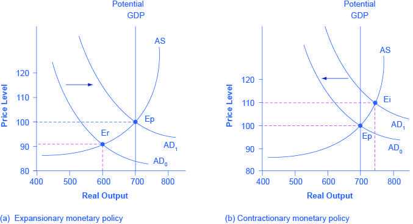

Aggregate demand represents the total demand for goods and services within an economy at a given overall price level and during a specific time period. It reflects consumption expenditure by households, investment by businesses, government spending, and net exports, which collectively determine the economy's overall expenditure. Fiscal policy and monetary policy are the primary tools employed by governments and central banks to manage economic stability and growth. 

Fiscal policy involves adjusting government spending and tax policies to influence aggregate demand. For instance, during economic downturns, governments might implement expansionary fiscal policy by increasing public expenditure or cutting taxes to boost demand and stimulate growth. Conversely, contractionary fiscal policy can be employed to reduce demand and control inflation if the economy overheats.



Monetary policy, on the other hand, encompasses the actions of central banks to manage the money supply and interest rates. These policies are designed to maintain price stability and achieve economic objectives such as full employment. Tools like interest rate manipulation and open market operations allow central banks to influence borrowing costs and thereby aggregate demand.

Algorithmic trading has emerged as a significant tool for capitalizing on economic policies and market movements. By using automated systems that employ algorithms, traders can process large data sets at high speed to identify opportunities created by fiscal and monetary policy shifts. This form of trading leverages computational power to analyze market trends and execute trades with precision, contributing to the efficiency and dynamism of financial markets.

## Table of Contents

## Understanding Aggregate Demand

Aggregate demand refers to the total demand for goods and services within an economy at a specific overall price level and in a given time period. This concept is crucial in understanding how different sectors of the economy interact and contribute to the overall economic activity. Aggregate demand is composed of four primary components: consumer spending (C), investment by businesses (I), government spending (G), and net exports (X - M), where 'X' represents exports and 'M' represents imports.

Consumer spending is the largest component of aggregate demand and includes expenditures on goods and services by households. It encompasses spending on necessities, such as food and housing, as well as discretionary items like entertainment and luxury goods. Business investment entails expenditures by firms on capital goods, such as machinery and infrastructure, which are essential for future production. Government spending refers to expenditures on public services and infrastructure, which directly inject funds into the economy. Lastly, net exports represent the balance of trade between a country and the rest of the world, calculated as the difference between the value of exports and the value of imports.

The formula for aggregate demand is expressed as:

$$
AD = C + I + G + (X - M)
$$

Aggregate demand is pivotal in macroeconomic policy because it reflects the overall economic activity and health of an economy. Its level and fluctuation can indicate periods of growth or recession. Policymakers closely monitor aggregate demand to implement strategies that stabilize or stimulate the economy. During economic downturns, increasing aggregate demand can lead to higher production and employment rates, thereby improving economic well-being. Conversely, in times of overheating, reducing excessive demand can help control inflation.

In conclusion, understanding the components and significance of aggregate demand is vital for designing effective economic policies aimed at sustaining growth and ensuring economic stability.

## The Role of Fiscal Policy in Influencing Aggregate Demand

Fiscal policy is a crucial aspect of government intervention that seeks to influence a nation's economic activity by manipulating two primary components: government spending and taxation. The thrust of fiscal policy can be either expansionary or contractionary, depending on the economic objectives pursued.

### Definition and Types of Fiscal Policy

Expansionary fiscal policy aims to stimulate economic growth and increase aggregate demand, typically during periods of economic recession or slow growth. This is achieved through increased government spending, tax cuts, or a combination of both. The rationale is to boost consumer and business spending, thereby driving demand and creating jobs.

Conversely, contractionary fiscal policy focuses on reducing aggregate demand to control inflation during periods of economic overdrive. This can be implemented through decreasing government expenditures, raising taxes, or both. The intention is to temper excessive spending and curb rising prices, stabilizing the economy.

### Impact on Aggregate Demand

Government spending directly affects aggregate demand since it constitutes a primary component of the aggregate demand formula:

$$
AD = C + I + G + (X - M)
$$

where:
- $C$ is consumer spending.
- $I$ is investment by businesses.
- $G$ is government spending.
- $(X - M)$ is net exports (exports minus imports).

Increased government spending ($G$) directly raises aggregate demand, fostering higher economic output and employment. Tax policies also impact disposable income and consequently influence consumer spending ($C$). A reduction in taxes increases disposable income, leading to higher consumption and investment, thereby elevating aggregate demand.

### Keynesian Economics and Fiscal Policy

Keynesian economics emphasizes the role of government intervention during periods of economic downturn. John Maynard Keynes argued that active fiscal policy, mainly through government spending, can mitigate the adverse impacts of economic recessions and stabilize employment levels. Keynesians advocate for increased public expenditure to offset decreased private sector spending.

In practice, Keynesian fiscal policy might involve public projects, infrastructure spending, or direct financial assistance to individuals, essentially injecting money into the economy to spur activity and thereby reduce unemployment.

### Examples of Fiscal Policy Measures

Several real-world examples illustrate fiscal policy measures. During the 2008 global financial crisis, governments worldwide implemented stimulus packages consisting of substantial government spending and tax reliefs to revitalize their economies. The American Recovery and Reinvestment Act of 2009, which totaled approximately $831 billion, is one such example.

Additionally, tax cuts have been regularly employed to increase household disposable income, encouraging consumer spending and investment. For instance, the U.S. Tax Cuts and Jobs Act of 2017 sought to reduce tax rates for individuals and corporations to stimulate economic growth.

In conclusion, fiscal policy is a powerful tool that can reshape economic conditions by adjusting government spending and taxation. By understanding its mechanisms, policymakers can better navigate economic cycles and promote sustained economic well-being.

## Monetary Policy's Impact on Aggregate Demand

Monetary policy refers to the actions undertaken by a nation's central bank to control the money supply, with the overarching aim of promoting economic stability and growth. The primary tools of monetary policy are [interest rate](/wiki/interest-rate-trading-strategies) manipulation and open market operations. By adjusting the interest rate, central banks influence borrowing costs and spending behaviors, which subsequently affect aggregate demand. Open market operations involve the buying and selling of government securities in the open market to regulate the money supply.

Monetary policy affects the economy through its influence on the money supply and interest rates, which in turn impact inflation and employment levels. When a central bank enacts an expansionary monetary policy, it typically lowers interest rates and increases the money supply. This is accomplished through purchasing government securities, which injects [liquidity](/wiki/liquidity-risk-premium) into the banking system. Lower interest rates make borrowing cheaper for consumers and businesses, encouraging spending and investment, thus increasing aggregate demand.

Conversely, a contractionary monetary policy is aimed at reducing aggregate demand by increasing interest rates and decreasing the money supply. This is typically achieved by selling government securities, withdrawing liquidity from the banking system. Higher interest rates discourage borrowing and spending while encouraging saving, which can counteract inflationary pressures.

The effects of these policies are significant. Expansionary monetary policy can lead to higher economic growth and reduced unemployment, but if applied excessively, it risks causing inflation. Meanwhile, contractionary policy can help control inflation, but may also slow economic growth and increase unemployment if applied too stringently.

Central banks utilize monetary policy interventions as part of broader economic cycle management. For example, during the 2008 financial crisis, central banks worldwide, including the U.S. Federal Reserve, implemented aggressive expansionary monetary policies, lowering interest rates and engaging in large-scale asset purchases known as quantitative easing, to stabilize financial markets and stimulate economic recovery.

Monetary policy remains a critical element in managing economic stability. By understanding its implications on aggregate demand and overall economic conditions, central banks can tailor their interventions to foster a stable and growing economy.

## Algorithmic Trading and Economic Policies

Algorithmic trading is the utilization of computer algorithms to execute trading strategies at speeds and frequencies that exceed human capability. This approach has gained prominence in global financial markets, driven by advances in technology and the availability of vast amounts of data. Algorithmic trading allows traders to leverage sophisticated models to determine the optimal conditions for buying or selling assets, significantly influencing trading dynamics.

Algorithmic trading systems are adept at responding swiftly to changes in economic policies, including adjustments in fiscal and monetary policy. For instance, changes in interest rates or government spending can influence asset prices, creating opportunities for trade. Algorithms can be programmed to detect these policy shifts and adjust trading strategies accordingly, thus optimizing portfolios in response to policy changes. 

The adoption of [algorithmic trading](/wiki/algorithmic-trading) provides several advantages. Foremost, these systems operate at speeds far beyond human capabilities, allowing for rapid execution of trades and enabling participants to capitalize on fleeting market opportunities. Additionally, algorithmic trading enhances data analysis, enabling the processing of large volumes of market data to identify trading signals and predict future movements accurately. This capability improves the decision-making process, allowing traders to adjust their strategies based on comprehensive data analysis.

An example of a trading algorithm might include the use of macroeconomic indicators, such as GDP growth rates, inflation figures, or employment [statistics](/wiki/bayesian-statistics), to inform trading decisions. Python, a programming language widely used in the finance industry, can implement such algorithms. Below is a simple example of how an algorithm might incorporate GDP data to make trading decisions:

```python
def trade_decision(gdp_growth_rate):
    if gdp_growth_rate > 2.5:
        return "Buy"
    elif gdp_growth_rate < 1.5:
        return "Sell"
    else:
        return "Hold"

current_gdp_growth_rate = 3.0
decision = trade_decision(current_gdp_growth_rate)
print(f"Trade Decision: {decision}")
```

In this example, the algorithm makes a decision to 'Buy' if the GDP growth rate exceeds 2.5%, signaling a robust economy likely to boost market confidence. Conversely, it advises 'Sell' if the growth rate is below 1.5%, suggesting economic weakness and potential market downturns.

By leveraging such algorithms, traders can systematically respond to economic indicators, aligning their trading activities with broader economic trends. As algorithmic trading continues to evolve, its integration with economic policy analysis is expected to deepen, offering enhanced opportunities for optimizing financial strategies.

## Conclusion

The interplay between aggregate demand, fiscal policy, monetary policy, and algorithmic trading represents a complex but crucial aspect of modern economics, influencing both theoretical understanding and practical application. Aggregate demand, reflecting the cumulative demand for goods and services in an economy, is shaped significantly by fiscal and monetary policies. Fiscal policy, through government spending and taxation, and monetary policy, via interest rates and money supply management, are essential tools for stabilizing and stimulating economic activity. Understanding these concepts is vital for investors and policymakers seeking to navigate and influence economic conditions effectively.

Incorporating these economic principles, algorithmic trading stands as a potent force in contemporary financial markets. By leveraging algorithms capable of rapid data analysis and execution, traders can respond swiftly to shifts in economic policies and macroeconomic indicators. This capability not only enhances trading efficiency but also helps investors capitalize on policy-induced market movements.

The future potential of algorithmic trading is enormous, particularly as global economic policies continue to evolve. As economies become more interconnected and policies more complex, the demand for sophisticated trading algorithms that can parse massive datasets and predict market trends is likely to increase. For investors, this means greater opportunities to optimize returns through smart, policy-responsive strategies. Meanwhile, policymakers can use insights gleaned from trading data to understand market reactions to policy changes more accurately, potentially informing more effective policy decisions.

In conclusion, the comprehension and integration of aggregate demand, fiscal policy, monetary policy, and algorithmic trading form the cornerstone of a robust economic strategy. As these components continue to interact and develop, they promise to reshape financial landscapes, offering both challenges and opportunities for those navigating the economies of the future.

## References & Further Reading

[1]: Bernanke, B. (2012). ["The Federal Reserve and the Financial Crisis."](https://www.jstor.org/stable/j.ctt24hrrt) Princeton University Press.

[2]: Krugman, P., & Wells, R. (2018). ["Macroeconomics."](https://books.google.com/books/about/Macroeconomics.html?id=_d-lswEACAAJ) Worth Publishers.

[3]: John Maynard Keynes. (1936). ["The General Theory of Employment, Interest, and Money."](https://www.files.ethz.ch/isn/125515/1366_KeynesTheoryofEmployment.pdf) Palgrave Macmillan.

[4]: Taylor, J. B. (1993). ["Discretion versus Policy Rules in Practice."](https://web.stanford.edu/~johntayl/Onlinepaperscombinedbyyear/1993/Discretion_versus_Policy_Rules_in_Practice.pdf) Carnegie-Rochester Conference Series on Public Policy.

[5]: Lopez de Prado, M. (2018). ["Advances in Financial Machine Learning."](https://books.google.com/books/about/Advances_in_Financial_Machine_Learning.html?id=oU9KDwAAQBAJ) Wiley.

[6]: Alemi, H., & Arroyo, A. (2018). ["Algorithmic and High-Frequency Trading."](https://assets.cambridge.org/97811070/91146/frontmatter/9781107091146_frontmatter.pdf) Springer.

[7]: Mishkin, F. S. (2018). ["The Economics of Money, Banking, and Financial Markets."](https://www.pearsonhighered.com/assets/preface/0/1/3/4/0134855388.pdf) Pearson.