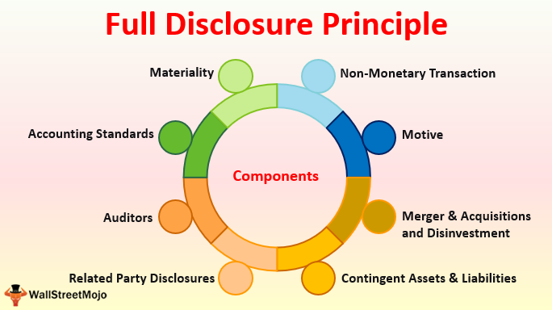

In recent years, the landscape of financial markets has been significantly transformed by advancements in technology, enabling a shift towards algorithmic trading. This form of trading uses sophisticated algorithms to execute high-speed transactions efficiently and has become a mainstay in global financial markets. Algorithmic trading leverages computer programs to automatically execute trading strategies at speeds and frequencies unimaginable to human traders, fundamentally altering market dynamics.

With this shift, issues concerning market transparency and full disclosure have become more pronounced. The complexity and rapid pace of algorithmic trading have underscored the need for stringent transparency measures to ensure fair market practices. The automated nature of this trading means decisions are driven by algorithms that are often opaque to regulators and investors alike, posing challenges to monitoring and controlling potential market manipulation or systematic risks.



This article explores the interplay between financial markets, market transparency, full disclosure, and algorithmic trading. These elements are essential for maintaining market integrity and protecting investors. Transparency provides market participants with the confidence that prices reflect available information accurately, thereby promoting efficient markets. For algorithmic trading, ensuring transparency involves disclosing detailed information about trading strategies and algorithmic models, which helps in preventing fraudulent activities and ensuring equitable trading conditions.

We aim to outline existing disclosure transparency laws, study real-world implications of these regulations, and discuss the future of financial markets as technological advancements continue. Current regulatory frameworks are tasked with balancing the rapid pace of technological innovation with the need to safeguard market participants and uphold ethical trading practices. This involves requiring financial institutions to adhere to comprehensive disclosure standards, which enable regulators to track and analyze trading activities effectively.

Ultimately, this discussion will highlight why transparency is critical in today's fast-evolving financial markets and how it can be achieved through both regulatory frameworks and corporate governance. Regulatory bodies and firms must collaborate to design systems that promote transparency without stifling innovation, ensuring that the benefits of algorithmic trading are fully realized while potential risks are mitigated. This concerted effort is vital for sustaining investor trust and preserving the robustness of financial markets in the digital era.

## Table of Contents

## Understanding Financial Market Transparency

Financial market transparency is a fundamental concept that pertains to the availability of timely and accurate information to investors, which is essential for making well-informed financial decisions. This transparency plays a crucial role in preventing fraudulent activities and maintaining fair trading conditions across financial markets.

Proper disclosure by financial firms is vital for leveling the playing field among customers, investors, and analysts. When financial information is disclosed transparently, it enables all market participants to access pertinent data that influences investment strategies and decisions. This equitable access reduces information asymmetry, a situation where some investors have more or better information than others, potentially leading to unfair trading advantages and distorted market dynamics.

However, the sheer [volume](/wiki/volume-trading-strategy) and complexity of financial data can be overwhelming, even with regulations mandating disclosures. Investors often face the challenge of discerning which pieces of information are most relevant to their specific investment strategies. This can be influenced by several factors, including market conditions, risk tolerance, and investment time horizons.

Regulatory bodies play a critical role in governing transparency in financial markets by enforcing disclosure norms designed to minimize reckless and unfair practices. These regulations ensure that significant financial information is made available to all market participants in a manner that is both accessible and understandable. An example could be the requirements set forth by the Securities and Exchange Commission (SEC), which mandates that public companies disclose financial results, risk factors, and other critical information in their periodic filings.

This regulatory oversight aims to protect investors and sustain their confidence in the market, fostering a healthy financial system. In promoting transparency, regulatory bodies contribute to the integrity, efficiency, and stability of financial markets, mitigating the risk of market manipulation and promoting fair competition among market participants.

## The Intersection of Full Disclosure and Algorithmic Trading

Algorithmic trading has become a dominant feature in modern financial markets, utilizing computer algorithms to perform trades at unprecedented speeds and volumes. This evolution has presented significant challenges for market transparency and effective disclosure. The complexities inherent in [algorithmic trading](/wiki/algorithmic-trading) necessitate full disclosure to enable investors and regulators to comprehend the strategies employed and the associated risks. 

The full disclosure of trading algorithms is critical in curbing potential market manipulation. When market participants have access to detailed information about trading algorithms, they gain insights into how these algorithms influence market dynamics. This transparency can help prevent unfair trade practices by outlining the underlying logic and potential impacts of these technologically driven strategies.

However, attaining complete transparency in algorithmic trading presents notable difficulties. These challenges stem largely from the proprietary nature of algorithmic technologies, which companies often guard fiercely as trade secrets. As these algorithms are key competitive differentiators, firms are generally reluctant to disclose their specific mechanics or strategic approaches.

To illustrate, consider a simple algorithmic trading strategy, such as a mean reversion strategy, which assumes that the price of a security will revert to its mean. An algorithm could be structured as follows:

```python
def mean_reversion(price_series, window, threshold):
    rolling_mean = price_series.rolling(window=window).mean()
    signal = (price_series - rolling_mean) / rolling_mean

    buy_signal = signal < -threshold
    sell_signal = signal > threshold

    return buy_signal, sell_signal
```

In this Python script, the algorithm calculates the rolling mean of a given price series over a specified window. It generates buy and sell signals based on deviations from this mean, measured against a certain threshold. While the logic is straightforward, firms may employ far more sophisticated models incorporating [machine learning](/wiki/machine-learning) or high-frequency data, all of which add layers of complexity to both the strategy and its disclosure.

The speed at which algorithmic trades are executed further complicates transparency efforts. These transactions occur in microseconds, often engendering concerns that they could destabilize markets or lead to information asymmetry, where certain participants have more complete or timely information than others.

In conclusion, while full disclosure in algorithmic trading is essential for maintaining market integrity and understanding, the dual challenges of proprietary technology and the rapid pace of trading complicate this goal. Balancing the need for transparency while preserving competitive advantages is a pressing issue for stakeholders aiming to foster fair and efficient financial markets.

## Regulatory Frameworks Supporting Market Transparency

Several legislative frameworks exist to ensure transparency and accountability within financial markets, with prominent examples including the Securities Act of 1933 and the Securities Exchange Act of 1934. These legislative measures were enacted in response to the financial turmoil of the early 20th century and are designed to mandate comprehensive disclosures from companies. Such disclosures include details of financial conditions, associated risks, and strategic initiatives. The underlying aim is to foster transparency and provide a more equitable and informed marketplace.

These acts have significant implications for algorithmic trading. In this context, regulations focus on necessitating the disclosure of critical components like algorithmic logic and risk assessments. Additionally, firms are required to report any changes to trading systems, ensuring that systemic risks are minimized. This level of disclosure is crucial due to the complex and high-speed nature of algorithmic trading, which can introduce significant [volatility](/wiki/volatility-trading-strategies) and potential vulnerabilities to market systems.

The Securities and Exchange Commission (SEC) plays a pivotal role in enforcing compliance with these regulatory frameworks. As the primary regulatory body, the SEC is tasked with monitoring the adherence of financial entities to established laws, thereby safeguarding investor interests. The SEC's oversight functions include reviewing financial statements, investigating fraudulent activities, and implementing reforms to enhance transparency. The commission also adapts existing regulations to address emerging challenges, such as those posed by technological advancements in trading practices. This adaptive regulatory approach is essential for ensuring that markets operate efficiently and fairly, reflecting an ongoing commitment to protecting investors and maintaining public confidence in the financial system.

## Real-World Implications and Case Studies

Real-world cases demonstrate the significance of disclosure in algorithmic trading. A notable example is the penalty imposed on BlueCrest Capital Management for inadequate disclosure regarding its shift from human traders to algorithmic systems. In this instance, BlueCrest was found to have replaced several key human traders with a proprietary algorithmic trading system, without providing sufficient information to its investors regarding the change in strategy. As a result, in 2020, the U.S. Securities and Exchange Commission (SEC) ordered BlueCrest to pay $170 million to settle the charges of misleading investors about the nature of its trading operations.[1]

Such cases highlight the consequences of failing to maintain transparency in algorithmic trading. Financial penalties are one of the direct repercussions, but the damage extends further into reputational harm, which can have long-term effects on a company’s market position and investor confidence. The BlueCrest case underscores how lack of transparency can lead to substantial legal and financial consequences, emphasizing the critical role of full disclosure in ensuring investors are not misled.

The importance of transparency is further emphasized through these cases as they showcase how critical it is for maintaining market integrity and investor trust. By failing to provide comprehensive disclosure, firms risk creating environments where market manipulation or perceived unfair practices can occur, ultimately destabilizing investor confidence and market stability. Full transparency ensures that all market participants have access to the same information, leading to more informed decision-making and fairer, more equitable markets.

References:
1. U.S. Securities and Exchange Commission. (2020). SEC Orders BlueCrest Capital Management to Pay $170 Million to Harmed Investors for Inadequate Disclosure about Fund Management. Retrieved from https://www.sec.gov/news/press-release/2020-304

## The Future of Market Transparency in Algorithmic Trading

As algorithmic trading continues to evolve, the financial markets face the challenge of updating regulatory measures to match the rapid pace of technological innovation. This necessity arises from the increased complexity and speed at which algorithmic trading operates, which can obscure the transparency critical for fair and efficient markets. Ensuring that these advanced trading systems do not compromise market integrity requires a regulatory framework that is both adaptable and robust.

Proposed regulations, such as the Algorithmic Accountability Act, aim to enhance transparency by mandating comprehensive evaluations of high-risk automated systems. This Act emphasizes the importance of accountability and auditing for trading algorithms, ensuring that they operate fairly and without bias. Similarly, the Commodity Futures Trading Commission's Regulation Automated Trading seeks to improve transparency and manage risks by requiring detailed disclosures about algorithmic trading strategies, system testing, and risk controls. These disclosures help regulators and investors understand the inherent risks and ensure that these systems do not destabilize markets.

The continuous advancement in technology necessitates a proactive regulatory approach. As algorithmic strategies become more sophisticated, regulators must anticipate potential risks and refine policies accordingly. This includes not only existing trading practices but also emerging innovations such as machine learning and [artificial intelligence](/wiki/ai-artificial-intelligence) in trading algorithms. A balance must be struck between fostering innovation and maintaining market stability, ensuring that technological progress does not outpace regulatory safeguards.

Adapting to these advances involves integrating technological tools within the regulatory framework itself. Techniques such as machine learning can be employed by regulators to monitor trading patterns and detect anomalies indicative of potential misconduct. Python, a preferred language for data analysis and automation, can be utilized to develop models that process large datasets, identify trends, and predict outcomes. For example:

```python
import pandas as pd
from sklearn.ensemble import RandomForestClassifier
from sklearn.model_selection import train_test_split

# Sample data representing trading patterns
data = pd.read_csv('trading_patterns.csv')

# Features and Label selection
X = data[['trade_volume', 'price_variation', 'time_of_day']]
y = data['anomaly_detected']

# Split the data
X_train, X_test, y_train, y_test = train_test_split(X, y, test_size=0.3, random_state=42)

# Training a Random Forest model
model = RandomForestClassifier(n_estimators=100, random_state=42)
model.fit(X_train, y_train)

# Predict and evaluate
accuracy = model.score(X_test, y_test)
print(f"Model Accuracy: {accuracy:.2f}")
```

This code snippet illustrates a basic model to classify and detect anomalies in trading patterns, which can aid regulators in identifying irregular trading activities promptly.

In conclusion, as algorithmic trading becomes an integral part of financial markets, updating regulatory frameworks is essential to manage transparency and risk effectively. By leveraging technological advancements in regulatory processes and embracing a dynamic policy approach, the balance between innovation and market integrity can be maintained, ensuring a transparent and equitable trading environment.

## The Importance of Managerial and Board-Level Oversight

Managerial and board-level oversight is essential in promoting market transparency, especially as financial markets become increasingly dominated by algorithmic trading. This level of oversight ensures that companies comply with disclosure regulations, which are designed to maintain ethical trading practices and safeguard market integrity.

To achieve effective oversight, companies should establish roles focused on monitoring trading algorithms throughout their lifecycle. Personnel in these roles must ensure that the algorithms adhere to ethical standards and legislative norms, minimizing the risks associated with algorithm-driven financial activities. By designating individuals responsible for these tasks, firms can proactively address compliance issues and reduce the likelihood of market manipulation.

In addition to assigning dedicated personnel, informed and proactive governance at the executive level plays a crucial role in fostering a culture of accountability and transparency. Executives and board members should regularly review the implementation of disclosure practices, ensuring that the company’s trading strategies align with both regulatory requirements and ethical considerations. This active involvement not only helps to uphold legal standards but also enhances the company's reputation and investor trust.

Furthermore, companies can establish internal auditing mechanisms to periodically evaluate the compliance of their trading algorithms. These audits can help identify potential discrepancies or lapses in ethical standards, allowing firms to take corrective action promptly. By integrating these practices into their governance frameworks, organizations demonstrate a commitment to transparency and market fairness.

Ultimately, managerial and board-level oversight provides a foundation for ethical and transparent financial operations. It empowers firms to navigate the complexities of algorithmic trading while maintaining the trust and confidence of investors and regulators alike.

## Conclusion

Market transparency and full disclosure are crucial elements in financial markets, particularly with the advent of algorithmic trading. These principles serve to uphold investor trust and ensure the smooth functioning of markets by providing all participants with access to relevant and accurate information. Proper regulatory frameworks for transparency help promote equitable trading conditions, which are essential for fostering confidence in the increasingly automated trading environment. 

As financial markets continue to evolve with technological innovations like algorithmic trading, maintaining a vigilant and adaptive regulatory approach becomes imperative. This approach might include updating disclosure requirements and monitoring systems to address the complexities and speed of algorithmic transactions. Such measures are necessary to mitigate risks associated with market manipulation or inefficiencies that could arise from opaque trading practices.

Ultimately, achieving greater transparency in financial markets requires concerted efforts from regulatory bodies, market participants, and corporate governance structures. By working together, these entities can uphold the integrity of financial markets, ensuring they remain robust and trustworthy for all participants. This collaboration will be critical as new technologies reshape the financial landscape, demanding ongoing adjustments to regulatory and oversight frameworks to keep pace with innovation.

## References & Further Reading

[1]: U.S. Securities and Exchange Commission. (2020). [SEC Orders BlueCrest Capital Management to Pay $170 Million to Harmed Investors for Inadequate Disclosure about Fund Management](https://www.sec.gov/newsroom/press-releases/2020-308).

[2]: Securities Act of 1933. U.S. Securities and Exchange Commission. [Access Securities Act of 1933](https://www.sec.gov/rules-regulations/statutes-regulations).

[3]: Securities Exchange Act of 1934. U.S. Securities and Exchange Commission. [Access Securities Exchange Act of 1934](https://en.wikipedia.org/wiki/Securities_Exchange_Act_of_1934).

[4]: Gomber, P., Arndt, B., Lutat, M., & Uhle, T. (2011). [High-Frequency Trading.](https://papers.ssrn.com/sol3/papers.cfm?abstract_id=1858626) Encyclopedia of Financial Globalization.

[5]: Markets in Financial Instruments Directive II (MiFID II). European Securities and Markets Authority. [Overview of MiFID II](https://www.esma.europa.eu/publications-and-data/interactive-single-rulebook/mifid-ii).

[6]: Committee on Payment and Settlement Systems & Technical Committee of the International Organization of Securities Commissions. (2012). [Principles for Financial Market Infrastructures.](https://www.bis.org/cpmi/publ/d101a.pdf) Bank for International Settlements.