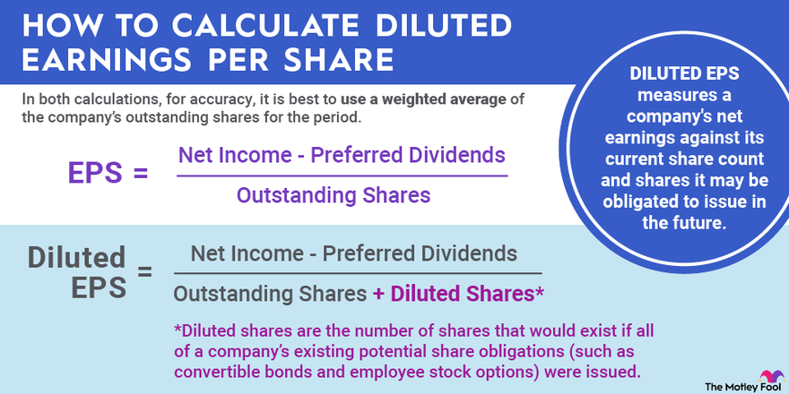

## Table of Contents

## What are fully diluted shares?

Fully diluted shares are the total number of shares that a company would have if all possible sources of new shares were exercised. This includes not just the current outstanding shares, but also shares that could be created from things like stock options, warrants, and convertible securities. It's a way to see the maximum potential dilution of existing shareholders' ownership if all these potential shares were issued.

Understanding fully diluted shares is important for investors because it gives a clearer picture of what their ownership stake might look like in the future. If a company has a lot of potential shares that could be issued, it might mean that the value of each share could go down if all those shares are actually created. This helps investors make more informed decisions about buying or holding the company's stock.

## How do fully diluted shares differ from basic shares?

Basic shares are the number of shares that a company has right now. These are the shares that are already out there and owned by people. When you look at basic shares, you're just counting what's currently available and nothing more.

Fully diluted shares, on the other hand, include not just the basic shares but also all the shares that could possibly be created in the future. This means adding in shares from things like stock options, which employees might be able to buy, or convertible bonds, which can turn into shares. Fully diluted shares give you a bigger picture of how many shares might exist if everything that could turn into a share actually does.

So, the main difference is that basic shares show you the current situation, while fully diluted shares show you a potential future situation where all possible shares are counted. This is important because it can affect how much each share is worth and how much of the company you own if you're an investor.

## Why is the concept of fully diluted shares important for investors?

The concept of fully diluted shares is important for investors because it helps them understand the potential future value of their investment. When a company has a lot of options, warrants, or convertible securities that could turn into more shares, it means the total number of shares could go up. If the number of shares goes up, the value of each share might go down because the same company is now divided into more pieces. So, by looking at fully diluted shares, investors can see the worst-case scenario for their ownership stake and make better decisions about whether to buy, hold, or sell the stock.

Also, fully diluted shares give investors a clearer picture of the company's future financial health. If a company is planning to issue a lot of new shares, it might be doing so to raise money, which could be good or bad depending on what the money is used for. Investors need to know about these plans because they can affect the company's earnings per share and overall valuation. By understanding fully diluted shares, investors can better assess the risks and rewards of investing in the company.

## What is earnings per share (EPS) and how does it relate to fully diluted shares?

Earnings per share (EPS) is a number that shows how much money a company makes for each share of its stock. It's calculated by taking the company's total earnings and dividing it by the number of shares. EPS is important because it helps investors see how profitable a company is and how much of that profit they might get if they own a share.

When we talk about EPS, we usually use the basic shares to calculate it. But, if we want to see a more complete picture, we can use fully diluted shares. Fully diluted EPS shows what the earnings per share would be if all possible new shares were created. This gives investors a clearer idea of what their share of the earnings might look like in the future if the company issues more shares. It's a way to be prepared for the worst-case scenario where the value of each share could go down because there are more shares.

## How can fully diluted shares affect a company's EPS?

Fully diluted shares can lower a company's earnings per share (EPS). When a company has more shares, the total earnings are spread out over more pieces, so each piece gets a smaller amount. If a company has a lot of options, warrants, or convertible securities that could turn into more shares, and we count all those possible shares, the EPS goes down. This is because the same amount of earnings is now divided by a bigger number of shares.

Understanding the impact of fully diluted shares on EPS is important for investors. If they only look at the basic EPS, which uses the current number of shares, they might think the company is more profitable per share than it really could be. By looking at the fully diluted EPS, investors can see what might happen if the company issues all those extra shares. This helps them make better decisions about whether the stock is a good investment for them.

## What are stock options and how do they contribute to fully diluted shares?

Stock options are like special tickets that a company gives to its employees or others. These tickets let them buy the company's stock at a set price, usually lower than what the stock is worth right now. If the stock's price goes up, the people with options can buy the stock at the lower price and then sell it at the higher price, making money. Companies give out these options to reward their employees and to make them want to help the company do well.

When we talk about fully diluted shares, we count all the shares that could be out there if everyone used their stock options. If a lot of people decide to use their options and buy the stock, it means more shares will be created. This can make the total number of shares go up, and that's why we include them when we figure out fully diluted shares. It helps us see the biggest possible number of shares that might exist, which can affect how much each share is worth and how much of the company you own if you're an investor.

## Can you explain the impact of convertible securities on fully diluted shares?

Convertible securities are like special investments that can be turned into shares of a company's stock. They are things like convertible bonds or preferred stock. If someone who owns these securities decides to convert them, it means new shares get created. When we talk about fully diluted shares, we count all the shares that could be out there if everyone used their convertible securities. This helps us see the biggest possible number of shares that might exist.

If a lot of people decide to convert their securities into shares, it means more shares will be created. This can make the total number of shares go up, which is why we include them when we figure out fully diluted shares. It's important because it can affect how much each share is worth and how much of the company you own if you're an investor. By knowing about fully diluted shares, investors can better understand what might happen to their investment in the future.

## How do companies report fully diluted EPS in their financial statements?

Companies report fully diluted EPS in their financial statements to give investors a clear picture of their earnings. They do this by showing two numbers: the basic EPS and the fully diluted EPS. The basic EPS is calculated using the number of shares that are out there right now. The fully diluted EPS is calculated using the number of shares that could be out there if all possible new shares were created from things like stock options and convertible securities. This helps investors see what might happen to their share of the earnings if the company issues more shares in the future.

You can find these numbers in the company's income statement or in a section called "Notes to the Financial Statements." The fully diluted EPS is usually lower than the basic EPS because it's based on more shares. By looking at both numbers, investors can understand the best and worst-case scenarios for their investment. This information helps them make smarter choices about buying, holding, or selling the company's stock.

## What are the potential scenarios where fully diluted shares significantly impact a company's valuation?

When a company has a lot of stock options, warrants, or convertible securities, fully diluted shares can really change how much the company is worth. If all these options and securities turn into new shares, the total number of shares goes up. This means each share is worth a smaller piece of the company. Investors look at fully diluted shares to see what might happen to the value of their investment if the company decides to issue all those extra shares. If the company's value stays the same but the number of shares goes up, the price of each share could go down, making the company seem less valuable overall.

A big impact can happen when a company is planning to raise money by issuing new shares. If they do this, the fully diluted shares number will be a lot higher than the basic shares number. This can make the company's earnings per share (EPS) look smaller because the same amount of earnings is now spread over more shares. Investors need to know about this because it can affect how they see the company's future growth and profitability. If they think the company will use the new money well, they might not mind the dilution. But if they're worried about the company's plans, they might see the fully diluted shares as a big risk to their investment.

## How can investors use the fully diluted share count to make better investment decisions?

Investors can use the fully diluted share count to see what might happen to their ownership in a company if all possible shares are issued. By looking at this number, they can understand the worst-case scenario for their investment. If a company has a lot of stock options, warrants, or convertible securities, it means more shares could be created in the future. This can make each share worth less because the same company is now divided into more pieces. Knowing this helps investors decide if they want to buy, hold, or sell the stock based on how much they think the company's value might change.

For example, if an investor sees that a company's fully diluted EPS is much lower than its basic EPS, it might mean the company is planning to issue a lot of new shares. This could be to raise money for growth, which might be good if the investor believes in the company's plans. But if the investor thinks the company won't use the money well, they might see the potential dilution as a risk. By comparing the fully diluted share count with the current share count, investors can better judge the risks and rewards of their investment and make smarter choices about their money.

## What are the accounting standards governing the calculation of fully diluted shares?

The calculation of fully diluted shares is guided by accounting standards like the Generally Accepted Accounting Principles (GAAP) in the United States and the International Financial Reporting Standards (IFRS) used globally. These standards make sure that companies report their fully diluted shares in a clear and consistent way. GAAP uses a method called the treasury stock method to figure out how many new shares might be created from stock options and warrants. IFRS also has rules to include all potential shares that could come from convertible securities and other instruments.

Both GAAP and IFRS want to help investors understand the worst-case scenario for their investment. They do this by making companies show what would happen to the number of shares if all possible new shares were issued. This helps investors see if the value of their shares might go down because more shares could be created. By following these standards, companies give investors a better idea of what might happen to their ownership in the future.

## How do changes in fully diluted shares over time reflect on a company's growth strategy and financial health?

Changes in fully diluted shares over time can tell investors a lot about a company's growth strategy and financial health. If a company is increasing its fully diluted shares a lot, it might mean they are trying to grow by raising money. They do this by giving out stock options to employees or by letting people turn their convertible securities into new shares. This can be a good sign if the company is using the money to invest in new projects or to expand their business. But, if the company is not using the money well, it might be a bad sign because more shares can make each share worth less.

Looking at how fully diluted shares change can also show if a company is in good financial health. If a company's fully diluted shares keep going up but their earnings are not growing, it might mean they are struggling to make money. This can worry investors because it shows the company might be having trouble. On the other hand, if the fully diluted shares go up but the company's earnings are growing too, it can be a good sign. It means the company is using the new money to make more profits, which can make the company more valuable in the long run.

## What is the meaning of Fully Diluted Shares?

Fully diluted shares represent an important financial metric that accounts for the total number of shares that would be outstanding if all convertible securities, such as convertible bonds, stock options, and warrants, were exercised. This metric is essential in calculating earnings per share (EPS), as it dilutes potential earnings, providing a more conservative and realistic view of a company's financial performance.

Understanding fully diluted shares is crucial for financial analysis because it accounts for the potential changes in a company's share count due to the conversion of various financial instruments. Convertible bonds, for instance, are debt instruments that can be converted into a predefined number of equity shares, adding to the total share count upon conversion. Similarly, stock options, which give employees or other stakeholders the right to purchase shares at a set price within a specified period, can significantly increase the number of outstanding shares if exercised. Warrants, another type of financial instrument, also provide the holder the right but not the obligation to buy shares at a certain price before expiration, thereby further impacting the total share count upon execution.

By incorporating convertible securities into the share count, analysts and investors can calculate the fully diluted EPS, which gives a more comprehensive insight into a company's profitability under the assumption of maximum dilution. The formula for calculating fully diluted EPS can be expressed as:

$$
\text{Fully Diluted EPS} = \frac{\text{Net Income} - \text{Preferred Dividends}}{\text{Weighted Average Fully Diluted Shares Outstanding}}
$$

This analysis helps in assessing the true value of a company and aids investors in evaluating the stock's valuation more accurately by considering worst-case scenarios where maximum dilution occurs. An accurate assessment of fully diluted shares also supports better decision-making during investment appraisal, mergers, and acquisitions or when evaluating the financial health and future prospects of a company. As such, understanding fully diluted shares is indispensable for effective financial analysis and sound investment strategies.

## What is the impact of fully diluted shares on earnings?

Earnings per share (EPS) is a fundamental measure of a company's profitability, calculated by dividing the company's net income by the number of outstanding shares. A pivotal [factor](/wiki/factor-investing) influencing EPS is the count of outstanding shares, which directly affects the perceived financial health of the company. When considering fully diluted shares, the scenario becomes more complex and reflective of a worst-case scenario where all convertible instruments are exercised.

Utilizing fully diluted shares in EPS calculations allows for a conservative and comprehensive analysis of a company's earnings. It captures potential dilutive impacts from convertible securities such as stock options, convertible bonds, and warrants. In essence, the formula for fully diluted EPS is:

$$
\text{Fully Diluted EPS} = \frac{\text{Net Income}}{\text{Total Shares Outstanding + all other potential shares}}
$$

This approach ensures that an inflated picture of profitability is not presented, providing a realistic assessment by factoring in potential dilutive events that could affect shareholder value. From an investor and analyst perspective, analyzing fully diluted EPS offers crucial insights, especially during significant corporate events such as initial public offerings (IPOs) or in the evaluation of a company’s long-term growth strategies. This metric is instrumental in delivering a holistic view of the earnings potential, assuming all possible shares were to be converted. By applying this conservative measure, investors can safeguard themselves against overly optimistic earnings outlooks, optimizing decision-making in light of possible equity dilution.

## What is the relationship between Algorithmic Trading and Dilution Events?

Algorithmic trading employs automated systems that enable traders to respond rapidly to dilution events, such as the issuance of new shares, convertible securities, or stock options being exercised. These events increase the total number of shares outstanding, leading to potential alterations in stock price valuations due to changes in supply and perceived value. To capitalize on these changes, traders use algorithmic strategies that take into account the projected impact of dilution events on share prices.

An effective algorithmic strategy begins with the anticipation of dilution events. Traders design algorithms to scrutinize a company's financial announcements, monitor regulatory filings, and evaluate historical data on stock performance. This preemptive approach allows algorithms to adjust trading positions in anticipation of dilution, enabling traders to mitigate risks associated with potential decreases in earnings per share (EPS) or shifts in investor sentiment.

For instance, algorithms may incorporate real-time data analysis and historical trend evaluation to predict how a dilution event could influence market prices. By leveraging [machine learning](/wiki/machine-learning) techniques, these systems can refine their predictions of stock price movements in response to new share issuances. This is crucial for maintaining an updated portfolio strategy that adapts to fluctuations in market conditions.

The fluid metrics of earnings per share and fully diluted shares are integral to the algorithms’ calculations. The formula for EPS is often modified in these algorithms to account for fully diluted shares:

$$
EPS_{\text{diluted}} = \frac{\text{Net Income}}{\text{Shares Outstanding} + \text{Convertible Securities}} 
$$

Through this adjustment, traders ensure their algorithms maintain a conservative understanding of the company's profitability by considering scenarios where maximum conversion occurs.

Furthermore, [algorithmic trading](/wiki/algorithmic-trading) systems utilize various market signals and quantitative models to execute trades that capitalize on price inefficiencies brought about by dilution events. Such systems are designed to quickly adapt to real-time data, adjusting positions to either curb losses or enhance gains during market fluctuations. This adaptability is especially important in volatile markets where rapid reactions can significantly enhance trading outcomes.

By strategically integrating these elements, algorithmic trading allows for a dynamic response to dilution events and the complexities they introduce to investment decisions. This approach not only optimizes trading efficiency but also bolsters processes for risk management in rapidly changing market environments.

## References & Further Reading

Lucas, D. J., & McDonald, R. L. (1990). "Equity Issues and Stock Price Dynamics." The Journal of Finance, 45(4), 1019-1043. This paper explores the relationship between equity issuance and subsequent stock price movements, providing insights into how market dynamics and investor behavior can affect share valuation. 

Jenkins, R. A., & Hamilton, F. (2003). "Insider Trading and the Effects of Share Dilution." Journal of Business Finance & Accounting, 30(9-10), 1383-1406. This study examines how insider trading is influenced by share dilution events, discussing the implications for both market integrity and investor confidence.

Fishman, M. J., & Hagerty, K. M. (1996). "Earnings, Dilution, and Per Share Measures: Understanding the Incentives." The Accounting Review, 71(1), 43-68. The authors focus on the strategic considerations underlying companies' financial disclosures, specifically how earnings and per-share measures are impacted by potential dilution.

Johnson, B. "Algorithmic Trading and DMA: An Introduction to Direct Access Trading Strategies." This book serves as a comprehensive guide to algorithmic trading, including the technical and strategic foundations necessary for leveraging direct market access and refining trading algorithms to respond effectively to dilution and other market events.

