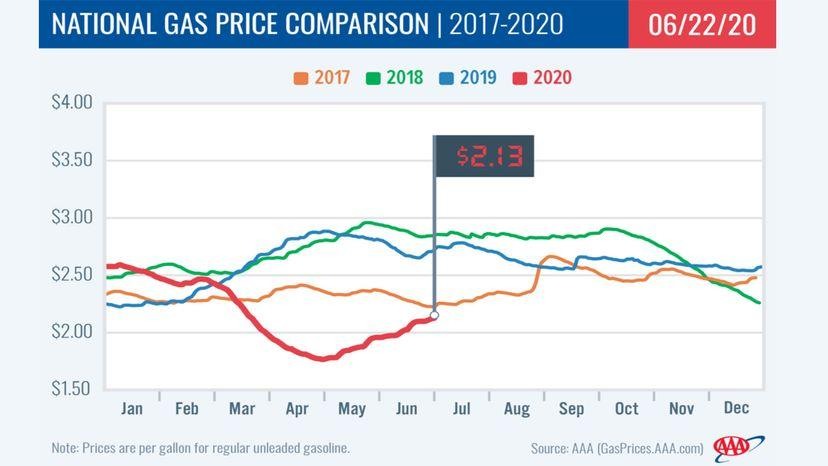

## Table of Contents

## What are gas prices and how are they determined?

Gas prices are what you pay for a gallon of gasoline at the pump. They change a lot and can be different depending on where you live. Many things affect gas prices, like how much oil costs, taxes, how much gas people want to buy, and how much gas is available to sell.

The price of oil is a big part of what makes gas prices go up or down. Oil is what they use to make gasoline, so if oil prices go up, gas prices usually go up too. Taxes also add to the cost of gas. Different places have different taxes, so gas can cost more in one place than another. If a lot of people want to buy gas and there isn't enough to go around, prices can go up. But if there's a lot of gas and not many people want to buy it, prices can go down.

Other things can also affect gas prices, like problems at oil refineries or big events that change how much oil we use. For example, if a hurricane stops an oil refinery from working, it can make gas prices go up because there's less gas to sell. Also, if something big happens in the world that makes people worried about oil supplies, like a war, gas prices can change a lot.

## How do gas prices affect the cost of living for individuals?

Gas prices can make a big difference in how much it costs for people to live every day. When gas prices go up, it costs more to fill up your car. This means you might have to spend more money just to get to work or go to the store. For people who drive a lot for their job, like truck drivers or delivery people, higher gas prices can really hurt their wallets. They might have to pay a lot more just to do their job, which can make it hard to pay for other things they need.

Higher gas prices can also make other things more expensive. When it costs more to move goods from one place to another, the price of food, clothes, and other stuff can go up too. This is because trucks and ships that [carry](/wiki/carry-trading) these things use gas, and if gas is more expensive, the companies might charge more for their products. So, even if you don't drive a car, you might still feel the effects of high gas prices because everything else can get more expensive too.

## What is the relationship between gas prices and inflation?

Gas prices and inflation are closely linked. When gas prices go up, it can make inflation go up too. Inflation is when the prices of things we buy, like food and clothes, go up over time. If gas prices are high, it costs more to move these things from one place to another. This means that the companies that make and sell these things might raise their prices to cover the extra cost of gas. So, when you go to the store, you might see that everything costs a bit more.

This can also affect how much money people have to spend. If people are spending more on gas and other things that cost more because of inflation, they might not have as much money left over for other stuff. This can slow down the economy because people aren't buying as much. Governments and central banks watch gas prices and inflation closely because they can have a big impact on how well the economy is doing.

## How do fluctuations in gas prices impact different sectors of the economy?

Fluctuations in gas prices can have a big impact on many parts of the economy. For example, the transportation sector feels it right away. When gas prices go up, it costs more for trucks, planes, and ships to move goods around. This can make it more expensive for companies to get their products to stores, and they might have to raise their prices. This can also affect how much people travel. If gas is expensive, fewer people might drive or fly, which can hurt businesses like airlines and car rental companies.

The agriculture sector is also affected by changes in gas prices. Farmers use a lot of gas to run their machinery and to transport their crops. If gas prices go up, it costs more to grow and move food. This can make food prices go up too. The manufacturing sector feels the impact as well. When gas prices rise, it costs more to make things because factories use gas to run their machines. This can lead to higher prices for all kinds of products, from cars to clothes.

Overall, when gas prices go up or down, it can cause a ripple effect across the economy. Many businesses have to adjust their prices and how they operate. This can lead to changes in how much people spend and can even affect how fast the economy grows. So, keeping an eye on gas prices is important for understanding what might happen in different parts of the economy.

## What role do government policies play in influencing gas prices?

Government policies can have a big impact on gas prices. One way they do this is by setting taxes on gas. Different countries have different taxes, and these taxes can make gas more expensive in some places than others. Governments can also give out subsidies, which are like discounts, to help keep gas prices lower. These subsidies can make it cheaper for people to buy gas, but they can also cost the government a lot of money.

Another way government policies affect gas prices is through regulations on the oil and gas industry. Governments can make rules about how oil companies drill for oil, how they refine it into gas, and how they sell it. These rules can make it more expensive for oil companies to do business, which can lead to higher gas prices. On the other hand, if the government makes it easier for oil companies to do their work, it might help keep gas prices lower. So, the choices governments make can really change how much we pay for gas.

## How do gas prices affect consumer spending and behavior?

When gas prices go up, people have to spend more money to fill up their cars. This means they might have less money left over for other things they want to buy, like clothes or going out to eat. Some people might decide to drive less to save money, so they might carpool, take the bus, or walk more often. This can change how they spend their time and money, and they might look for cheaper ways to do things, like buying cheaper food or waiting for sales.

High gas prices can also make people think more about how they use their cars. They might try to combine trips so they don't have to drive as much, or they might choose to live closer to where they work to cut down on commuting costs. This can affect the kinds of cars people buy too. When gas is expensive, more people might be interested in cars that use less gas, like hybrids or electric cars. So, gas prices can change not just what people spend their money on, but also how they live their daily lives.

## What are the long-term economic impacts of sustained high gas prices?

When gas prices stay high for a long time, it can change the economy in big ways. People have to spend more money on gas, so they might not have as much money to spend on other things like clothes, food, or going out. This can slow down the economy because businesses sell less stuff. Companies that need gas to make or move their products might have to raise their prices, which can make everything more expensive. This can lead to inflation, where the cost of living goes up and people's money doesn't go as far.

Over time, high gas prices can also push people and businesses to change how they do things. More people might start using public transportation, carpooling, or buying cars that use less gas or no gas at all, like electric cars. Companies might try to find new ways to save energy and use less gas in their work. Governments might also make new rules to help use less gas and find other kinds of energy. All these changes can help the economy in the long run by making it more efficient and less dependent on gas, but it can take time for these changes to happen and for people to feel the benefits.

## How do international events and geopolitical tensions affect gas prices?

International events and geopolitical tensions can really shake up gas prices. When there's trouble in countries that make a lot of oil, like wars or political fights, it can make it harder to get oil. If people are worried that oil might not be available, they might start buying more, which can push prices up. For example, if there's a conflict in the Middle East, which has a lot of oil, it can make the world nervous about oil supplies, and gas prices can jump.

Also, big events like natural disasters can mess with oil production. If a hurricane hits an area with oil refineries, it might stop them from working for a while. This means less gas is made, and prices can go up because there's not enough to go around. Governments around the world might also decide to put limits on how much oil they sell, or they might work together to control oil prices. When these things happen, it can make gas prices go up or down, depending on what's going on.

## What are the economic implications of transitioning from fossil fuels to renewable energy sources?

Moving from fossil fuels like gas and oil to renewable energy sources like wind and solar can change the economy in big ways. At first, it might cost a lot of money to build new wind farms or solar panels. This can mean higher prices for energy while we're making the switch. But over time, renewable energy can be cheaper because the sun and wind are free, and we don't have to keep buying more like we do with oil and gas. This can save money for people and businesses in the long run. Also, using renewable energy can create new jobs in building and running these new energy systems, which can help the economy grow.

Another big change is that we won't have to rely on other countries for oil and gas anymore. This can make our energy supply safer because we won't have to worry about problems in other countries affecting our energy prices. It can also help the environment by reducing pollution and slowing down climate change. But, it can be hard for places that make a lot of money from oil and gas. They might have to find new ways to make money as the world uses less of these fuels. So, while moving to renewable energy can be good for the economy in the long run, it can also be a big challenge in the short term.

## How do gas prices influence the transportation and logistics industry?

High gas prices make it more expensive for the transportation and logistics industry to do its job. Trucks, ships, and planes all use gas to move goods from one place to another. When gas costs more, it costs more to run these vehicles. Companies might have to raise the prices they charge for moving things to cover these higher costs. This can make everything we buy more expensive because the cost of getting it to the store goes up.

Because of high gas prices, companies in the transportation and logistics industry might also change how they work. They might try to find ways to use less gas, like planning their routes better or using vehicles that are more fuel-efficient. Some companies might even switch to using electric trucks or other vehicles that don't use gas at all. These changes can help them save money over time, but it can take a while to make the switch and see the benefits.

## What economic theories explain the impact of gas prices on the economy?

One important economic theory that helps explain how gas prices affect the economy is called the theory of supply and demand. When gas prices go up, it means that either the supply of gas is going down, or the demand for gas is going up, or both. If there's less gas available because of problems at oil refineries or international issues, the price goes up. On the other hand, if a lot of people want to buy gas and there's not enough to go around, prices can also go up. This theory shows how gas prices can change based on what's happening with how much gas there is and how much people want it.

Another theory that helps us understand the impact of gas prices is the concept of inflation. When gas prices rise, it can lead to higher prices for other things too. This is because gas is used to move goods around, and if it costs more to move things, the price of those things can go up. This can make the overall cost of living go up, which is what we call inflation. When people have to spend more on gas and other things, they might not have as much money left over to spend on other stuff, which can slow down the economy. So, gas prices can have a big effect on how much everything costs and how well the economy is doing.

## How can predictive models be used to forecast the economic effects of gas price changes?

Predictive models can help us guess what might happen to the economy when gas prices go up or down. These models use a lot of information, like past gas prices, how much people want to buy gas, and what's happening in the world. They look at all this data and try to find patterns. For example, if gas prices went up last time and people spent less money on other things, the model might predict that the same thing could happen again. By looking at these patterns, the models can give us a good idea of what might happen next time gas prices change.

These models are really useful for businesses and governments. Businesses can use them to plan ahead. If a company knows that gas prices might go up, they can try to find ways to use less gas or change their prices to cover the extra cost. Governments can use these models to make decisions about things like taxes or subsidies on gas. They can also use them to figure out how to help people if gas prices go up a lot. So, predictive models help everyone be ready for what might happen when gas prices change.

## References & Further Reading

[1]: Russo, Vincent A., & Pearce, John. (2006). ["The Economic Impact of Gasoline Prices on Consumers and Retail Issues."](https://www.researchgate.net/publication/321196443_Farmgate_prices_retail_prices_and_supermarkets'_pricing_decisions_An_integrated_approach) Resources for the Future.

[2]: Hamilton, James D. (2009). ["Causes and Consequences of the Oil Shock of 2007-08."](https://www.brookings.edu/wp-content/uploads/2016/07/2009a_bpea_hamilton-1.pdf) Brookings Papers on Economic Activity.

[3]: Pourzanjani, Mehdi, Radenovic, Felix, & Rezaee, Bijan. (2020). ["Algorithmic Trading Using Deep Learning and Sentiment Analysis: Evidence from the Asian Markets."](https://arxiv.org/abs/2005.13934) arXiv.

[4]: Kilian, Lutz. & Murphy, Daniel P. (2014). ["The Role of Inventories and Speculative Trading in the Global Market for Crude Oil."](https://deepblue.lib.umich.edu/bitstream/handle/2027.42/106955/jae2322.pdf?sequence=1) The Quarterly Journal of Economics.

[5]: International Energy Agency. (2021). ["World Energy Outlook 2021."](https://www.iea.org/reports/world-energy-outlook-2021) International Energy Agency.

[6]: Yergin, Daniel. (2012). ["The Quest: Energy, Security, and the Remaking of the Modern World."](https://www.amazon.com/Quest-Energy-Security-Remaking-Modern/dp/0143121944) Penguin Books.