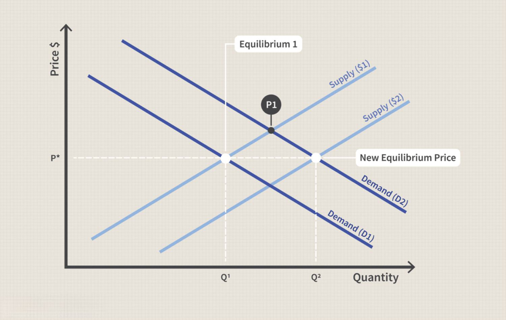

Gas prices have long served as a key indicator of economic health and consumer behavior. The intricate dynamics of global oil markets mean that these prices are in constant flux, highlighting the necessity of understanding their broader economic impacts. For businesses, consumers, and policymakers, grasping these dynamics is essential for making informed decisions in an increasingly volatile environment.

This article examines the extensive impact of gas prices on various aspects of the economy, including consumer spending and the emergence of algorithmic trading in the fuel market. Gas prices have significant implications for transportation costs, one of the primary ways these fluctuations impact both businesses and individual consumers. As transportation costs rise with gas prices, so too does the cost of goods and services that depend on these networks. This ripple effect underscores the multifaceted influence of gas prices as a macroeconomic indicator, impacting myriad sectors from logistics to hospitality.

The intricate relationship between gas prices and broader economic indicators is increasingly intertwined with the realm of technology and financial markets. Algorithmic trading is beginning to make its mark on fuel markets, offering the potential to reshape how prices are determined. By leveraging vast datasets and sophisticated algorithms, this approach may lead to more efficient pricing mechanisms, although it carries risks such as potential price manipulation and unintended collusion.

By understanding these complex interconnections and the evolving role of technology in fuel markets, stakeholders can better navigate the challenges and opportunities posed by fluctuating gas prices. This insight is crucial for fostering resilience and adaptability in an era where economic and environmental considerations are more interlinked than ever.

## Table of Contents

## Understanding Gas Prices and Their Volatility

Gas prices exhibit significant volatility, largely driven by a multitude of interconnected factors. At the core is the price of crude oil, the primary raw material from which gasoline is refined. The global crude oil market operates under the influence of supply and demand dynamics, where changes in production levels, consumption patterns, and geopolitical events can provoke substantial price shifts. For instance, geopolitical instability or armed conflicts in major oil-producing regions can lead to supply disruptions, causing crude prices to spike and consequently increasing gas prices.

Economic sanctions imposed on oil-rich nations can further compound these effects by constricting supply. Such events historically demonstrate the sensitivity of gas prices to political and economic actions. Natural disasters, such as hurricanes, can disrupt oil extraction and refining facilities, thus impacting supply chains. A notable example is Hurricane Katrina in 2005, which significantly affected oil production and refining along the Gulf Coast of the United States, leading to notable price increases at gas stations nationwide.

Furthermore, domestic supply and demand dynamics play a crucial role. In the United States, the summer travel season typically sees a rise in demand for gasoline, which can lead to higher prices if supply does not keep pace. Conversely, an economic downturn may reduce consumption, leading to lower prices.

The ongoing global transition towards renewable energy sources and more energy-efficient technologies introduces additional variables into the equation. As countries strive to reduce carbon emissions, the adoption of electric vehicles (EVs) and investments in renewable energy infrastructures can influence gasoline demand patterns. This shift may cause temporary price fluctuations as the market adjusts to new consumption norms. Energy policy and regulatory measures also impact these dynamics, with subsidies and incentives for green technologies further altering demand for traditional gasoline.

For businesses, understanding gas price [volatility](/wiki/volatility-trading-strategies) is critical to maintaining operational stability. Companies reliant on transportation and logistics must prepare for fluctuating costs, often using hedging strategies to mitigate risks. Consumers, meanwhile, encounter the most immediate consequences at the fuel pump, as rising costs directly affect disposable income and influence spending behavior across the broader economy. The challenge for both businesses and consumers lies in anticipating and adapting to these price changes that ripple through supply chains and affect profit margins and budgets.

In summary, gas prices are subject to a complex interplay of factors, including [crude oil](/wiki/crude-oil) prices, geopolitical stability, natural events, and the shift towards renewable energy. Stakeholders across the economy must continuously adapt to the inherent volatility within these markets, requiring both strategic foresight and flexibility.

## Economic Impact of Rising Gas Prices

Rising gas prices have a significant impact on the economy as they influence various aspects of consumer behavior and business operations. When gas prices increase, consumers tend to allocate a greater portion of their budgets toward fuel costs, which in turn reduces their disposable income for other expenses, such as retail shopping and dining out. This shift can lead to a decrease in consumer spending in these sectors, which is detrimental to economic growth and can result in lower revenues for businesses operating within these industries.

Transportation-heavy industries bear the brunt of higher gas prices, with logistics, trucking, and airlines experiencing substantial increases in operational costs. As fuel is a critical input for these sectors, even minor fluctuations in gas prices can disproportionately affect their overall cost structures. As a result, companies may pass these increased expenses onto consumers in the form of higher prices for goods and services, contributing to a rise in the overall cost of living.

This chain reaction can lead to inflationary pressures within the broader economy. Inflation occurs when the general level of prices for goods and services rises, eroding purchasing power. Elevated fuel costs can be a significant driver of inflation, as they trickle down to affect the price of numerous products and services. Central banks and monetary authorities, tasked with maintaining price stability, may need to intervene by adjusting interest rates and employing other monetary policy tools to curb inflation and mitigate its adverse effects.

The intricate relationship between gas prices, consumer spending, operational costs in transportation sectors, and inflationary trends underscores the complexity of managing economic stability in the face of fluctuating fuel prices. Understanding these dynamics is crucial for policymakers as they devise strategies to address and alleviate the impact of rising gas prices on both consumers and the economy at large.

## Fuel Economy Innovations Amid Price Volatility

The automotive industry has continually adapted to increasing fuel costs by advancing in the realms of fuel-efficient and electric vehicles. These vehicles are designed to consume less fuel, thereby reducing the overall operational costs associated with driving. Technological advancements such as hybrid powertrains, improved aerodynamics, and lightweight materials contribute significantly to fuel economy. The shift towards electric vehicles (EVs) is driven by these technological innovations, offering an alternative to traditional gasoline-powered cars by utilizing electricity as a primary energy source.

The cost-effectiveness of EVs is becoming more apparent with improvements in battery technology. Contemporary lithium-ion batteries offer increased energy density and longer life spans, which lower the total ownership cost compared to conventional vehicles. Charging infrastructure is also expanding, making EVs more viable for everyday use. Increased competition among automakers has accelerated this progression, with many companies setting ambitious targets for EV integration over the next decade.

Public transportation users have grown in numbers as gas prices rise, offering a respite from high fuel costs. With investments in service frequency and network expansion, public transport systems become a more viable and cost-efficient option for commuters. The increased ridership helps to alleviate traffic congestion and reduce pollution levels, indirectly contributing to economic sustainability.

Emerging technologies in alternative energy sources complement these innovations. Hydrogen fuel cells, biofuels, and solar-powered vehicles represent potential pathways for reducing dependency on fossil fuels. However, the widespread adoption of such technologies faces several challenges. Infrastructure for hydrogen refueling remains scarce, and biofuels require sustainable feedstock production.

Overall, the adaptation to fluctuating gas prices sees a dynamic interplay between efficient vehicular technology and alternative energy development. The ongoing evolution in these sectors promises not only to cushion the economic impacts of fuel costs but also to drive advancements toward a more sustainable and diversified energy future.

## Algorithmic Trading in Fuel Markets

Algorithmic trading employs complex algorithms to execute trades based on a set of predefined criteria and is finding increasing applications in fuel markets. By utilizing these algorithms, traders can analyze vast datasets, identifying trends and predicting price movements with greater accuracy. This capability enhances the efficiency of pricing mechanisms in fuel markets, as algorithms can rapidly assimilate new information such as geopolitical events or shifts in supply and demand dynamics, adjusting prices in real-time.

The integration of [algorithmic trading](/wiki/algorithmic-trading) in fuel markets allows for the swift processing of comprehensive market data, including futures prices, demand forecasts, and inventory levels. These algorithms operate on intricate mathematical models and statistical techniques, often using [machine learning](/wiki/machine-learning) to continually refine their predictions. For instance, the use of regression analysis or time-series forecasting can help in understanding market behavior and extrapolating future price movements, with algorithms making split-second decisions based on this analysis.

Despite these efficiencies, the utilization of algorithmic trading in fuel markets is not without risks. One significant concern is the potential for price manipulation. Algorithms executing high-frequency trades have the capability to influence market prices through rapid inventory shifts, leading to artificial price inflation or deflation. Moreover, the phenomenon known as algorithmic collusion presents a risk, where algorithms unintentionally align their trading strategies, leading to synchronized price-setting behavior. This could result in reduced market competition, although it operates outside the intent of explicit collusion.

Regulatory bodies remain vigilant to these possibilities, emphasizing the need for transparency and systematic monitoring of algorithmic trading practices. Ensuring fair market conditions requires ongoing scrutiny and possibly the introduction of regulatory frameworks that prevent unintended consequences like price manipulation or reduced competitive dynamics. While algorithmic trading offers potential improvements in market efficiency, careful management and oversight are crucial to safeguard against its inherent risks.

## Policy Responses to Gas Price Fluctuations

Governments have several mechanisms at their disposal to address fluctuations in gas prices, which can have significant economic implications. One primary approach is the strategic release of oil reserves. By tapping into these reserves during periods of high prices, governments can temporarily increase supply, helping to stabilize or reduce prices. For example, the U.S. Strategic Petroleum Reserve, which holds large quantities of crude oil, can be utilized in situations where the market experiences severe disruptions.

Another approach involves adjusting fuel taxes. By reducing taxes on fuel, governments can alleviate some of the financial burden on consumers. This measure, however, usually serves as a short-term solution and has budgetary implications given that fuel taxes often contribute to public funding. 

Long-term solutions include investments in alternative transportation infrastructure. Developing electric vehicle (EV) charging stations and high-speed rail networks can reduce dependency on fossil fuels. Governments can stimulate electric vehicle adoption by providing tax incentives and subsidies, thereby cushioning the economy against future oil price volatility. 

Furthermore, fiscal and monetary policies may be modified to counteract inflationary pressures exacerbated by high gas prices. For example, central banks might consider altering interest rates to stabilize the economy, while fiscal measures could involve increased public spending to spur economic growth during periods of high energy costs. 

In summary, governments have a range of tools—strategic reserves, tax adjustments, infrastructure investment, and policy shifts—that can mitigate the effects of volatile gas prices, fostering economic stability and promoting a transition towards more sustainable energy sources.

## Conclusion

Gas prices have a significant impact on the economy, influencing consumer behavior and the functionality of global transportation systems. A rise in gas prices tends to reduce disposable income, which shifts consumer spending away from other sectors, directly affecting retail and leisure industries. Businesses, particularly those heavily reliant on transportation, encounter increased operational costs, thereby contributing to price inflation and altering market dynamics.

However, these fluctuations also pave the way for innovation. Industries are incentivized to develop in response to rising gas prices. This is evident in the transportation sector, where advancements in fuel-efficient technologies and electric vehicles reflect an adaptive strategy to counteract high fuel expenses. Public transportation systems, too, benefit from increased usage as people seek cost-effective alternatives.

Understanding the underlying causes of gas price volatility is crucial for developing strategic policy interventions. Governments can implement measures like tax adjustments, investment in alternative fuel technologies, or strategic oil reserve releases to balance economic stability and ecological sustainability. By grasping the intricate ties between gas prices and economic health, stakeholders can better prepare for, and possibly mitigate, the adverse consequences of price volatility, fostering a more resilient economy capable of adapting to future challenges.

## References & Further Reading

[1]: Russo, Vincent A., & Pearce, John. (2006). ["The Economic Impact of Gasoline Prices on Consumers and Retail Issues."](https://www.researchgate.net/publication/321196443_Farmgate_prices_retail_prices_and_supermarkets'_pricing_decisions_An_integrated_approach) Resources for the Future.

[2]: Hamilton, James D. (2009). ["Causes and Consequences of the Oil Shock of 2007-08."](https://www.brookings.edu/wp-content/uploads/2016/07/2009a_bpea_hamilton-1.pdf) Brookings Papers on Economic Activity.

[3]: Pourzanjani, Mehdi, Radenovic, Felix, & Rezaee, Bijan. (2020). ["Algorithmic Trading Using Deep Learning and Sentiment Analysis: Evidence from the Asian Markets."](https://arxiv.org/abs/2005.13934) arXiv.

[4]: Kilian, Lutz. & Murphy, Daniel P. (2014). ["The Role of Inventories and Speculative Trading in the Global Market for Crude Oil."](https://deepblue.lib.umich.edu/bitstream/handle/2027.42/106955/jae2322.pdf?sequence=1) The Quarterly Journal of Economics.

[5]: International Energy Agency. (2021). ["World Energy Outlook 2021."](https://www.iea.org/reports/world-energy-outlook-2021) International Energy Agency.

[6]: Yergin, Daniel. (2012). ["The Quest: Energy, Security, and the Remaking of the Modern World."](https://www.amazon.com/Quest-Energy-Security-Remaking-Modern/dp/0143121944) Penguin Books.