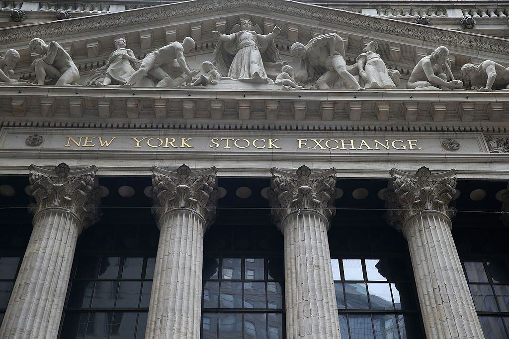

The Glass-Steagall Act, enacted in 1933, was a foundational financial regulation designed to address the banking crises precipitated by the Great Depression. It fundamentally distinguished between commercial banking and investment banking, aiming to safeguard depositor funds from speculative trading activities typically conducted by investment banks. This segregation was intended to restore public confidence in the banking system and mitigate potential conflicts of interest within financial institutions.

However, in 1999, the Gramm-Leach-Bliley Act effectively dismantled key provisions of the Glass-Steagall Act. By allowing commercial and investment banking activities to coexist within the same institutions, this legislative shift sparked ongoing debates regarding its influence on the 2008 financial crisis. Some critics argue that the repeal enabled major financial conglomerates to engage in riskier investment practices, which could have contributed to the systemic failures witnessed during the crisis.

This article aims to explore the intricate connections between the repeal of the Glass-Steagall Act, the subsequent financial meltdown of 2008, and the increasing prevalence of algorithmic trading in financial markets. The role of deregulation is critical when examining how economic stability can be affected by such legislative changes. This exploration is important for understanding whether the repeal was a pivotal factor in the crisis or if it merely echoed a broader trend of deregulation affecting global financial stability.

By examining these components, the article will shed light on the ongoing dialogue about the necessity of financial regulation and the potential implications of the Glass-Steagall Act's repeal. This insight is essential for shaping future policy measures intended to prevent similar economic disruptions and enhance the resilience of the financial sector.

## Table of Contents

## Background of the Glass-Steagall Act

The Glass-Steagall Act, formally known as the Banking Act of 1933, was a landmark piece of legislation in the United States designed to restore public confidence in the banking system during the tumultuous era of the Great Depression. At its core, the Act aimed to prevent conflicts of interest and risky financial practices by imposing a clear separation between commercial banking and investment banking activities.

Commercial banks, which primarily deal with deposits, loans, and related services, were prohibited under Glass-Steagall from engaging in the underwriting or dealing of securities—activities typically associated with investment banks. This separation was intended to mitigate risks that arose when banks used depositors’ funds to engage in speculative trading activities that could result in substantial losses.

The context leading to its enactment involved a widespread loss of trust in banks following the 1929 stock market crash and the ensuing collapse of thousands of banks. By curbing such speculative activities, the Glass-Steagall Act sought to protect depositors and ensure the stability of financial institutions. It effectively established a fortified boundary between low-risk and high-risk banking operations, thereby reducing the likelihood of economic crises attributable to such risky ventures.

For numerous decades, the provisions of the Glass-Steagall Act were regarded as integral to maintaining financial stability within the U.S. economy. The regulation instilled discipline and enforced prudence among banks, laying a foundation for sustainable banking practices. Consequently, the Act is frequently cited in discussions on financial regulation for its role in fostering a stable and reliable banking system during its period of effectiveness.

## Reasons for Repealing Glass-Steagall

The push to repeal the Glass-Steagall Act was driven by various factors that aligned with the evolving landscape of the global financial industry. At the forefront was the persistent lobbying from the financial services sector, which argued that the stringent separation between commercial and investment banking was hindering U.S. banks from competing on an international scale. Proponents of the repeal contended that the financial markets had transformed significantly since 1933, necessitating a more integrated banking model that could offer diverse financial products and services under one corporate umbrella.

The Gramm-Leach-Bliley Act of 1999 epitomized this shift in regulatory philosophy. This landmark legislation enabled the creation of financial conglomerates, thereby allowing banks, insurance companies, and securities firms to consolidate and operate within each other’s domains. Such integration was believed to foster efficiency, innovation, and customer convenience, as financial institutions could now leverage their combined resources and data across different service lines.

The argument for repeal also hinged on the premise that advances in technology and risk management had ostensibly reduced the need for the rigid segregation imposed by Glass-Steagall. Modern risk assessment tools and financial engineering strategies were seen as capable of mitigating the dangers associated with combining commercial and investment banking activities. This sentiment was bolstered by the perceived regulatory burden Glass-Steagall imposed, which critics argued stymied the growth and adaptability of U.S. banks in an increasingly complex financial environment.

Moreover, globalization of financial markets meant U.S. banks faced fierce competition from international counterparts, which operated without similar structural restrictions. Repeal supporters posited that for American banks to maintain their global leadership, they needed the latitude to offer comprehensive services and broaden their market reach.

These factors collectively fueled the [momentum](/wiki/momentum) towards dismantling the Glass-Steagall framework, with policymakers and industry leaders advocating that such a move was essential for maintaining economic competitiveness and fostering a dynamic financial system.

## The 2008 Financial Crisis

The 2008 financial crisis marked a pivotal moment in global economic history, resulting in the collapse of several major financial institutions, necessitating government bailouts, and causing a severe downturn in global stock markets. At its core, the crisis was primarily triggered by the collapse of the U.S. housing bubble, which had been inflated during the early 2000s. This bubble's burst led to a steep decline in the value of asset-backed securities (ABS), particularly those tied to U.S. real estate. 

A central [factor](/wiki/factor-investing) in the crisis was the prevalence of subprime mortgage lending practices. Banks and mortgage lenders offered loans to borrowers with poor credit histories, often with adjustable interest rates that initially seemed affordable. As housing prices began to fall, many of these borrowers defaulted on their loans, leading to significant financial losses.

Compounding the problem, financial institutions heavily engaged in the trading of complex financial instruments such as mortgage-backed securities (MBS) and collateralized debt obligations (CDOs). These instruments pooled various mortgages, including subprime loans, and sold them to investors. While they initially offered attractive returns, the decline in housing prices caused their values to plummet, resulting in widespread financial instability.

The environment of deregulation post-Glass-Steagall repeal is often cited as having facilitated these risky practices. Without the stringent separation of commercial and investment banking, financial institutions could engage in both activities, increasing their exposure to high-risk investments. This convergence of banking activities allowed banks to take on greater risks without adequate oversight, exacerbating the crisis as these risks materialized. 

The failure of significant financial entities like Lehman Brothers exemplified the systemic risks that had developed. Such institutions were deeply involved in the MBS market and, lacking sufficient regulatory checks, found themselves unable to withstand the cascading defaults and resultant financial panic. The crisis underscored the fragility of a financial system operating with inadequate regulatory measures, emphasizing the need for comprehensive oversight to prevent future occurrences.

## Impact of Glass-Steagall Repeal on the Crisis

The repeal of the Glass-Steagall Act, formally enacted by the Gramm-Leach-Bliley Act in 1999, facilitated the convergence of commercial and investment banking, which many analysts argue heightened systemic risk within the financial sector. By enabling commercial banks to engage in investment banking activities, the regulations allowed for the emergence of large financial conglomerates, often described as "too big to fail." These institutions, due to their complex interconnections across various financial markets, posed significant risks to the global financial system, as their failure could have triggered widespread economic disruptions. The collapse of Lehman Brothers in 2008 exemplifies how interconnected global finance had become; however, it is important to recognize that Lehman was primarily an investment bank and thus not directly constrained by Glass-Steagall provisions.

While critics of the repeal assert that it allowed for excessive risk-taking by commercial banks, others maintain that non-bank financial entities played more substantial roles in the 2008 financial crisis. These entities, which include hedge funds and mortgage brokers, operated largely outside the purview of traditional banking regulations and were instrumental in the proliferation of high-risk financial products such as mortgage-backed securities and collateralized debt obligations. The shadow banking system, composed chiefly of these entities, magnified financial instability by providing a venue for exorbitant leverage and risk without the comprehensive oversight present in regulated banking activities.

Furthermore, large-scale investment banks not constrained by Glass-Steagall, such as Bear Stearns and Lehman Brothers, were deeply implicated in the financial turmoil, primarily through their extensive involvement in the subprime mortgage market. Their significant exposure to risky mortgage-related instruments was a critical factor in their financial distress, highlighting the multifaceted origins of the crisis that extend beyond the repeal of specific banking regulations. Thus, while the Glass-Steagall repeal contributed to certain conditions that aggravated the financial crisis, it is inaccurate to attribute the entirety of the crisis to this deregulatory measure alone. The combination of insufficient oversight of non-bank financial entities and the extensive leverage utilized throughout the financial system were pivotal components of the catastrophic events that unfolded. 

This analysis underscores that financial crises typically stem from a confluence of regulatory, economic, and institutional factors, rather than a single legislative change. Consequently, addressing systemic vulnerabilities in the financial sector requires a comprehensive approach that considers the interactions between various financial market participants and the regulatory framework governing them.

## Role of Algorithmic Trading

Algorithmic trading refers to the use of computer algorithms to automate the process of buying and selling securities, a practice that gained momentum partly due to the broader trend of financial deregulation. This form of trading relies on pre-defined criteria and strategies to execute orders at speeds and frequencies that surpass human capabilities. Algorithmic trading includes a subset known as high-frequency trading ([HFT](/wiki/high-frequency-trading-strategies)), which has become particularly influential in modern financial markets.

High-frequency trading leverages technological advancements to execute a large number of transactions within fractions of a second. During the 2008 financial crisis, HFT contributed to significant market [volatility](/wiki/volatility-trading-strategies) as computers rapidly processed and acted upon information, thereby amplifying market movements. The speed and [volume](/wiki/volume-trading-strategy) of HFT can lead to increased [liquidity](/wiki/liquidity-risk-premium) under normal circumstances, as trades are filled quickly and efficiently. However, during periods of market stress, such as the crisis, these automated systems can exacerbate sell-offs and hinder the market's ability to stabilize.

The introduction of [algorithmic trading](/wiki/algorithmic-trading) brought enhanced efficiency and liquidity to markets by narrowing bid-ask spreads and increasing trade volumes. However, it also introduced new risks, including potential market manipulation and the phenomenon known as "flash crashes." Flash crashes occur when the market experiences a rapid decline and recovery within minutes or seconds, often triggered by algorithmic trading activities reacting to erroneous data or extreme market conditions.

Algorithmic systems can lack the discretion and judgment that human traders possess, which can be problematic in tumultuous market conditions. The rapid execution capabilities of these systems make them a double-edged sword; while facilitating more accessible and cost-effective trading, they can also contribute to significant market dislocations.

In summary, while algorithmic trading has brought undeniable benefits in terms of market efficiency and liquidity, it also poses challenges in terms of risk management and market stability. Continuous regulatory efforts are required to ensure that the financial system can harness the benefits of such technologies while mitigating the potential downsides.

## Lessons Learned and Future Implications

The 2008 financial crisis underscored the critical necessity for comprehensive regulation aimed at managing systemic risk and ensuring financial stability. This realization gave rise to significant legislative reforms, most notably the Dodd-Frank Wall Street Reform and Consumer Protection Act of 2010. The Dodd-Frank Act was devised to address the regulatory gaps and weaknesses exposed by the crisis. Its primary goals were to enhance oversight, promote transparency, and ensure accountability within the financial sector. The Act introduced stringent regulatory measures, including the establishment of the Financial Stability Oversight Council (FSOC) to monitor and mitigate risks to the financial system, and the creation of the Consumer Financial Protection Bureau (CFPB) to safeguard consumers from abusive financial practices.

Despite these reforms, there is a persistent and ongoing debate about the necessity of reinstating certain provisions from the Glass-Steagall Act to fortify the banking system further. Proponents of reintroducing elements of Glass-Steagall argue that separating commercial banking from investment banking could reduce the risk of conflict of interest and limit the likelihood of banks engaging in overly speculative activities with depositors' money. Such measures could potentially act as a safeguard against scenarios wherein financial institutions become "too big to fail," a phenomenon that was prominently highlighted during the crisis.

The calls for re-enacting parts of Glass-Steagall reflect broader considerations around the balance between financial innovation and regulatory oversight. Implementing effective checks and balances remains a crucial task to prevent future crises, ensuring that the financial system not only supports economic growth but does so in a way that protects the broader economy from systemic failures. As financial markets continue to evolve, maintaining a dynamic yet robust regulatory framework is essential to mitigate risks and enhance the resilience of the global financial architecture.

## Conclusion

The repeal of the Glass-Steagall Act in 1999 was a significant factor in creating the environment that led to the 2008 financial crisis, though it was not the only cause. By allowing the merging of commercial and investment banking operations, new systemic risks emerged, contributing to the financial instability experienced during the crisis. This regulatory change was indicative of a broader deregulatory trend that was a defining characteristic of financial markets leading up to the crisis.

Understanding the interaction between regulation, financial innovation, and market stability is critical for effective policymaking in the future. The global financial system is inherently complex, with innovations such as derivative instruments and high-frequency trading adding layers of sophistication. These developments necessitate a revisiting of how regulations are crafted and implemented to ensure they bolster economic resilience and prevent excessive risk-taking by financial institutions.

Establishing adequate checks and balances is essential for safeguarding the financial system. Lessons from the past highlight the need to pair regulatory oversight with modern market practices and technologies. As future markets evolve, regulators must be vigilant and adaptive, ensuring that new financial products do not escape scrutiny and that systemic risks are quickly identified and mitigated. By learning from past regulatory failures and integrating those insights with current practices, a more robust global financial architecture can be constructed for the future.

## References & Further Reading

[1]: ["The Economist Guide to Financial Markets (6th Ed): Why they exist and how they work"](https://books.google.com/books/about/The_Economist_Guide_to_Financial_Markets.html?id=9WIHAQAAQBAJ) by Marc Levinson

[2]: ["Too Big to Fail: The Inside Story of How Wall Street and Washington Fought to Save the Financial System—and Themselves"](https://www.amazon.com/Too-Big-Fail-Washington-System/dp/0143118242) by Andrew Ross Sorkin

[3]: ["The Big Short: Inside the Doomsday Machine"](https://en.wikipedia.org/wiki/The_Big_Short) by Michael Lewis

[4]: ["All the Devils Are Here: The Hidden History of the Financial Crisis"](https://en.wikipedia.org/wiki/All_the_Devils_Are_Here) by Bethany McLean and Joe Nocera

[5]: ["Fool's Gold: The Inside Story of J.P. Morgan and How Wall St. Greed Corrupted Its Bold Dream and Created a Financial Catastrophe"](http://www.web.lancaster.edu.gh/textbooks/Resources/HomePages/Fools_Gold_The_Inside_Story_Of_J_P_Morgan_And_How_Wall_St_Greed_Corrupted_Its_Bold_Dream_And_Created_A_Financial_Catastrophe.pdf) by Gillian Tett

[6]: ["The Road to Ruin: The Global Elites' Secret Plan for the Next Financial Crisis"](https://archive.org/details/roadtoruinglobal0000rick) by James Rickards

[7]: ["Flash Boys: A Wall Street Revolt"](https://en.wikipedia.org/wiki/Flash_Boys) by Michael Lewis