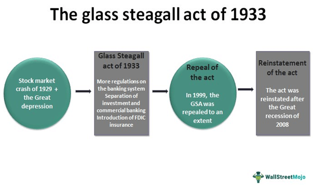

## Table of Contents

## What was the Glass-Steagall Act?

The Glass-Steagall Act was a law passed in the United States in 1933. It was created to help fix problems in the banking system after the stock market crash of 1929. The main goal of the act was to separate commercial banks from investment banks. Commercial banks are the ones people use every day for things like saving money and getting loans. Investment banks, on the other hand, deal with risky activities like buying and selling stocks. The act said that these two types of banks could not be part of the same company. This was done to protect people's money and make the banking system safer.

The Glass-Steagall Act worked well for many years. It helped to prevent banks from taking too many risks with people's money. However, over time, some people thought the rules were too strict. In 1999, a new law called the Gramm-Leach-Bliley Act was passed. This new law got rid of the main parts of the Glass-Steagall Act. It allowed commercial banks and investment banks to be part of the same company again. Many people think that this change helped cause the big financial crisis in 2008.

## When was the Glass-Steagall Act repealed?

The Glass-Steagall Act was repealed in 1999. This happened when a new law called the Gramm-Leach-Bliley Act was passed. The Gramm-Leach-Bliley Act allowed banks to mix their commercial and investment activities again, which the Glass-Steagall Act had separated.

Before the repeal, the Glass-Steagall Act had been in place since 1933. It was created to protect people's money by keeping commercial banking separate from the riskier activities of investment banking. After the repeal, many people worried that banks might take too many risks, and some believe this contributed to the financial crisis in 2008.

## What were the main reasons for repealing the Glass-Steagall Act?

The main reasons for repealing the Glass-Steagall Act were related to changes in the banking industry and economic pressures. Over the years, banks wanted more freedom to offer a wider range of financial services. They argued that the strict rules of the Glass-Steagall Act were holding them back from competing with other financial institutions around the world. Banks wanted to be able to mix commercial banking, like taking deposits and making loans, with investment banking, like trading stocks and bonds. They believed this would help them grow and make more money.

Another reason was the influence of powerful people in the banking and political worlds. Many big banks and financial companies lobbied, or tried to influence, lawmakers to change the rules. They spent a lot of money and used their power to push for the repeal. Politicians, including President Bill Clinton, supported the repeal because they thought it would help the economy grow. In the end, these pressures led to the passing of the Gramm-Leach-Bliley Act in 1999, which repealed the main parts of the Glass-Steagall Act and allowed banks to combine their commercial and investment activities again.

## How did the repeal of the Glass-Steagall Act change the banking industry?

The repeal of the Glass-Steagall Act in 1999 changed the banking industry a lot. Before the repeal, banks had to keep their everyday banking activities, like taking deposits and giving loans, separate from their riskier activities, like trading stocks and bonds. After the repeal, banks could do both types of activities under the same company. This meant banks could grow bigger and offer more services to their customers. They could make more money by taking more risks, but it also meant that if something went wrong, the whole bank could be in trouble.

The change also made the banking industry more competitive. Banks could now compete with other financial companies that were not limited by the old rules. They started to create new financial products and services that mixed banking and investing. This helped some banks grow very big and powerful. But it also made the financial system more complicated and risky. Many people believe that the repeal of the Glass-Steagall Act played a role in the big financial crisis in 2008, because banks were taking too many risks with people's money.

## What is the connection between the repeal of the Glass-Steagall Act and the 2008 financial crisis?

The repeal of the Glass-Steagall Act in 1999 allowed banks to mix their everyday banking activities with riskier investment activities. Before the repeal, banks had to keep these activities separate to protect people's money. After the repeal, banks could do both under the same company. This meant they could take more risks to make more money. They started to create new financial products and services that mixed banking and investing. This made the financial system more complicated and risky.

Many people believe that the repeal of the Glass-Steagall Act played a big role in the 2008 financial crisis. Banks were taking too many risks with people's money. When the housing market crashed, many banks had invested heavily in risky mortgage-backed securities. These investments lost a lot of value, and some big banks failed. This caused a huge financial crisis that affected the whole world. If the Glass-Steagall Act had still been in place, banks might not have been able to take such big risks, and the crisis might have been less severe.

## How did the repeal allow banks to engage in riskier activities?

The repeal of the Glass-Steagall Act let banks mix their everyday banking activities with riskier investment activities. Before the repeal, banks had to keep these two types of activities separate. This was to protect people's money by stopping banks from taking big risks. After the repeal, banks could do both under the same company. This meant they could take more risks to make more money.

Because of the repeal, banks started to create new financial products and services that mixed banking and investing. They invested in things like mortgage-backed securities, which were very risky. If these investments did well, banks could make a lot of money. But if they did badly, the banks could lose a lot of money too. This made the financial system more complicated and risky. Many people think this helped cause the big financial crisis in 2008.

## What role did the merging of commercial and investment banking play in the financial crisis?

The merging of commercial and investment banking played a big role in the 2008 financial crisis. Before the Glass-Steagall Act was repealed, banks had to keep their everyday banking activities, like taking deposits and giving loans, separate from their riskier investment activities, like trading stocks and bonds. This was to protect people's money. But after the repeal, banks could do both under the same company. This meant they could take more risks to make more money. They started to invest in risky things like mortgage-backed securities, which are loans bundled together and sold as investments.

When the housing market crashed, these risky investments lost a lot of value. Banks that had invested heavily in them lost a lot of money too. Because banks were now doing both commercial and investment banking, the losses from the risky investments hurt their everyday banking activities. This caused some big banks to fail, which led to the 2008 financial crisis. If the Glass-Steagall Act had still been in place, banks might not have been able to take such big risks, and the crisis might have been less severe.

## Can you explain the concept of 'too big to fail' in relation to the repeal of the Glass-Steagall Act?

The idea of 'too big to fail' means that some banks are so big and important that if they go bankrupt, it could hurt the whole economy. This idea became a big problem after the Glass-Steagall Act was repealed. Before the repeal, banks had to keep their everyday banking separate from their riskier investment activities. But after the repeal, banks could do both under the same company. This let them grow much bigger and take more risks. If a big bank made risky investments and lost a lot of money, it could fail. But because the bank was so big and important, the government might have to step in to save it to stop the economy from crashing.

This is what happened during the 2008 financial crisis. Big banks that had mixed their commercial and investment activities took too many risks and lost a lot of money. When they started to fail, the government had to bail them out to keep the economy from collapsing. This showed how the repeal of the Glass-Steagall Act helped create banks that were 'too big to fail.' If the Glass-Steagall Act had still been in place, banks might not have been able to grow so big and take such big risks, and the crisis might have been less severe.

## What were the specific financial instruments and practices that became more prevalent after the repeal?

After the Glass-Steagall Act was repealed, banks started using more risky financial instruments like mortgage-backed securities and derivatives. Mortgage-backed securities are loans bundled together and sold as investments. They can be very risky because if people can't pay back their loans, the value of the securities goes down. Derivatives are contracts based on the value of something else, like stocks or bonds. They can be used to bet on whether the value of something will go up or down. These instruments let banks take bigger risks to make more money, but they also made the financial system more complicated and dangerous.

Banks also started using more practices like securitization and leverage. Securitization is when banks turn loans into securities that they can sell to investors. This lets banks make money from loans without having to keep them on their [books](/wiki/algo-trading-books). Leverage is when banks borrow money to make bigger investments. This can make their profits bigger, but it also makes their losses bigger if things go wrong. These practices became more common after the repeal because banks could mix their everyday banking with their riskier investment activities. This helped lead to the big financial crisis in 2008.

## How did the regulatory environment change after the repeal, and what impact did this have on financial stability?

After the Glass-Steagall Act was repealed, the rules that banks had to follow changed a lot. Before, banks had to keep their everyday banking separate from their riskier investment activities. But after the repeal, banks could do both under the same company. This meant they could take more risks to make more money. The new rules under the Gramm-Leach-Bliley Act were less strict. Banks could create new financial products and services that mixed banking and investing. They could also grow bigger and become more powerful. This made the financial system more complicated and harder for regulators to watch over.

The changes in the regulatory environment had a big impact on financial stability. Because banks could take more risks, they started to invest in things like mortgage-backed securities and derivatives. These were very risky, but they could make banks a lot of money if things went well. But when the housing market crashed, these investments lost a lot of value. Banks that had taken big risks lost a lot of money too. This led to the 2008 financial crisis. If the old rules had still been in place, banks might not have been able to take such big risks, and the crisis might have been less severe. The less strict rules after the repeal made the financial system more unstable and harder to control.

## What are the arguments for and against reinstating the Glass-Steagall Act?

People who want to bring back the Glass-Steagall Act say it would make the banking system safer. They think that separating everyday banking from riskier investments would protect people's money. They argue that without this separation, banks can take too many risks, like they did before the 2008 financial crisis. They also believe that bringing back the Glass-Steagall Act would stop banks from becoming too big to fail. This means the government wouldn't have to bail out big banks if they get into trouble, which costs taxpayers a lot of money.

On the other hand, people who are against reinstating the Glass-Steagall Act say it would hurt the economy. They argue that the rules are too strict and would stop banks from offering a wide range of services. They think this would make it harder for banks to compete with other financial companies around the world. They also believe that bringing back the Glass-Steagall Act wouldn't fix all the problems that led to the 2008 financial crisis. They say that better rules and more careful watching over banks would be a better way to keep the financial system safe.

## How have other countries' banking regulations compared to the U.S. post-repeal, and what lessons can be learned?

After the U.S. repealed the Glass-Steagall Act, other countries had different rules for their banks. Some countries, like Canada and Germany, kept strict rules that separated everyday banking from riskier investments. These countries did not have as big a financial crisis as the U.S. in 2008. Canada, for example, had rules that made it hard for banks to take big risks with people's money. This helped keep their banks safe and stable. Germany also had rules that separated different types of banking activities, which helped protect their financial system.

Other countries, like the UK, had rules that were more like the U.S. after the repeal. The UK let banks mix their everyday banking with riskier investments, just like the U.S. did. This made their banks take big risks, and when the financial crisis hit in 2008, some big UK banks got into trouble. The UK had to spend a lot of money to save these banks. This showed that letting banks mix different activities can be very risky and can hurt the whole economy.

From these examples, we can learn that strict rules separating everyday banking from riskier investments can help keep the financial system safe. Countries that kept these rules did better during the 2008 financial crisis. On the other hand, countries that let banks mix their activities, like the U.S. and the UK, had bigger problems. This suggests that bringing back rules like the Glass-Steagall Act might help protect the economy from big financial crises.

## References & Further Reading

[1]: ["The Economist Guide to Financial Markets (6th Ed): Why they exist and how they work"](https://books.google.com/books/about/The_Economist_Guide_to_Financial_Markets.html?id=9WIHAQAAQBAJ) by Marc Levinson

[2]: ["Too Big to Fail: The Inside Story of How Wall Street and Washington Fought to Save the Financial System—and Themselves"](https://www.amazon.com/Too-Big-Fail-Washington-System/dp/0143118242) by Andrew Ross Sorkin

[3]: ["The Big Short: Inside the Doomsday Machine"](https://en.wikipedia.org/wiki/The_Big_Short) by Michael Lewis

[4]: ["All the Devils Are Here: The Hidden History of the Financial Crisis"](https://en.wikipedia.org/wiki/All_the_Devils_Are_Here) by Bethany McLean and Joe Nocera

[5]: ["Fool's Gold: The Inside Story of J.P. Morgan and How Wall St. Greed Corrupted Its Bold Dream and Created a Financial Catastrophe"](http://www.web.lancaster.edu.gh/textbooks/Resources/HomePages/Fools_Gold_The_Inside_Story_Of_J_P_Morgan_And_How_Wall_St_Greed_Corrupted_Its_Bold_Dream_And_Created_A_Financial_Catastrophe.pdf) by Gillian Tett

[6]: ["The Road to Ruin: The Global Elites' Secret Plan for the Next Financial Crisis"](https://archive.org/details/roadtoruinglobal0000rick) by James Rickards

[7]: ["Flash Boys: A Wall Street Revolt"](https://en.wikipedia.org/wiki/Flash_Boys) by Michael Lewis