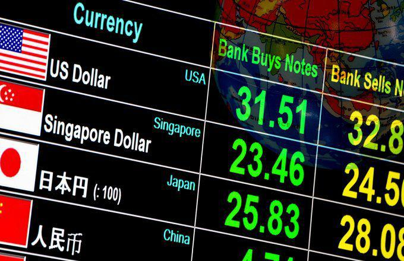

## Table of Contents

## What is the Forex market and how does it function?

The Forex market, also known as the foreign exchange market, is where people and businesses trade different currencies. It's the biggest financial market in the world, with a lot of money changing hands every day. People use the Forex market to buy one currency with another, usually to do business in another country, or to invest and make money from changes in currency values.

The Forex market works all the time, 24 hours a day during the week, because it's spread out all over the world. You can trade currencies in different places like London, New York, Tokyo, and Sydney. The price of currencies goes up and down because of things like how well a country's economy is doing, interest rates, and even big news events. Traders use these changes to decide when to buy or sell currencies, hoping to make a profit.

## How do global events influence currency values?

Global events can have a big impact on currency values. When something important happens in the world, like a war, a big election, or a natural disaster, it can change how people feel about a country's money. For example, if there's a war in a country, people might think that country's money is riskier to hold, so they sell it, and its value goes down. On the other hand, if a country does well in something, like hosting a successful big event, people might want to buy more of its currency, making its value go up.

Economic news also plays a big role. If a country's economy is doing well, with lots of jobs and growing businesses, its currency usually gets stronger because people want to invest there. But if the economy is doing badly, with high unemployment or a big debt, the currency might weaken because people lose confidence in it. Things like changes in interest rates by a country's central bank can also make people buy or sell that country's currency, affecting its value.

## Can you explain the relationship between economic indicators and Forex market movements?

Economic indicators are like health check-ups for a country's economy. They tell us how well a country is doing with things like jobs, prices, and how much stuff people are buying. When these indicators come out, they can make the Forex market move a lot. For example, if a report shows that more people are getting jobs, it might mean the country's economy is getting stronger. People might then want to buy that country's currency, making its value go up in the Forex market.

On the other hand, if an economic indicator shows bad news, like prices going up a lot (inflation), people might think the country's money will be worth less in the future. They might sell that currency, causing its value to drop in the Forex market. Things like interest rates set by a country's central bank are also important. If interest rates go up, it can make the currency more attractive because people can earn more from saving in that currency, which might make its value go up. So, economic indicators can really shake things up in the Forex market, making currencies move in different directions based on the news they bring.

## What role do geopolitical events play in Forex market volatility?

Geopolitical events, like wars or big elections, can make the Forex market go up and down a lot. When something big happens, it can change how safe people feel about a country's money. For example, if there's a war, people might think it's risky to hold onto that country's currency, so they sell it. This can make the currency's value drop quickly. On the other hand, if a country solves a big problem, like ending a conflict, people might feel better about its money and want to buy it, pushing its value up.

These events can also affect how much people trust a country's economy. If there's a lot of uncertainty, like during a big election, people might not want to invest in that country until they know what will happen. This uncertainty can make the Forex market very jumpy, with currency values changing a lot in a short time. So, geopolitical events are a big reason why the Forex market can be so unpredictable and volatile.

## How do natural disasters impact Forex trading?

Natural disasters like earthquakes, hurricanes, or floods can shake up the Forex market. When a big disaster hits a country, it can hurt its economy a lot. Businesses might have to close, people might lose their jobs, and it can take a long time to fix everything. This makes people worry about the country's money, so they might sell it to buy a safer currency. This selling can make the value of the affected country's currency drop quickly in the Forex market.

But it's not just about the immediate damage. After a disaster, a country might need to spend a lot of money to rebuild. This can lead to more borrowing or printing more money, which can make the currency weaker over time. Also, if the disaster affects important things like oil or food production, it can change prices around the world, which can make other currencies move too. So, natural disasters can cause a lot of ups and downs in the Forex market, both right away and in the longer term.

## What are the effects of pandemics on currency exchange rates?

Pandemics, like the big health crises we sometimes see, can really shake up the Forex market. When a big sickness spreads, it can hurt a country's economy. People might not go out to work or spend money like they used to, and businesses might have to close. This can make people worried about that country's money, so they might sell it to buy a safer currency. This selling can make the value of the affected country's currency drop fast in the Forex market.

But it's not just about the short-term effects. After a pandemic, a country might need to spend a lot of money to help its people and businesses recover. This can lead to more borrowing or printing more money, which can make the currency weaker over time. Also, if the pandemic affects important things like medicine or food supplies, it can change prices around the world, which can make other currencies move too. So, pandemics can cause a lot of ups and downs in the Forex market, both right away and in the longer term.

## How do central bank policies respond to global events, and what are the Forex market implications?

Central banks watch what's happening around the world closely because global events can shake up their country's economy. When something big happens, like a war or a big sickness spreading, central banks might change their policies to help their country. They could lower interest rates to make it cheaper for people and businesses to borrow money, hoping to keep the economy going. Or they might do the opposite and raise rates if they think the economy is getting too hot and prices are going up too fast. These changes in policy are like the central bank trying to steer the economy through rough waters caused by global events.

When central banks change their policies, it can make the Forex market move a lot. If a central bank lowers interest rates, it might make people think that country's currency will be worth less in the future, so they might sell it. This can make the currency's value drop in the Forex market. On the other hand, if a central bank raises rates, it might make the currency more attractive because people can earn more from saving in it, which might push its value up. So, the way central banks respond to global events can lead to big changes in currency values, making the Forex market go up and down.

## Can you discuss the impact of trade agreements and tariffs on Forex markets?

Trade agreements and tariffs can really shake up the Forex market. When countries agree to trade more with each other, it's usually good for their economies. This can make people want to buy the currencies of those countries because they think the economies will do well. For example, if two countries sign a deal to trade more cars, it might make their currencies stronger because more business means more money moving around. On the other hand, if a country puts tariffs on another country's goods, it can make trade harder and hurt the economy. This might make people sell that country's currency, making its value drop in the Forex market.

But it's not just about the immediate effects. Over time, trade agreements can lead to more stable and predictable trade, which can make people feel more confident about a country's currency. This can help keep the currency's value steady or even make it stronger. Tariffs, though, can lead to trade wars, where countries keep putting up barriers against each other's goods. This can make the Forex market more unpredictable and volatile because people aren't sure what will happen next. So, trade agreements and tariffs can have big and lasting effects on currency values in the Forex market.

## How do investors use global event analysis to predict Forex market trends?

Investors look at global events to guess where the Forex market might go next. They watch things like wars, big elections, and natural disasters because these can change how people feel about a country's money. For example, if there's a war, investors might think it's risky to hold that country's currency, so they might sell it. This can make the currency's value drop. On the other hand, if a country solves a big problem, like ending a conflict, investors might feel better about its money and want to buy it, which can push its value up. By keeping an eye on these events, investors try to predict which way the Forex market will move.

Economic news is also really important for investors. They pay attention to reports about jobs, prices, and how much stuff people are buying because these can show how well a country's economy is doing. If a report shows good news, like more people getting jobs, investors might want to buy that country's currency, thinking its value will go up. But if the news is bad, like prices going up a lot, they might sell the currency, thinking its value will drop. By analyzing these economic indicators, investors try to stay one step ahead and make smart choices in the Forex market.

## What advanced strategies can traders employ to mitigate risks associated with global events?

Traders can use a few smart tricks to keep their money safe when big things happen around the world. One good idea is to spread out their money, which means not putting all their cash into one currency. If they have money in different currencies, a bad event in one country won't hurt them as much. Another trick is to use stop-loss orders. These are like safety nets that automatically sell a currency if its value drops too much, so traders don't lose too much money. Also, traders can use options and futures to protect themselves. These are like insurance policies for their money, helping them manage the risk of sudden changes in currency values.

Another strategy is to keep an eye on the news and understand how different events might affect the economy. By staying informed, traders can make better guesses about what might happen next and adjust their plans accordingly. They can also use technical analysis, which is like looking at charts and patterns to see where the market might be heading. By combining this with their understanding of global events, traders can make smarter decisions and lower their risks. So, by spreading out their money, using safety nets, and staying informed, traders can better handle the ups and downs caused by global events.

## How does the Forex market react differently to short-term versus long-term global events?

The Forex market reacts differently to short-term and long-term global events. When something big happens suddenly, like a natural disaster or a surprise election result, it can make the market go up and down a lot right away. People might quickly sell a country's currency if they think it's risky because of the event, making its value drop fast. But these quick changes can also calm down pretty soon if the event doesn't have a lasting impact on the economy. Traders often use stop-loss orders and other quick moves to protect their money during these short-term shocks.

On the other hand, long-term global events, like ongoing wars or pandemics, can have a bigger and longer-lasting effect on the Forex market. These events can hurt a country's economy over time, making people lose trust in its currency. As a result, the currency's value might keep going down slowly as the event continues. Central banks might change their policies, like lowering interest rates, to help the economy, but these changes can also make the currency weaker in the long run. Traders need to watch these long-term events closely and adjust their strategies to manage the risks over time.

## What are some historical examples where global events significantly influenced the Forex market?

One big example is the 2008 financial crisis. It started in the United States but quickly spread around the world. Banks were in trouble, and people were worried about losing their money. This made the value of the U.S. dollar go down a lot because people didn't trust it as much. But then, as things got worse, people started to see the U.S. dollar as a safe place to keep their money, so its value went back up. This shows how a big global event can make the Forex market go up and down a lot in a short time.

Another example is Brexit, when the United Kingdom decided to leave the European Union. This decision caused a lot of uncertainty about the UK's economy. Right after the vote in 2016, the British pound dropped a lot because people were worried about what would happen next. Over time, as the UK worked out the details of leaving the EU, the pound kept going up and down based on new news and agreements. This shows how long-term global events can keep affecting the Forex market for a long time.

The Covid-19 pandemic is another clear example. When the virus started spreading in early 2020, it caused a lot of fear and uncertainty. Countries closed their borders, businesses shut down, and people stopped spending money. This made many currencies drop in value, especially in countries hit hard by the virus. Central banks around the world tried to help by lowering interest rates and printing more money, but this also made some currencies weaker over time. The Forex market was very volatile during the pandemic, showing how a global health crisis can shake up currency values.

## What are the advantages of algorithmic trading in Forex?

Algorithmic trading has become a transformative force in the forex market, offering notable advantages in terms of trading efficiency and cost reduction. By leveraging computational algorithms, traders can automate decision-making processes, leading to optimized trade execution and substantial savings on transaction costs.

### Trading Efficiency and Cost Reduction

Algorithmic trading enhances efficiency by executing trades at optimal prices, minimizing manual intervention. This automation reduces human errors and emotional biases, leading to consistent and data-driven trading decisions. Cost efficiency is achieved through reduced transaction fees, as algorithms can break down large orders into smaller ones, minimizing market impact and slippage.

### Speed and Accuracy in Trade Execution

One of the primary advantages of algorithmic trading is its unparalleled speed. Algorithms can process large volumes of data at high speeds, allowing for the rapid identification of trading signals and swift execution. This speed not only improves the accuracy of trade entries and exits but also enables traders to capture fleeting market opportunities that manual traders might miss. For instance, algorithms can analyze price movements and execute trades within milliseconds, capitalizing on even the smallest market fluctuations.

### Arbitrage Opportunities

Algorithmic trading significantly enhances the ability to identify and exploit [arbitrage](/wiki/arbitrage) opportunities. Arbitrage involves taking advantage of price discrepancies of identical or similar financial instruments across different markets or forms. Due to the high-speed data processing capabilities of algorithms, traders can quickly detect and act on these discrepancies before they disappear.

For instance, consider two currency pairs, EUR/USD and USD/JPY, and an indirect cross-rate for EUR/JPY derived from them. If the directly quoted EUR/JPY rate differs from its implied rate, an arbitrage opportunity arises:

$$
\text{Arbitrage Opportunity} = (\text{EUR/USD} \times \text{USD/JPY}) - \text{Direct EUR/JPY Quote}
$$

Algorithmic systems can instantly calculate and exploit such opportunities across multiple platforms simultaneously, ensuring profit from minor price differences without significant risk. This functionality is critical in high-frequency trading ([HFT](/wiki/high-frequency-trading-strategies)), where the rapid turnover of positions relies heavily on micro-arbitrage strategies.

By improving efficiency, accuracy, and profitability, algorithmic trading significantly enhances the operational workflow in the forex market. Through automation and computation, traders can meet the demands of a fast-paced and ever-evolving financial environment, maintaining a competitive edge.

## References & Further Reading

[1]: ["Triennial Central Bank Survey"](https://www.bis.org/statistics/rpfx22.htm), Bank for International Settlements, 2019.

[2]: Lopez de Prado, M. (2018). ["Advances in Financial Machine Learning."](https://www.amazon.com/Advances-Financial-Machine-Learning-Marcos/dp/1119482089) Wiley.

[3]: Aronson, D. (2006). ["Evidence-Based Technical Analysis: Applying the Scientific Method and Statistical Inference to Trading Signals."](https://www.amazon.com/Evidence-Based-Technical-Analysis-Scientific-Statistical/dp/0470008741) Wiley.

[4]: Jansen, S. (2020). ["Machine Learning for Algorithmic Trading."](https://github.com/stefan-jansen/machine-learning-for-trading) Packt Publishing.

[5]: Chan, E. P. (2008). ["Quantitative Trading: How to Build Your Own Algorithmic Trading Business."](https://github.com/ftvision/quant_trading_echan_book) Wiley.

[6]: Fabozzi, F. J., Focardi, S. M., & Kolm, P. N. (2006). ["Financial Modeling of the Equity Market: From CAPM to Cointegration."](https://onlinelibrary.wiley.com/doi/book/10.1002/9781119201236) Wiley.

[7]: Aldridge, I. (2013). ["High-Frequency Trading: A Practical Guide to Algorithmic Strategies and Trading Systems."](https://www.ahmetbeyefendi.com/wp-content/uploads/2020/07/High-Frequency-Trading-Irene-Aldridge.pdf) Wiley.

[8]: Leinweber, D. (2009). ["Nerds on Wall Street: Math, Machines and Wired Markets."](https://archive.org/details/nerdsonwallstree0000lein) Wiley.