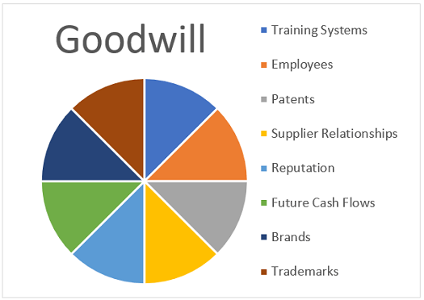

## Table of Contents

## What is goodwill in the context of business?

Goodwill in business is the value of a company's reputation and customer relationships that goes beyond its physical assets and financial numbers. It's like an invisible asset that makes a business more valuable because people trust and like the company. Goodwill can come from things like a strong brand name, loyal customers, good relationships with suppliers, and a positive public image.

When a company is sold, goodwill is often part of the price. If a business is worth more than the value of its buildings, equipment, and money in the bank, that extra value is goodwill. For example, if a company is sold for $1 million, but its tangible assets are only worth $700,000, the $300,000 difference is considered goodwill. This shows how important a company's reputation and relationships can be in adding value to the business.

## How is goodwill calculated in a company's financial statements?

Goodwill is calculated when a company buys another company for more money than the value of its physical assets like buildings and equipment. The extra money paid is called goodwill. For example, if Company A buys Company B for $1 million, but Company B's tangible assets are worth $700,000, the goodwill is $300,000. This $300,000 represents the value of Company B's reputation, customer loyalty, and other intangible benefits.

In a company's financial statements, goodwill is listed as an asset on the balance sheet. It is not something you can touch, but it is still valuable. Companies have to check the value of their goodwill every year to make sure it hasn't gone down. If the goodwill is worth less than what was paid for it, the company has to write down the value, which means they have to show a loss on their financial statements. This helps keep the financial statements honest and accurate.

## Why is goodwill important in company valuation?

Goodwill is important in company valuation because it shows the value of things you can't touch, like a company's reputation and customer loyalty. When a company is sold, the buyer often pays more than the value of the buildings, machines, and money the company has. This extra amount is called goodwill. It shows how much people trust and like the company, which can be very valuable.

For example, if a famous brand like Coca-Cola is sold, the buyer would pay a lot more than just the cost of their factories and trucks. They would pay for the Coca-Cola name and the loyal customers who keep buying their drinks. This extra value is goodwill, and it makes the company worth more than just its physical stuff. So, when figuring out how much a company is worth, it's important to include goodwill to get the full picture.

## What are the different types of goodwill?

There are two main types of goodwill: purchased goodwill and inherent goodwill. Purchased goodwill happens when one company buys another company for more money than the value of its buildings, machines, and other things you can touch. The extra money paid is called purchased goodwill. It shows how much the buyer thinks the company's reputation, customer loyalty, and other things you can't touch are worth.

Inherent goodwill, on the other hand, is the value that a company builds up over time by itself. It's not bought from another company. This type of goodwill comes from things like a strong brand name, happy customers, and good relationships with suppliers. Inherent goodwill is not shown on the company's financial statements because it's hard to put a number on it, but it still makes the company more valuable.

Both types of goodwill are important because they show how much a company is worth beyond its physical stuff. Purchased goodwill is easier to see because it's part of a company sale, while inherent goodwill is more about the company's day-to-day work and reputation. Together, they help show the full value of a business.

## How does goodwill affect a company's balance sheet?

Goodwill affects a company's balance sheet by showing up as an asset. When a company buys another company for more than the value of its buildings and machines, the extra money paid is called goodwill. This goodwill is listed on the balance sheet as an intangible asset, which means it's something valuable that you can't touch. It shows how much the buyer thinks the company's reputation and customer loyalty are worth.

Every year, the company has to check if the goodwill is still worth what they paid for it. If the goodwill is worth less, the company has to show a loss on their financial statements. This is called a goodwill impairment. It makes the company's total assets go down on the balance sheet. So, goodwill can make a company look more valuable, but it also needs to be checked regularly to make sure it's still worth what was paid.

## Can goodwill be amortized, and if so, under what conditions?

Goodwill used to be something companies could spread out over time, called amortization, but that changed in the United States with a new rule in 2001. Now, under U.S. accounting rules, goodwill can't be amortized. Instead, companies have to check the value of their goodwill every year to see if it's still worth what they paid for it. If it's not, they have to show a loss, which is called an impairment.

In some other countries, like those following International Financial Reporting Standards (IFRS), goodwill still can be amortized. But it's not common. If a company chooses to amortize goodwill under IFRS, they can spread out the cost over a period of time, usually up to 10 years, unless they can prove a longer period is more accurate. So, whether goodwill can be amortized depends on which accounting rules the company follows.

## What is the impact of goodwill impairment on a company's valuation?

When a company finds out that the goodwill on its balance sheet is worth less than what they paid for it, they have to show a loss. This is called goodwill impairment. It means the company's total assets go down because the value of the goodwill has dropped. When this happens, it can make the company look less valuable to investors and other people who are looking at how much the company is worth.

Goodwill impairment can affect a company's valuation by showing that the company's reputation or customer loyalty might not be as strong as people thought. If investors see a big impairment, they might think the company is not doing as well and decide to sell their shares, which can make the stock price go down. So, goodwill impairment can lower how much people think the company is worth because it shows that some of the value they thought was there is actually gone.

## How do investors and analysts assess the value of goodwill?

Investors and analysts look at goodwill to understand how much a company's reputation and customer loyalty are worth. When a company buys another company for more than its buildings and machines, the extra money paid is called goodwill. Investors want to know if this extra money was a good investment. They look at things like how well the company is doing after the purchase, if the brand name is still strong, and if customers are still loyal. They also check if the goodwill is still worth what was paid for it by comparing it to the company's overall performance and market conditions.

If investors and analysts think the goodwill is overvalued, they might worry that the company paid too much for the other company. This can make them think the company is worth less than what the balance sheet says. On the other hand, if they believe the goodwill is still valuable, it can make the company look more attractive. They often use financial ratios and market analysis to help them decide if the goodwill is a good or bad sign for the company's future.

## What role does goodwill play in mergers and acquisitions?

Goodwill plays a big role in mergers and acquisitions because it shows the value of things you can't touch, like a company's reputation and customer loyalty. When one company buys another, it often pays more than just the value of the buildings and machines. The extra money paid is called goodwill. This extra money shows how much the buyer thinks the company's brand name, happy customers, and other invisible benefits are worth. For example, if a company buys a famous brand like Nike, it would pay a lot more than just the cost of Nike's factories and stores because the Nike name and loyal customers are very valuable.

After the merger or acquisition, the buyer has to put the goodwill on its balance sheet as an intangible asset. This means the buyer needs to check every year if the goodwill is still worth what they paid for it. If the goodwill is worth less, the buyer has to show a loss on their financial statements, which is called goodwill impairment. This can affect how investors see the company's value. If the goodwill stays valuable, it can make the company look good to investors and show that the merger or acquisition was a smart move.

## How does the treatment of goodwill differ under various accounting standards (e.g., GAAP vs. IFRS)?

The way companies handle goodwill on their financial statements can be different depending on whether they follow U.S. Generally Accepted Accounting Principles (GAAP) or International Financial Reporting Standards (IFRS). Under U.S. GAAP, goodwill cannot be spread out over time, which is called amortization. Instead, companies have to check the value of their goodwill every year to see if it's still worth what they paid for it. If it's not, they have to show a loss, which is called an impairment. This means the value of the goodwill goes down on the balance sheet, and it can make the company look less valuable.

On the other hand, under IFRS, companies have a choice. They can either check the value of goodwill every year like in U.S. GAAP, or they can choose to amortize it. If they decide to amortize, they can spread out the cost of the goodwill over a period of time, usually up to 10 years, unless they can show that a longer time is more accurate. This means that under IFRS, companies can slowly reduce the value of goodwill on their balance sheet over time, which can make their financial statements look different from those following U.S. GAAP.

## What are the potential risks associated with high levels of goodwill on a company's books?

High levels of goodwill on a company's [books](/wiki/algo-trading-books) can be risky because it might mean the company paid too much for another company. If the goodwill is too high, it could make the company look more valuable than it really is. If the company's performance doesn't match the high value of the goodwill, investors might start to worry. They might think the company made a bad investment, which can make the stock price go down. This can also make it harder for the company to get loans or attract new investors because people might not trust the company's financial health.

Another risk is that if the value of the goodwill goes down, the company has to show a loss on its financial statements. This is called goodwill impairment. When this happens, it can make the company's total assets go down, which can hurt its balance sheet. If investors see a big impairment, they might think the company is not doing well and decide to sell their shares. This can lower the company's stock price and make it look less valuable. So, having a lot of goodwill on the books can be risky if it doesn't match the company's real value and performance.

## How can strategic management of goodwill enhance a company's market value?

Strategic management of goodwill can help a company's market value by making sure the company's reputation and customer loyalty are strong. When a company buys another company, it often pays more than just the value of the buildings and machines. This extra money is called goodwill, and it shows how much the buyer thinks the company's brand name and happy customers are worth. If the company keeps the goodwill valuable by taking good care of its brand and customers, it can make the company look more attractive to investors. This can make the stock price go up and make the company worth more in the market.

Goodwill can also help in mergers and acquisitions. When a company wants to buy another company, it looks at how much goodwill the other company has. If the goodwill is high and the company manages it well, it can make the merger or acquisition more successful. After the deal, if the goodwill stays valuable, it can show investors that the company made a smart move. This can make people trust the company more and be willing to pay more for its stock, which can increase the company's market value. So, taking good care of goodwill can really help a company's value in the market.

## What is the role of goodwill in company valuation?

Goodwill in company valuation represents the added value attributed to factors beyond a company's tangible assets. These factors typically include brand reputation, customer relationships, and intellectual property, which collectively enhance a company's perceived worth in the market. 

Valuing goodwill is inherently challenging due to its intangible nature. Unlike physical assets, which can be appraised based on market prices, goodwill must be calculated through a different approach. This calculation typically occurs during business acquisitions, where goodwill is determined as the excess of the purchase price over the fair market value of the company's identifiable net assets. This is expressed by the formula:

$$
\text{Goodwill} = \text{Purchase Price} - (\text{Fair Market Value of Assets} - \text{Liabilities})
$$

Here, the fair market value encompasses all identifiable assets and liabilities, focusing on tangible and easily quantifiable elements. 

Goodwill plays a crucial role in company valuation as it signifies a company's potential for future [earning](/wiki/earning-announcement), a component often stemming from non-physical attributes such as customer loyalty and the strength of a brand. These factors can significantly influence market position, providing a competitive edge and signaling long-term profitability. Goodwill, thus, is a pivotal element in the overall assessment of a company's worth, providing insights into the prospects of the business beyond its current financial statements.

## What are the challenges in goodwill valuation?

Valuing goodwill presents significant challenges due to its inherent subjectivity and intangible nature. It's difficult to pinpoint the exact worth of goodwill as it's influenced by various factors beyond numerical financial metrics. Crucially, market conditions and brand perception play pivotal roles in shaping goodwill's valuation. For instance, a reputable brand name might hold significant goodwill value during favorable market conditions, but the same value could decline if market sentiments shift adversely.

The process of assessing goodwill typically necessitates expert judgment, leveraging a combination of methodologies. Two predominant approaches are the income approach and the market approach. The income approach focuses on projecting future earnings attributable to goodwill, often utilizing discounted cash flow analysis. Here, the formula used might resemble the following:

$$
\text{Goodwill Value} = \sum \left( \frac{\text{Projected Future Earnings}}{ (1 + \text{Discount Rate})^n} \right)
$$

where $n$ denotes the number of years projected.

The market approach, alternatively, compares the target company's goodwill with similar companies in the same industry. This comparability is often achieved via market multiples of similar transactions, such as price-to-earnings ratios that account for intangible benefits like customer loyalty inherent in goodwill.

An additional challenge arises from the impairment of goodwill, which can necessitate financial statement adjustments. Goodwill impairment occurs when the carrying amount of goodwill exceeds its recoverable amount, calling for a write-down to reflect its diminished value accurately. This practice is crucial because substantial impairments can affect a company's reported financial health, impacting investor perceptions and stock market situations.

In accounting standards such as International Financial Reporting Standards (IFRS) and Generally Accepted Accounting Principles (GAAP), goodwill impairment tests are mandatory annually or more frequently if certain indications suggest potential impairment. This rigorous scrutiny ensures that financial statements accurately represent a company's asset value, but it also introduces complexity and necessitates judgment and precision to execute appropriately. Hence, accurately determining goodwill's current value amid various changing factors remains a substantial challenge for financial analysts and corporate accountants.

## What is the impact of algo trading on company valuation?

Algorithmic trading, often abbreviated as algo trading, relies on computerized algorithms to execute trades at speeds and volumes that far surpass those possible through manual trading. These algorithms are programmed with specific rules regarding timing, price, and quantity, ensuring that trades occur efficiently and optimally.

The advent of algo trading has profoundly impacted company valuation, primarily through its influence on stock prices and market [liquidity](/wiki/liquidity-risk-premium). Market liquidity refers to the ease with which assets can be bought or sold without causing drastic changes in the asset's price. Increased liquidity, facilitated by algo trading, typically results in narrower bid-ask spreads and reduced transaction costs, making the market more attractive to investors. This heightened liquidity can lead to higher stock prices since assets are perceived as less risky and more desirable.

Stock prices are critical in determining a company's market value, commonly calculated using the formula:

$$
\text{Market Capitalization} = \text{Stock Price} \times \text{Outstanding Shares}
$$

Algo trading's capability to process vast amounts of data and execute trades at lightning speed can influence stock prices by reacting instantaneously to market news and fluctuations. This ability can lead to more frequent adjustments in a company's market valuation as the trading activities driven by algorithms potentially amplify short-term price movements.

The integration of algorithms into trading strategies also necessitates a thorough understanding of both technical and market environments. Algo trading systems must be designed to process large datasets, identify patterns, and make split-second decisions. Financial professionals implementing these systems often employ [machine learning](/wiki/machine-learning) techniques for predictive analytics, enhancing their capacity to forecast market trends and adapt trading strategies accordingly.

For instance, an example of a simple [algorithmic trading](/wiki/algorithmic-trading) strategy in Python using historical price data might look as follows:

```python
import pandas as pd

# Sample function to generate buy/sell signals based on moving averages
def generate_signals(data, short_window=40, long_window=100):
    signals = pd.DataFrame(index=data.index)
    signals['price'] = data['price']

    # Create short simple moving average
    signals['short_mavg'] = data['price'].rolling(window=short_window, min_periods=1, center=False).mean()

    # Create long simple moving average
    signals['long_mavg'] = data['price'].rolling(window=long_window, min_periods=1, center=False).mean()

    # Create signals
    signals['signal'] = 0.0
    signals['signal'][short_window:] = np.where(signals['short_mavg'][short_window:] > signals['long_mavg'][short_window:], 1.0, 0.0)   

    # Generate trading orders
    signals['positions'] = signals['signal'].diff()

    return signals
```

In this basic model, buy signals are generated when the short-term moving average crosses above the long-term moving average, indicating a potential upward trend. Conversely, a sell signal is generated when the short-term average falls below the long-term average.

The expansion of algo trading continues to push the boundaries of how trading is executed and its subsequent effect on company valuation. As algorithmic techniques evolve, understanding their impact on market dynamics becomes paramount, helping businesses and investors make informed financial decisions in a rapidly changing environment.

## References & Further Reading

[1]: ["The Role of Goodwill in Business Valuation: A Case Study"](https://www.bedestined.com/insights/the-role-of-goodwill-in-business-valuation/) by Bart Clarysse, Mike Wright, and Luc Van Acker, Small Business Economics.

[2]: ["Financial Accounting Theory"](https://corporatefinanceinstitute.com/resources/accounting/financial-accounting-theory/) by William Scott.

[3]: Koumanakos, E., Siriopoulos, C., & Georgopoulos, A. (2005). "Firm Acquisitions, Goodwill and Performance: An Empirical Analysis of Acquisitions in Greece." [Journal of Business Finance & Accounting](https://onlinelibrary.wiley.com/doi/abs/10.1111/j.0306-686X.2005.07169.x).

[4]: Narayan, J. & Singh, M (2012). ["Goodwill Impairment and its Impact on Results of Firms: Evidence from EU Countries."](https://www.sciencedirect.com/science/article/pii/S1755309118300923) International Journal of Accounting & Information Management.

[5]: ["Algorithmic Trading and DMA: An Introduction to Direct Access Trading Strategies"](https://www.amazon.com/Algorithmic-Trading-DMA-introduction-strategies/dp/0956399207) by Barry Johnson.

[6]: ["High-Frequency Trading and Probability Theory"](https://worldscientific.com/worldscibooks/10.1142/9233) by Ionut Florescu.