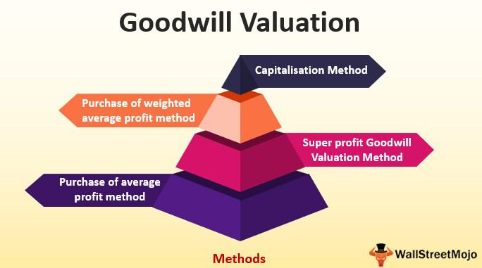

Corporate finance is a critical field that ensures the growth and sustainability of businesses worldwide. Central to this discipline is company valuation, an essential process that determines a business's worth by assessing its assets, liabilities, and potential for future earnings. This valuation process is complex, involving various components that contribute to a company's market value. Among these components, goodwill stands out as an intangible asset that often plays a decisive role in corporate acquisitions and mergers. Goodwill is essentially the premium paid over the book value of a company, justified by factors such as its reputation, brand recognition, and customer loyalty. These elements are not directly quantifiable, yet they significantly enhance a company's value by promising future economic benefits.

Simultaneously, the rise of algorithmic (algo) trading has reshaped how financial markets operate, bringing new dynamics to asset management and trading strategies. Algorithmic trading utilizes automated programs to execute trades at speeds and frequencies that are unimaginable for human traders. This technological advancement enhances market efficiency and liquidity, affecting stock prices and market valuations. Algo trading, therefore, indirectly impacts company valuation by influencing the market conditions under which a company's stock is traded.



This article explores the intersection of company valuation, goodwill, and algo trading within corporate finance. It examines how these elements interact to influence business decisions and financial strategies, ultimately shaping a company's trajectory in an increasingly complex market environment.

## Table of Contents

## Understanding Goodwill in Company Valuation

Goodwill in company valuation represents the added value attributed to factors beyond a company's tangible assets. These factors typically include brand reputation, customer relationships, and intellectual property, which collectively enhance a company's perceived worth in the market. 

Valuing goodwill is inherently challenging due to its intangible nature. Unlike physical assets, which can be appraised based on market prices, goodwill must be calculated through a different approach. This calculation typically occurs during business acquisitions, where goodwill is determined as the excess of the purchase price over the fair market value of the company's identifiable net assets. This is expressed by the formula:

$$
\text{Goodwill} = \text{Purchase Price} - (\text{Fair Market Value of Assets} - \text{Liabilities})
$$

Here, the fair market value encompasses all identifiable assets and liabilities, focusing on tangible and easily quantifiable elements. 

Goodwill plays a crucial role in company valuation as it signifies a company's potential for future [earning](/wiki/earning-announcement), a component often stemming from non-physical attributes such as customer loyalty and the strength of a brand. These factors can significantly influence market position, providing a competitive edge and signaling long-term profitability. Goodwill, thus, is a pivotal element in the overall assessment of a company's worth, providing insights into the prospects of the business beyond its current financial statements.

## The Role of Goodwill in Corporate Finance

Goodwill plays a vital role in corporate finance, particularly noticeable during mergers and acquisitions. It acts as an indicator of a company's strategic advantage and its potential for long-term profitability. In financial terms, goodwill represents the premium paid over the recognizable assets and liabilities of a business. This premium is attributed to key intangible assets such as brand reputation, customer loyalty, and proprietary technologies, which do not explicitly appear on the balance sheet but contribute significantly to future earnings.

The evaluation of goodwill requires a meticulous assessment of these intangible assets to ascertain their effect on a company's future cash flows. This assessment may involve a variety of methods, each geared to provide a detailed understanding of the intangible drivers that [factor](/wiki/factor-investing) into the company's prospective financial performance. For example, the income approach evaluates the present value of expected future cash earnings generated by these intangible assets. Meanwhile, the market approach compares similar transactions in the marketplace to gauge appropriate value.

Goodwill is classified into two main types: purchased and inherent goodwill. Purchased goodwill arises when one company acquires another and pays more than the fair value of its net identifiable assets. This type of goodwill is often seen on the acquiring company's balance sheet post-transaction. It reflects not only the tangible and identifiable intangibles acquired but also the overall potential for revenue growth and strategic market positioning.

Inherent goodwill, on the other hand, is developed internally over time through business operations and exists within a company without purchase. It is not recorded in the financial statements but remains a crucial consideration for stakeholders assessing the company's market value. Both types of goodwill provide insights into a company's value proposition and competitive edge; however, they also pose challenges in valuation due to their inherently intangible nature.

Overall, goodwill functions as a critical component driving company value in corporate finance, especially during strategic business combinations. Properly evaluating it is essential in understanding a company's true worth and potential contributions to the acquirer’s long-term profitability.

## Challenges in Goodwill Valuation

Valuing goodwill presents significant challenges due to its inherent subjectivity and intangible nature. It's difficult to pinpoint the exact worth of goodwill as it's influenced by various factors beyond numerical financial metrics. Crucially, market conditions and brand perception play pivotal roles in shaping goodwill's valuation. For instance, a reputable brand name might hold significant goodwill value during favorable market conditions, but the same value could decline if market sentiments shift adversely.

The process of assessing goodwill typically necessitates expert judgment, leveraging a combination of methodologies. Two predominant approaches are the income approach and the market approach. The income approach focuses on projecting future earnings attributable to goodwill, often utilizing discounted cash flow analysis. Here, the formula used might resemble the following:

$$
\text{Goodwill Value} = \sum \left( \frac{\text{Projected Future Earnings}}{ (1 + \text{Discount Rate})^n} \right)
$$

where $n$ denotes the number of years projected.

The market approach, alternatively, compares the target company's goodwill with similar companies in the same industry. This comparability is often achieved via market multiples of similar transactions, such as price-to-earnings ratios that account for intangible benefits like customer loyalty inherent in goodwill.

An additional challenge arises from the impairment of goodwill, which can necessitate financial statement adjustments. Goodwill impairment occurs when the carrying amount of goodwill exceeds its recoverable amount, calling for a write-down to reflect its diminished value accurately. This practice is crucial because substantial impairments can affect a company's reported financial health, impacting investor perceptions and stock market situations.

In accounting standards such as International Financial Reporting Standards (IFRS) and Generally Accepted Accounting Principles (GAAP), goodwill impairment tests are mandatory annually or more frequently if certain indications suggest potential impairment. This rigorous scrutiny ensures that financial statements accurately represent a company's asset value, but it also introduces complexity and necessitates judgment and precision to execute appropriately. Hence, accurately determining goodwill's current value amid various changing factors remains a substantial challenge for financial analysts and corporate accountants.

## Impact of Algo Trading on Company Valuation

Algorithmic trading, often abbreviated as algo trading, relies on computerized algorithms to execute trades at speeds and volumes that far surpass those possible through manual trading. These algorithms are programmed with specific rules regarding timing, price, and quantity, ensuring that trades occur efficiently and optimally.

The advent of algo trading has profoundly impacted company valuation, primarily through its influence on stock prices and market [liquidity](/wiki/liquidity-risk-premium). Market liquidity refers to the ease with which assets can be bought or sold without causing drastic changes in the asset's price. Increased liquidity, facilitated by algo trading, typically results in narrower bid-ask spreads and reduced transaction costs, making the market more attractive to investors. This heightened liquidity can lead to higher stock prices since assets are perceived as less risky and more desirable.

Stock prices are critical in determining a company's market value, commonly calculated using the formula:

$$
\text{Market Capitalization} = \text{Stock Price} \times \text{Outstanding Shares}
$$

Algo trading's capability to process vast amounts of data and execute trades at lightning speed can influence stock prices by reacting instantaneously to market news and fluctuations. This ability can lead to more frequent adjustments in a company's market valuation as the trading activities driven by algorithms potentially amplify short-term price movements.

The integration of algorithms into trading strategies also necessitates a thorough understanding of both technical and market environments. Algo trading systems must be designed to process large datasets, identify patterns, and make split-second decisions. Financial professionals implementing these systems often employ [machine learning](/wiki/machine-learning) techniques for predictive analytics, enhancing their capacity to forecast market trends and adapt trading strategies accordingly.

For instance, an example of a simple [algorithmic trading](/wiki/algorithmic-trading) strategy in Python using historical price data might look as follows:

```python
import pandas as pd

# Sample function to generate buy/sell signals based on moving averages
def generate_signals(data, short_window=40, long_window=100):
    signals = pd.DataFrame(index=data.index)
    signals['price'] = data['price']

    # Create short simple moving average
    signals['short_mavg'] = data['price'].rolling(window=short_window, min_periods=1, center=False).mean()

    # Create long simple moving average
    signals['long_mavg'] = data['price'].rolling(window=long_window, min_periods=1, center=False).mean()

    # Create signals
    signals['signal'] = 0.0
    signals['signal'][short_window:] = np.where(signals['short_mavg'][short_window:] > signals['long_mavg'][short_window:], 1.0, 0.0)   

    # Generate trading orders
    signals['positions'] = signals['signal'].diff()

    return signals
```

In this basic model, buy signals are generated when the short-term moving average crosses above the long-term moving average, indicating a potential upward trend. Conversely, a sell signal is generated when the short-term average falls below the long-term average.

The expansion of algo trading continues to push the boundaries of how trading is executed and its subsequent effect on company valuation. As algorithmic techniques evolve, understanding their impact on market dynamics becomes paramount, helping businesses and investors make informed financial decisions in a rapidly changing environment.

## Future Trends and Implications

The integration of [artificial intelligence](/wiki/ai-artificial-intelligence) (AI) and machine learning into algorithmic trading is transforming corporate finance, introducing both significant opportunities and complexities. These technologies enhance trading efficiency by analyzing vast datasets to identify trends, optimize strategies, and execute trades in real-time. The ability to process large volumes of data ensures that trading strategies can be adjusted dynamically in response to market changes, potentially increasing profitability and reducing risk.

As financial markets evolve, traditional company valuation methods, including goodwill assessment, must adapt to keep pace with technological advancements. Goodwill, an intangible asset linked to brand reputation and customer loyalty, is traditionally measured by subjective estimation methods. However, AI and machine learning can refine these assessments by utilizing predictive analytics and big data to provide more accurate forecasts of a company's future earnings potential. This innovative approach could mitigate the uncertainty inherent in valuing intangibles, thereby improving investment decision-making.

Understanding the relationship between goodwill and algorithmic trading is increasingly important for crafting successful financial strategies. Algo trading's capacity to influence stock prices and liquidity directly impacts how a company's value is perceived and calculated in the market. Changes in stock prices induced by algorithmic factors can affect market capitalization, necessitating an updated assessment of goodwill in line with these fluctuations.

As these technologies continue to develop, corporate finance professionals must remain informed about AI and machine learning trends to optimize valuation techniques. This is increasingly critical as these advancements could reshape company evaluations, necessitating a new approach to traditional financial principles. Adapting to these changes will likely involve recalibrating existing models to incorporate AI-driven insights, ensuring they remain relevant and accurate.

Overall, the successful integration of AI and machine learning in corporate finance relies on a synergetic understanding of both technological capabilities and traditional financial metrics. The future of company valuation, and by extension corporate finance, will depend on how effectively these elements can be aligned to drive innovation and strategic growth.

## Conclusion

Goodwill and algorithmic trading (algo trading) are pivotal elements in corporate finance that significantly impact company valuation. The precise valuation of goodwill provides essential insights into a firm's potential for future profitability. Goodwill effectively serves as an indicator of intangible assets such as brand strength, customer loyalty, and intellectual property, which collectively enhance a company's earning potential beyond its tangible asset base. A well-assessed goodwill valuation reflects not only the premium investors are willing to pay but also signifies a competitive advantage that is often a critical driver during mergers and acquisitions.

Alongside goodwill, algorithmic trading represents a transformative force in financial transactions, offering unprecedented speed and efficiency. By utilizing complex mathematical models and powerful computing systems, algo trading improves market liquidity and influences stock prices, which are essential determinants in assessing a company's market value. The integration of advanced technologies such as artificial intelligence and machine learning into algo trading is continuously evolving, presenting novel opportunities and challenges for financial markets and strategies. As a result, awareness of the future trends in how algorithms shape trading is crucial.

Staying updated on these trends and adjusting valuation techniques is imperative for financial professionals to accurately assess a company's worth in today's dynamic market landscape. Professionals who are adept in incorporating the implications of goodwill and algo trading into their valuation processes will likely gain a competitive advantage. They will be better positioned to offer insightful guidance and strategies, thereby ensuring sustained growth and value creation in an increasingly complex financial environment.

## References & Further Reading

[1]: ["The Role of Goodwill in Business Valuation: A Case Study"](https://www.bedestined.com/insights/the-role-of-goodwill-in-business-valuation/) by Bart Clarysse, Mike Wright, and Luc Van Acker, Small Business Economics.

[2]: ["Financial Accounting Theory"](https://corporatefinanceinstitute.com/resources/accounting/financial-accounting-theory/) by William Scott.

[3]: Koumanakos, E., Siriopoulos, C., & Georgopoulos, A. (2005). "Firm Acquisitions, Goodwill and Performance: An Empirical Analysis of Acquisitions in Greece." [Journal of Business Finance & Accounting](https://onlinelibrary.wiley.com/doi/abs/10.1111/j.0306-686X.2005.07169.x).

[4]: Narayan, J. & Singh, M (2012). ["Goodwill Impairment and its Impact on Results of Firms: Evidence from EU Countries."](https://www.sciencedirect.com/science/article/pii/S1755309118300923) International Journal of Accounting & Information Management.

[5]: ["Algorithmic Trading and DMA: An Introduction to Direct Access Trading Strategies"](https://www.amazon.com/Algorithmic-Trading-DMA-introduction-strategies/dp/0956399207) by Barry Johnson.

[6]: ["High-Frequency Trading and Probability Theory"](https://worldscientific.com/worldscibooks/10.1142/9233) by Ionut Florescu.