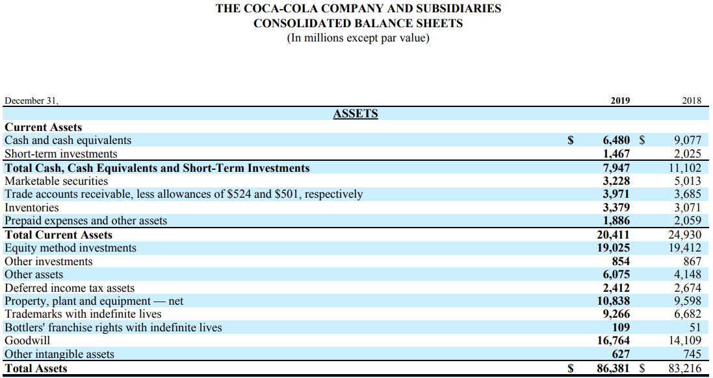

## Table of Contents

## What is goodwill in the context of financial statements?

Goodwill is an intangible asset that shows up on a company's balance sheet when it buys another business for more money than the fair value of its net assets. Think of it like this: if a company pays $1 million to buy another company, but the other company's assets minus its debts are only worth $800,000, the extra $200,000 is called goodwill. This extra amount often reflects the value of things you can't touch, like a strong brand name, a loyal customer base, or great employee skills.

Goodwill is important because it shows the value of a company's reputation and other non-physical assets that help it make money. However, it's tricky to measure because it's not something you can see or touch. If the value of the acquired company goes down later, the company might have to write down the goodwill, which means they recognize that it's worth less than they thought. This can affect the company's profits on their financial statements.

## How is goodwill calculated when a company acquires another?

When a company buys another company, goodwill is calculated by figuring out the difference between the purchase price and the fair value of the net assets of the company being bought. The fair value of the net assets is what the assets of the company are worth minus what it owes. For example, if a company pays $1 million to buy another company, and the net assets of that company are worth $800,000, the goodwill would be $200,000. This $200,000 represents the extra value the buying company sees in things like the brand, customer relationships, and employee skills.

Sometimes, the calculation can get a bit more complicated. The buying company needs to make sure they're valuing everything correctly. They might need to hire experts to help figure out the fair value of the assets and liabilities. If they find that the value of the goodwill goes down over time, they might have to do something called an impairment test. This means they check if the goodwill is still worth what they thought, and if not, they have to lower its value on their financial statements, which can affect their profits.

## Where does goodwill appear on a company's balance sheet?

Goodwill shows up on a company's balance sheet under the section called "Assets." It's listed as an intangible asset, which means it's something valuable that you can't touch or see. You'll find it right alongside other intangible assets like patents, trademarks, and copyrights.

When a company buys another company and pays more than the value of the net assets, that extra amount is called goodwill. It's like paying for the reputation, customer loyalty, and other non-physical things that make the company valuable. Goodwill stays on the balance sheet as long as it's worth what the company paid for it. If its value goes down, the company might have to lower its value on the balance sheet, which can affect their profits.

## What is the difference between purchased goodwill and internally generated goodwill?

Purchased goodwill is the extra amount a company pays when it buys another company. It's the difference between what they pay and the value of the net assets they get. This happens when a company sees value in things like the other company's brand, customer loyalty, or employee skills. Purchased goodwill shows up on the balance sheet as an intangible asset and can be recorded because it's part of a business deal that can be measured.

Internally generated goodwill, on the other hand, is the value a company builds up over time through its own efforts. This could come from a strong brand, happy customers, or a good reputation. Unlike purchased goodwill, internally generated goodwill doesn't show up on the balance sheet. It's hard to measure exactly how much it's worth, so accounting rules don't allow companies to record it as an asset. This means that while it's valuable, it doesn't appear on financial statements.

## How does goodwill affect a company's total assets?

Goodwill increases a company's total assets when it buys another company for more than the value of its net assets. Let's say a company pays $1 million to buy another company, but the net assets of that company are only worth $800,000. The extra $200,000 is called goodwill, and it gets added to the buying company's balance sheet as an intangible asset. This means the total assets of the buying company go up by the amount of the goodwill.

However, if the value of the goodwill goes down later, the company might have to do something called an impairment test. This means they check if the goodwill is still worth what they thought. If it's not, they have to lower its value on their balance sheet, which means their total assets go down too. So, goodwill can make a company's total assets go up when they buy another company, but it can also make them go down if the value of the goodwill decreases.

## What are the accounting standards for recognizing and measuring goodwill?

When a company buys another company, it has to follow certain rules to figure out and record goodwill on its financial statements. These rules come from accounting standards like the Generally Accepted Accounting Principles (GAAP) in the U.S. and the International Financial Reporting Standards (IFRS) used in many other countries. Both sets of rules say that goodwill should be the difference between what a company pays to buy another company and the fair value of the net assets it gets. The fair value is what the assets are worth minus what the company owes.

After a company records goodwill, it has to keep checking if it's still worth what they thought. This is called an impairment test. If the value of the goodwill goes down, the company has to lower its value on the balance sheet, which can affect their profits. GAAP and IFRS have different ways to do this test, but the main idea is the same: if the goodwill isn't worth as much anymore, the company has to show that on their financial statements. This makes sure that the financial statements give a true picture of the company's value.

## How is goodwill impairment tested and what are the implications?

Goodwill impairment testing is a way for companies to check if the goodwill they recorded when they bought another company is still worth what they thought. They do this by comparing the fair value of the business unit that has the goodwill to its carrying amount, which is the value on the balance sheet. If the fair value is less than the carrying amount, it means the goodwill might be worth less now. The company then has to figure out how much less it's worth and lower its value on the balance sheet. This process is called an impairment test, and it's something companies have to do at least once a year, or more often if there are signs that the goodwill might be worth less.

When a company finds out that its goodwill is worth less and has to lower its value, it's called an impairment loss. This loss gets recorded on the income statement and can make the company's profits go down. It's important because it shows that the company might have paid too much for the other company or that the value of the things like the brand or customer loyalty has gone down. This can affect how investors and others see the company's financial health. So, even though goodwill is an intangible asset, it can have a big impact on a company's financial statements and how people think about its value.

## Can goodwill be amortized, and if not, why?

Goodwill cannot be amortized under the current accounting rules like GAAP and IFRS. Amortization is when you spread out the cost of an asset over time, like how you might pay off a loan in monthly payments. But with goodwill, instead of spreading out its cost, companies have to check if it's still worth what they paid for it. This is called an impairment test, and it's done at least once a year. If the goodwill is worth less now, the company has to lower its value on the balance sheet, which can affect their profits.

The reason goodwill can't be amortized is because it's hard to know exactly how long it will be valuable. Things like a company's reputation or customer loyalty don't wear out like a machine or a building. They might stay valuable for a long time, or they might lose value quickly if something goes wrong. So, instead of guessing how long goodwill will last, accounting rules say companies should just check if it's still worth what they paid for it. This way, the financial statements show a more accurate picture of the company's value.

## What impact does goodwill have on a company's financial ratios?

Goodwill can change a company's financial ratios because it's part of the total assets on the balance sheet. When a company buys another company and records goodwill, it makes the total assets bigger. This can make ratios like return on assets (ROA) look smaller because the profit is spread over a bigger number of assets. ROA is calculated by dividing the profit by the total assets, so if the assets go up but the profit stays the same, the ROA goes down. Also, goodwill can make the debt-to-equity ratio look better because it increases the equity part of the balance sheet. This ratio shows how much a company is borrowing compared to what the owners have put in, and a higher equity can make the company look less risky.

If a company has to do an impairment test and finds out that the goodwill is worth less, it can affect the financial ratios too. When a company lowers the value of goodwill, it's called an impairment loss, and this loss goes on the income statement. This can make the profit go down, which can make ratios like the price-to-earnings (P/E) ratio go up. The P/E ratio is the stock price divided by the earnings per share, so if the earnings go down, the P/E ratio goes up. This can make the stock look more expensive compared to its earnings. So, goodwill can have a big impact on how investors see a company's financial health through these ratios.

## How does the treatment of goodwill vary between IFRS and GAAP?

Both IFRS and GAAP say that goodwill is the extra amount a company pays when it buys another company, but they have some different rules about how to check if it's still worth what they paid. Under IFRS, companies have to do an impairment test for goodwill at least once a year, or more often if there are signs that the goodwill might be worth less. They compare the fair value of the business unit that has the goodwill to its carrying amount, which is the value on the balance sheet. If the fair value is less, they have to lower the value of the goodwill. GAAP also requires an annual impairment test, but it's a bit different. Companies first check if the fair value of the business unit is less than its carrying amount. If it is, they then compare the fair value of the goodwill itself to its carrying amount to see if it needs to be lowered.

The main difference between IFRS and GAAP when it comes to goodwill is how they do the impairment test. IFRS looks at the whole business unit to see if the goodwill needs to be lowered, while GAAP has a two-step process that looks at the business unit first and then the goodwill itself. Another difference is that under IFRS, companies can't reverse an impairment loss once they've recorded it, but under GAAP, they can reverse it if the value of the goodwill goes back up later. These differences can affect how companies report their financial health and how investors see their value.

## What are the strategic considerations for managing goodwill on financial statements?

When a company buys another company, it has to think about how to handle the goodwill that shows up on its financial statements. Goodwill is the extra money a company pays for another company, and it can make the total assets look bigger. This can affect important numbers like return on assets, which might make the company look less profitable. Companies need to be careful about how much they pay for other companies because if they pay too much, they might have to lower the value of the goodwill later, which can hurt their profits. They also need to keep an eye on the value of the things that make up the goodwill, like the brand or customer loyalty, because if these things lose value, the goodwill might need to be lowered too.

Another thing companies need to think about is how often they check if the goodwill is still worth what they paid. They have to do this at least once a year, but they might need to do it more often if something changes. If they find out the goodwill is worth less, they have to show that on their financial statements, which can make their profits go down. This can affect how investors see the company's financial health. So, companies need to be smart about how they manage goodwill, making sure they don't pay too much for other companies and keeping a close watch on the value of the things that make up the goodwill.

## How does goodwill influence investor perceptions and company valuation?

Goodwill can change how investors see a company and its value. When a company buys another company and pays more than the value of its assets, that extra amount is called goodwill. It shows up on the balance sheet and makes the total assets bigger. Investors might see this as a sign that the company is willing to pay a lot for things like a strong brand or loyal customers, which can be good. But if the company paid too much, it might mean they overvalued the other company, which can make investors worried about the company's decision-making.

If the value of the goodwill goes down later, the company has to do something called an impairment test. This means they check if the goodwill is still worth what they thought. If it's not, they have to lower its value on the balance sheet, which can make their profits go down. This can make investors think the company's financial health is not as good as they thought. So, goodwill can make a company's total assets look bigger, but it can also make investors worry if the company has to lower its value later.

## References & Further Reading

#