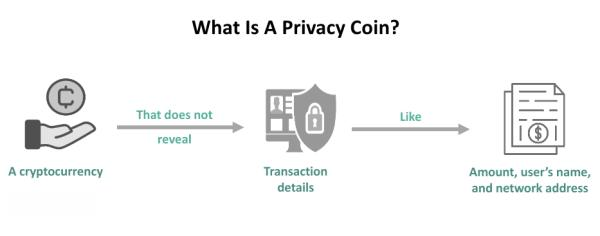

The rising importance of privacy in cryptocurrencies reflects the original ethos of blockchain technology: decentralization and individual control over financial transactions. As digital currencies have become mainstream, concerns over user privacy have gained traction. The desire to keep transaction details confidential has led to the development of privacy-focused cryptocurrencies, which aim to enhance the anonymity of users.

Privacy cryptocurrencies, such as Monero and Zcash, have spurred significant debate. Proponents argue that these coins provide essential safeguards against increasingly invasive data practices and potential misuse of personal financial information. Privacy coins use advanced cryptographic techniques to obscure transaction details, offering greater anonymity than traditional cryptocurrencies like Bitcoin. However, this has sparked controversy, as the potential for misuse by malicious actors, including money laundering and funding illicit activities, has drawn attention from regulators globally.

This ongoing debate brings to the forefront three key themes: privacy features, government regulation, and algorithmic trading. Privacy features of cryptocurrencies focus on developing cryptographic protocols to ensure that transaction details remain confidential. Yet, as governments strive to implement Anti-Money Laundering (AML) and Combating the Financing of Terrorism (CFT) regulations, privacy coins pose a challenge. Regulating these coins without undermining their privacy-enhancing technologies presents a delicate balance. Furthermore, algorithmic trading, which plays a significant role in the broader cryptocurrency market, must adapt to the evolving landscape of privacy-focused regulations. Algorithmic traders seek efficient trading strategies that can quickly respond to regulatory changes affecting these privacy-focused assets.

In conclusion, privacy in cryptocurrency is a contentious issue with substantial implications for financial privacy, regulation, and market dynamics. Understanding how these elements interact is crucial for navigating the future of digital currencies.

## Table of Contents

## Understanding Privacy Cryptocurrencies

Privacy-focused cryptocurrencies are a subset of digital currencies designed to protect the anonymity and financial privacy of users. Unlike traditional cryptocurrencies such as Bitcoin, which record all transactions on an openly accessible public ledger, privacy-focused cryptocurrencies employ advanced cryptographic techniques to obscure the details of transactions and enhance user anonymity.

### Definition and Characteristics

Privacy-focused cryptocurrencies, often referred to as "privacy coins," incorporate features that prioritize the confidentiality of transaction data. These features are designed to prevent the traceability of transactions and the visibility of wallet balances, thereby ensuring users' privacy. The core characteristics of privacy coins include:

1. **Obfuscation of Transaction Details**: Privacy coins conceal information about the transaction parties and the amount being transferred.

2. **User Anonymity**: These cryptocurrencies often provide options for users to remain anonymous, thereby reducing the risk of personal data exposure.

3. **Fungibility**: Since all units of the currency are indistinguishable from each other, privacy coins are inherently more fungible. This means one coin is always equal in value to another, as there's no transaction history that might devalue a particular coin.

### Examples of Popular Privacy Coins

Several privacy-focused cryptocurrencies have gained significant attention and usage:

- **Monero (XMR)**: Monero employs advanced cryptographic techniques such as ring signatures, stealth addresses, and Ring Confidential Transactions (RingCT) to ensure that transactions cannot be linked to each other or to specific users. [Monero](https://www.getmonero.org/) is well-known for its robust privacy features.

- **Zcash (ZEC)**: Zcash offers users the choice between transparent transactions, similar to Bitcoin, and shielded transactions, which use zk-SNARKs (zero-knowledge succinct non-interactive arguments of knowledge) to provide enhanced privacy by enabling users to prove the validity of a transaction without revealing its particulars. [Zcash](https://z.cash/) is celebrated for its pioneering use of zero-knowledge proofs in enhancing privacy.

- **Dash (DASH)**: Though not exclusively a privacy coin, Dash includes an optional privacy feature called PrivateSend, which mixes funds through a series of transactions making it difficult to trace the original source of the money.

### How Privacy Coins Enhance Anonymity

Privacy coins utilize a variety of techniques to protect user anonymity and transaction privacy. Here are some common methods:

- **Ring Signatures**: Used in Monero, this technique obscures the sender by mixing a user's transaction with others, making it difficult for outsiders to determine the true sender.

- **Stealth Addresses**: This feature allows users to transact through one-time addresses generated for each transaction. This ensures that the recipient's address is not linked to any specific transaction, enhancing privacy even further.

- **Zero-Knowledge Proofs**: Utilized by Zcash, these cryptographic proofs allow transactions to be verified without revealing any specific information about them, thus keeping the transaction's details and the identities of involved parties private.

- **Coin Mixing Services**: Some cryptocurrencies provide built-in mixing services to combine multiple transactions, thereby obscuring the source and destination of funds.

Privacy-focused cryptocurrencies represent a significant evolution in digital currency technology, emphasizing the importance of user confidentiality and the protection of financial data. As discussions around surveillance and data privacy continue to gain [momentum](/wiki/momentum), these cryptocurrencies offer valuable tools for individuals seeking to maintain control over their financial privacy.

## Privacy Concerns and Government Regulation

Privacy-focused cryptocurrencies, often referred to as privacy coins, have been subject to increasing regulatory scrutiny globally. Governments have initiated various regulatory actions aimed at overseeing these cryptocurrencies due to their potential use in illicit activities. The primary concern lies in their ability to provide enhanced anonymity, which can potentially hinder anti-money laundering (AML) and counter-financing of terrorism (CFT) efforts.

### Government Actions and Regulatory Measures

Governments worldwide have been actively devising policies to regulate privacy coins. In the United States, regulatory bodies such as the Financial Crimes Enforcement Network (FinCEN) have issued guidelines that mandate exchanges and financial institutions to adhere to strict AML and CFT regulations. This includes ensuring that transactions involving privacy coins can be tracked effectively, which poses inherent challenges given the core nature of these cryptocurrencies.

The European Union (EU) has similarly approached privacy coins with caution. The EU's Fifth Anti-Money Laundering Directive (5AMLD), which came into effect in 2020, extended the scope of AML regulations to include virtual currencies. Companies dealing with privacy coins are required to implement customer due diligence processes and report suspicious activities, aiming to increase transparency and traceability in transactions that involve privacy-focused cryptocurrencies.

In Asia, countries like Japan have taken decisive steps by outright banning certain privacy coins from being traded on domestic exchanges. This reflects a hardline stance on cryptocurrencies that prioritize anonymity. South Korea, on the other hand, has enforced stringent KYC (Know Your Customer) norms on [cryptocurrency](/wiki/cryptocurrency) exchanges to mitigate the risks associated with anonymous transactions, without an outright ban on privacy coins.

### Impact of AML and CFT Regulations

Regulations focusing on AML and CFT have a profound impact on the functioning and adoption of privacy cryptocurrencies. These regulations compel exchanges to de-list privacy coins as they struggle to meet the transparency requirements set by financial authorities. Consequently, this limits the accessibility of privacy coins to mainstream users, reducing [liquidity](/wiki/liquidity-risk-premium) and slowing down adoption rates.

However, privacy coin developers have responded to these challenges by implementing optional transparency features. Zcash, for example, offers an option to make transactions transparent to comply with regulatory requirements, providing a balance between user privacy and governmental oversight.

### Examples of Global Regulatory Approaches

The regulatory landscape for privacy coins varies greatly across different regions. In the U.S., the focus has been on compliance with comprehensive financial regulations, whereas the EU emphasizes harmonizing national laws to create a unified stance against the risks posed by privacy coins. Asian countries present a mixed approach, with Japan opting for strict prohibitive measures, in contrast to the regulatory frameworks of South Korea and Singapore, where compliance requirements are prioritized without complete bans.

In response to these varying regulatory environments, the cryptocurrency industry continues to advocate for clearer regulations that protect innovation while addressing governmental concerns. As governments refine their approaches, the ongoing evolution of privacy technologies within the cryptocurrency space remains crucial to align with both user demand for privacy and the necessity for financial oversight.

## Implications for Algo Trading

Algorithmic trading, a rapidly growing segment in the financial sector, involves using computer programs to execute trading strategies at speeds and frequencies that are impossible for a human trader to match. In the cryptocurrency market, [algorithmic trading](/wiki/algorithmic-trading) accounts for a significant portion of the trading [volume](/wiki/volume-trading-strategy) due to its ability to capitalize on market efficiencies and price discrepancies. 

Unlike traditional assets, cryptocurrencies operate on a decentralized digital medium where price [volatility](/wiki/volatility-trading-strategies) is much higher, offering both increased risk and potential rewards for algorithmic trading systems. These systems utilize complex algorithms based on technical indicators, market sentiment, and sometimes [machine learning](/wiki/machine-learning) to execute trades when certain predefined conditions are met.

The introduction of privacy-focused cryptocurrencies, such as Monero and Zcash, presents unique challenges and opportunities for algorithmic traders. These cryptocurrencies prioritize user privacy by obfuscating transaction details, including the sender, receiver, and the amount transferred. This poses a challenge for algorithmic trading, which often relies on transparency and data availability to make informed decisions.

### Interaction with Privacy-Focused Cryptocurrencies

Algorithmic trading systems typically rely on comprehensive datasets to inform decision-making processes. However, the privacy features of cryptocurrencies like Monero, which uses ring signatures, stealth addresses, and confidential transactions, significantly limit the amount of accessible transaction data. Similarly, Zcash offers selective transparency of transactions through its zk-SNARK protocol, further complicating data acquisition for algorithmic analysis.

This obfuscation inherently reduces the accuracy of algorithmic models that depend on historical transaction data, making it difficult to predict price movements based on traditional technical analysis. To mitigate this, algo traders might focus more on external signals, such as macroeconomic factors or broader market trends, rather than on direct transaction data. Alternatively, machine learning models may be trained on broader datasets that include social media sentiment or news analytics, adopting a more holistic approach to market prediction.

### Challenges and Opportunities Amid Regulatory Changes

Regulatory changes introduce additional layers of complexity for algorithmic traders dealing with privacy-focused cryptocurrencies. On one hand, stringent regulations could curtail trading opportunities by restricting the availability and liquidity of these coins, especially if exchanges are forced to delist privacy tokens to comply with anti-money laundering (AML) and combating the financing of terrorism (CFT) standards.

On the other hand, regulatory clarity can also bring positive effects, such as increasing market stability and the legitimacy of remaining traded coins. Algorithmic traders who adapt swiftly to these changes could find opportunities in new [arbitrage](/wiki/arbitrage) or newly established compliant trading venues.

Furthermore, regulatory developments often lead to increased volatility – an environment where algorithmic trading thrives. The sudden price swings resulting from regulatory announcements provide fertile ground for high-frequency trading strategies to capitalize on short-term market movements. However, it is essential for developers of these algorithms to integrate compliance-based parameters into their systems to avoid legal ramifications and maintain operational integrity in a regulatory environment that becomes increasingly stringent.

Overall, while the intersection of algorithmic trading and privacy-focused cryptocurrencies is complicated by privacy features and fluctuating regulations, adaptive strategies and robust analytical frameworks may offer competitive advantages for traders willing to navigate the challenges and exploit emerging opportunities.

## Positive and Negative Effects of Regulation

Regulation in the context of privacy-focused cryptocurrencies presents a dichotomy of effects, offering both protective measures for investors and challenges to the innovation and accessibility of these digital assets.

One of the primary positive aspects of regulation is the enhancement of safety and investor protection. Regulations such as Anti-Money Laundering (AML) and Combating the Financing of Terrorism (CFT) aim to mitigate the risks of illicit activities commonly associated with anonymous transactions. By enforcing stringent Know Your Customer (KYC) protocols and monitoring large transactions, regulators can ensure that cryptocurrency markets are not exploited for illegal activities. These measures build trust among investors, particularly institutional ones, who may be wary of engaging with markets perceived as high-risk[1]. Thus, regulatory frameworks can lead to greater mainstream adoption by fostering a secure environment.

Conversely, regulations can stifle innovation by imposing constraints that limit the technological advancements of privacy coins. Privacy coins, by design, emphasize user anonymity, which may clash with regulatory demands for transparency and traceability. The need to comply with regulations could result in the delisting of these coins on major exchanges, reducing their accessibility[2]. This may discourage developers from pursuing further enhancements of privacy features, as the risk of non-compliance with evolving regulations can deter investment and innovation within the sector.

The market's response to regulatory developments is adaptation through several strategies. Cryptocurrency exchanges may choose to implement stricter compliance measures to avoid government crackdowns, which may involve advanced analytics to track suspicious activities without completely compromising user anonymity. Some privacy coin projects are exploring technological solutions to balance privacy with regulatory demands, such as developing selective disclosure methods where transaction details can be revealed only to authorized parties[3].

Overall, while regulation introduces hurdles, it also offers opportunities to legitimize the cryptocurrency space, potentially propelling it towards broader acceptance. The key for privacy-focused cryptocurrencies lies in navigating this landscape by seeking a harmonious balance between user anonymity and compliance with global financial standards.

### References
1. Financial Action Task Force. (2019). Guidance for a Risk-Based Approach to Virtual Assets and Virtual Asset Service Providers. [Available online](https://www.fatf-gafi.org/).
2. CoinCenter. (2021). The Case for Electronic Cash. [Available online](https://www.coincenter.org/case-for-electronic-cash/).
3. Electric Coin Company. (2020). Approaches to Privacy-preserving Compliance. [Available online](https://electriccoin.co/blog/).

## Future of Privacy Cryptocurrencies

Privacy-focused cryptocurrencies have emerged as pivotal players in the digital finance ecosystem, primarily due to their commitment to enhancing transactional anonymity. As we look towards the future, these cryptocurrencies face a bifurcated path shaped by regulatory measures and technological evolution.

The long-term prospects of privacy cryptocurrencies hinge substantially on global regulatory developments. Governments worldwide are grappling with the challenge of balancing crime prevention with user privacy. Anticipated regulatory frameworks may aim to enhance transparency without fully undermining privacy features. A potential model involves encouraging exchanges to adopt Know Your Customer (KYC) standards specifically for privacy coin transactions, thereby facilitating legal scrutiny while preserving user anonymity to some degree. The evolution of such regulations could lead to a hybrid compliance approach where privacy is maintained for compliant transactions but becomes penetrable for illicit activities through advanced forensic tools.

On the technological front, privacy cryptocurrencies are likely to see continuous enhancements in their privacy protocols. Innovations such as Bulletproofs, Zero-Knowledge Proofs, and Ring Signatures are expected to play crucial roles. For instance, Bulletproofs can decrease the transaction sizes in privacy coins like Monero, boosting both scalability and privacy. Future iterations of cryptographic technology may further obscure transaction details while simultaneously ensuring quick and efficient processing. Enhanced privacy features could include dynamic network configurations that optimize anonymity based on real-time threat assessments or decentralized privacy layers that embed into blockchain infrastructure itself.

Adoption trends for privacy cryptocurrencies are poised for growth despite regulatory pressures. Industry shifts might be propelled by increasing public awareness of data breaches and privacy rights. As privacy technology becomes more sophisticated and accessible, a wider audience may gravitate towards privacy coins for both personal and commercial transactions. Institutions might also utilize privacy cryptocurrencies for secure, anonymized transactions without sacrificing compliance mandates, particularly if regulatory frameworks accommodate privacy-enhanced technologies.

Furthermore, privacy coins are anticipated to intrigue markets through their ability to function autonomously in highly regulated spaces. Algorithmic trading strategies may evolve to incorporate privacy coins by leveraging their unique volatility patterns, which differ from mainstream digital currencies. Developers might build advanced algorithms designed to function within these privacy-centric systems, offering new speculative and hedging strategies in the financial markets.

In summary, the future of privacy cryptocurrencies will likely be characterized by a complex interplay between regulatory actions and advancements in privacy-preserving technologies. While governments may impose stricter regulations, technological innovation is expected to continually enhance transaction anonymity and network efficiency. The ongoing dialogue between stakeholders and regulatory bodies will be vital to steer privacy cryptocurrencies towards a sustainable and legally compliant future.

## Conclusion

The interplay between privacy-focused cryptocurrencies and government regulation presents a complex yet critical landscape in the financial ecosystem. Privacy coins, such as Monero and Zcash, have garnered attention for their ability to provide enhanced anonymity in transactions. This feature, while addressing legitimate privacy concerns for users, poses significant challenges in the eyes of regulators tasked with enforcing Anti-Money Laundering (AML) and Countering the Financing of Terrorism (CFT) statutes. Governments globally have responded with a diverse array of strategies aimed at curtailing the potential misuse of these cryptocurrencies, initiated through stringent regulatory measures. These actions, while necessary for security, can impede accessibility and innovation within the ecosystem.

The challenge lies in achieving a balanced framework where privacy is preserved without undermining regulatory objectives. This balance is pivotal in promoting a sustainable environment for innovation while ensuring security and compliance. For algorithmic traders, the evolving regulatory backdrop presents both hurdles and opportunities. Navigating this landscape requires a nuanced understanding of the legal frameworks across different jurisdictions and an adaptable trading strategy.

As the cryptocurrency market evolves, ongoing dialogue among industry stakeholders is essential. Developers, regulatory bodies, investors, and traders must combine efforts to craft regulations that safeguard privacy while minimizing risks of illicit activity. The future of privacy cryptocurrencies hinges on this collaborative approach, continually redefining the delicate balance between privacy, regulation, and technological innovation. Encouraging such dialogue fosters an environment conducive to the responsible growth and integration of privacy technologies within the broader financial system.

## References & Further Reading

[1]: Narayanan, A., Bonneau, J., Felten, E., Miller, A., & Goldfeder, S. (2016). ["Bitcoin and Cryptocurrency Technologies."](https://press.princeton.edu/books/hardcover/9780691171692/bitcoin-and-cryptocurrency-technologies) Princeton University Press.

[2]: Fisk, N., Moeser, M., & Schuch, L. (2021). ["The Regulation of Cryptoassets: A Short Guide for Investors"](https://pmc.ncbi.nlm.nih.gov/articles/PMC1130142/). Library of Congress.

[3]: Breiman, L. (2001). ["Random Forests."](https://link.springer.com/article/10.1023/A:1010933404324) Machine Learning, 45(1), 5-32.

[4]: Moser, M., Bohme, R., & Breuker, D. (2013). ["An Inquiry into Money Laundering Tools in the Bitcoin Ecosystem."](https://ieeexplore.ieee.org/document/6805780) eCrime Researchers Summit.

[5]: Zohar, A. (2015). ["Bitcoin: under the hood."](https://dl.acm.org/doi/10.1145/2701411) Communications of the ACM, 58(9), 104-113.