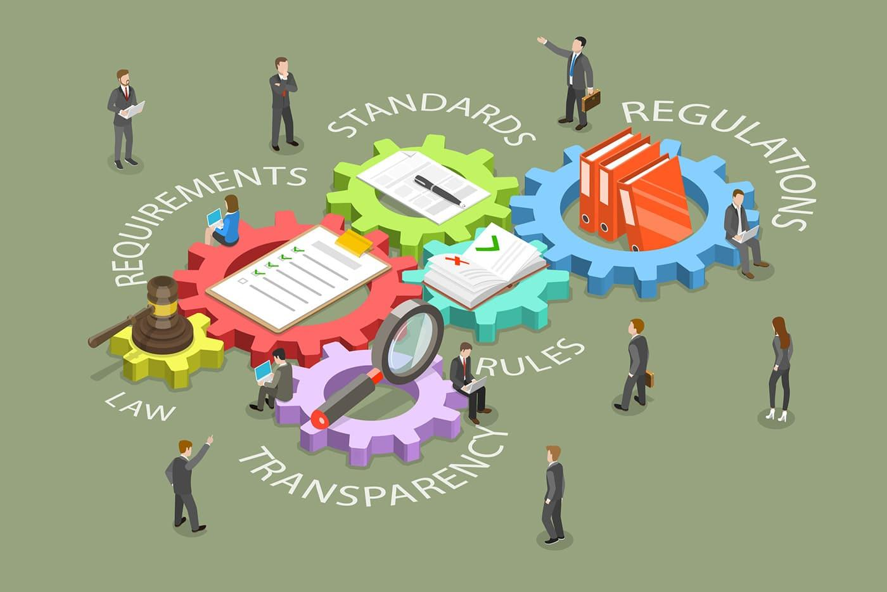

The rapid evolution of financial markets in the digital age has brought algorithmic trading to the forefront, transforming how trades are executed and creating new opportunities and challenges. This shift stems primarily from the ability of algorithms to process vast amounts of data and execute trades at speeds unattainable by human traders. By leveraging these capabilities, algorithmic trading maximizes efficiency and reduces the likelihood of human error, which can significantly impact market behavior.

As technological advancements in financial markets continue, government regulations play a crucial role in shaping the business environment. The finance sector is particularly susceptible as its fast-paced technological growth often outpaces traditional oversight mechanisms. Regulatory bodies strive to ensure that while innovation is encouraged, it does not compromise market integrity or investor protection. 

Algorithmic trading lies at the intersection of government regulations, economic policy, and technological innovation. Regulations can both facilitate and hinder the development of new trading strategies and technologies. Effective regulatory frameworks aim to balance innovation with the necessary safeguards against market abuse and systemic risk. For instance, regulations addressing high-frequency trading and the risks associated with artificial intelligence in financial transactions are evolving to protect market participants without stifling technological progress.

In an increasingly interconnected global economy, financial markets are influenced by a complex web of regulations and policies. Understanding these dynamics is crucial for businesses and stakeholders across the financial landscape to remain competitive. As technology continues to reshape the execution of trades, the challenge for policymakers and market participants is to harmonize regulatory frameworks with emerging technologies to achieve sustainable economic growth.

## Table of Contents

## Algorithmic Trading: A Brief Overview

Algorithmic trading, commonly known as algo trading, leverages computer algorithms to automate the execution of trading orders, often achieving this within fractions of a second. This method has significantly transformed the trading landscape, enhancing both the speed and efficiency of transactions while drastically reducing human errors. By automating the trading process, algorithmic systems can efficiently manage numerous trades simultaneously, adjusting strategies dynamically in response to real-time market data.

Algo trading encompasses a wide array of strategies, including high-frequency trading ([HFT](/wiki/high-frequency-trading-strategies)), [arbitrage](/wiki/arbitrage), and [trend following](/wiki/trend-following). High-frequency trading exploits microscopic price differences across markets, executing a large number of orders in lightning-fast succession. Arbitrage strategies aim to capitalize on price imbalances between different markets or instruments, while trend-following strategies analyze market data to identify and act on prevailing market trends.

The integration of [machine learning](/wiki/machine-learning) and [artificial intelligence](/wiki/ai-artificial-intelligence) (AI) into [algorithmic trading](/wiki/algorithmic-trading) systems has further bolstered their capabilities. These technologies enable systems to analyze vast datasets, uncover hidden patterns, and make predictions with increasing accuracy. AI-driven models can adapt to changing market conditions, learning from new data to refine their trading strategies autonomously.

Understanding algorithmic trading is essential for comprehending the broader implications of regulatory measures that affect it. As these systems become more complex and integrated into the financial ecosystem, regulatory frameworks aim to ensure that innovation continues responsibly, maintaining market integrity and investor protection. This foundational knowledge is crucial as regulations evolve in response to technological advancements in trading systems.

## Government Regulations: An Essential Framework

Government regulations form the backbone of financial markets by ensuring fairness, transparency, and [liquidity](/wiki/liquidity-risk-premium). These regulations are vital for protecting investors, preventing market manipulation, and minimizing systemic risk. Across the globe, various regulatory bodies and guidelines reflect a range of approaches to managing the modern complexities inherent in trading environments. 

For instance, in the United States, the Securities and Exchange Commission (SEC) sets out rules to maintain an orderly market and protect investors. The SEC’s regulations include requirements for financial reporting, enforcement actions against fraudulent practices, and guidelines for high-frequency trading. In Europe, the Markets in Financial Instruments Directive II (MiFID II) has introduced comprehensive rules aimed at increasing transparency and reducing the speculative nature of trading activities. MiFID II mandates detailed transaction reporting and stringent requirements for algorithm testing to mitigate potential market disruptions.

The recent trend towards digital transformation in trading has prompted regulators to emphasize mitigating risks associated with high-frequency trading and the utilization of artificial intelligence in financial transactions. For example, regulators scrutinize algorithmic trading systems to prevent erroneous trades and [volatility](/wiki/volatility-trading-strategies) spikes, which could destabilize markets. This focus has led to the development of "circuit breakers" and other automated tools to suspend trading when abnormal patterns are detected.

Businesses must understand and comply with these regulations to thrive in the ever-evolving trading landscape. Compliance requires substantial investment in technology and expertise, which can be seen as both a challenge and an opportunity. Financial firms are increasingly investing in sophisticated risk management systems and real-time monitoring tools to ensure adherence to regulatory standards and maintain their competitive edge.

As regulations evolve in response to technological advancements, businesses are also encouraged to innovate, creating new solutions that align with regulatory expectations. This symbiotic relationship between regulation and innovation ultimately supports a stable and resilient financial ecosystem.

## Economic Policy and Its Influence on Business

Economic policy is a critical [factor](/wiki/factor-investing) that shapes the landscape in which businesses, especially those engaged in algorithmic trading, operate. These policies encompass a broad array of government actions including taxation, fiscal spending, and monetary interventions, each of which can significantly impact market dynamics and investor behavior.

Taxation policies affect the disposable income of consumers and the capital available to businesses, thereby influencing economic activity and business profitability. High corporate taxes can reduce net earnings for firms, potentially restraining investment in innovative trading technologies. Conversely, favorable tax policies can encourage increased investment and risk-taking, vital for growth and development in fast-evolving markets like algorithmic trading.

Fiscal spending, through government expenditure on infrastructure, education, and health, can stimulate economic growth and increase demand for goods and services, boosting market activity. An increase in government spending can lead to higher liquidity within the financial system, affecting the conditions under which businesses operate and strategize their trading activities.

Monetary policy, as orchestrated by a country’s central bank, holds profound implications for algorithmic trading. Through the manipulation of interest rates and control of the money supply, central banks can influence economic stability, inflation rates, and overall market performance. A lower [interest rate](/wiki/interest-rate-trading-strategies) environment typically results in increased borrowing and investment, which can enhance market liquidity and trader activity. For example, reduced interest rates can lower the cost of borrowing for businesses, thus potentially amplifying their trading volumes.

Algorithmic trading, which relies heavily on historical data and predictive models, is particularly susceptible to shifts in economic policy. Policy changes can alter market confidence and behavior, making historical data less reflective of future conditions. For instance, unexpected policy shifts can lead to heightened market volatility—a critical factor that many algorithmic strategies seek to exploit or mitigate. Therefore, traders must continuously re-evaluate their models in response to such changes to maintain competitiveness.

Analyzing the interaction between economic policy and regulation provides crucial insights for forecasting future market opportunities and risks. While economic policies set the broader economic landscape, regulations offer specific rules and guidelines within which businesses must operate. The interplay between these two can dictate the potential for innovation and growth within the financial sector. For instance, a regulatory environment that encourages transparency and investor protection can enhance market integrity, while sound economic policy can streamline business operations.

Understanding these dynamics is essential for businesses striving to optimize their algorithmic trading strategies in an ever-evolving policy environment, enabling them to harmonize technological innovation with economic and regulatory considerations for sustained success.

## Impact of Regulations on Algorithmic Trading

Regulatory actions significantly impact algorithmic trading, influencing both operational practices and strategic development. Compliance with regulations such as the Securities Exchange Commission (SEC) rules in the United States or the European Union's MiFID II mandates is pivotal for trading firms. These regulations necessitate substantial investments in technology and expertise to ensure adherence to complex legal requirements and maintain market participation.

Regulatory caps on trading speed and [volume](/wiki/volume-trading-strategy) present both challenges and opportunities. For instance, mandates requiring transparency can lead to constraints on algorithmic operations, affecting liquidity and potentially altering trading strategies. However, these same mandates can also drive improvements in market integrity and investor confidence, serving as a catalyst for inventive solutions within the industry. 

Failure to comply with these regulatory frameworks can result in severe consequences, including hefty fines and reputational damage. This underscores the need for robust compliance systems and continuous monitoring. As a result, financial firms often develop or adopt advanced technologies to detect and prevent regulatory breaches proactively, incorporating tools like real-time data analysis and automated reporting.

Despite the challenges posed by regulations, they can also stimulate innovation within the algorithmic trading sector. The necessity for compliance has led to the creation of sophisticated risk management tools, enhanced data analytics capabilities, and real-time monitoring systems. Many fintech companies are investing in technologies that simplify compliance processes, including AI-driven compliance checks and blockchain-based transparency solutions. These innovations aim not only to meet regulatory standards efficiently but also to refine trading strategies and improve overall operational efficiency. 

Consequently, the regulatory landscape—the interaction between market regulations and algorithmic trading operations—continues to evolve. This evolution reflects a dynamic interplay between maintaining regulatory compliance and pursuing technological advancement, ultimately benefiting both the financial sector and the broader economy.

## Innovations Spurred by Regulatory Challenges

Regulatory challenges in algorithmic trading, while often perceived as obstacles, have proven to be powerful catalysts for innovation. The necessity to comply with stringent regulatory frameworks drives the development of sophisticated technologies aimed at risk mitigation and compliance enhancement. This has particularly spurred advancements in risk management tools, real-time monitoring systems, and advanced data analytics.

Risk management tools have evolved to incorporate more predictive analytics and machine learning algorithms that can identify potential compliance breaches before they occur. For instance, predictive modeling using machine learning can assess historical trading data to predict and flag unusual patterns that might contravene regulatory standards. This not only ensures compliance but also preemptively safeguards against market anomalies.

Moreover, real-time monitoring systems are now equipped with enhanced data processing capabilities, allowing instant analysis of high-frequency trading activities. These systems employ complex algorithms that can process vast datasets in real-time, delivering immediate feedback on trading operations. Such advancements help in maintaining market integrity and prevent manipulative practices, aligning with regulatory objectives.

Fintech companies are actively developing technologies that facilitate regulatory compliance. AI-driven compliance checks are becoming increasingly prevalent, utilizing natural language processing and other AI techniques to review trading documentation and communications. These automated systems can quickly and accurately ensure that trades and related activities meet regulatory standards.

Blockchain technology is also playing a significant role in providing transparency solutions. By creating immutable records of transactions, blockchain ensures that trading activities can be audited for compliance purposes, enhancing trust and transparency within the financial markets. The decentralized nature of blockchain also minimizes the chance of data tampering, thereby aligning trading activities with regulatory expectations.

These innovations do more than merely meeting regulatory requirements; they also improve trading strategies and operational efficiency. Advanced data analytics enable traders to devise more informed strategies by leveraging comprehensive market insights. Additionally, the automation of compliance processes reduces manual intervention, thereby minimizing human error and operational costs.

This ongoing cycle of regulation-induced innovation underscores a dynamic interplay that benefits both the financial sector and the broader economy. As companies develop new tools to comply with regulations, they not only foster a more secure trading environment but also create opportunities for growth and efficiency. The financial industry can thus harmonize technological innovation with regulatory compliance, paving the way for sustainable advancement.

## Global Perspectives: Diverse Regulatory Approaches

The approach to regulating algorithmic trading varies widely across different global markets. In the United States, the Securities and Exchange Commission (SEC) serves as a primary regulatory body, focusing on ensuring transparency and maintaining market stability. The SEC's rules impact high-frequency trading by instituting measures to prevent market manipulation and protect investors. This includes monitoring and regulating the speed and volume of trades, ensuring that high-frequency traders do not gain an unfair advantage over traditional market participants.

In Europe, the Markets in Financial Instruments Directive II (MiFID II) has significantly reshaped the trading environment. Enacted in January 2018, MiFID II aims to enhance market transparency and foster competition across Europe. It introduces rigorous reporting requirements for algorithmic traders, mandating detailed records of executed orders and their market impact. Additionally, MiFID II imposes strict licensing and testing requirements for algorithmic trading firms, ensuring that their trading strategies do not disrupt market integrity.

Asian markets present diverse regulatory landscapes, reflecting each country's unique economic policies and technological advancements. China, for instance, emphasizes the oversight of stock exchanges and focuses on controlling capital flows to stabilize its markets. Regulatory bodies in China have increasingly scrutinized algorithmic trading practices to mitigate risks associated with market volatility. Japan, on the other hand, continually updates its Financial Instruments and Exchange Act to address the evolving technology-driven trading landscape. Japanese regulators prioritize systemic risk management and investor protection, enforcing guidelines that ensure the stability of their financial markets.

Examining these global perspectives enables businesses to understand the varied regulatory challenges and opportunities they face across different regions. As countries implement tailored approaches to managing algorithmic trading, companies must navigate this complex regulatory environment to remain compliant and competitive. This requires a strategic understanding of both local regulatory frameworks and the global market context in which they operate.

## Conclusion: Navigating the Complex Landscape

Navigating the complex interface of government regulations, economic policies, and algorithmic trading demands both nuanced understanding and strategic foresight. This environment's dynamic nature necessitates that businesses remain vigilant and adaptable to continuously evolving regulatory landscapes and economic policy shifts. By doing so, companies can maintain a competitive edge and capitalize on emerging opportunities.

Collaboration is pivotal. Effective communication and partnership between regulators, financial institutions, and technology companies can foster an ecosystem that supports both regulatory compliance and technological innovation. By working together, these entities can devise solutions that address the challenges posed by rapid advancements in financial technology while safeguarding market integrity and investor protection.

Technological advancements, notably in artificial intelligence and machine learning, continue to reshape financial markets, influencing how algorithmic trading is conducted. A well-crafted regulatory approach, one that balances innovation with risk mitigation, is essential for sustainable growth in this dynamic sector. By harmonizing technological progress with robust regulatory frameworks, stakeholders can ensure that the evolution of algorithmic trading aligns with broader economic objectives.

Ultimately, the future of algorithmic trading is intrinsically linked to the symbiotic relationship between technology and regulation. Through strategic collaboration and informed policy-making, the financial ecosystem can thrive, driving forward both innovation and compliance in a balanced, sustainable manner.

## References & Further Reading

[1]: Bergstra, J., Bardenet, R., Bengio, Y., & Kégl, B. (2011). ["Algorithms for Hyper-Parameter Optimization."](https://papers.nips.cc/paper/4443-algorithms-for-hyper-parameter-optimization) Advances in Neural Information Processing Systems 24.

[2]: ["Advances in Financial Machine Learning"](https://www.amazon.com/Advances-Financial-Machine-Learning-Marcos/dp/1119482089) by Marcos Lopez de Prado

[3]: ["Evidence-Based Technical Analysis: Applying the Scientific Method and Statistical Inference to Trading Signals"](https://www.amazon.com/Evidence-Based-Technical-Analysis-Scientific-Statistical/dp/0470008741) by David Aronson

[4]: ["Machine Learning for Algorithmic Trading"](https://github.com/stefan-jansen/machine-learning-for-trading) by Stefan Jansen

[5]: ["Quantitative Trading: How to Build Your Own Algorithmic Trading Business"](https://www.amazon.com/Quantitative-Trading-Build-Algorithmic-Business/dp/1119800064) by Ernest P. Chan

[6]: Securities and Exchange Commission. ["SEC Rule 613."](https://www.sec.gov/about/divisions-offices/division-trading-markets/rule-613-consolidated-audit-trail)

[7]: Directive 2014/65/EU of the European Parliament and of the Council on markets in financial instruments (MiFID II). 

[8]: Aldridge, I. (2013). ["High-Frequency Trading: A Practical Guide to Algorithmic Strategies and Trading Systems,"](https://onlinelibrary.wiley.com/doi/pdf/10.1002/9781119203803.fmatter) 2nd Edition.

[9]: Cartea, Á., Jaimungal, S., & Penalva, J. (2015). ["Algorithmic and High-Frequency Trading."](https://assets.cambridge.org/97811070/91146/frontmatter/9781107091146_frontmatter.pdf) Cambridge University Press.