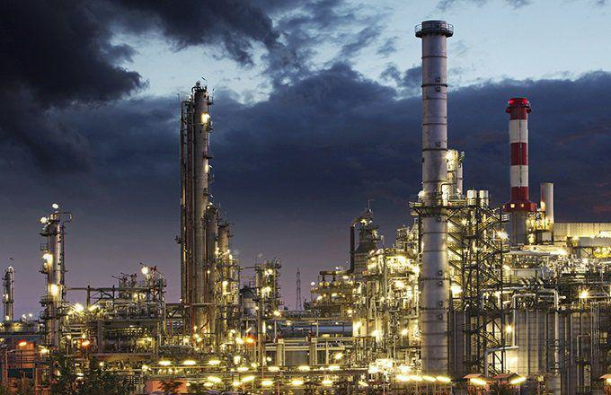

The oil and gas drilling sector is a cornerstone of the global energy supply, offering significant contributions to economic stability and growth. This industry, however, operates under substantial scrutiny, governed by a web of government regulations aimed at managing its environmental, health, and safety impacts. These regulations are pivotal in enforcing compliance with standards that ensure responsible resource extraction, safeguarding both ecological systems and public health.

In parallel to regulatory oversight, the sector is being revolutionized by market innovations such as algorithmic trading. This technological shift is redefining how markets operate, introducing efficiencies in trading processes and altering market dynamics. The intersection of these elements—traditional regulatory frameworks and advanced technological applications—illustrates a sector at a crossroads, where adaptability and compliance are equally crucial. 

This article aims to elucidate the dual focus of regulatory governance over conventional extraction techniques and the transformative potential of technological advancements, specifically in trading. For stakeholders—ranging from policymakers, industry leaders to environmental advocates—understanding these intersecting areas is essential to navigating this complex and evolving landscape.

Analyzing regulatory structures that guide environmental, health, and safety protocols offers insights into the industry's operational standards and requirements. Concurrently, examining how algorithmic trading impacts the sector provides a glimpse into future market behaviors and the need for ongoing innovation. Through this exploration, we aim to speculate on the future trajectory of the oil and gas industry, considering how current trends in regulation and technology might shape its development.

## Table of Contents

## Government Regulations in the Oil and Gas Drilling Sector

Government regulations play an essential role in overseeing the oil and gas drilling sector, primarily by addressing environmental concerns, ensuring the safety of operations, and safeguarding public health. Among these regulations, the Clean Air Act stands out as a pivotal piece of legislation aimed at reducing harmful emissions from drilling operations. It mandates the adoption of greener practices, promoting the deployment of technology to minimize environmental footprints. This legislation is integral to efforts aimed at curbing pollutants like volatile organic compounds (VOCs) and nitrogen oxides, thereby contributing to improved air quality and reduced smog formation ([U.S. Environmental Protection Agency](https://www.epa.gov/clean-air-act-overview)).

The Occupational Safety and Health Administration (OSHA) is another crucial entity in this regulatory landscape, providing comprehensive guidelines to maintain high safety standards within the industry. These guidelines are designed to mitigate the risk of accidents and ensure robust protective measures for workers exposed to hazardous oil field environments. OSHA's regulations encompass a wide range of safety protocols, including the safe handling of drilling equipment and preventative measures against chemical exposures and explosions ([OSHA](https://www.osha.gov/oil-and-gas-well-drilling-and-servicing)).

Collaboration between state and federal governments is vital in coordinating regulatory efforts. The federal government typically manages operations in federal waters, whereas state governments regulate activities in local and state waters. This delineation ensures that precise jurisdictional overlaps are clearly outlined, fostering effective collaboration between different levels of government. For instance, state agencies may implement additional regulations that cater to local environmental priorities, thereby complementing federal regulations.

Regulations governing the oil and gas sector are frequently updated to reflect technological advancements and evolving environmental priorities. This dynamic approach ensures that regulatory frameworks remain relevant and effective in addressing contemporary challenges. For example, advancements in drilling technologies, such as hydraulic fracturing and horizontal drilling, have prompted updates to existing regulations, ensuring that these innovative methods are conducted safely and sustainably. By continuously adapting to emerging technologies and environmental considerations, regulatory bodies strive to balance the economic interests of the oil and gas sector with the imperative of environmental protection and public safety.

## Environmental Regulations and Their Impact

Environmental regulations have significantly reshaped the landscape of the oil and gas sector, primarily by encouraging the transition towards cleaner extraction methods. The Clean Air Act, a pivotal piece of legislation in the United States, exemplifies efforts to curb greenhouse gas emissions and other pollutants. By setting stringent limits on the emission of hazardous substances, this act has necessitated the development and adoption of technologies capable of capturing and repurposing natural gas emissions, thereby mitigating their environmental impact.

The economic implications of such regulations are multifaceted. On one hand, compliance with environmental standards often leads to increased operational costs as companies invest in cleaner technologies and processes. For example, installation of equipment like vapor recovery units to capture emissions can impose substantial upfront expenditures. However, these same regulations open up new revenue streams through sustainable practices, such as selling captured gases or trading carbon credits, potentially offsetting these costs over time.

Regulatory frameworks have a profound influence on the exploration of shale gas and the development of infrastructure for alternative energy sources. By enforcing rigorous environmental standards, these regulations promote the adoption of innovative drilling technologies, like hydraulic fracturing combined with horizontal drilling, to minimize environmental footprints. In addition, they drive investment in renewable energy infrastructure, such as wind and solar power, as companies seek to diversify their energy portfolios and align with sustainability goals.

However, smaller firms often face economic challenges due to the costs associated with regulatory compliance. The financial burden of meeting environmental standards can be disproportionate for these companies, affecting their ability to compete with larger firms that possess greater resources to absorb such costs. Consequently, these dynamics can influence overall market structures, potentially leading to increased consolidation in the industry as smaller entities struggle to maintain profitability.

In conclusion, while environmental regulations impose significant demands on the oil and gas industry, they also spur technological innovation and present new opportunities for growth. The transformation towards cleaner practices not only addresses environmental concerns but also reshapes the economic landscape, highlighting the critical interplay between regulatory frameworks and industry adaptation.

## Health and Safety Standards in Oil and Gas

OSHA plays a pivotal role in safeguarding worker safety within the oil and gas industry by setting comprehensive health and safety standards. These regulations ensure safe working conditions in environments often characterized by unique hazards and challenges. OSHA's guidelines meticulously detail operational procedures, including the use of power tongs, which are critical for gripping and turning drill pipe. These standards are essential in preventing accidents and ensuring operational safety. Additionally, OSHA recommends preventive measures against chemical exposures and potential explosions, critical concerns in this sector. 

The Bureau of Labor Statistics provides valuable insights into the inherent risks faced by workers in the oil and gas industry. Their data underscores the necessity for robust safety protocols, as workers are frequently exposed to hazardous conditions including high-pressure equipment, toxic chemicals, and volatile environments. Such [statistics](/wiki/bayesian-statistics) highlight the ongoing need for stringent safety measures to minimize risks and protect worker health.

To maintain high safety standards, regulations are continually updated. As new technologies and methods are introduced within the oil and gas industry, safety guidelines are revised to ensure they remain relevant and effective. This dynamic approach is crucial in keeping pace with technological advancements and mitigating newly identified risks.

Both federal and state authorities are actively involved in promoting these safety standards, working collaboratively to ensure rigorous inspections and compliance across the industry. This joint effort helps maintain a cohesive regulatory framework that supports the oil and gas sector in adhering to mandatory safety practices, ultimately protecting workers and enhancing overall operational safety.

In summary, OSHA's regulations, complemented by data from the Bureau of Labor Statistics and coordinated federal and state efforts, form the backbone of health and safety standards in the oil and gas industry. This regulatory ecosystem is essential for fostering a safe working environment and addressing the sector's intrinsic challenges.

## Algorithmic Trading in the Oil and Gas Market

Algorithmic trading, a form of automated trading using computer algorithms, is having a profound impact on the oil and gas markets. These systems analyze vast datasets at incredible speeds, executing trades based on predefined criteria without human intervention. This shift is fostering greater efficiencies by increasing trading volumes and [liquidity](/wiki/liquidity-risk-premium), reducing transaction costs, and enabling market participants to respond swiftly to changing market conditions.

The introduction of [algorithmic trading](/wiki/algorithmic-trading) means that price movements and market liquidity are increasingly driven by data-driven strategies. Algorithms can process information faster than any human trader, analyzing factors such as supply and demand data, geopolitical events, and market sentiment. This allows them to predict price fluctuations and make split-second decisions to buy or sell oil and gas commodities. Efficiency gains from high-frequency trading ([HFT](/wiki/high-frequency-trading-strategies)), a subset of algorithmic trading, have been particularly notable, providing fresh dynamics to how energy resources are priced and exchanged.

However, the rapid capabilities of algorithmic trading introduce various risks. The exactness and speed with which these algorithms can operate raise concerns about potential market manipulation. They could, for instance, exacerbate price swings, triggering rapid fluctuations that could destabilize the market. Sudden, unexplained shifts in oil prices can occur due to the automated actions of these trading systems reacting to misinterpreted data or minor market disturbances—commonly referred to as "flash crashes."

Regulations are evolving in response to these challenges. Regulatory bodies such as the Securities and Exchange Commission (SEC) and the Commodity Futures Trading Commission (CFTC) are intensifying their focus on setting standards to govern algorithmic trading. These standards include enforcing transparency in algorithmic operations, implementing robust risk management protocols, and ensuring that these systems are fail-safe to prevent market disruptions.

Energy firms are recognizing the strategic importance of algorithmic trading and are adapting quickly. By leveraging advanced data analytics, firms can refine their trading strategies, allowing them to identify profitable opportunities with greater precision and less risk. Through [machine learning](/wiki/machine-learning) algorithms and real-time data feeds, companies can enhance their predictive modeling skills, offering a competitive edge in an increasingly sophisticated market environment.

Algorithmic trading represents a double-edged sword for the oil and gas market: while it enhances efficiency and trading accuracy, it requires safeguards to protect against market instability. The industry's future hinges on striking a fine balance—leveraging the full potential of technology while mitigating associated risks through thoughtful regulation and prudent market practices.

## Future Outlook: Regulation and Innovation

The future outlook of the oil and gas drilling sector is increasingly being influenced by a synergy between evolving regulations and technological innovations. As we look forward, it is expected that regulatory frameworks will become more stringent, pushing the industry to adopt cleaner, safer, and more sustainable practices. These regulations aim to reduce environmental impact, enhance safety, and promote public health amid growing global environmental concerns.

Technological advancements, particularly the rise of algorithmic trading, are set to further transform market operations and energy pricing structures. Algorithmic trading utilizes complex data-driven algorithms, which allow for automated and high-frequency trading. This technology not only increases the speed and accuracy of trades but also significantly influences price movements and enhances market liquidity. However, it brings challenges such as potential market manipulation and rapid price fluctuations, necessitating robust regulatory oversight.

Stakeholders in the oil and gas sector must remain adaptive to these changes. Effective integration of regulatory compliance and technological adoption into strategic planning will be crucial. Companies that can swiftly adapt to regulatory updates while leveraging technological innovations stand to gain competitive advantages and optimize their operational efficiency.

The dynamic interplay between regulation and innovation provides considerable opportunities for growth and transformation within the energy industry. As the sector continues to navigate this landscape, it will be essential for stakeholders to strike a balance. Embracing regulatory changes, while harnessing advancements in technology, will catalyze the industry's evolution towards a more resilient and sustainable future. This balanced approach will ensure not only compliance with regulatory measures but also position industry players to thrive in an increasingly competitive market environment.

## Conclusion

The convergence of government regulations and algorithmic trading in the oil and gas sector marks a significant period of transformation. Industry players who understand these regulatory measures and embrace technological advancements are well-positioned to thrive. As environmental and safety standards continue to rise, companies must adopt operational adjustments and apply strategic foresight to meet and exceed compliance expectations effectively.

Algorithmic trading introduces complexity but offers new avenues for optimizing market interactions and energy distribution. The utilization of data-driven algorithms enables quicker and more accurate trading decisions, fostering efficiency in the market. However, the potential for market manipulation and rapid price fluctuations necessitates vigilance and regulatory oversight to ensure fair trading conditions.

Ultimately, the future of oil and gas drilling hinges on balancing regulatory adherence with innovation-driven performance. Companies that integrate rigorous compliance with the strategic adoption of technological advancements can navigate this evolving landscape successfully and exploit growth opportunities. This equilibrium between regulations and innovation will determine the sector's trajectory, ensuring its sustainability and resilience in the coming years.

## References & Further Reading

[1]: ["Clean Air Act Overview."](https://www.epa.gov/clean-air-act-overview) U.S. Environmental Protection Agency.

[2]: ["Oil and Gas Well Drilling and Servicing eTool."](https://www.osha.gov/etools/oil-and-gas) Occupational Safety and Health Administration.

[3]: ["Advances in Financial Machine Learning"](https://www.amazon.com/Advances-Financial-Machine-Learning-Marcos/dp/1119482089) by Marcos Lopez de Prado.

[4]: ["Quantitative Trading: How to Build Your Own Algorithmic Trading Business"](https://www.amazon.com/Quantitative-Trading-Build-Algorithmic-Business/dp/1119800064) by Ernest P. Chan.

[5]: ["Algorithmic Trading and DMA: An Introduction to Direct Access Trading Strategies"](https://archive.org/details/algorithmictradi0000john) by Barry Johnson.