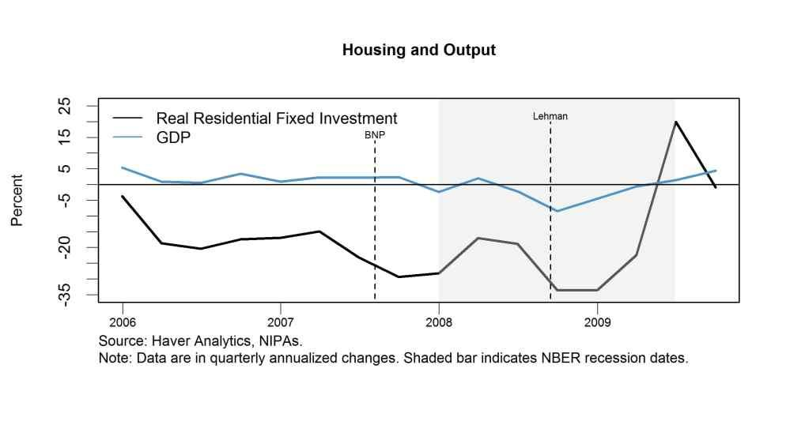

The global economic downturn known as the Great Recession, which took place from 2007 to 2009, underscored the deep interconnectedness between the housing market and the broader economy. This period was marked by a dramatic contraction in economic activity worldwide, stemming from a collapse in housing prices and the subsequent financial crisis. The destabilization of the housing market revealed how deeply the global financial system was intertwined with residential real estate values, leading to significant repercussions across various sectors of the economy.

This article examines the extensive economic impacts spawned by the Great Recession, specifically focusing on the housing market's critical role. It underscores the events that led to the collapse of the housing bubble and assesses how these developments influenced other economic domains. Furthermore, post-recession developments will be addressed, including the recovery trajectory of the housing market and the emergence of automated, algorithmic trading systems that have since gained traction as a significant force in financial markets.

The interconnected events from the bursting of the housing bubble to the advent of sophisticated trading technologies illustrate how past economic challenges can inform current and future market strategies. Grasping the historical interactions between housing markets and economic forces provides valuable insights into potential vulnerabilities and opportunities within the modern economic landscape.

## Table of Contents

## The Housing Market and Economic Impact during the Great Recession

The housing market collapse in 2006 served as the initial trigger for a series of events leading to the Great Recession from 2007 to 2009. This downturn was primarily fueled by loose lending practices and a dramatic increase in subprime mortgages, which inflated housing prices to unsustainable levels. These subprime mortgages were often granted to borrowers with poor credit histories, under the belief that rising home prices would mitigate the risk associated with these loans.

As housing prices began to stall and then decline, many homeowners found themselves with mortgages that exceeded the value of their homes. This situation, known as being "underwater," led to a surge in defaults and foreclosures. The impact was magnified by the extensive use of financial instruments such as mortgage-backed securities (MBS) and credit default swaps (CDS), which had proliferated during the housing boom.

Mortgage-backed securities are financial products that bundle together a group of home loans and sell them to investors. These securities were highly attractive due to their seemingly high returns, with many backed by the subprime mortgages previously mentioned. However, as defaults increased, the value of these MBS plummeted, creating significant losses for banks and investors who held them.

Credit default swaps further exacerbated the crisis. CDS are essentially insurance contracts that protect holders against defaults in debt instruments like MBS. Financial institutions, such as investment banks and insurance companies, entered into extensive CDS agreements, believing they were hedging their risks. However, the sheer [volume](/wiki/volume-trading-strategy) of CDS created a complex and opaque network of financial obligations that magnified the shock when the underlying loans defaulted.

The rapidly deteriorating situation prompted government intervention in an attempt to stabilize the financial system. The collapse of major financial institutions, such as Lehman Brothers, ignited a global financial panic, necessitating extraordinary measures from governments worldwide. These measures included significant bailouts for banks and massive infusions of [liquidity](/wiki/liquidity-risk-premium) into the financial markets.

In summary, the housing market's meltdown, driven by unsustainable lending practices and ambitious financial engineering, had a profound impact on the global economy during the Great Recession. The cascading failures of financial instruments like mortgage-backed securities and credit default swaps highlighted the vulnerability of interconnected financial systems, prompting a re-evaluation of regulatory frameworks and risk management practices.

## Aftermath and Housing Market Recovery

The Great Recession's aftermath significantly altered the housing market dynamics, imposing a downward pressure on home values and construction efforts. As the economy sought recovery, the housing sector was met with a restricted supply amid burgeoning demand, creating a challenging environment for market participants.

A critical regulatory response to this crisis was the establishment of the Dodd-Frank Wall Street Reform and Consumer Protection Act in 2010. This comprehensive legislation aimed to avert future economic breakdowns of a similar magnitude by increasing transparency in the financial system and imposing stricter regulations on financial institutions. Key provisions of the Dodd-Frank Act included the formation of the Consumer Financial Protection Bureau (CFPB) to monitor consumer products, the Volcker Rule to limit speculative investments by banks, and enhanced oversight of derivatives and financial instruments responsible for amplifying the financial crisis.[^1][^2]

Despite these efforts, the housing market's recovery trajectory was protracted. Home values and real estate development experienced a period of stagnation as financial institutions tightened lending standards and potential buyers faced credit constraints. This slow recovery period could be attributed, in part, to lingering uncertainties in the financial markets and consumer confidence post-crisis.

However, the COVID-19 pandemic in 2020 stimulated notable shifts in the housing landscape. The sudden emphasis on remote work and the pursuit of larger living spaces drove a surge in housing demand. Urban-to-suburban migration trends emerged as individuals and families sought residences that could accommodate home offices and offer greater comfort during prolonged periods of stay-at-home mandates. This shift prompted a revitalization in the housing market with increased buying activity, which influenced house pricing and inventory distribution across different regions.[^3]

As the housing market adapts to the evolving demands and economic conditions set forth by the pandemic, it faces the challenge of balancing supply and demand with ongoing regulatory measures aimed at ensuring financial stability. The continuous adaptation to these external conditions demonstrates the resilient yet vulnerable nature of the housing sector in the post-recession era.

[^1]: Financial Crisis Inquiry Commission. "The Financial Crisis Inquiry Report." Government Printing Office, 2011.
[^2]: Paletta, D. & Solomon, D. "Dodd-Frank Act: What It Does, What It Means." The Wall Street Journal, 2010.
[^3]: Meen, G. "The Long-Run Relationship Between Housing Prices and Income: Evidence from Local Housing Market Data." Journal of Housing Economics, 2022.

## The Rise of Algorithmic Trading in the Post-Recession Era

In the aftermath of the Great Recession, the financial landscape witnessed a transformative shift with the rise of [algorithmic trading](/wiki/algorithmic-trading). This technology, predicated upon pre-set rules and complex algorithms, enabled the execution of trades at velocities and frequencies previously unattainable by human traders, significantly altering the functioning of financial markets.

Algorithmic trading operates by leveraging mathematical models and sophisticated software to make rapid trading decisions. The underlying algorithms are designed to adhere to specified criteria, such as timing, price, or quantity, and can react to market conditions within milliseconds. This capability not only enhances the efficiency of trade execution but also has profound implications for market dynamics, particularly concerning liquidity and [volatility](/wiki/volatility-trading-strategies).

The introduction of algorithmic trading contributed to increased market liquidity by enabling more trades to occur rapidly and efficiently. Liquidity, crucial for the smooth operation of financial markets, reflects the ease with which assets can be bought or sold without causing a significant movement in their price. By using algorithmic trading, financial institutions can provide continuous bid and ask prices, facilitating more active trading and narrower bid-ask spreads. This is particularly beneficial during periods of market stress, where maintaining liquidity is essential to avoiding panic and sharp price movements.

However, while algorithmic trading can enhance liquidity, it also introduces the risk of increased volatility. The automation and speed of trades can lead to rapid price swings, especially during times of high market stress or unexpected economic news. Algorithmic trading systems may respond to sudden market movements by executing a flurry of trades that amplify price fluctuations. This phenomenon was notably observed during the "Flash Crash" of May 6, 2010, when major US equity indices plummeted and then quickly recovered within minutes, an event that underscored the potential risks associated with high-frequency trading ([HFT](/wiki/high-frequency-trading-strategies)).

Algorithmic trading systems hold the potential to influence broader economic trends by shaping the behavior of financial markets. These systems can respond to economic indicators and policy changes with high speed, effectively anticipating and reacting to shifts in economic conditions. As such, algorithmic trading not only impacts asset prices and market liquidity but can also have secondary effects on investment strategies and risk management practices across the financial industry.

In addition to liquidity and volatility concerns, the rise of algorithmic trading has catalyzed discussions regarding market fairness and transparency. Critics argue that the technological advantage held by entities employing sophisticated algorithms may marginalize smaller investors, potentially skewing market dynamics to favor large, tech-savvy trading firms.

Despite these challenges, algorithmic trading continues to evolve, propelled by advancements in [artificial intelligence](/wiki/ai-artificial-intelligence) and big data analytics. As financial markets grow increasingly complex, the role of algorithmic trading systems is likely to expand, necessitating a careful balance between technological innovation and regulatory oversight to ensure market stability and integrity.

## Current Housing Market and Future Prospects

The current housing market is dealing with the enduring consequences of the Great Recession and the more recent disruptions caused by the COVID-19 pandemic. These challenges have created a complex environment characterized by fluctuating home prices and varying regional trends. The pandemic has notably altered the way people work, with an increase in remote working arrangements leading to shifts in housing demand. Urban centers have experienced changes in population density, with some residents moving to suburban or rural areas in search of more space and affordable housing.

Interest rates, a critical [factor](/wiki/factor-investing) influencing housing markets, have remained relatively low since the pandemic's onset. Central banks around the world implemented monetary policies designed to stimulate economic activity by keeping borrowing costs low. While this has supported increased housing demand, it has also led to significant price inflations in some markets, raising concerns about affordability and potential bubbles in certain regions.

Market predictions indicate significant regional variations in home prices, influenced by local economic conditions, supply chain issues, and the evolving dynamics of remote work. For instance, areas with a strong tech sector presence or robust job markets may see sustained demand, while regions that are heavily reliant on physical presence jobs might face stagnation.

Regulatory measures and economic policies have been directed towards stabilizing the market and preventing systemic risks akin to those exposed during the Great Recession. The enforcement of stricter lending standards and the oversight of financial products has aimed to mitigate risks of widespread defaults and economic fallout.

Algorithmic trading has emerged as an influential tool in the post-Recession financial landscape, providing potential opportunities for investment in the housing market. These automated methods allow for rapid transaction speeds and increased market liquidity, though they also introduce potential volatility and require careful regulation to ensure market stability. As technology advances, investments based on algorithmic models may offer new strategies for market participation and hedging against risks.

Overall, the housing market's future is marked by uncertainty, as it adapts to the lingering effects of past economic disruptions and the ongoing shifts instigated by the COVID-19 pandemic. Policymakers and investors continue to seek a balance between fostering growth, ensuring affordability, and maintaining the market's integrity.

## Conclusion

The interconnectedness between the housing market and the broader economy was starkly highlighted by the Great Recession, illustrating the profound impact that fluctuations in one sector can have on global financial stability. The collapse of the housing bubble triggered a domino effect, influencing financial markets worldwide and demonstrating the vulnerabilities inherent in the intertwining of complex financial products with real estate markets. This highlights the ongoing necessity to carefully monitor and regulate these connections to safeguard against similar crises.

Future market stability may hinge on achieving a balance between regulatory oversight and the incorporation of technological advancements, such as algorithmic trading, in financial practices. Algorithmic trading, with its capacity for rapid data processing and execution, offers opportunities for increased market efficiencies but also presents challenges in terms of market volatility and the risk of automated cascades in trading activities during times of stress. Therefore, regulatory frameworks like the Dodd-Frank Act, aimed at enhancing transparency and accountability, remain critical in ensuring that technological progress does not outpace prudent risk management.

By learning from the disturbances of the past, such as those observed during the Great Recession, financial systems can be better equipped to anticipate and mitigate future economic disruptions. This involves not only refining economic models and stress testing against potential market shocks but also integrating robust safeguards that account for both traditional market dynamics and the novel complexities introduced by automated systems. The insights gained from historical economic challenges can inform policies and strategies designed to foster resilience and stability in an ever-evolving financial landscape.

## References & Further Reading

[1]: Financial Crisis Inquiry Commission. "The Financial Crisis Inquiry Report." Government Printing Office, 2011.

[2]: Paletta, D., & Solomon, D. "Dodd-Frank Act: What It Does, What It Means." The Wall Street Journal, 2010.

[3]: Meen, G. "The Long-Run Relationship Between Housing Prices and Income: Evidence from Local Housing Market Data." Journal of Housing Economics, 2022.

[4]: Gorton, G. B. "Slapped by the Invisible Hand: The Panic of 2007." Oxford University Press, 2010.

[5]: Shiller, R. J. "The Subprime Solution: How Today's Global Financial Crisis Happened, and What to Do about It." Princeton University Press, 2008.

[6]: Lewis, M. "The Big Short: Inside the Doomsday Machine." W. W. Norton & Company, 2010.

[7]: Hendershott, T., Jones, C. M., & Menkveld, A. J. "Does Algorithmic Trading Improve Liquidity?" The Journal of Finance, 66(1), 1-33, 2011.

[8]: Johnson, N., Zhao, G., Hunsader, E., Meng, J., Ravindar, A., Carran, S., & Tivnan, B. "Abrupt Rise of New Machine Ecology Beyond Human Response Time." Scientific Reports 3, Article number: 2627, 2013.

[9]: Lopez de Prado, M. "Advances in Financial Machine Learning." Wiley, 2018.