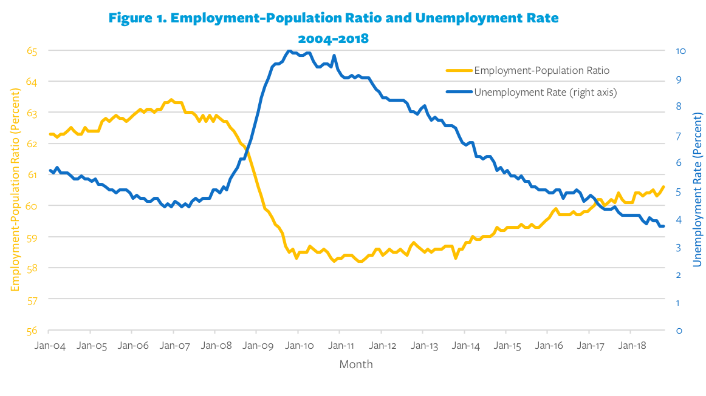

## Table of Contents

## What is the Great Recession?

The Great Recession was a big economic problem that started in the United States in 2007 and spread to many countries around the world. It was caused by problems in the housing market, where many people had taken out loans they couldn't pay back. Banks that had given out these loans started to lose a lot of money, which made them stop lending money to other people and businesses. This led to a lot of businesses closing and many people losing their jobs.

The effects of the Great Recession were felt for many years. In the United States, it officially lasted from December 2007 to June 2009, but the recovery was slow. Many people had a hard time finding new jobs, and some people lost their homes because they couldn't pay their mortgages. Governments around the world had to take action to try to fix the economy, like giving money to banks and creating programs to help people. It took a long time for things to get back to normal, and some people felt the effects for many years after the recession officially ended.

## What is structural unemployment?

Structural unemployment happens when there are not enough jobs for people because the economy has changed. This can happen when new technology or new ways of doing things make some jobs go away. For example, if a factory starts using robots instead of people, the workers who used to work there might not have the skills to do other jobs. This type of unemployment is different from when people lose their jobs because of a short-term problem, like a recession.

It can be hard to fix structural unemployment because it means people need to learn new skills or move to where the jobs are. Sometimes, the government or schools can help by offering training programs. But it can take a long time for people to learn new skills and find new jobs. This is why structural unemployment can be a big problem for a long time, even when the economy is doing well in other ways.

## How did the Great Recession begin?

The Great Recession started because of problems in the housing market in the United States. Many people had taken out loans to buy houses, but these loans were risky because the people couldn't always pay them back. Banks had given out a lot of these risky loans, called subprime mortgages, and they thought they could sell them to other investors. But when people started to default on their loans, the value of these mortgages dropped a lot. This caused big problems for banks and other financial institutions that had invested in them.

As banks lost money, they stopped lending to other people and businesses. This made it hard for businesses to grow and for people to buy things. When businesses can't grow and people can't buy things, the economy slows down. This slowdown spread from the United States to other countries around the world. By the end of 2007, the economy was in a recession, and it officially lasted until mid-2009, though the effects were felt for much longer.

## What industries were most affected by the Great Recession?

The Great Recession hit many industries hard, but some were affected more than others. The housing industry was one of the first to feel the impact because it all started with problems in the housing market. When people couldn't pay their mortgages, construction slowed down a lot. Many builders and real estate agents lost their jobs. The financial industry was also hit hard because banks had invested a lot in those risky loans and lost a lot of money when people couldn't pay them back.

Another industry that was badly affected was manufacturing. When banks stopped lending money, businesses couldn't get the funds they needed to keep making things. This led to factories closing and many workers losing their jobs. The auto industry in the United States was especially hard hit, with big companies like General Motors and Chrysler needing government help to stay in business. Retail also suffered because people had less money to spend, so many stores closed and retail workers lost their jobs. Overall, the Great Recession caused a lot of pain across many different industries.

## How did the Great Recession influence structural unemployment?

The Great Recession made structural unemployment worse. When the economy got bad, a lot of people lost their jobs. Some of these jobs were in industries that were already changing because of new technology or new ways of doing things. For example, some factories started using robots instead of people. This meant that even when the economy started to get better, the jobs that people used to have were not coming back. They needed to learn new skills or move to where the new jobs were, but this was hard to do.

The government and schools tried to help by offering training programs. But it took a long time for people to learn new skills and find new jobs. This made structural unemployment a big problem even after the Great Recession was over. Many people who lost their jobs during the recession stayed unemployed for a long time because they couldn't find work that matched their skills. This showed how the Great Recession made the problem of structural unemployment even worse.

## What were the long-term effects of the Great Recession on the labor market?

The Great Recession had big effects on the labor market that lasted a long time. Many people lost their jobs during the recession, and even when the economy started to get better, it was hard for them to find new work. This was because some of the jobs that were lost were in industries that were changing, like factories that started using robots instead of people. So, even when the economy was doing better, these jobs were not coming back. People had to learn new skills or move to where the new jobs were, but this was not easy to do. This made the problem of structural unemployment worse, and many people stayed out of work for a long time.

Another long-term effect was that people who did find jobs often had to take ones that paid less or were not as good as their old jobs. This meant that even though they were working again, they were not earning as much money as before. This was hard for them and their families. Also, young people who were just starting their careers during the recession had a harder time finding good jobs. This could affect their whole careers because they started with lower pay and less good jobs. Overall, the Great Recession made the labor market worse in many ways that lasted for years.

## How did government policies respond to structural unemployment during the Great Recession?

Governments tried to help with structural unemployment during the Great Recession by making new programs. They knew that many people had lost their jobs and needed to learn new skills to find work again. So, they started job training programs to help people learn new things. These programs taught people how to do jobs that were in demand, like working with computers or in healthcare. The idea was to help people get the skills they needed to find new jobs in industries that were growing.

Another way governments tried to help was by giving money to people who were out of work. This money, called unemployment benefits, helped people pay their bills while they looked for new jobs. Governments also tried to create new jobs by spending money on big projects, like building roads or schools. This was supposed to help the economy get better and give people more chances to find work. But even with all these efforts, it took a long time for the labor market to get better, and many people still had a hard time finding good jobs.

## What role did automation and globalization play in structural unemployment during the Great Recession?

Automation and globalization made structural unemployment worse during the Great Recession. Automation means using machines and computers to do jobs that people used to do. For example, factories started using robots to make things instead of hiring workers. This meant that even when the economy started to get better, the jobs that people used to have in factories were not coming back. They had to learn new skills to work with computers or in other growing industries, but this was hard to do. Globalization also played a role because companies started moving their factories to other countries where it was cheaper to make things. This meant fewer jobs in places like the United States, and people had to find new work in different industries.

Both automation and globalization made it harder for people who lost their jobs during the Great Recession to find new work. When the economy got bad, a lot of people lost their jobs, and many of these jobs were in industries that were already changing because of automation and globalization. So, even when the economy started to recover, the old jobs were not there anymore. People had to learn new skills or move to where the new jobs were, but this took time and was not easy. This is why structural unemployment became a big problem that lasted long after the Great Recession was over.

## How did the Great Recession's impact on structural unemployment vary by region?

The Great Recession affected different regions in different ways when it came to structural unemployment. In places like the Midwest of the United States, where a lot of people worked in factories, the recession hit hard. Many factories closed because of the economic downturn, but also because they were using more robots and moving jobs to other countries. This meant that even when the economy started to get better, the old factory jobs were not coming back. People in these areas had to learn new skills or move to find work, but this was hard and took a long time.

In other regions, like the coastal cities on the East and West coasts of the United States, the impact was different. These areas had more jobs in technology and services, which were growing even during the recession. But even here, some people still faced structural unemployment. For example, if they had skills that were no longer in demand, like working in real estate, they had to learn new things to find work. So, while the overall impact might have been less severe in these regions, structural unemployment was still a problem that affected many people.

## What are some case studies of industries that experienced increased structural unemployment due to the Great Recession?

The auto industry in the United States is a good example of an industry that saw a lot of structural unemployment during the Great Recession. Many car companies, like General Motors and Chrysler, had to close factories and lay off workers because people were not buying as many cars. But even when the economy started to get better, these factories did not open again because the companies were using more robots and moving some of their work to other countries. This meant that the old jobs were gone for good. Workers who used to build cars had to learn new skills or move to find work, but this was hard and took a long time.

Another example is the manufacturing industry, especially in places like the Midwest. Many factories that made things like steel or machinery had to close during the recession. But even after the economy got better, these factories did not reopen because they were using more machines and moving work to other countries where it was cheaper. This left a lot of workers without jobs and made it hard for them to find new work. They had to learn new skills or move to where the new jobs were, but this was not easy. So, the Great Recession made the problem of structural unemployment in manufacturing even worse.

## How have economic theories about structural unemployment evolved since the Great Recession?

Since the Great Recession, economists have been thinking more about how structural unemployment works. They used to think that structural unemployment was mostly about people not having the right skills for the jobs that were available. But after the recession, they saw that it was more complicated. They realized that things like automation and globalization were making big changes in the economy. These changes were causing jobs to disappear in some industries, even when the economy was doing better. So, economists started to focus more on how these big changes were affecting the job market and making it harder for people to find work.

Another thing that economists learned is that structural unemployment can last a long time. They saw that even after the Great Recession was over, many people were still out of work because the jobs they used to have were gone for good. This made them think more about how to help people who lose their jobs because of big changes in the economy. They started to talk more about the need for better job training programs and other ways to help people learn new skills. They also thought about how to make the economy more fair so that everyone has a chance to find good work, even when the economy is changing a lot.

## What strategies have been effective in reducing structural unemployment post-Great Recession?

Since the Great Recession, one effective strategy to reduce structural unemployment has been to offer better job training programs. These programs help people learn new skills that are in demand in the job market. For example, if someone used to work in a factory that closed, they can learn how to work with computers or in healthcare. Governments and schools have been working together to make these programs better and more available to people who need them. This has helped some people find new jobs and get back to work, even if the jobs they used to have are gone for good.

Another strategy that has worked is helping people move to where the new jobs are. Sometimes, the jobs that are growing are in different places from where people live. So, governments have been trying to help people move to these new areas by offering things like housing assistance or help with moving costs. This can make it easier for people to find work in industries that are doing well, even if it means leaving their old homes behind. Both of these strategies have been important in helping to reduce structural unemployment after the Great Recession.

## What was the economic impact of structural unemployment during the Great Recession?

The Great Recession, which spanned from 2007 to 2009, significantly altered the economic landscape, leading to prolonged periods of high unemployment levels. This was especially marked by a rise in structural unemployment. Structural unemployment arises when there are fundamental changes within an economy that decrease the demand for certain skills, often due to technological innovation, globalization, or shifts in consumer preferences. During the Great Recession, structural unemployment became more pronounced as industries failed to recover at the same pace as before, leading to many workers finding themselves with skills that were no longer in demand.

One notable sector severely affected by structural unemployment during the Great Recession was manufacturing. The manufacturing sector, which had already been experiencing a decline due to globalization and increased automation, suffered a more profound decrease in employment opportunities. Companies increasingly adopted technology to improve efficiency, resulting in fewer jobs for low-skilled workers. For example, the use of robots in automotive manufacturing reduced the need for assembly line workers, accelerating the trend of job displacement among less technologically skilled workers.

Another sector profoundly impacted by structural unemployment was real estate. Post-recession, the real estate market saw a considerable change with financial institutions adopting more stringent lending criteria. As a result, the construction industry witnessed a significant downturn. The reduction in housing starts and commercial projects meant that construction workers and real estate [agents](/wiki/agents) faced prolonged unemployment periods. These job losses were often permanent as the sector adjusted to a new normal, reducing demand for traditional roles previously abundant in the industry.

The long-term consequences for workers displaced due to these structural shifts were severe. Many faced reduced [earning](/wiki/earning-announcement) potential as they were often forced to accept lower-paying jobs outside their expertise. Skill mismatches became prevalent, as the evolving job market demanded new competencies that the displaced workforce lacked. This mismatch created a significant barrier to reemployment and often necessitated retraining or upskilling.

To illustrate the mathematics behind earning potential post-displacement, consider the present value of lifetime earnings formula:

$$
PV = \sum_{t=0}^{T} \frac{E_t}{(1 + r)^t}
$$

Where:
- $PV$ is the present value of lifetime earnings,
- $E_t$ is the earnings in year $t$,
- $r$ is the discount rate, 
- $T$ is the total number of years until retirement.

For many displaced workers, $E_t$ decreased significantly post-recession, reducing the present value of their lifetime earnings.

In conclusion, the Great Recession left a lasting impact on structural unemployment within key sectors like manufacturing and real estate. The resulting shift not only led to immediate job losses but also imposed enduring economic challenges on the displaced workforce. Addressing these issues requires comprehensive retraining programs and policies aimed at aligning workforce skills with the changing economic demands.

## References & Further Reading

1. Autor, D. H., & Dorn, D. (2013). [The Growth of Low-Skill Service Jobs and the Polarization of the US Labor Market](https://www.aeaweb.org/articles?id=10.1257/aer.103.5.1553). *American Economic Review*, 103(5), 1553-1597.

2. Bessen, J. E. (2019). [AI and Jobs: The Role of Demand](https://www.nber.org/papers/w24235). *NBER Working Paper No. 24235.*

3. Lopez de Prado, M. (2018). [Advances in Financial Machine Learning](https://www.amazon.com/Advances-Financial-Machine-Learning-Marcos/dp/1119482089). Wiley.

4. Chan, E. P. (2009). [Quantitative Trading: How to Build Your Own Algorithmic Trading Business](https://github.com/ftvision/quant_trading_echan_book). Wiley.

5. Jansen, S. (2020). [Machine Learning for Algorithmic Trading](https://github.com/stefan-jansen/machine-learning-for-trading). Packt Publishing.

6. Aronson, D. R. (2006). [Evidence-Based Technical Analysis: Applying the Scientific Method and Statistical Inference to Trading Signals](https://www.semanticscholar.org/paper/Evidence-Based-Technical-Analysis%3A-Applying-the-and-Aronson/3b33df8737f1772e9e14d66a08c9696f140a2ee1). Wiley.

7. Bergstra, J., Bardenet, R., Bengio, Y., & Kégl, B. (2011). [Algorithms for Hyper-Parameter Optimization](https://dl.acm.org/doi/10.5555/2986459.2986743). Advances in Neural Information Processing Systems 24.