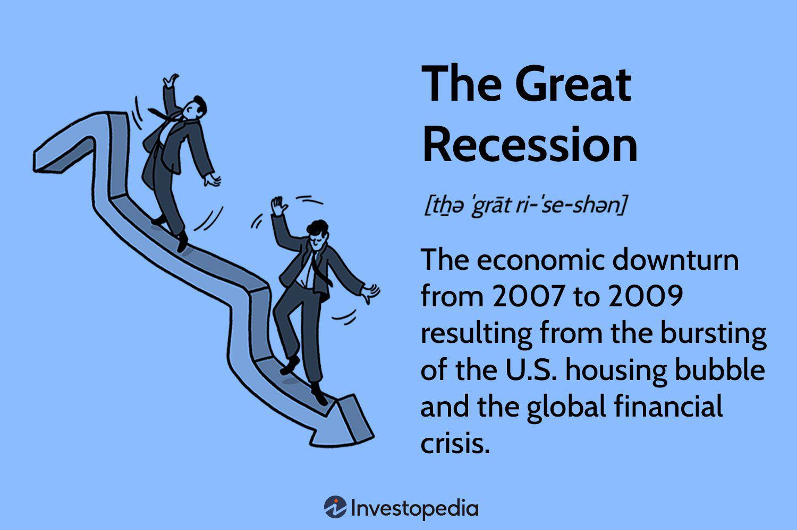

The onset of the Great Recession marked a pivotal moment in global economic history, characterized by a severe contraction in economic activity and a sharp rise in unemployment rates. Triggered by the collapse of major financial institutions in 2008, the recession impacted economies worldwide, leading to widespread job losses and financial instability. Amid this period, structural unemployment—defined as a mismatch between the skills of the labor force and the demands of the labor market—emerged as a profound and enduring challenge.

Unlike cyclical unemployment, which fluctuates with the economic cycle, structural unemployment persists even in times of economic recovery. This type of unemployment became increasingly prominent during the Great Recession as technological advancements and sectoral shifts transformed the employment landscape. As traditional industries declined and new, technology-centric sectors emerged, many workers found their skills obsolete, leading to prolonged periods of joblessness and a need for retraining and reskilling.

This article examines the intricate relationship between structural unemployment and its economic impact during the Great Recession. It also investigates into how algorithmic trading—an automated method using complex algorithms to execute financial trades—rose to prominence in the post-recession economy. The interplay of these factors plays a crucial role in shaping employment trends and market dynamics, making it imperative for policymakers, economists, and investors to grasp these complexities to effectively navigate the evolving economic environment. Understanding these dynamics is vital in addressing the long-term consequences of structural shifts and ensuring economic resilience in future downturns.

## Table of Contents

## Understanding Structural Unemployment

Structural unemployment represents a fundamental mismatch between the skills possessed by workers and the skills demanded by employers. Unlike cyclical unemployment, which is temporary and linked to the economic cycle, and frictional unemployment, which is a result of normal labor turnover, structural unemployment is more entrenched and long-lasting. It arises from changes in the economy that alter the structure of labor markets, rendering certain skills obsolete while increasing the demand for new skills.

Economic shifts, particularly those driven by globalization and technological innovation, play a crucial role in exacerbating structural unemployment. Globalization has prompted many organizations to relocate their production facilities to countries with lower labor costs, reducing demand for domestic manufacturing jobs. This shift has been compounded by technological advancements, especially automation and digitalization, which have significantly affected labor demand in various sectors. For example, the integration of robotics and artificial intelligence in production processes has displaced workers in industrial roles that involve routine tasks.

In the wake of the Great Recession, several industries highlighted the transition towards structural unemployment. The manufacturing sector serves as a pertinent example, where automation and offshoring impacted traditional factory jobs. According to a report from the Bureau of Labor Statistics, manufacturing employment dramatically declined during the recession and did not fully recover in the subsequent years, despite a rebound in manufacturing output. This outcome reflected the increased efficiency facilitated by technological advancements, requiring fewer workers.

The real estate sector also offers insight into structural unemployment post-recession. As the housing bubble burst, a substantial loss of jobs in construction and real estate took place. However, the recovery in this sector was weak due to different demands, such as the increased need for energy-efficient homes, which required workers to acquire new skills in sustainable construction practices. 

Thus, structural unemployment underscores a significant challenge: the need for the workforce to adapt to changing industry requirements. Workers in sectors that experience structural shifts must often engage in retraining or skill enhancement programs to remain competitive. These dynamics highlight the importance of creating adaptable labor markets and providing robust retraining opportunities to mitigate the impact of structural changes on unemployment.

## Economic Impact of Structural Unemployment During the Great Recession

The Great Recession, which spanned from 2007 to 2009, significantly altered the economic landscape, leading to prolonged periods of high unemployment levels. This was especially marked by a rise in structural unemployment. Structural unemployment arises when there are fundamental changes within an economy that decrease the demand for certain skills, often due to technological innovation, globalization, or shifts in consumer preferences. During the Great Recession, structural unemployment became more pronounced as industries failed to recover at the same pace as before, leading to many workers finding themselves with skills that were no longer in demand.

One notable sector severely affected by structural unemployment during the Great Recession was manufacturing. The manufacturing sector, which had already been experiencing a decline due to globalization and increased automation, suffered a more profound decrease in employment opportunities. Companies increasingly adopted technology to improve efficiency, resulting in fewer jobs for low-skilled workers. For example, the use of robots in automotive manufacturing reduced the need for assembly line workers, accelerating the trend of job displacement among less technologically skilled workers.

Another sector profoundly impacted by structural unemployment was real estate. Post-recession, the real estate market saw a considerable change with financial institutions adopting more stringent lending criteria. As a result, the construction industry witnessed a significant downturn. The reduction in housing starts and commercial projects meant that construction workers and real estate [agents](/wiki/agents) faced prolonged unemployment periods. These job losses were often permanent as the sector adjusted to a new normal, reducing demand for traditional roles previously abundant in the industry.

The long-term consequences for workers displaced due to these structural shifts were severe. Many faced reduced [earning](/wiki/earning-announcement) potential as they were often forced to accept lower-paying jobs outside their expertise. Skill mismatches became prevalent, as the evolving job market demanded new competencies that the displaced workforce lacked. This mismatch created a significant barrier to reemployment and often necessitated retraining or upskilling.

To illustrate the mathematics behind earning potential post-displacement, consider the present value of lifetime earnings formula:

$$
PV = \sum_{t=0}^{T} \frac{E_t}{(1 + r)^t}
$$

Where:
- $PV$ is the present value of lifetime earnings,
- $E_t$ is the earnings in year $t$,
- $r$ is the discount rate, 
- $T$ is the total number of years until retirement.

For many displaced workers, $E_t$ decreased significantly post-recession, reducing the present value of their lifetime earnings.

In conclusion, the Great Recession left a lasting impact on structural unemployment within key sectors like manufacturing and real estate. The resulting shift not only led to immediate job losses but also imposed enduring economic challenges on the displaced workforce. Addressing these issues requires comprehensive retraining programs and policies aimed at aligning workforce skills with the changing economic demands.

## Role of Algorithmic Trading in the Post-Recession Economy

Algorithmic trading, also known as algo trading, refers to the use of computer algorithms to automate trading decisions and execute orders in financial markets at speeds and frequencies that are beyond human capability. This practice gained significant traction following the 2008 financial crisis due to the increased availability of computing power, advancements in software technology, and a growing competitive pressure on financial institutions to improve trading efficiency and reduce costs.

The rise of [algorithmic trading](/wiki/algorithmic-trading) post-2008 has had a considerable impact on job markets, particularly within the finance sector. Traditional roles, such as floor traders and brokers, have seen a decline as the demand for high-frequency trading capabilities increased. Simultaneously, there has been a surge in demand for quantitative analysts, data scientists, and software engineers who possess the skills necessary to develop and maintain these complex trading algorithms. This shift underscores the growing importance of interdisciplinary expertise that combines finance knowledge with proficiency in programming and data analysis.

One of the primary challenges presented by algorithmic trading is the potential for increased market [volatility](/wiki/volatility-trading-strategies). Algorithms can react to market conditions in milliseconds, executing trades much faster than human traders. This can sometimes result in erratic market behavior, as was seen during the 'Flash Crash' of May 6, 2010, when major stock indices in the USA dropped and then rebounded rapidly within minutes. Nevertheless, algorithms offer the opportunity to capitalize on small price discrepancies that would be unprofitable for ordinary traders, thereby enhancing market [liquidity](/wiki/liquidity-risk-premium).

Moreover, algorithmic trading provides substantial opportunities for investors and traders. One of the main benefits is the ability to backtest trading strategies using historical data, allowing traders to assess the viability of their models before deploying them in live markets. Additionally, algorithms can operate without the emotional biases that often affect human traders, potentially leading to more rational and systematic trading decisions.

Despite these advantages, the role of human oversight in algorithmic trading remains crucial. Machine learning and [artificial intelligence](/wiki/ai-artificial-intelligence) are increasingly being integrated into trading models, yet human judgment is essential to interpret complex market scenarios and manage situations where automated systems may malfunction or behave unpredictably.

In summary, algorithmic trading has fundamentally transformed the landscape of financial markets in the post-recession era, driving efficiency and creating new employment opportunities while also posing unique challenges related to market stability and the evolving skill requirements for finance professionals.

## Sectoral Shifts and Structural Unemployment

Sectoral shifts have profound implications for structural unemployment, particularly in the context of economic recessions. During such periods, economic transformations often become catalysts for altering the employment landscape, fostering long-term changes in labor markets. Recessions, by exerting financial pressures and catalyzing technological advancements, expedite transitions between various economic sectors, affecting employment patterns and workforce needs.

One notable pattern is the decline of traditional industries, such as manufacturing, and the concurrent rise of technology-centric sectors. This phenomenon was particularly evident during and after the Great Recession. The manufacturing sector, long considered a backbone of stable employment, faced significant declines due to automation and the global shift toward a service-oriented economy [1]. As industries that relied heavily on unskilled labor contracted, technology-centric industries, focused on innovation and efficiency, expanded their influence [2].

The ascension of technology-driven sectors such as information technology, renewable energy, and biotechnology has resulted in a demand for a workforce skilled in new technologies and adaptable to rapidly changing environments. This shift underscores the importance of cultivating skills that align with emerging industries. For instance, the increasing integration of artificial intelligence (AI) and [machine learning](/wiki/machine-learning) (ML) in various industries requires workers to acquire specialized technical skills which were previously unnecessary.

The implications for workforce adaptability are significant. Workers displaced from traditional industries often face challenges in transitioning to new roles due to skill mismatches. The obsolete skills of workers in declining industries, juxtaposed with the demand for advanced skills in burgeoning fields, can exacerbate structural unemployment. Consequently, there is an urgent need for comprehensive retraining programs that equip the workforce with the necessary skills to thrive in new economic sectors.

Governments and educational institutions play a vital role in facilitating these transitions. Implementing targeted retraining programs can help bridge the gap between existing skills and those required by growing sectors. For example, initiatives that focus on technical education and professional development can foster adaptability and mitigate unemployment risks. Furthermore, industry partnerships can ensure training curricula remain relevant and aligned with market demands.

In conclusion, sectoral shifts during recessions catalyze structural unemployment by disrupting traditional industries and promoting growth in technology-centric sectors. To address these challenges, proactive measures such as retraining programs are essential to prepare the workforce for future economic landscapes. By aligning educational initiatives with industry needs, it is possible to enhance workforce adaptability and reduce structural unemployment.

### References
1. Autor, D. H., & Dorn, D. (2013). The Growth of Low-Skill Service Jobs and the Polarization of the US Labor Market. *American Economic Review*, 103(5), 1553-1597.
2. Bessen, J. E. (2019). AI and Jobs: The Role of Demand. *NBER Working Paper No. 24235.*

## Governmental Policies: Mitigating Structural Unemployment

Following the Great Recession, various government interventions were implemented to address structural unemployment. These interventions primarily focused on job training programs and economic stimulus measures designed to boost job creation and facilitate skill acquisition.

### Job Training Programs: Successes and Shortcomings

Job training programs were a critical component of post-recession policy interventions. They aimed to equip workers with the skills demanded by emerging industries, thereby reducing the mismatch between job seekers and available positions. In the United States, programs such as the Workforce Investment Act (WIA), later succeeded by the Workforce Innovation and Opportunity Act (WIOA), were pivotal in providing training and career services. These programs offered individualized training plans, support for occupational skills training, and access to earn-and-learn models like apprenticeships.

The successes of these programs are notable in several areas. Firstly, they provided displaced workers with opportunities to retrain and gain credentials in high-demand fields, such as healthcare, information technology, and advanced manufacturing. Evaluations have shown that participants who completed these programs generally experienced higher employment rates and earnings compared to non-participants.

However, several shortcomings also emerged. The effectiveness of job training programs was often hindered by inadequate funding, resulting in limited capacity and resources. Additionally, the alignment of training curricula with industry needs was occasionally mismatched, leading to skills that were not always directly applicable to available jobs. Critics argued that the one-size-fits-all approach failed to address the unique local labor market needs, and the bureaucracy involved in accessing these programs could deter potential participants.

### Economic Stimulus Measures

Economic stimulus measures, particularly those under the American Recovery and Reinvestment Act (ARRA), played a significant role in mitigating structural unemployment by injecting public funds into infrastructure projects, educational institutions, and renewable energy initiatives. These measures not only aimed to create immediate jobs but also sought to lay the groundwork for future economic growth by investing in key sectors.

While these stimulus initiatives helped stabilize the economy, their impact on structural unemployment was nuanced. On the positive side, infrastructure projects created a demand for skilled labor, thereby offering employment opportunities for those with the requisite skills. However, the temporary nature of some of these projects meant that long-term employment stability was not always guaranteed.

### Recommendations for Policy Improvements

To more effectively address structural unemployment, several policy improvements can be recommended:

1. **Enhanced Funding and Flexibility**: Increasing the financial resources allocated to job training programs and allowing for greater flexibility in designing localized training initiatives can better meet the specific needs of various regions and sectors.

2. **Stronger Industry Partnerships**: Developing partnerships between governments, educational institutions, and private sector companies can ensure that training programs align closely with current industry demands. This collaboration can also facilitate greater apprenticeship and on-the-job training opportunities.

3. **Focus on Lifelong Learning**: Cultivating a culture of continuous education and skill development is essential in adapting to ongoing technological advancements and economic shifts. Policies should support lifelong learning by providing incentives for both workers and employers to engage in regular upskilling activities.

4. **Evaluation and Feedback Mechanisms**: Implementing robust evaluation frameworks for job training and stimulus programs can help identify areas of success and areas requiring improvement. Feedback from participants and industry stakeholders should be regularly solicited to ensure programs remain relevant and effective.

Overall, while governmental policies post-Great Recession offered essential support in addressing structural unemployment, ongoing adjustments and enhancements are necessary to build a resilient workforce capable of navigating future economic challenges.

## Conclusion

The confluence of structural unemployment, the economic transformations induced by the Great Recession, and the rise of algorithmic trading has fundamentally altered the employment landscape. Structural unemployment has proven to be a persistent drag on recovery, reflecting a misalignment between the skills possessed by the workforce and those demanded by the evolving economy. This misalignment was exacerbated by the recession, which accelerated shifts from traditional industries to sectors emphasizing advanced technology and automation.

Algorithmic trading, which gained prominence in the wake of the 2008 financial crisis, exemplifies these shifts. It optimized financial operations, but also reshaped job markets, particularly in finance, by favoring roles that require technical and analytical acumen. Consequently, workers previously engaged in more traditional roles have faced significant challenges in adapting to these new demands, highlighting the need for robust retraining and education initiatives.

The lessons from this period underscore the importance of resilience in economic structures and policies. To better navigate such structural changes in the labor market, continuous research into emerging economic patterns and innovations is vital. Policymakers must strive to create adaptable frameworks that can preemptively address potential mismatches between labor supply and demand. This involves not just rethinking job training and educational programs but also ensuring that economic policies are flexible enough to accommodate rapid technological and industrial changes.

Ultimately, fostering an adaptable workforce equipped to meet the demands of new industries is paramount. As the economic environment continues to evolve, proactive measures will be essential in equipping workers with relevant skills, thus allowing them to thrive in a world driven increasingly by technological advancement and innovation. By learning from the past and implementing forward-thinking strategies, societies can build a more resilient and inclusive economic future.

## References & Further Reading

1. Autor, D. H., & Dorn, D. (2013). [The Growth of Low-Skill Service Jobs and the Polarization of the US Labor Market](https://www.aeaweb.org/articles?id=10.1257/aer.103.5.1553). *American Economic Review*, 103(5), 1553-1597.

2. Bessen, J. E. (2019). [AI and Jobs: The Role of Demand](https://www.nber.org/papers/w24235). *NBER Working Paper No. 24235.*

3. Lopez de Prado, M. (2018). [Advances in Financial Machine Learning](https://www.amazon.com/Advances-Financial-Machine-Learning-Marcos/dp/1119482089). Wiley.

4. Chan, E. P. (2009). [Quantitative Trading: How to Build Your Own Algorithmic Trading Business](https://github.com/ftvision/quant_trading_echan_book). Wiley.

5. Jansen, S. (2020). [Machine Learning for Algorithmic Trading](https://github.com/stefan-jansen/machine-learning-for-trading). Packt Publishing.

6. Aronson, D. R. (2006). [Evidence-Based Technical Analysis: Applying the Scientific Method and Statistical Inference to Trading Signals](https://www.semanticscholar.org/paper/Evidence-Based-Technical-Analysis%3A-Applying-the-and-Aronson/3b33df8737f1772e9e14d66a08c9696f140a2ee1). Wiley.

7. Bergstra, J., Bardenet, R., Bengio, Y., & Kégl, B. (2011). [Algorithms for Hyper-Parameter Optimization](https://dl.acm.org/doi/10.5555/2986459.2986743). Advances in Neural Information Processing Systems 24.