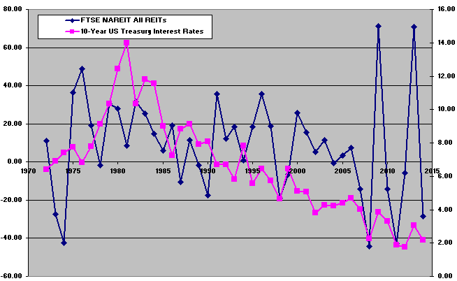

In recent years, the investment landscape has been significantly reshaped by the interplay of fluctuating interest rates, advancements in trading technologies, and the emergence of new financial instruments. A key challenge for today's investors is optimizing portfolios in the face of high interest rates, which, while presenting hurdles, simultaneously offer intriguing opportunities for enhancing financial returns. This article examines the complex relationships between high interest rates, Real Estate Investment Trusts (REITs), and algorithmic trading.

High interest rates, often used by central banks as a tool to combat inflation and stabilize economies, have an undeniable impact on borrowing costs and consumer spending, which in turn affect investment returns across various asset classes. For investors, understanding these dynamics is crucial to managing and capitalizing on the financial market shifts.



Among the financial instruments influenced by interest rate changes are Real Estate Investment Trusts (REITs), which provide a means to gain exposure to real estate markets without requiring direct ownership of properties. Additionally, the rise of algorithmic trading has revolutionized investment approaches by leveraging advanced technologies and mathematical models to execute trades at speeds unattainable by human traders. Algorithmic trading strategies, particularly in high interest rate environments, can capitalize on market volatilities that these conditions often introduce.

By exploring the connections between these components, investors can develop a more nuanced understanding of the current financial environment and adjust their strategies accordingly. This knowledge is essential for navigating the evolving markets and uncovering future opportunities for growth. As we explore how high interest rates, REITs, and algorithmic trading impact investment strategies and future opportunities, investors are empowered to make well-informed decisions.

## Table of Contents

## Understanding High Interest Rates

High interest rates serve as a tool for central banks to mitigate inflation and maintain economic stability. By increasing interest rates, central banks aim to reduce the money supply in the economy, leading to decreased consumer spending and borrowing. This strategy can help curb inflationary pressures, as consumers and businesses are encouraged to save rather than spend. High interest rates also impact investment returns across various asset classes, as they increase the cost of borrowing and influence the yield on income-generating securities.

For investors, understanding the dynamics of interest rate changes is crucial in managing their portfolios. Interest rates directly affect income-generating securities such as bonds and fixed-income investments. As interest rates rise, the price of existing bonds generally falls, since newer bonds are issued with higher yields, making older bonds with lower returns less attractive. This inverse relationship between interest rates and bond prices is fundamental in fixed-income investing.

The current [interest rate](/wiki/interest-rate-trading-strategies) environment is shaped by several macroeconomic factors, including inflation trends, central bank policies, and global economic conditions. For instance, if inflation rates persistently exceed central bank targets, policymakers may opt to increase interest rates to preemptively temper economic overheating. This has potential implications for global markets, affecting capital flows, currency valuations, and international trade dynamics.

Investors looking to benefit from high interest rates can adopt several strategies. One approach is to focus on short-duration bonds, which are less sensitive to interest rate changes than long-term bonds. Additionally, investing in sectors that traditionally perform well during periods of high interest rates, such as financial services, can also be advantageous. These sectors may benefit from improved net interest margins as the cost of borrowing increases. Furthermore, dividend-paying stocks can serve as a buffer against rising interest rates, offering a steady income stream that can be attractive amidst volatile market conditions.

In conclusion, high interest rates [carry](/wiki/carry-trading) significant influence over economic activity and investment landscapes. By understanding their impact, investors can make informed decisions to optimize their portfolios. Through strategic asset allocation and a keen awareness of market conditions, it is possible to navigate the challenges and capitalize on the opportunities presented by a high interest rate environment.

## The Role of Real Estate Investment Trusts (REITs)

Real Estate Investment Trusts (REITs) have emerged as a significant investment vehicle, offering individuals the opportunity to invest in large-scale, income-producing real estate without the complexities of direct property ownership. This unique approach allows investors to partake in real estate markets, which have traditionally been reserved for more substantial capital investments.

### Impact of High Interest Rates on REITs

High interest rates have a multifaceted impact on REITs, primarily affecting property valuations, borrowing costs, and dividend yields. When interest rates rise, borrowing costs for REITs often increase as well, since these entities typically leverage debt to finance property acquisitions and development. This can lead to tighter profit margins, as the cost of maintaining or expanding real estate holdings becomes more expensive.

Additionally, higher interest rates can lead to increased capitalization rates, which may result in lower property valuations. The capitalization rate, or cap rate, is used to estimate the return on investment for a real estate property and is inversely related to property value. When cap rates rise due to higher interest rates, property values generally decrease, which can impact the net asset value of REITs.

Moreover, dividend yields offered by REITs might become less attractive relative to the yields of safer, fixed-income securities when interest rates are elevated. Investors may demand higher yields from REITs to compensate for the increased risk and to remain competitive with the returns from bonds and other interest-bearing instruments.

### Characteristics and Performance in High Interest Environments

REITs are characterized by their obligation to distribute at least 90% of their taxable income to shareholders in the form of dividends, making them appealing primarily for income-seeking investors. The performance of REITs in high interest rate environments varies across different sectors within the REIT market. For instance, sectors such as healthcare and residential REITs may show resilience due to consistent demand. In contrast, retail and office REITs might suffer more due to potential reductions in consumer spending and shifts towards remote work, respectively.

### Strategies for Portfolio Diversification

Incorporating REITs into a diversified portfolio requires a strategic approach, especially amidst fluctuating interest rates. One effective strategy is to focus on sectors that exhibit stable demand regardless of the broader economic climate, such as those involved in healthcare and logistics. Geographic diversification can also mitigate risks associated with regional economic downturns or interest rate changes.

### Sector Analysis

Certain REIT sectors may thrive in high interest rate conditions due to their ability to pass increased costs onto tenants or because of their strong market positions. Industrial REITs, for instance, benefit from enduring demand for distribution and storage solutions due to the growth of e-commerce. Conversely, hospitality REITs might struggle as increased borrowing costs and potential reductions in discretionary spending weigh on the sector.

In summary, while high interest rates pose specific challenges to REITs, understanding their unique characteristics and leveraging strategic diversification can enable investors to optimize returns. By evaluating the performance of various REIT sectors and crafting a portfolio that balances risk and reward, investors can effectively navigate shifts in interest rates.

## Algorithmic Trading: Revolutionizing Investment Approaches

Algorithmic trading employs sophisticated technologies and mathematical models to execute trades at a pace that surpasses human capability. This method is characterized by the use of algorithms—predefined sets of rules and strategies—to analyze market data and identify potential trading opportunities. The automation achieved through [algorithmic trading](/wiki/algorithmic-trading) allows for the rapid execution of trades, often within fractions of a second. This speed is crucial in modern financial markets, where delays can result in significant opportunity costs.

In environments marked by high interest rates, financial markets may experience increased [volatility](/wiki/volatility-trading-strategies). Such volatility arises because changes in interest rates can influence market behaviors, affecting asset valuations and investor sentiment. Algorithmic strategies are particularly adept at capitalizing on this volatility. By continuously monitoring market conditions and executing trades based on real-time data, algorithmic systems can exploit short-lived trading opportunities that human traders might miss.

Algorithms can adapt to changing market conditions, including fluctuations in interest rates, by employing a variety of strategies. For instance, mean reversion strategies, which assume that prices will revert to their historical averages, can be coded to take advantage of temporary mispricings affected by interest rate changes. Trend-following algorithms, on the other hand, focus on identifying and capitalizing on emerging market trends, which may be influenced by rate adjustments.

While algorithmic trading offers numerous advantages, it is not without risks. One benefit is the ability to process vast amounts of market data at high speeds, allowing for better-informed trading decisions. Additionally, algorithms can operate without fatigue, reducing the impact of human emotions on trading decisions. However, reliance on algorithms also introduces potential risks, including technical failures, overfitting to historical data, and a lack of flexibility in unforeseen market circumstances. Furthermore, high-frequency trading, a subset of algorithmic trading, can contribute to market instability, as evidenced by events like the 2010 Flash Crash.[^1][^2]

Investors and institutions are increasingly turning to algorithmic trading to maintain a competitive edge. By leveraging advanced computational techniques and data analytics, they can enhance trading efficiency and profitability. For example, hedge funds and proprietary trading firms commonly employ algorithmic strategies to manage risk and optimize returns. Moreover, developments in [machine learning](/wiki/machine-learning) and [artificial intelligence](/wiki/ai-artificial-intelligence) are further enhancing the capabilities of algo-trading systems, enabling them to learn from past market data and improve their predictive accuracy.

In conclusion, algorithmic trading represents a transformative approach to modern investing, particularly in high-interest rate environments where volatility may present lucrative opportunities. By understanding the benefits and limitations of these systems, investors can better position themselves to navigate the complexities of today's fast-paced financial markets.

[^1]: Kirilenko, A. A., Kyle, A. S., Samadi, M., & Tuzun, T. (2017). The Flash Crash: High‐Frequency Trading in an Electronic Market. *Journal of Finance*, 72(3), 967-998.
[^2]: Easley, D., López de Prado, M. M., & O'Hara, M. (2012). The Volume Clock: Insights into the High-Frequency Paradigm. *Journal of Portfolio Management*, 39(1), 19-29.

## Synergizing REITs and Algorithmic Trading

Combining the steady income potential of Real Estate Investment Trusts (REITs) with the dynamic nature of algorithmic trading can yield a robust investment strategy, leveraging the best of both worlds. By integrating REITs into algorithm-driven portfolios, investors can optimize returns while maintaining diversification and risk management.

### Integrating REITs into Algorithm-Driven Portfolios

REITs, known for their steady dividend income and exposure to real estate markets, can be effectively included in algorithmic trading strategies. Algorithms can be designed to periodically assess market conditions and optimize the allocation between REITs and other assets. The objective is to adjust portfolio weights in response to interest rate changes, real estate market trends, and other economic indicators. This adaptive allocation can enhance returns while minimizing risk through diversification.

For instance, an algorithm might employ a [momentum](/wiki/momentum) strategy, which involves buying assets that have performed well in the recent past. In such a strategy, the algorithm continually evaluates the performance of different REIT sectors and reallocates investments towards those exhibiting positive trends.

### Successful Investment Strategies with Combined Elements

There are real-world examples of investment strategies successfully combining REITs and algorithmic trading. One such strategy involves using machine learning models to predict REIT performance based on financial metrics, macroeconomic data, and sentiment analysis. These predictions help algorithms to position portfolios optimally.

For example, the use of [reinforcement learning](/wiki/reinforcement-learning), a type of machine learning, can be applied to develop strategies that learn and adapt decision rules over time. Reinforcement learning models could learn from historical data to recognize patterns that indicate bullish or bearish trends in REIT markets, thus making informed trading decisions.

### Leveraging Technology to Enhance Traditional Real Estate Investments

Technological advancements play a critical role in enhancing traditional real estate investments. Technology allows for the collection and analysis of vast datasets, providing insights into market trends and property valuations. By applying data analytics and artificial intelligence, investors can make more informed decisions about REIT allocations.

Python libraries like Pandas and Scikit-learn can facilitate data analysis and enable the building of predictive models. A simple example of code that might be used in such contexts involves loading REIT data and calculating its correlation with interest rate movements:

```python
import pandas as pd

# Load REIT and interest rate data
reits_data = pd.read_csv('reits_data.csv')
interest_rates = pd.read_csv('interest_rates.csv')

# Calculate correlation
correlation = reits_data['Returns'].corr(interest_rates['InterestRateChange'])
print(f'Correlation between REIT returns and interest rate changes: {correlation}')
```

### Balancing Risk and Reward in Combined Strategies

When employing combined strategies involving REITs and algorithmic trading, it's essential to balance risk and reward. While algorithmic strategies can enhance returns through sophisticated analysis and rapid execution, they also entail risks, such as algorithmic errors and model overfitting. 

To balance these risks, investors should establish robust risk management frameworks. This can include setting stop-loss limits, conducting regular [backtesting](/wiki/backtesting), and ensuring algorithms are continuously updated with the latest market data. Additionally, diversification across different REIT sectors and geographies can help mitigate risks associated with localized market downturns. 

By combining the stable, income-generating nature of REITs with the sophisticated, adaptive qualities of algorithmic trading, investors can potentially achieve superior risk-adjusted returns in a rapidly changing financial landscape.

## Conclusion

High interest rates, Real Estate Investment Trusts (REITs), and algorithmic trading serve as fundamental components in the ever-evolving investment landscape. Each element offers unique potential and challenges, but when understood and strategically managed, they collectively provide diverse opportunities for growth. High interest rates can significantly impact borrowing costs and consumer spending, thereby influencing investment returns. Understanding the nuances of how rates affect various asset classes permits investors to position themselves advantageously.

REITs offer a conduit for investors to gain exposure to real estate markets without the complexities of direct property ownership. They are sensitive to interest rate fluctuations, which can affect property valuations and dividend yields. Integrating REITs into an investment portfolio during high interest periods can be beneficial, especially by concentrating on sectors within REITs that demonstrate resilience under such conditions.

Algorithmic trading allows investors to navigate volatile markets with agility, leveraging advanced technologies to execute trades at speeds beyond human capability. The volatility often seen in high interest rate environments can be harnessed through these algorithmic strategies. While algorithmic trading presents notable risks, its potential for providing a competitive edge in trading operations cannot be overlooked.

As financial markets continue to evolve, the ability to adapt and synthesize traditional and modern investment strategies becomes increasingly important. By combining the steady potential of REITs with the dynamic capabilities of algorithmic trading, investors can build resilient portfolios that can withstand market cycles. This synergy allows for the optimization of returns across varying economic contexts.

Going forward, successful investors will be those who remain well-informed and adaptable, effectively blending the traditional with the innovative. By doing so, they can not only mitigate risks but also capitalize on the opportunities that the convergence of high interest rates, REITs, and algorithmic trading present. Such strategic foresight and adaptability are crucial in navigating the complexities of today's financial markets.

## References & Further Reading

[1]: Kirilenko, A. A., Kyle, A. S., Samadi, M., & Tuzun, T. (2017). ["The Flash Crash: High‐Frequency Trading in an Electronic Market."](https://onlinelibrary.wiley.com/doi/abs/10.1111/jofi.12498) Journal of Finance, 72(3), 967-998.

[2]: Easley, D., López de Prado, M. M., & O'Hara, M. (2012). ["The Volume Clock: Insights into the High-Frequency Paradigm."](https://papers.ssrn.com/sol3/papers.cfm?abstract_id=2034858) Journal of Portfolio Management, 39(1), 19-29.

[3]: ["Advances in Financial Machine Learning"](https://www.amazon.com/Advances-Financial-Machine-Learning-Marcos/dp/1119482089) by Marcos Lopez de Prado

[4]: ["Machine Learning for Algorithmic Trading"](https://github.com/stefan-jansen/machine-learning-for-trading) by Stefan Jansen

[5]: ["Quantitative Trading: How to Build Your Own Algorithmic Trading Business"](https://www.amazon.com/Quantitative-Trading-Build-Algorithmic-Business/dp/1119800064) by Ernest P. Chan