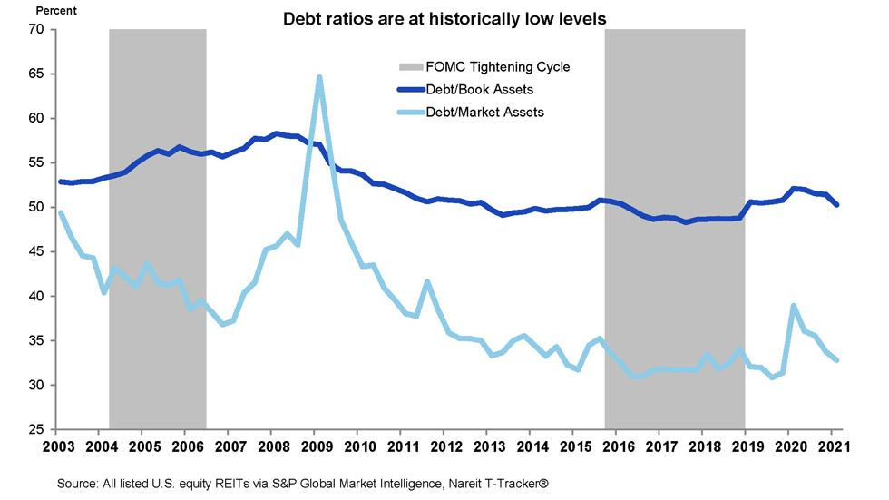

## Table of Contents

## What are REITs and how do they work?

REITs, or Real Estate Investment Trusts, are companies that own, operate, or finance income-generating real estate. They allow people to invest in large-scale, income-producing real estate without having to buy, manage, or finance properties themselves. By investing in a REIT, you can earn a share of the income produced through real estate without actually owning physical property.

REITs work by pooling money from many investors to buy and manage properties like apartments, shopping centers, offices, and hotels. They are required by law to pay out at least 90% of their taxable income as dividends to shareholders each year. This makes them attractive to investors looking for regular income. The value of a REIT can go up or down based on how well the properties are doing and what's happening in the real estate market.

## What are interest rates and how do they affect the economy?

Interest rates are the cost of borrowing money. They are set by banks and other financial institutions and can be influenced by the government's central bank. When you borrow money, like taking out a loan or using a credit card, you have to pay back the amount you borrowed plus some extra, which is the interest. The interest rate is usually shown as a percentage of the total amount borrowed.

Interest rates have a big impact on the economy. When interest rates are low, it's cheaper to borrow money. This can encourage people and businesses to take out loans to buy things like houses, cars, or to start new projects. This spending can help the economy grow. On the other hand, when interest rates are high, borrowing money costs more. This can make people and businesses less likely to borrow and spend, which can slow down the economy. So, by changing interest rates, the central bank can try to control how fast or slow the economy is growing.

## How do high interest rates generally impact the real estate market?

High interest rates can make buying a home more expensive. When interest rates go up, the cost of borrowing money for a mortgage also goes up. This means people have to pay more each month to buy a house. Because of this, fewer people might want to buy homes. This can lead to fewer home sales and can make the real estate market slow down.

Also, when fewer people are buying homes, the demand for houses goes down. If there are a lot of homes for sale but not many buyers, sellers might have to lower their prices to sell their homes. This can cause home prices to drop. So, high interest rates can not only make it harder for people to afford homes, but they can also lead to lower home prices in the real estate market.

## What specific effects do high interest rates have on REITs' borrowing costs?

High interest rates make it more expensive for REITs to borrow money. When interest rates go up, the cost of loans that REITs use to buy or develop properties also goes up. This means REITs have to pay more in interest payments every month. Because REITs often use a lot of borrowed money to buy properties, these higher costs can really affect their profits.

When borrowing costs go up, REITs might have less money to spend on new properties or improvements to existing ones. This can slow down their growth and make it harder for them to increase their income. If REITs can't grow or if their profits go down because of high borrowing costs, this can also make their stock prices go down. So, high interest rates can have a big impact on how well REITs do.

## How do high interest rates influence REITs' property valuations?

High interest rates can make property valuations for REITs go down. When interest rates are high, it costs more for REITs to borrow money to buy or improve properties. This means they might not be able to buy as many new properties or make as many improvements to the ones they already own. If REITs can't grow their portfolio or improve their properties, the value of their properties might not go up as much as it could with lower interest rates.

Also, when interest rates are high, fewer people want to buy homes or rent spaces because it's more expensive to borrow money. This can lead to lower demand for the properties that REITs own. When demand goes down, the value of those properties can go down too. So, high interest rates can make it harder for REITs to keep their property values high.

## Can high interest rates affect the dividend yields of REITs?

High interest rates can affect the dividend yields of REITs. When interest rates go up, it costs more for REITs to borrow money. This means they have to pay more in interest on their loans, which can leave them with less money to pay out as dividends. Since REITs are required to pay out at least 90% of their taxable income as dividends, if their income goes down because of higher borrowing costs, their dividends might go down too.

Also, when interest rates are high, investors might find other investments, like bonds, more attractive because they offer higher yields. To keep investors interested, REITs might need to offer higher dividend yields. But if they can't afford to do this because of their higher borrowing costs, their stock prices might go down, which can make their dividend yields go up even if the actual dividend payments stay the same. So, high interest rates can make it harder for REITs to maintain or increase their dividend yields.

## What is the relationship between REITs' stock prices and high interest rates?

High interest rates can make REITs' stock prices go down. When interest rates go up, it costs more for REITs to borrow money. They have to pay more in interest on their loans, which can make their profits go down. If a REIT's profits go down, its stock price can go down too because investors might not want to buy the stock if they think the REIT isn't making as much money.

Also, when interest rates are high, other investments like bonds might look more attractive to investors. Bonds can offer higher interest payments when interest rates go up. If investors think they can get a better return from bonds, they might sell their REIT stocks and buy bonds instead. This can make the demand for REIT stocks go down, which can make the stock prices go down too. So, high interest rates can make it harder for REITs to keep their stock prices high.

## How do high interest rates impact the ability of REITs to acquire new properties?

When interest rates go up, it gets more expensive for REITs to borrow money. They need loans to buy new properties, but with high interest rates, the cost of these loans goes up. This means REITs have to pay more money every month just to borrow the money they need. Because of this, they might not be able to buy as many new properties as they would like.

Also, when borrowing costs are high, REITs might be more careful about which properties they buy. They might only want to buy properties that they are sure will make them a lot of money. This can make it harder for them to find good deals and grow their business. So, high interest rates can slow down how fast REITs can add new properties to their portfolio.

## What strategies can REITs employ to mitigate the negative impacts of high interest rates?

REITs can use different strategies to deal with high interest rates. One way is to use less borrowed money. Instead of taking out big loans to buy properties, they can use more of their own money or money from investors. This can help them avoid paying a lot of interest on loans. Another way is to focus on properties that make a lot of money right away. If they buy properties that start making money quickly, they can use that money to pay off loans faster and not have to borrow as much.

REITs can also try to make their current properties better. By fixing up or improving the properties they already own, they can make more money from them. This extra money can help them pay for the higher costs of borrowing. Another strategy is to look for other ways to get money. For example, they can sell some of their properties that are not doing well and use that money to buy better ones or pay off loans. By being smart about how they manage their money and properties, REITs can handle high interest rates better.

## How have historical periods of high interest rates affected REIT performance?

In the past, when interest rates were high, REITs often had a tough time. During the early 1980s, for example, interest rates in the U.S. went up a lot. This made it more expensive for REITs to borrow money. Because they had to pay more in interest, their profits went down. At the same time, people were less interested in buying or renting properties because it was more expensive for them too. This meant that REITs had a harder time making money from their properties, and their stock prices went down.

However, not all REITs did badly during these times. Some REITs were able to do better by focusing on properties that could still make a lot of money even with high interest rates. For example, REITs that owned properties like apartments or healthcare facilities, which always had people needing to rent them, did better than others. These REITs were able to keep their profits up and even grow a bit, even though it was harder to borrow money. So, while high interest rates made things harder for REITs in general, some were able to find ways to do okay.

## What are the long-term implications of sustained high interest rates on the REIT sector?

If high interest rates stick around for a long time, it can be really hard for the REIT sector. When borrowing money costs more, REITs have to pay more in interest on their loans. This can cut into their profits because they have less money left over after paying these higher costs. Also, when interest rates are high, people and businesses might not want to buy or rent as much. This can make it harder for REITs to make money from their properties. Over time, this could mean slower growth for REITs and maybe even lower property values if there's less demand.

But not all is bad news. Some REITs might find ways to do well even with high interest rates. For example, REITs that own properties like apartments or healthcare facilities might still do okay because people always need places to live or get medical care. These REITs could keep making money and even grow a bit. Also, if REITs are smart about how they manage their money, like using less borrowed money or selling off properties that aren't doing well, they might be able to handle high interest rates better. So, while high interest rates can make things tough for the REIT sector, some REITs might find ways to keep going strong.

## How do different types of REITs (e.g., retail, office, residential) respond differently to high interest rates?

Different types of REITs can be affected differently by high interest rates. Retail REITs, which own shopping centers and malls, might have a harder time when interest rates go up. When borrowing money costs more, people might spend less on shopping, which means less money coming in for retail REITs. Also, if people are less likely to buy things, stores might close, leaving the REIT with empty spaces that don't make any money. This can make it tough for retail REITs to keep their profits up.

Office REITs, which own office buildings, can also struggle with high interest rates. When it's more expensive to borrow money, businesses might cut back on renting office space. They might decide to work from home more or move to smaller offices to save money. This can mean less money coming in for office REITs, and if a lot of businesses leave, the REIT might have a hard time filling those empty offices. So, high interest rates can make it harder for office REITs to do well.

Residential REITs, which own apartment buildings and other housing, might do better than retail or office REITs when interest rates are high. People always need a place to live, so even if it's more expensive to borrow money, they might still rent apartments. This can help residential REITs keep making money. But if interest rates stay high for a long time, even residential REITs might see fewer people wanting to rent because it's more expensive to live. Still, they might do better than other types of REITs because the need for housing doesn't go away as quickly as the need for shopping or office space.

## References & Further Reading

[1]: Kirilenko, A. A., Kyle, A. S., Samadi, M., & Tuzun, T. (2017). ["The Flash Crash: High‐Frequency Trading in an Electronic Market."](https://onlinelibrary.wiley.com/doi/abs/10.1111/jofi.12498) Journal of Finance, 72(3), 967-998.

[2]: Easley, D., López de Prado, M. M., & O'Hara, M. (2012). ["The Volume Clock: Insights into the High-Frequency Paradigm."](https://papers.ssrn.com/sol3/papers.cfm?abstract_id=2034858) Journal of Portfolio Management, 39(1), 19-29.

[3]: ["Advances in Financial Machine Learning"](https://www.amazon.com/Advances-Financial-Machine-Learning-Marcos/dp/1119482089) by Marcos Lopez de Prado

[4]: ["Machine Learning for Algorithmic Trading"](https://github.com/stefan-jansen/machine-learning-for-trading) by Stefan Jansen

[5]: ["Quantitative Trading: How to Build Your Own Algorithmic Trading Business"](https://www.amazon.com/Quantitative-Trading-Build-Algorithmic-Business/dp/1119800064) by Ernest P. Chan