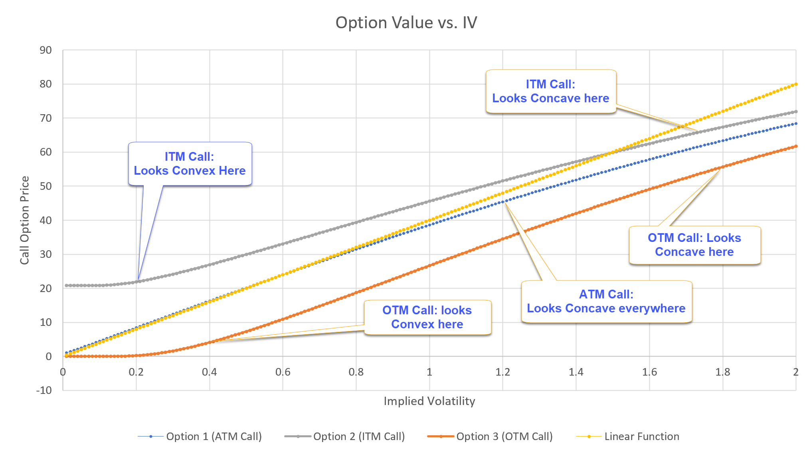

Options pricing is a fundamental aspect of financial markets, playing a crucial role in trading and risk management. Options are derivatives that provide the holder with the right, but not the obligation, to buy or sell an underlying asset at a predetermined price before or at a specified date. The accurate pricing of these instruments is essential because it influences investment decisions and hedging strategies across various market participants.

At the core of options pricing is the concept of implied volatility. This metric reflects the market's expectations of the future volatility of the underlying asset. Implied volatility is derived from options prices in the market and serves as a critical input in pricing models, such as the Black-Scholes model. Unlike historical volatility, which measures past asset price fluctuations, implied volatility offers a forward-looking perspective that can significantly impact the valuation of options. As options traders and investors rely on implied volatility to assess the potential risk and return, understanding its implications becomes indispensable.



Parallel to the development of advanced pricing models, the rise of algorithmic trading has transformed the landscape of financial markets. Algorithmic trading involves the use of computer programs to automate trading decisions, execution, and strategies. In options markets, these algorithms enable traders to efficiently parse large datasets, execute trades at high speeds, and implement complex strategies that take advantage of fleeting market opportunities. The integration of algorithmic trading with options markets, especially through the lens of implied volatility, opens new avenues for innovation and optimization in trading strategies.

This article aims to explore the intersection of options pricing, implied volatility, and algorithmic trading. It will first provide a foundational understanding of options pricing and the traditional models used in the industry. The discussion will then shift to the pivotal role of implied volatility in pricing and trading options, followed by an examination of how algorithmic trading has reshaped these processes. The synthesis of these elements will highlight the strategic advantage gained when leveraging implied volatility within algorithmic trading. Moreover, real-world applications and case studies will be presented to illustrate these concepts in practice. Finally, the article will look forward, addressing future trends and potential developments as technology continues to advance.

By examining the confluence of options pricing, implied volatility, and algorithmic trading, this article seeks to provide a comprehensive overview of how these dynamics are shaping modern financial markets. Understanding these components not only enhances theoretical knowledge but also equips market participants with the insights necessary to navigate an increasingly complex financial environment.

## Table of Contents

## Understanding Options Pricing

Options are financial derivatives that grant the holder the right, but not the obligation, to buy or sell an underlying asset at a predetermined price, known as the strike price, before or on a specific expiration date. There are two primary types of options: call options, which give the right to buy the asset, and put options, which give the right to sell. Options pricing is the process of determining the fair market value of an option, which involves several complex factors and methodologies.

### Key Factors Influencing Options Pricing

1. **Intrinsic Value**: The intrinsic value of an option represents the difference between the underlying asset's current market price and the option's strike price. For call options, this is calculated as $\max(S_t - K, 0)$, where $S_t$ is the asset's spot price and $K$ is the strike price. For put options, it is $\max(K - S_t, 0)$. Intrinsic value represents the profit that could be realized if the option were exercised immediately.

2. **Time Value**: This reflects the value of the option's potential for increased profitability over time until expiration. Time value decreases as the expiration date approaches, a phenomenon known as time decay. The more time left until expiration, the greater the chance for the option to become profitable, thus increasing its price due to time value.

3. **Volatility**: Volatility refers to the magnitude of price fluctuations in the underlying asset. Higher volatility increases the probability of the asset price moving significantly, which enhances both call and put option values. Market participants are especially concerned with implied volatility, which predicts future volatility and influences options pricing through market expectations.

### Popular Models for Options Pricing

The most recognized model for pricing options is the Black-Scholes model, an analytical approach formulated by Fischer Black and Myron Scholes in 1973. The Black-Scholes model uses the following formula to calculate the theoretical price of European call options:

$$

C = S_t N(d_1) - K e^{-r(T-t)} N(d_2) 
$$

where:

- $C$ is the call option price.
- $S_t$ is the current stock price.
- $K$ is the option's strike price.
- $r$ is the risk-free interest rate.
- $T-t$ is the time to expiration.
- $N$ is the cumulative distribution function of the standard normal distribution.
- $d_1$ and $d_2$ are calculated as follows:

$$

d_1 = \frac{\ln(S_t/K) + (r + \sigma^2/2)(T-t)}{\sigma \sqrt{T-t}} 
$$

$$

d_2 = d_1 - \sigma \sqrt{T-t} 
$$

The Black-Scholes model is pivotal due to its simplicity and ability to provide closed-form solutions for pricing European options.

### Limitations and Assumptions of Traditional Pricing Models

While the Black-Scholes model and other traditional pricing methodologies are fundamental to options pricing, they rest on several critical assumptions that can limit their accuracy. These include:

- **Constant Volatility**: The model assumes that the asset's volatility remains constant over the option's life, which is often not true in dynamic markets.
- **Efficiency of Markets**: These models presuppose sufficient market efficiency, ignoring potential anomalies that could affect pricing.
- **No Dividends**: Originally, models like Black-Scholes did not account for dividend payments, although this can be adjusted for dividend-paying stocks.
- **European-style Options**: The Black-Scholes model is designed for European options, which can only be exercised at expiration, unlike American options that can be exercised at any point before expiration.

Despite these limitations, these models continue to be instrumental tools for traders and analysts in assessing and trading options within financial markets.

## The Role of Implied Volatility

Implied [volatility](/wiki/volatility-trading-strategies) is a critical concept in the options market, providing insights into market expectations regarding future volatility. It is inferred from the market price of an option, assuming all other variables in the option pricing model are constant, particularly the Black-Scholes model, which is widely employed in financial markets.

Mathematically, implied volatility ($\sigma_{\text{impl}}$) is not calculated directly, but rather it is the value of volatility that equates the theoretical price of an option as given by a pricing model, such as the Black-Scholes formula, to its market price. The Black-Scholes model is represented by:

$$
C = S_0 N(d_1) - Xe^{-rT} N(d_2)
$$

where 

$$
d_1 = \frac{\ln(S_0 / X) + (r + \sigma^2 / 2) T}{\sigma \sqrt{T}}
$$

$$
d_2 = d_1 - \sigma \sqrt{T}
$$

Here, $C$ represents the call option price, $S_0$ is the current stock price, $X$ is the strike price, $T$ is the time to maturity, $r$ is the risk-free [interest rate](/wiki/interest-rate-trading-strategies), $N(\cdot)$ denotes the cumulative distribution function of a standard normal distribution, and $\sigma$ is the volatility. Implied volatility is the $\sigma$ that resolves this equation when market prices are input for $C$.

Implied volatility reflects investors' collective expectations regarding the magnitude of future price movements, without indicating direction. A higher implied volatility suggests that investors anticipate larger price swings, which can be due to upcoming earnings reports, geopolitical events, or other market-moving occurrences.

The measure of implied volatility plays a pivotal role in the pricing and trading of options because it influences the premium investors are willing to pay for options contracts. Options traders closely monitor changes in implied volatility as it impacts the risk and potential rewards of holding options.

Implied volatility is often contrasted with historical volatility, which is the actual volatility observed over a past period, measured by the statistical volatility of the underlying asset's price. While historical volatility provides a record of past price fluctuations, implied volatility offers a window into the market's future volatility expectations, making it invaluable for traders seeking to predict future movements and assess market sentiment.

The reliance on implied volatility is evident in strategies such as volatility [arbitrage](/wiki/arbitrage), where traders exploit price inefficiencies based on predicted versus actual market movements. This emphasizes the dynamic nature of implied volatility as an indicator of market sentiment and its essential function in derivatives trading.

## Algorithmic Trading in Financial Markets

Algorithmic trading, often referred to as algo trading, has become increasingly dominant in modern financial markets. This form of trading uses complex algorithms to make trading decisions at speeds and frequencies impractical for human traders. The rise of high-frequency trading ([HFT](/wiki/high-frequency-trading-strategies)) exemplifies this trend, where trades are executed in fractions of a second, capitalizing on small price deviations for profit.

In options trading, algorithms are employed to assess pricing, manage risk, and execute trades with precision. The integration of mathematical models and market data allows for the real-time adjustment of trading strategies. Algorithms can quickly evaluate an option's theoretical fair value and its relationship to the market price, making instantaneous decisions to buy or sell.

Key benefits of [algorithmic trading](/wiki/algorithmic-trading) include its speed and efficiency. Algorithms can process vast amounts of data far more quickly than human traders, enabling them to spot and exploit market inefficiencies rapidly. They also handle large volumes of transactions simultaneously, increasing [liquidity](/wiki/liquidity-risk-premium) and narrowing spreads, which may lead to lower costs for traders. Additionally, algo trading systems can be rigorously backtested, using historical data to refine strategies before deployment in live markets.

Despite these advantages, algorithmic trading presents several challenges and risks. One primary concern is the potential for exacerbated market volatility, as seen during events like the May 6, 2010, Flash Crash. The rapid pace of execution can lead to cascading sell-offs if algorithms react similarly to specific triggers. Moreover, algorithms rely heavily on market data and their underlying models. Any inaccuracies or unforeseen market events can lead to significant losses. Lastly, the complexity of these systems makes them susceptible to technical glitches and requires continuous monitoring and updates.

In summary, while algorithmic trading offers substantial benefits in terms of speed, efficiency, and data handling, it also introduces risks, particularly in terms of market stability and system reliability. The ongoing development of robust frameworks and regulatory oversight is essential to mitigate these risks and ensure the integrity of financial markets.

## The Intersection: Implied Volatility and Algo Trading

Algorithmic trading, a method where computers execute trades based on pre-defined strategies, has revolutionized financial markets. Among its numerous advantages, one significant capability is its ability to leverage implied volatility in options trading. Implied volatility, critical in reflecting the market's forecast of a stock's future volatility, allows traders to anticipate price movements and strategize accordingly.

Algorithmic trading strategies often incorporate implied volatility to achieve volatility arbitrage. Volatility arbitrage is a specialized trading strategy that aims to exploit the difference between the forecasted future volatility and the market-implied volatility of a security. Traditional methods to achieve this involved manual trading, but with advancements in computing, algorithms are now used extensively. These algorithms quickly identify mispricings and execute trades to capitalize on expected changes; for instance, buying an option if the implied volatility is perceived to be lower than actual future volatility.

Machine learning has gained traction for its predictive capabilities, allowing for more accurate forecasting of implied volatility. Algorithms using [machine learning](/wiki/machine-learning) employ historical volatility data, financial indicators, and market sentiment to predict future movements. For example, regression algorithms or neural networks can be trained on past data to forecast future implied volatility. A simple Python code using scikit-learn for a linear regression model could look like this:

```python
from sklearn.model_selection import train_test_split
from sklearn.linear_model import LinearRegression
import numpy as np

# Sample data
historical_data = np.array([...])  # array of historical volatility data
target_data = np.array([...])      # corresponding array of implied volatility

# Split data into training and testing sets
X_train, X_test, y_train, y_test = train_test_split(historical_data, target_data, test_size=0.2, random_state=42)

# Initialize and train the model
model = LinearRegression()
model.fit(X_train, y_train)

# Predict implied volatility
predictions = model.predict(X_test)
```

Traders widely utilize algorithms to exploit volatility metrics in various ways. For instance, in a rapidly moving market, algorithmic systems can instantly recalibrate their models and execute trades based on new implied volatility figures, which might be impossible at human speed. An example is the use of [statistical arbitrage](/wiki/statistical-arbitrage) strategies, where algorithms identify and trade based on statistical patterns in market volatility.

In essence, the integration of algorithmic trading with implied volatility analysis has transformed how traders engage with financial markets. Strategies that once relied heavily on manual calculations and subjective judgments are now driven by precise algorithms capable of processing vast datasets and executing optimal trades in milliseconds. This synthesis not only enhances efficiency and profitability but also accentuates the importance of technology in modern finance.

## Case Studies and Real-World Applications

### Case Studies and Real-World Applications

Algorithmic trading, particularly strategies that leverage implied volatility, has become a critical component in the operations of hedge funds, asset managers, and proprietary trading firms. These strategies are often built on sophisticated models that analyze historical data and real-time market conditions to predict future volatility patterns and execute trades with precision.

**Successful Algo Trading Case Studies**

One prominent example of successful algorithmic trading based on implied volatility is the strategy employed by Renaissance Technologies, a famous quantitative [hedge fund](/wiki/hedge-fund-trading-strategies). Renaissance is renowned for its Medallion Fund, which has delivered exceptional returns partially due to its ability to exploit volatility discrepancies. The fund uses proprietary algorithms that incorporate various quantitative signals, including implied volatility metrics, to inform trading decisions. By accurately predicting shifts in volatility, Renaissance can capitalize on options mispricing and manage risk effectively.

Another noteworthy case is that of Two Sigma Investments, another leading quantitative hedge fund. Two Sigma employs machine learning and large-scale data analysis to forecast market movements. Their algorithms use implied volatility data as a crucial input for constructing market-neutral strategies. These strategies aim to mitigate the impacts of market fluctuations by maintaining a balance between long and short positions, effectively using volatility as a guide for portfolio adjustments.

**Market Events Impacted by Implied Volatility and Algorithmic Trading**

Notable market events have illustrated the significant impact that implied volatility and algorithmic trading can have. During the 2020 COVID-19 pandemic, markets experienced unprecedented volatility levels. Hedge funds and algorithmic traders that had integrated implied volatility forecasting in their strategies were better positioned to weather the storm. Algorithms capable of dynamically adjusting risk exposure based on volatility predictions allowed these traders to preserve capital and even profit from the heightened uncertainty.

Another instance was the 2010 Flash Crash, where a rapid, deep, and volatile market decline was partially attributed to algorithmic trading systems. Although heavily scrutinized for exacerbating volatility, some trading systems successfully navigated the event by adapting to the fast-changing implied volatility landscape, showcasing the importance of robust models that can handle extreme market conditions.

**Industry Use-Cases from Hedge Funds and Asset Management Companies**

Hedge funds and asset managers have widely adopted volatility-based algorithmic trading strategies for various purposes. For instance, volatility arbitrage is a common strategy where traders seek to exploit the difference between predicted (implied) and actual (historical) volatility. Firms like Citadel LLC utilize advanced statistical models and real-time data analytics to execute these trades, aiming for consistent returns regardless of market direction.

Additionally, market makers in options markets rely heavily on algorithms that use implied volatility to price options accurately. They maintain a competitive edge by continuously updating their pricing models in response to market changes, thereby ensuring that their bid-ask spreads reflect true market conditions. This approach helps in maintaining liquidity in the options market and reducing transaction costs.

### Python Code for Volatility Forecasting

A simple Python model to forecast implied volatility could be constructed using libraries like NumPy, pandas, and scikit-learn. Here's a skeleton code to start with:

```python
import numpy as np
import pandas as pd
from sklearn.linear_model import LinearRegression
from sklearn.model_selection import train_test_split

# Assume we have a DataFrame 'data' with historical market data
data = pd.read_csv('market_data.csv')

# Feature engineering to include variables that might affect implied volatility
data['lagged_volatility'] = data['historical_volatility'].shift(1)
data['price_change'] = data['price'].pct_change()
data['volume_change'] = data['volume'].pct_change()

# Prepare the dataset
features = ['lagged_volatility', 'price_change', 'volume_change']
X = data[features].dropna()
y = data['implied_volatility'].loc[X.index]

# Split into train and test set
X_train, X_test, y_train, y_test = train_test_split(X, y, test_size=0.2, random_state=42)

# Initialize and train the model
model = LinearRegression()
model.fit(X_train, y_train)

# Predicting implied volatility
y_pred = model.predict(X_test)
```

The above code serves as a starting point for creating a model that predicts implied volatility based on historical features. While simplistic, this method highlights the potential of algorithmic strategies driven by data analysis and machine learning techniques.

Through these case studies and examples, we see how algorithmic trading strategies, particularly those leveraging implied volatility, play a vital role in modern finance, underscoring the need for continuous innovation and adaptation in trading technologies.

## Future Trends and Developments

Future developments in options pricing and algorithmic trading are poised to be significantly influenced by advancements in [artificial intelligence](/wiki/ai-artificial-intelligence) (AI) and machine learning (ML), as well as an evolving regulatory framework.

AI and machine learning have already begun transforming the financial landscape, and their potential effects on modeling implied volatility are particularly notable. These technologies enable the analysis of vast amounts of historical and real-time data, facilitating more accurate predictions of market movements. Machine learning models can identify patterns and correlations that are not easily discernible through traditional statistical methods. For example, neural networks, a type of machine learning model, can be trained to predict implied volatility by learning from various factors such as market sentiment, macroeconomic indicators, and historical price data.

```python
# Example: Using simple Python code to estimate implied volatility using machine learning

from sklearn.model_selection import train_test_split
from sklearn.ensemble import RandomForestRegressor
from sklearn.metrics import mean_squared_error

# Sample data: features representing market indicators, target being implied volatility
X, y = features, implied_volatility_values

# Splitting data into training and testing sets
X_train, X_test, y_train, y_test = train_test_split(X, y, test_size=0.2, random_state=42)

# Using RandomForestRegressor to predict implied volatility
model = RandomForestRegressor(n_estimators=100)
model.fit(X_train, y_train)

# Predicting and evaluating the model
predictions = model.predict(X_test)
mse = mean_squared_error(y_test, predictions)

print(f"Mean Squared Error of the model: {mse}")
```

In addition to traditional models, such as the Black-Scholes, AI and ML can incorporate non-linear relationships and external data sources, which can enhance the predictive accuracy of implied volatility models, thus aiding traders in making informed decisions.

Regarding the regulatory landscape, financial authorities worldwide are increasingly scrutinizing algorithmic trading. These changes are aimed at ensuring market stability and protecting against systemic risks associated with high-frequency trading activities. Future regulations may focus on enhancing transparency, implementing stricter risk management controls, and ensuring fair market practices. Regulators like the U.S. Securities and Exchange Commission (SEC) and the European Securities and Markets Authority (ESMA) continue to adapt regulations to manage the complexities introduced by advanced algorithmic strategies.

Moreover, regulations could necessitate the use of standardized testing and validation processes for algorithms before deployment. This approach aims to limit flash crashes and other market disruptions. New frameworks may also stipulate the documentation of trading algorithms, requiring firms to maintain records of decision-making processes encoded within their algorithms.

In summary, while AI and machine learning stand to significantly enhance the precision and efficiency of options pricing models, future success will also depend on how these innovations are integrated within a robust regulatory framework designed to safeguard the integrity of financial markets.

## Conclusion

Options pricing remains a fundamental aspect of financial markets, heavily influencing decision-making processes and investment strategies. A comprehensive understanding of the mechanisms and models involved in options pricing is crucial for market participants. Traditional models, such as the Black-Scholes model, lay the foundational framework for calculating options prices by considering intrinsic value, time value, and volatility. However, these models also encompass several limitations and assumptions, necessitating continuous innovation and adaptation to current market conditions.

Implied volatility plays a pivotal role in this pricing landscape, serving as a measure of the market's expectations for future volatility. Unlike historical volatility, which is rooted in past price movements, implied volatility is derived from current option prices, thus reflecting the market's projection of future uncertainty. This forward-looking component is indispensable for accurately pricing options and managing associated risks.

Algorithmic trading has increasingly become an integral component of modern financial markets. It enhances precision in executing options trades through speed, efficiency, and sophisticated data handling capabilities. Moreover, it leverages implied volatility metrics to construct advanced trading strategies, including volatility arbitrage. The intersection of algorithmic trading and implied volatility has enabled the implementation of machine learning techniques, allowing traders to forecast volatility with improved accuracy.

As financial markets evolve, emerging technologies and models continue to shape the landscape for options pricing and trading strategies. Staying informed about these developments is essential for traders aiming to maintain a competitive edge. The integration of AI and machine learning in predictive analytics, coupled with a responsiveness to changing regulatory landscapes, will likely define the trajectory of future advancements. Embracing these tools and strategies will empower market participants to navigate the complexities of options trading and optimize their investment outcomes.

## References & Further Reading

[1]: Bergstra, J., Bardenet, R., Bengio, Y., & Kégl, B. (2011). ["Algorithms for Hyper-Parameter Optimization."](https://dl.acm.org/doi/10.5555/2986459.2986743) Advances in Neural Information Processing Systems 24.

[2]: ["Advances in Financial Machine Learning"](https://www.amazon.com/Advances-Financial-Machine-Learning-Marcos/dp/1119482089) by Marcos Lopez de Prado

[3]: ["Evidence-Based Technical Analysis: Applying the Scientific Method and Statistical Inference to Trading Signals"](https://www.amazon.com/Evidence-Based-Technical-Analysis-Scientific-Statistical/dp/0470008741) by David Aronson

[4]: ["Machine Learning for Algorithmic Trading"](https://github.com/PacktPublishing/Machine-Learning-for-Algorithmic-Trading-Second-Edition) by Stefan Jansen

[5]: ["Quantitative Trading: How to Build Your Own Algorithmic Trading Business"](https://books.google.com/books/about/Quantitative_Trading.html?id=j70yEAAAQBAJ) by Ernest P. Chan