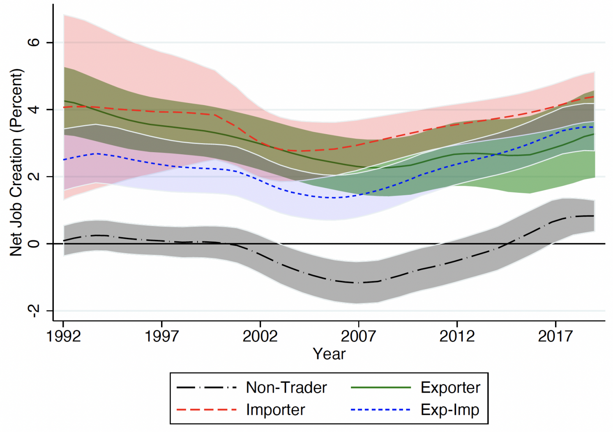

## Table of Contents

## What are imported goods?

Imported goods are products that are brought into a country from another country. These goods can include things like food, clothes, electronics, and cars. Countries import goods because they might not be able to produce everything they need or want within their own borders. For example, a country might import fruits that don't grow in its climate or technology that is not yet developed locally.

Importing goods can benefit a country's economy by providing consumers with more choices and sometimes cheaper prices. It also allows businesses to access materials or products that are not available locally. However, importing can also have downsides. It might hurt local industries if they can't compete with cheaper imported products. Governments sometimes put tariffs, which are taxes on imports, to protect local businesses and control the flow of goods into the country.

## How do imported goods enter the U.S. market?

Imported goods enter the U.S. market through a process that starts when they arrive at a U.S. port, like a seaport, airport, or border crossing. The goods are checked by U.S. Customs and Border Protection (CBP) to make sure they follow all the rules and laws. This includes checking for any taxes or tariffs that need to be paid. If everything is okay, the goods can move forward to be sold in stores or used by businesses.

Once the goods pass the customs check, they are usually transported to warehouses or distribution centers. From there, they are sent to different places across the country. Retailers, like grocery stores or clothing shops, buy these goods and sell them to customers. Sometimes, the goods are sold directly to businesses that use them to make other products. This whole process helps bring a wide variety of products to people all over the United States.

## What industries in the U.S. are most affected by imported goods?

The industries in the U.S. that are most affected by imported goods are mainly manufacturing and agriculture. In manufacturing, things like cars, electronics, and clothes are often imported. These products can be made cheaper in other countries, so they compete with what's made in the U.S. This can make it hard for American factories to stay in business if they can't match the low prices of imported goods.

In agriculture, the U.S. both imports and exports a lot of food. Fruits and vegetables that don't grow well in the U.S. climate, like some types of bananas or avocados, are often imported. This can affect local farmers because they have to compete with these cheaper imports. But it also means that people in the U.S. can enjoy a wider variety of foods all year round.

Retail is another industry that feels the impact of imported goods. Many stores sell products that come from other countries, like toys, furniture, and clothes. This gives customers more choices and sometimes lower prices. But it can also hurt local businesses that make similar products, because they might not be able to compete with the prices of the imported goods.

## How does the increase in imported goods affect U.S. employment?

When more goods are imported into the U.S., it can affect jobs in different ways. If a lot of products like clothes or cars come from other countries, it might be hard for factories in the U.S. to stay open. This is because the imported goods can be cheaper, and people might buy them instead of things made in the U.S. If factories close, workers can lose their jobs. This can lead to higher unemployment in areas where these factories are located.

But it's not all bad news. When more goods are imported, it can create jobs too. Stores and warehouses that sell these imported products need workers to move and sell them. Also, if the imported goods are used by U.S. companies to make other things, like using imported parts to make cars, this can create jobs in those industries. So, while some jobs might be lost, others can be created in different parts of the economy.

## What is the relationship between trade deficits and employment?

A trade deficit happens when a country imports more goods than it exports. This can affect jobs in the country. When there is a big trade deficit, it means more products are coming into the country from other places. This can make it hard for local companies that make the same things to stay in business. If these companies close or make fewer things, they might have to let workers go. This can lead to higher unemployment in the areas where these companies are.

On the other hand, a trade deficit isn't always bad for jobs. Some of the imported goods can help create jobs in other ways. For example, stores and warehouses that sell these imported products need people to work there. Also, if the imported goods are parts used by local companies to make other things, this can help keep jobs in those industries. So, while a trade deficit might hurt some jobs, it can also help create others in different parts of the economy.

## Can you explain the concept of offshoring and its impact on U.S. jobs?

Offshoring is when a company moves parts of its business, like making things or doing office work, to another country where it can be done cheaper. For example, a company in the U.S. might decide to make its products in a country where workers get paid less. This can help the company save money, but it can also mean fewer jobs in the U.S. because the work is now being done somewhere else.

When companies offshore their work, it can lead to job losses in the U.S. If a factory in the U.S. closes because the company moved its production to another country, the workers at that factory might lose their jobs. This can hurt the local economy where the factory was because those workers won't have money to spend. But offshoring isn't all bad for jobs. Sometimes, the money the company saves by offshoring can be used to create new jobs in the U.S. in other parts of the business, like research or sales. So, while offshoring can take away some jobs, it can also help create new ones in different areas.

## How do tariffs and trade policies influence the impact of imported goods on employment?

Tariffs are taxes that a country puts on imported goods. When the U.S. puts tariffs on imports, it makes these goods more expensive for people to buy. This can help protect jobs in the U.S. because people might choose to buy things made in America instead of the more expensive imports. For example, if there's a tariff on imported cars, people might buy more cars made in the U.S., which can help keep American car factories open and workers employed. But tariffs can also make things more expensive for everyone, which can hurt the economy in other ways.

Trade policies can also affect jobs by making it easier or harder for goods to come into the country. If the U.S. has strict trade policies that limit imports, it can protect jobs in industries that compete with those imports. For example, if the U.S. limits the amount of imported steel, it can help keep steel factories in the U.S. open and workers employed. On the other hand, if trade policies make it easier for goods to come in, it can lead to more competition for U.S. companies, which might cause them to lose business and cut jobs. So, trade policies can have a big impact on employment, depending on how they are set up.

## What are the long-term trends in U.S. employment related to import competition?

Over the years, the U.S. has seen a lot of change in jobs because of competition from imports. As more goods come into the country from other places, it has been hard for some American companies to keep up. Factories that make things like clothes, cars, and electronics have had to close down or move to other countries where it's cheaper to make things. This has led to a lot of job losses in these industries. For example, many people who used to work in factories in places like the Midwest lost their jobs as more products were imported.

But it's not all bad news. While some jobs have been lost, new jobs have been created in other areas. Stores and warehouses that sell imported goods need workers to move and sell these products. Also, some U.S. companies use imported parts to make things, which can help keep jobs in those industries. Over time, the U.S. economy has shifted away from making things to providing services, like working in stores, restaurants, and offices. So, while import competition has hurt some jobs, it has also helped create new ones in different parts of the economy.

## How do imported goods affect different skill levels of U.S. workers?

Imported goods can affect workers in the U.S. differently based on their skills. Workers who don't have a lot of education or special skills, like those who work in factories making clothes or simple electronics, can be hit hard by imports. These jobs can move to other countries where it's cheaper to make things, so these workers might lose their jobs. This can make it hard for them to find new work, especially if they don't have the skills needed for other kinds of jobs.

On the other hand, workers with more skills and education might not be as affected by imported goods. These workers often have jobs in areas like technology, finance, or healthcare, where it's harder for other countries to compete. Imported goods can actually help these workers by giving them more choices and sometimes cheaper materials to use in their work. But if their company uses a lot of imported parts, it could still affect their jobs if the company has to pay more for those parts because of tariffs or other trade policies.

## What are the regional differences in the U.S. regarding the impact of imports on employment?

Different parts of the U.S. feel the effects of imported goods on jobs in different ways. In places like the Midwest and parts of the South, there used to be a lot of factories making things like cars, steel, and clothes. But as more of these things are made in other countries and imported into the U.S., many of these factories have closed down. This has led to a lot of job losses in these areas. People who used to work in these factories often have a hard time finding new jobs, especially if they don't have the skills needed for other kinds of work.

On the other hand, regions like the coasts, especially around big cities, have been less affected by imports. These areas have more jobs in services, like working in stores, restaurants, and offices. Imported goods can actually help these businesses by giving them more choices and sometimes cheaper products to sell. But even in these areas, some workers can still be affected if their company uses a lot of imported parts or materials. So, while some regions struggle more with the impact of imports, others are better able to adapt and find new opportunities.

## How do multinational corporations' strategies affect employment due to imported goods?

Multinational corporations often move their production to other countries where it's cheaper to make things. This is called offshoring. When they do this, they can import the products back into the U.S. to sell. This can lead to fewer jobs in the U.S. because the work is now being done somewhere else. For example, if a big company decides to make its clothes in another country, the people who used to work in the U.S. factories might lose their jobs. This can hurt the local economy where the factory was because those workers won't have money to spend.

But multinational corporations can also create jobs in the U.S. even if they import a lot of goods. They might need workers to sell the imported products in stores or to move them around in warehouses. Also, these companies might use some imported parts to make other things in the U.S. This can help keep jobs in those industries. So, while offshoring and importing can take away some jobs, the strategies of multinational corporations can also help create new ones in different parts of the economy.

## What economic theories explain the impact of imported goods on U.S. employment?

One economic theory that helps explain the impact of imported goods on U.S. employment is comparative advantage. This theory says that countries should make things they are good at and buy things from other countries that are good at making different things. For the U.S., this means making high-tech products and services and importing things like clothes and simple electronics that can be made cheaper in other countries. This can lead to fewer jobs in U.S. factories that make these goods because the work moves to other countries. But it can also create jobs in other areas, like stores and warehouses that sell the imported goods.

Another theory is trade adjustment. This theory says that when a country imports more goods, it can hurt some jobs but help create new ones in other parts of the economy. For example, if a U.S. factory closes because of imports, the workers might lose their jobs. But the money saved by importing cheaper goods can be used to start new businesses or create jobs in different industries, like technology or services. This shift can help the economy grow, even if it's hard for some workers at first. So, while imports can cause job losses in some areas, they can also lead to new job opportunities in others.

## What is the impact on U.S. jobs?

Trade has played a pivotal role in shaping the U.S. job market, supporting approximately 39 million jobs in 2017, a statistic that underscores the nation's reliance on international commerce, including the importation of goods. The flow of goods into the U.S. market provides employment opportunities across various sectors, from transportation to retail, yet the evolution of global trade dynamics fueled by technology poses both opportunities and challenges for U.S. employment.

As industries integrate more advanced technologies, such as automation and algorithmic trading, the demand for specific skills shifts. Traditional roles, particularly in manufacturing and low-skill sectors, may be increasingly susceptible to automation, leading to potential job displacement. Conversely, these technological advancements create new job opportunities, especially in technology-driven roles that require specialized training and skills.

The key challenge is ensuring that the workforce adapts to these changing demands. This involves investing in education and continuous learning to equip workers with necessary skills for emerging industries. As the nature of work evolves, reskilling and upskilling initiatives become essential to mitigate unemployment risks and maintain employment levels.

Mathematically, if $J_t$ represents jobs at time $t$, and $\Delta J = J_{t+1} - J_t$ is the change in jobs over time, the net employment change can be seen as a function of jobs created by new industries $(J_{new})$ minus jobs lost due to automation $(J_{lost})$:

$$
\Delta J = J_{new} - J_{lost}
$$

Here, $J_{new}$ tends to depend on policies aimed at fostering industry-specific growth and adapting workforce skills, while $J_{lost}$ can be influenced by the rate of technology adoption in existing industries.

Managing this transition requires concerted efforts from policymakers and industry leaders to implement strategies for sustaining employment. Identifying and investing in growth sectors where the U.S. has a competitive edge—such as technology, clean energy, and advanced manufacturing—can promote job creation. Additionally, enhancing support for workers affected by job displacements through training programs and career transition services will be crucial in maintaining an adaptable workforce capable of meeting new economic demands.

## References & Further Reading

[1]: Bergstra, J., Bardenet, R., Bengio, Y., & Kégl, B. (2011). ["Algorithms for Hyper-Parameter Optimization."](https://papers.nips.cc/paper/4443-algorithms-for-hyper-parameter-optimization) Advances in Neural Information Processing Systems 24.

[2]: ["Advances in Financial Machine Learning"](https://www.amazon.com/Advances-Financial-Machine-Learning-Marcos/dp/1119482089) by Marcos Lopez de Prado

[3]: ["Evidence-Based Technical Analysis: Applying the Scientific Method and Statistical Inference to Trading Signals"](https://www.amazon.com/Evidence-Based-Technical-Analysis-Scientific-Statistical/dp/0470008741) by David Aronson

[4]: ["Machine Learning for Algorithmic Trading"](https://github.com/stefan-jansen/machine-learning-for-trading) by Stefan Jansen

[5]: ["Quantitative Trading: How to Build Your Own Algorithmic Trading Business"](https://www.amazon.com/Quantitative-Trading-Build-Algorithmic-Business/dp/1119800064) by Ernest P. Chan