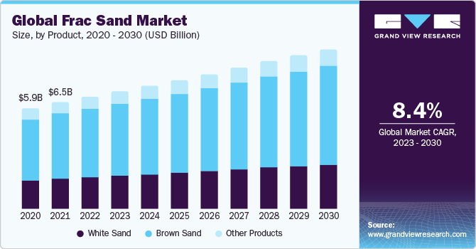

## Table of Contents

## What is frac sand and how is it used in the industry?

Frac sand, short for fracturing sand, is a type of sand used in the oil and gas industry. It is a special kind of sand that is very strong and does not break easily. This sand is usually made of quartz and is very clean, meaning it doesn't have many other minerals mixed in with it.

In the oil and gas industry, frac sand is used in a process called hydraulic fracturing, or fracking. During fracking, workers pump a mixture of water, chemicals, and frac sand into rock deep underground. The pressure from this mixture cracks the rock, and the frac sand holds these cracks open. This allows oil and gas to flow out of the rock and be collected. Frac sand is important because it helps make sure the cracks stay open so more oil and gas can be extracted.

## What is the role of concrete in construction and infrastructure?

Concrete is a very important material in construction and infrastructure. It is used to make buildings, roads, bridges, and many other structures. Concrete is strong and lasts a long time, which makes it a good choice for these projects. It is made from cement, water, and things like sand and gravel. When these ingredients are mixed together, they form a paste that hardens into a solid material.

In construction, concrete is used to create the foundations of buildings, which support the weight of the entire structure. It is also used for walls, floors, and roofs. For infrastructure, concrete is used to build roads and highways, which need to be strong to handle heavy traffic. Bridges are another important use of concrete, as they need to be sturdy and safe for people to cross over rivers or valleys. Overall, concrete helps make our buildings and infrastructure safe and reliable.

## How has the demand for frac sand changed in recent years?

In recent years, the demand for frac sand has gone up and down. When oil and gas prices are high, more companies want to do fracking, so they need more frac sand. This happened a lot in the early 2010s when oil prices were very high. But when oil prices dropped in 2014 and 2015, the demand for frac sand also went down because fewer companies were doing fracking.

Since then, the demand for frac sand has been a bit unpredictable. It depends a lot on what is happening with oil and gas prices. In some years, like 2017 and 2018, demand went up again as oil prices recovered. But then, in 2020, when the world was hit by the COVID-19 pandemic, oil prices crashed again, and so did the demand for frac sand. Lately, as oil and gas prices have started to recover, the demand for frac sand has been [picking](/wiki/asset-class-picking) up again, but it is still not as steady as it used to be.

## What factors contribute to the increased demand for concrete?

One big reason for more demand for concrete is that more people are living in cities. As cities get bigger, they need more buildings, roads, and other things made from concrete. People move to cities for jobs and to be near other people, so cities keep growing. This means more houses, offices, and stores are built, and all these need concrete. Also, as countries get richer, they spend more money on building things, which makes the need for concrete go up.

Another reason is that governments and companies are spending more on big projects like highways, bridges, and dams. These projects need a lot of concrete. For example, when a country decides to build a new highway, it uses a huge amount of concrete. Also, when old buildings and roads get old and need to be fixed or replaced, this also means more concrete is needed. So, both new big projects and fixing old ones add to the demand for concrete.

Lastly, new technology and ways of building can also increase the need for concrete. Some new types of concrete are stronger or last longer, so people want to use them more. Also, new building methods, like using concrete in 3D printing, can make building faster and easier, which means more concrete might be used. All these things together make the demand for concrete go up.

## How does the increased demand for frac sand affect its availability?

When more people want frac sand, it can be harder to find enough of it. Frac sand comes from special places where the sand is very strong and clean. If a lot of companies need this sand at the same time, the places that have it might not be able to give everyone what they need. This can make the price of frac sand go up because everyone is trying to buy it.

To keep up with the demand, companies might start looking for new places to get frac sand. They might also try to make the process of getting the sand faster or find ways to use the sand more carefully so it lasts longer. But even with these efforts, if the demand keeps growing very fast, it can still be hard to have enough frac sand for everyone who needs it.

## What are the supply chain challenges faced by the concrete industry due to increased demand?

The concrete industry faces many challenges when demand goes up. One big problem is getting enough of the things needed to make concrete, like cement, sand, and gravel. These materials come from different places, and if everyone wants them at the same time, it can be hard to get enough. This can slow down building projects and make them more expensive. Also, moving these heavy materials from where they are found to where they are needed can be tricky. If there are not enough trucks or if the roads are busy, it can take longer to get the materials to the construction site.

Another challenge is making sure the concrete is good quality. When demand is high, companies might rush to make more concrete, which can lead to mistakes. If the concrete is not mixed right or if it is not the right strength, it can cause problems later on. Keeping the quality high while trying to meet the demand is a big challenge. Also, the people who work in the concrete industry, like drivers and workers at the plants, can get very busy. If there are not enough workers, it can be hard to keep up with all the orders.

## What are the environmental impacts of increased frac sand mining?

When people mine more frac sand, it can hurt the environment. Mining frac sand means digging up a lot of land. This can destroy the homes of animals and plants. It can also make the air dirty because mining creates dust. The dust can make it hard for people and animals to breathe. Also, the trucks and machines used in mining use a lot of fuel, which adds more pollution to the air.

Another problem is what happens to the land after the mining is done. If the land is not fixed up, it can be left in a bad shape. This can lead to water problems, like when rain washes away the dirt and carries it into rivers and lakes. This can make the water dirty and harm fish and other water animals. Also, if the mining company does not put the land back the way it was, it can be hard for new plants to grow there, which means the land might not be good for anything for a long time.

## How do shortages of frac sand and concrete impact construction projects?

When there is not enough frac sand, it can slow down or even stop oil and gas projects. Frac sand is very important for fracking, which is how companies get oil and gas out of the ground. If they can't get enough frac sand, they have to wait or find another way to do their work. This can make the projects take longer and cost more money. Also, if the price of frac sand goes up because there is not enough, it can make the whole project more expensive.

Shortages of concrete can also cause big problems for building projects. Concrete is used to make the foundations, walls, and roads, so if there is not enough, construction can't move forward. Workers might have to wait for the concrete to arrive, which delays the project. This can be frustrating and can cost more money because the project takes longer to finish. If the price of concrete goes up because it is hard to find, it can also make the project more expensive.

## What strategies can be implemented to manage the supply of frac sand more effectively?

To manage the supply of frac sand better, companies can look for new places to mine it. They can use special tools to find new spots where the sand is strong and clean. By finding more places to get frac sand, they can make sure there is enough for everyone who needs it. Also, they can work on making the mining process faster and more efficient. This means using better machines and ways of working to get the sand out of the ground quicker and with less waste.

Another way to manage frac sand supply is to be smart about how it is used. Companies can try to use less sand for each fracking job by using better technology. This can help make the sand they have last longer. They can also plan better, so they know how much sand they will need and when. By talking to other companies and sharing information, they can work together to make sure there is enough frac sand for everyone. This can help keep the price steady and avoid shortages.

## How can the concrete industry adapt to fluctuating demands and ensure availability?

The concrete industry can adapt to changing demands by finding new ways to get the materials they need, like cement, sand, and gravel. They can look for new places to get these materials and work on making the process of getting them faster and better. By using better machines and methods, they can make sure they have enough materials even when a lot of people want concrete at the same time. They can also work with other companies to share information and plan ahead so they know how much concrete they will need and when.

Another way the concrete industry can ensure availability is by using the materials they have more wisely. They can use new technology to make concrete that is stronger and lasts longer, so they need less of it for each project. They can also recycle old concrete instead of always using new materials. This helps save resources and can help meet the demand better. By planning carefully and using materials smartly, the concrete industry can keep up with the changing needs and make sure there is enough concrete for everyone who needs it.

## What are the long-term economic implications of sustained high demand for frac sand and concrete?

If people keep wanting a lot of frac sand and concrete, it can change the economy in big ways. For frac sand, more demand means more jobs in mining and moving the sand. This can help the places where the sand comes from because more people will have work. But it can also make the price of frac sand go up. If oil and gas companies have to pay more for frac sand, they might have to charge more for oil and gas. This can make things more expensive for everyone. Also, if we use too much frac sand, we might run out of good places to get it, which can cause problems later.

For concrete, high demand means more jobs in making and using concrete. This is good for the construction industry and can help the economy grow. But it can also make the price of concrete go up, which can make building things more expensive. If we keep using a lot of concrete, we might use up the materials we need to make it, like sand and gravel. This can lead to shortages and higher prices in the future. It's important to find ways to use these materials wisely so we can keep building things without hurting the economy or running out of resources.

## What innovations or alternative materials are being researched to mitigate the impact of increased demand on frac sand and concrete?

Scientists are working on new ways to use less frac sand or find other things to use instead. One idea is to use smaller amounts of sand in fracking by mixing it with other materials that can help keep the cracks open. They are also looking at using different kinds of sand or even man-made materials that can do the same job as frac sand. These new materials could help make sure we don't run out of good frac sand and can keep the cost down.

For concrete, researchers are trying to find new ways to make it stronger and last longer so we don't need as much. One big idea is using recycled concrete instead of always using new materials. This can help save the resources we need to make concrete. Another idea is using different kinds of cement that are better for the environment. These new types of concrete could help meet the demand without using up all the sand and gravel we need.

## References & Further Reading

[1]: Beiser, V. (2018). ["The World in a Grain: The Story of Sand and How It Transformed Civilization."](https://www.penguinrandomhouse.com/books/537681/the-world-in-a-grain-by-vince-beiser/) Riverhead Books.

[2]: Peduzzi, P. (2014). ["Sand, Rarer Than One Thinks."](https://archive-ouverte.unige.ch/unige:75919) Environmental Development, 11, 208-218.

[3]: Lopez de Prado, M. (2018). ["Advances in Financial Machine Learning."](https://www.amazon.com/Advances-Financial-Machine-Learning-Marcos/dp/1119482089) Wiley.

[4]: U.S. Geological Survey. (2021). ["Frac Sand in the United States—A Geological and Industry Overview."](https://pubs.usgs.gov/of/2015/1107/) U.S. Geological Survey Open-File Report 2015-1107.

[5]: Kemp, L. (2016). ["The Global Frac Sand Market: Demand, Supplies, and Agricultural Impacts."](https://www.kenaninstitute.unc.edu/wp-content/uploads/2018/04/GlobalFracingConferenceReport2016.pdf) Biofuels, Bioproducts and Biorefining, 10(6), 737-752.

[6]: Jansen, S. (2020). ["Machine Learning for Algorithmic Trading."](https://github.com/stefan-jansen/machine-learning-for-trading) Packt Publishing.

[7]: "Environmental Impacts of Sand Mining." (n.d.). Retrieved from http://www.worldatlas.com/articles/what-are-the-negative-effects-of-sand-mining.html