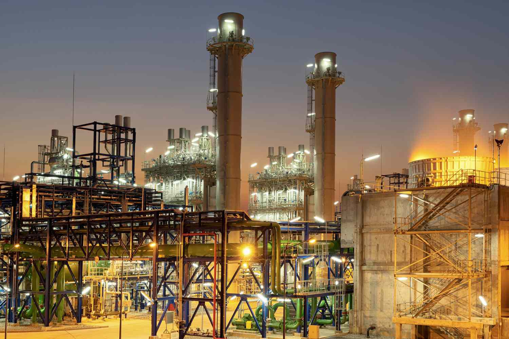

Industrialization has been a pivotal force in shaping the economies of less developed countries (LDCs), acting as a catalyst for economic transformation and growth. This article explores the significant economic impacts of industrialization on LDCs, with particular attention to the emerging role of algorithmic trading within these economies. Algorithmic trading, defined as the use of computer algorithms to manage trading decisions, execution, and processing, is expected to significantly influence the way LDCs interact with global markets by enhancing market efficiencies and liquidity.

Industrialization is often characterized by a shift from a predominantly agricultural economy to one centered around mass production and service industries. This transformation fosters improvements in infrastructure, education, and living standards, leading to increases in per capita GDP and national income. However, the effects of industrialization are multifaceted, encompassing distinct positive and negative outcomes. For instance, while industrialization can attract foreign investment and boost export capacity, it can also result in environmental challenges and social inequalities, demanding a balanced policy approach.

A case study on Hong Kong's industrialization highlights the potential of strategic industrial policies, demonstrating how conducive business environments and strong foreign trade can elevate national prosperity. Such examples provide invaluable insights for LDCs aiming to leverage industrialization as a foundation for growth. By integrating innovative technologies, such as algorithmic trading, LDCs have the potential to minimize financial risks, reduce transaction costs, and gain greater access to international markets.

Ultimately, understanding the complex effects of industrialization is crucial for LDCs as they navigate toward economic advancement. Through strategic planning and the infusion of technological advancements like algorithmic trading, these countries can improve economic stability and ensure sustainable growth.

## Table of Contents

## The Industrialization Process in LDCs

Industrialization represents a major shift for less developed countries (LDCs), moving from primarily agriculture-based economies to urban, mass-producing ones. This transition is crucial for enhancing both the per capita GDP and the general economic well-being of these nations. The process of industrialization is considered a vital step for LDCs because it offers opportunities for significant economic growth and development, enabling these countries to improve living standards, reduce poverty, and integrate into the global market economy.

During industrialization, LDCs are confronted with a range of challenges that encompass environmental, social, and cultural dimensions. Environmentally, industrial activities can lead to pollution and resource depletion, which require careful management and sustainable practices. Socially, industrialization can disrupt traditional livelihoods and exacerbate urban-rural divides, leading to potential social unrest. Culturally, rapid urbanization associated with industrial expansion might dilute traditional values and lifestyles.

Algorithmic trading platforms present a promising tool in facilitating this transition by improving market efficiencies. These platforms use complex algorithms to autonomously execute trades at high speeds and volumes, offering enhanced [liquidity](/wiki/liquidity-risk-premium) and potentially reducing transaction costs in financial markets. For LDCs, incorporating [algorithmic trading](/wiki/algorithmic-trading) could modernize their financial sectors and complement industrial efforts by providing more stable and efficient capital markets. As these countries advance industrially, modern trading systems can integrate them more seamlessly into the global financial network.

A strategic approach is imperative to harmonize industrial growth with sustainable economic practices. Policymakers in LDCs must devise frameworks that simultaneously promote industrial advancement and ensure the protection of natural resources and social equity. This involves crafting regulations that incentivize sustainable technologies, support workforce transitions from agriculture to industry, and mitigate environmental impacts.

In summary, while industrialization is a critical pathway for economic improvement in LDCs, it requires a careful balancing act. The effective utilization of technologies such as algorithmic trading can provide substantial benefits by enhancing market operations, but it is equally essential to address the accompanying challenges of environmental sustainability and social equity.

## Positive Economic Impacts

Industrialization is a critical driver of economic growth for less developed countries (LDCs), contributing to significant improvements in various socioeconomic indicators. It plays a vital role in enhancing education, life expectancy, and national income levels. The shift from an agrarian to an industrialized economy facilitates greater access to education, as industrial growth often necessitates a skilled workforce, which in turn encourages investments in education infrastructure and vocational training.

Improvement in infrastructure is another notable benefit of industrialization. As countries develop their industrial base, they invest in better roads, ports, and communication networks, which are essential for supporting industrial activities. Enhanced infrastructure attracts foreign investments, as investors seek stable environments with robust logistical capabilities. Investments in infrastructure not only boost the industrial sector but also have spillover effects on other areas of the economy, thereby increasing export capacity and integrating LDCs more effectively into global trade networks.

Technological innovation thrives in industrialized settings due to increased capital investment and the presence of competitive markets. As industries strive for efficiency, they foster a culture of innovation, leading to advancements that enhance productivity and competitiveness. This is crucial for LDCs, as technological adaptation can bridge the productivity gap between them and more developed nations.

The introduction of algorithmic trading platforms represents a significant advancement in financial market operations, contributing to economic benefits as part of industrialization. Algorithmic trading optimizes financial markets by providing liquidity and reducing transaction costs. It involves the use of complex algorithms to make trading decisions at speeds and accuracies beyond human capabilities. This technology not only enhances market efficiencies but also democratizes trading, allowing more participants, including those from LDCs, to engage in global financial markets.

The access to global markets is markedly increased through improved trading systems, further spurring economic development. By participating in these markets, LDCs can diversify their economic activities and reduce reliance on traditional agricultural exports. This diversification is critical for mitigating economic vulnerabilities and fostering resilience in the face of global economic fluctuations.

Overall, the positive economic impacts of industrialization in LDCs are extensive. Through infrastructure development, technological advancement, and enhanced market efficiencies, industrialization provides a pathway for sustainable economic growth and increased global integration. According to a study by Szirmai (2012), industrialization has been a successful growth engine for many economies, underscoring its importance for LDCs seeking economic advancement [1].

[1] Szirmai, A. (2012). Industrialization as an Engine of Growth in Developing Countries, 1950-2005. Structural Change and Economic Dynamics, 23(4), 406-420.

## Negative Economic Impacts

Industrialization in less developed countries (LDCs) can often result in various negative economic impacts, which necessitate careful consideration and management. A primary concern is environmental degradation, which arises from increased industrial activity leading to pollution and the depletion of natural resources. Industrial operations frequently involve extensive extraction and use of raw materials, which can result in significant ecological damage if not properly managed. The increased emission of greenhouse gases and pollutants from manufacturing plants contributes to air and water pollution, adversely affecting biodiversity and human health.

Another critical issue is the emergence of social inequalities. Industrialization tends to concentrate wealth and power among a small group of industrial elites. This concentration can exacerbate existing social divides, as these elites often have disproportionate influence over policy-making and economic planning. Studies have shown that income inequality tends to increase during periods of rapid industrialization, largely because the benefits of industrial growth are not evenly distributed (Kuznets, 1955).

The transition from rural, agrarian societies to urban, industrial economies can also disrupt social and cultural structures. As people migrate to cities in search of employment, traditional ways of life and community bonds are often weakened. This urbanization can lead to a loss of cultural heritage and identity, as well as increased social tensions in rapidly expanding urban areas.

Algorithmic trading, while providing potential benefits for financial markets, can also introduce new risks if not appropriately regulated. This form of trading utilizes complex algorithms to make rapid trading decisions, which can sometimes lead to increased market [volatility](/wiki/volatility-trading-strategies). Moreover, access to advanced trading technologies is often exclusive to well-funded institutions, potentially widening the gap between those who can afford to participate and those who cannot, thus reinforcing economic inequalities.

To mitigate these challenges, LDCs must craft policies that promote sustainable and equitable industrial growth. This involves implementing strict environmental regulations to minimize ecological damage and ensuring that industries operate within sustainable limits. Social policies should aim to distribute the economic gains of industrialization more evenly across the population and protect cultural identities through inclusive urban planning. Furthermore, regulatory frameworks for algorithmic trading need to be robust enough to prevent market disruptions and ensure fair access for smaller market participants.

By addressing these concerns, LDCs can better navigate the complexities associated with industrialization and foster an economic environment that supports both growth and social equity.

## Case Study: Hong Kong's Industrialization

Hong Kong experienced a remarkable transformation through rapid industrialization, evolving into a prominent global economy. This shift was characterized by a strategic emphasis on sectors like textiles and technology, underpinned by the region's low tax structure and conducive business environment. The favorable economic policies fostered an atmosphere conducive to business growth and innovation, attracting both local and international investments.

One of the key indicators of Hong Kong's successful industrialization is the significant increase in GDP per capita. This economic metric illustrates the capacity of strategic industrialization to elevate living standards and economic prosperity. By channeling investments into diverse industries, Hong Kong capitalized on its position as a leading exporter, exemplifying how industrial policies can spur comprehensive economic development.

Hong Kong's industrial growth was further bolstered by robust foreign trade. The region's strategic location along major trade routes facilitated the seamless exchange of goods and services, strengthening its position as a global trade hub. This integration into the global economy attracted multinational corporations and diversified Hong Kong's industrial base, paving the way for sustained economic success.

For less developed countries (LDCs) seeking to emulate Hong Kong's industrial trajectory, several lessons emerge. Prioritizing a supportive business environment with favorable tax policies can stimulate investment. Additionally, focusing on both traditional industries like textiles and advancing technological sectors can create a balanced and resilient economic structure. Moreover, fostering strong foreign trade relationships can enhance economic stability and growth potentials.

The case of Hong Kong underscores the potential of strategic industrialization, offering a blueprint for LDCs to cultivate economic growth and transformation. By adopting similar industrial policies tailored to their unique contexts, these countries can aspire to achieve comparable economic advancements.

## Future Growth Prospects

The growth potential for Less Developed Countries (LDCs) remains substantial as they persist on their trajectory of industrialization. Emerging economies, primarily within this group, are anticipated to drive a significant portion of global economic expansion in the upcoming decades. According to [statistics](/wiki/bayesian-statistics) from the United Nations Conference on Trade and Development (UNCTAD), these economies contribute increasingly to global GDP, and their share of exports in manufactured goods is rising [1]. 

Adopting innovative technologies is pivotal for these nations in accelerating their economic progress. Algorithmic trading, an advanced financial technology, offers notable advantages such as enhancing market liquidity and reducing transaction costs. It enables better price discovery and risk management, ensuring that financial markets in LDCs operate efficiently. For instance, the use of algorithmic trading systems can improve capital allocation, allowing local businesses to access financial resources more effectively and fuel economic activities.

International organizations play a crucial supportive role by providing resources, expertise, and platforms for collaboration among LDCs. Through initiatives like capacity-building programs and technical assistance, organizations such as the International Monetary Fund (IMF) and World Bank foster skill development and institutional strengthening. These efforts are essential in equipping LDCs to leverage technology and manage the complexities of industrialization [2].

Addressing challenges proactively is critical for LDCs to achieve sustainable socio-economic advancements. As these countries embrace industrialization, they must implement policies that mitigate environmental impacts and promote social equity. Integrating environmental considerations into industrial policies and prioritizing inclusive growth strategies can help balance economic progress with sustainability.

In conclusion, the potential for growth in LDCs is promising, contingent on the strategic adoption of technological advancements and the effective involvement of international bodies. By managing industrialization deftly, these economies can bolster their positions within the global market while addressing the pressing challenges of sustainability and equity.

References:
1. United Nations Conference on Trade and Development (UNCTAD). "Trade and Development Report 2021." 
2. International Monetary Fund (IMF) and World Bank Group. "Economic Growth and Development."

## Conclusion

Industrialization offers significant opportunities for less developed countries (LDCs), alongside a set of challenges that must be navigated carefully. At its core, industrialization has the potential to transform economic landscapes by elevating productivity, increasing national income, and enhancing the overall quality of life within these economies. However, the path to such progress is fraught with obstacles that require strategic consideration and application of emerging technologies.

The strategic integration of algorithmic trading is a critical [factor](/wiki/factor-investing) in bolstering economic stability and growth for LDCs. Algorithmic trading can optimize financial markets by facilitating greater liquidity and minimizing transaction costs, which in turn can stimulate economic activity and attract foreign investment. By leveraging sophisticated algorithms, LDCs can harness the benefits of global financial systems and create more robust economic structures that are capable of withstanding external shocks.

Yet, as industrialization proceeds, it is imperative for policies to address the dual imperatives of environmental sustainability and social equity. Growth must not come at the expense of natural resource depletion or exacerbate socio-economic inequalities. Sustainable industrial practices, coupled with equitable resource distribution, are essential to ensure that industrial progress translates into comprehensive socio-economic development.

Moreover, LDCs must learn from historical examples while fostering an innovative and forward-thinking mindset. Successful industrialization stories, such as that of Hong Kong, provide valuable lessons in how strategic policy design, investment in technology, and a favorable business environment can collectively spur economic advancements. By drawing upon these lessons, LDCs can tailor their industrial strategies to suit unique national contexts and priorities.

Looking ahead, future developments in trade and industry will significantly influence the economic resilience of LDCs. As globalization fosters closer economic integration, LDCs have the opportunity to capitalize on their unique advantages and align with global market needs. The adoption of cutting-edge technologies, like algorithmic trading, will be instrumental in accelerating economic progress and ensuring that LDCs remain competitive on the global stage.

Ultimately, the path to industrialization for LDCs is a dynamic one, requiring balanced, strategic, and adaptive approaches. Effective policy-making that fosters innovation while safeguarding social and environmental concerns will be critical in paving the way for sustainable growth and long-term economic resilience.

## References & Further Reading

[1]: Szirmai, A. (2012). ["Industrialization as an Engine of Growth in Developing Countries, 1950-2005."](https://www.sciencedirect.com/science/article/pii/S0954349X1100018X) Structural Change and Economic Dynamics, 23(4), 406-420.

[2]: Kuznets, S. (1955). ["Economic Growth and Income Inequality."](https://assets.aeaweb.org/asset-server/files/9438.pdf) The American Economic Review, 45(1), 1-28.

[3]: United Nations Conference on Trade and Development (UNCTAD). ["Trade and Development Report 2021."](https://unctad.org/publication/trade-and-development-report-2021)

[4]: International Monetary Fund (IMF) and World Bank Group. ["Economic Growth and Development."](https://www.worldbank.org/en/about/history/the-world-bank-group-and-the-imf)

[5]: Lechner, M., & Wunsch, C. (2013). ["Active Labor Market Policy in East Germany: Waiting for the Economy to Take Off."](https://www.ssoar.info/ssoar/bitstream/handle/document/31593/ssoar-2006-lechner_et_al-Active_labour_market_policy_in.pdf) The Economics of Transition, 21(3), 565–597.