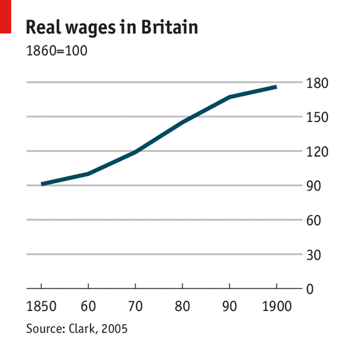

## Table of Contents

## What is industrialization?

Industrialization is when a country starts using machines and factories to make things instead of making them by hand. This change began in the late 1700s in Britain and then spread to other parts of the world. It changed how people worked and lived because they could make things faster and cheaper. Before industrialization, most people lived in the countryside and worked on farms. But with factories, many people moved to cities to work in these new jobs.

This big change brought many new inventions and ways of doing things. For example, the steam engine helped power machines and move goods quickly. Railroads and better roads made it easier to transport things from one place to another. But industrialization also had some problems. It could be hard for workers because they had to work long hours in factories that were not always safe. Also, the air and water in cities got dirty because of all the new factories. Even with these challenges, industrialization helped countries grow and become more powerful.

## How did industrialization change the way goods were produced?

Industrialization changed the way goods were produced by introducing machines and factories. Before, people made things by hand, which was slow and took a lot of time. But with machines, they could make things much faster and in larger amounts. For example, instead of one person weaving cloth by hand, a machine could do it much quicker. This meant that factories could produce more goods than ever before.

This change also meant that goods became cheaper. Because machines could make things faster, the cost of making each item went down. This made it possible for more people to buy things they needed or wanted. For instance, clothes and tools became more affordable. Overall, industrialization made it easier and cheaper to produce goods, which helped economies grow and changed the way people lived and worked.

## What were typical wages before industrialization?

Before industrialization, most people worked as farmers or in small workshops. They didn't earn a fixed wage like workers do today. Instead, they often got paid in goods like food or cloth, or they might get a small amount of money. The amount they earned depended on how much they could produce and sell. For example, a farmer might earn more in a good year with a big harvest, but less in a bad year.

Life was hard for many people because their earnings were not steady. They had to work long hours every day, and there was no guarantee of how much they would make. Families often worked together on the farm or in the workshop, and everyone's work was important for survival. This way of [earning](/wiki/earning-announcement) a living was very different from the regular wages that factory workers started to get during industrialization.

## How did wages change with the onset of industrialization?

When industrialization started, wages changed a lot. Before, people worked on farms or in small workshops and got paid in goods like food or a little bit of money. But with factories, workers started to get paid regular wages in money. This was good because it was more predictable. Workers knew how much they would earn each week or month, which made it easier to plan their lives.

But the change wasn't all good. In the early days of industrialization, wages were often very low. Workers had to work long hours, sometimes 12 to 16 hours a day, and the pay was not enough for a good life. Many families had to send their children to work in factories too, just to make ends meet. Over time, as workers started to organize and fight for better pay and conditions, wages slowly improved. But in the beginning, the change to factory work meant hard work for little money.

## What factors influenced wage levels during industrialization?

During industrialization, many things affected how much workers got paid. One big [factor](/wiki/factor-investing) was how much people wanted the goods that factories made. If lots of people wanted to buy things like cloth or tools, factories could sell more and might pay workers more. But if not many people wanted to buy, factories might pay less. Another factor was how many workers were looking for jobs. If there were more workers than jobs, factories could pay less because people really needed the work.

Also, the skills needed for the job made a difference. Jobs that needed special skills, like running a big machine, might pay more than simple jobs. But most factory jobs didn't need special skills, so wages stayed low. Over time, as workers started to form groups and ask for better pay, wages slowly got better. But in the early days of industrialization, these groups didn't have much power, so wages stayed low for a long time.

## How did the standard of living change as a result of industrialization?

Industrialization changed the standard of living in big ways. Before, most people lived in the countryside and worked on farms. They made their own food and clothes, and life was hard because they didn't have much money. But with factories, people started to move to cities for jobs. They could earn money to buy things they needed, like food and clothes, instead of making everything themselves. This made life a bit easier because they could get things faster and cheaper.

But the change wasn't all good. In the early days of industrialization, many people lived in crowded cities with dirty air and water. They worked long hours in factories for low pay, and life was still hard. Over time, as workers started to fight for better pay and conditions, the standard of living slowly got better. People could afford more things, and cities started to improve. But it took a long time for the benefits of industrialization to reach everyone.

## What was the impact of industrialization on different social classes?

Industrialization changed life for different social classes in big ways. For the working class, life got harder at first. They moved to cities to work in factories, but the pay was low and the hours were long. They lived in crowded places with dirty air and water. It was tough, but over time, as they started to organize and fight for better pay and conditions, things slowly got better. They could afford more things and their lives improved, but it took a long time.

For the middle class, industrialization brought new opportunities. They could start businesses or work in offices, which paid better than factory jobs. They could afford nicer homes and better education for their children. Their standard of living went up faster than the working class. The upper class, who owned the factories and businesses, got even richer. They had more power and money, and their lives got even more comfortable. So, while industrialization helped some people a lot, it took longer for everyone to feel the benefits.

## How did labor unions affect wages during industrialization?

Labor unions had a big impact on wages during industrialization. At first, workers didn't have much power. They had to work long hours for low pay, and if they complained, they could lose their jobs. But when workers started to join together in unions, they could speak with one voice. They could ask for better pay and working conditions. This was hard because the factory owners didn't want to pay more, but the unions kept trying.

Over time, the unions started to make a difference. They went on strikes, where workers stopped working until the owners agreed to pay more. Sometimes, the strikes worked, and wages went up a little. It was slow, but the unions helped workers get better pay and shorter hours. By working together, the workers had more power to change things. So, labor unions were really important in making life better for workers during industrialization.

## What role did government policies play in wage determination during industrialization?

During industrialization, government policies played a big role in how much workers got paid. At first, many governments didn't do much to help workers. They let factory owners decide how much to pay, and the owners usually paid as little as they could. This meant workers had low wages and had to work long hours. But over time, some governments started to see that workers needed help. They made laws to set a minimum wage, which meant factory owners had to pay at least that much. This helped workers earn a bit more money.

Governments also made rules about how long people could work. They set limits on the number of hours workers could be on the job each day or week. This gave workers more time to rest and spend with their families. These rules helped make life a bit better for workers. But it took a long time for governments to start making these changes. At first, they were more focused on helping businesses grow than on helping workers. So, government policies slowly started to help with wage determination, but it was a slow process.

## How did regional differences affect wage levels during industrialization?

During industrialization, where you lived made a big difference in how much money you made. In places like big cities where there were lots of factories, there were more jobs. But there were also more people looking for work. This meant that factory owners could pay less because workers really needed the jobs. In smaller towns or rural areas, there might not have been as many factories, but the cost of living could be lower. So, even if wages were lower, it might still be enough for people to live on.

Different regions also had different kinds of industries. For example, some places had factories that made cloth, while others made steel or machines. The kind of work and the skills needed could change how much people got paid. In areas with industries that needed special skills, like working with machines, wages might be higher. But in places with simple jobs that anyone could do, wages were often lower. So, the type of industry and the skills needed in different regions played a big role in how much workers earned.

## What long-term effects did industrialization have on wage structures?

Industrialization changed how wages worked over the long term. Before, people worked on farms or in small shops and got paid in things like food or a little money. But with factories, workers started to get paid regular money wages. This was good because it was more predictable. Workers knew how much they would earn each week or month, which made it easier to plan their lives. Over time, as workers started to organize into unions and fight for better pay, wages slowly got better. Governments also started to make laws to set minimum wages and limit working hours, which helped workers earn more and have better lives.

But the change to factory work also meant that wages were different in different places. In big cities with lots of factories, there were more jobs but also more people looking for work. This meant wages could be lower because workers really needed the jobs. In smaller towns or rural areas, there might not have been as many factories, but the cost of living could be lower. So, even if wages were lower, it might still be enough for people to live on. The type of industry and the skills needed also made a difference. Jobs that needed special skills, like working with machines, might pay more than simple jobs. So, industrialization made wages more regular and slowly better, but it also made them different depending on where you lived and what kind of work you did.

## How do economists measure the impact of industrialization on wages?

Economists measure the impact of industrialization on wages by looking at how wages changed over time. They use data from old records and surveys to see how much workers earned before and after factories started. They look at things like how much money workers made each week or month, and how this changed as more factories were built. They also compare wages in different places, like cities with lots of factories and smaller towns with fewer factories. This helps them understand how industrialization affected wages in different areas.

Another way economists measure the impact is by looking at how wages changed for different kinds of jobs. They study wages for jobs that needed special skills, like working with machines, and compare them to wages for simple jobs that anyone could do. They also look at how government policies, like minimum wage laws, affected wages. By studying all these things, economists can see how industrialization made wages more regular and slowly better, but also how it made wages different depending on where you lived and what kind of work you did.

## References & Further Reading

[1]: Acemoglu, D., & Restrepo, P. (2018). ["The Race Between Man and Machine: Implications of Technology for Growth, Factor Shares, and Employment."](https://www.aeaweb.org/articles?id=10.1257/aer.20160696) The Quarterly Journal of Economics, 133(2), 1050-1100.

[2]: Dickens, Charles. ["Hard Times."](https://en.wikipedia.org/wiki/Hard_Times_(novel)) Report highlighting worker exploitation during the Industrial Revolution.

[3]: Allen, R. C. (2009). ["The British Industrial Revolution in Global Perspective."](https://www.cambridge.org/core/books/british-industrial-revolution-in-global-perspective/29A277672CCD093D152846CE7ED82BD9) Oxford University Press. 

[4]: Piketty, T. (2014). ["Capital in the Twenty-First Century."](https://www.jstor.org/stable/j.ctt6wpqbc) Harvard University Press. 

[5]: Jovanovic, B., & Rousseau, P. L. (2005). ["General Purpose Technologies."](https://www.nber.org/papers/w11093) Journal of Economic Literature, 43(3), 641-661.

[6]: Autor, D. H., Levy, F., & Murnane, R. J. (2003). ["The Skill Content of Recent Technological Change: An Empirical Exploration."](https://www.jstor.org/stable/25053940) The Quarterly Journal of Economics, 118(4), 1279-1333.

[7]: Brynjolfsson, E., & McAfee, A. (2014). ["The Second Machine Age: Work, Progress, and Prosperity in a Time of Brilliant Technologies."](https://psycnet.apa.org/record/2014-07087-000) W.W. Norton & Company.