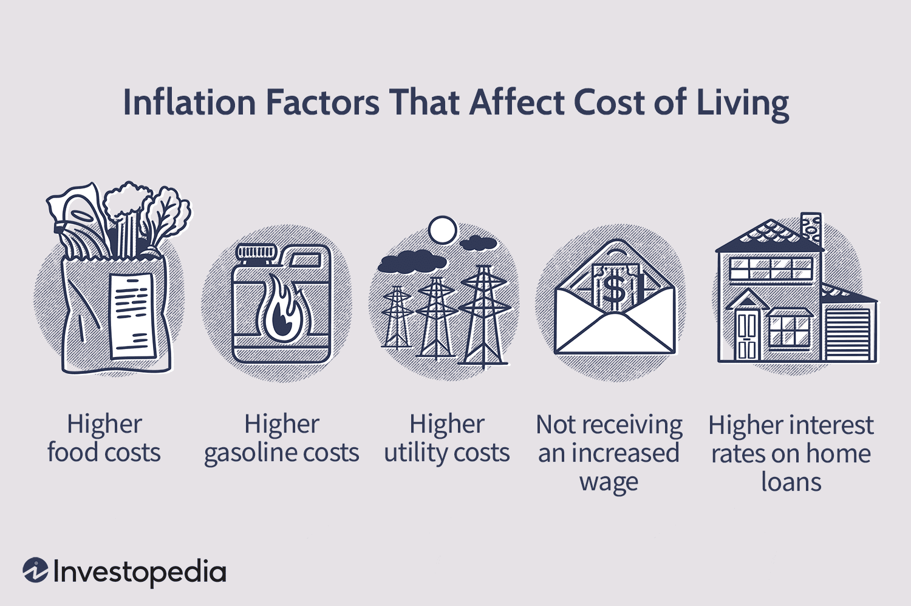

In today's interconnected global economy, understanding economic indicators such as inflation and the cost of living is increasingly important. These metrics are critical in evaluating financial health and social well-being across different societies. Inflation refers to the rise in prices over time, which directly impacts the purchasing power of consumers and the stability of the economy. The cost of living, on the other hand, encompasses the amount of money needed to sustain a certain standard of living, covering expenses for goods and services, housing, and healthcare.

As globalization and technological advances reshape financial landscapes, the interaction between economic conditions and modern financial innovations like algorithmic trading becomes complex and profound. Algorithmic trading involves the use of computer algorithms to automate trading decisions and execute securities transactions at speeds and frequencies impossible for human traders. These systems rely on comprehensive economic data, including indices like inflation, to optimize trading strategies and manage financial risk.



This article investigates the intersection of cost of living, inflation, and algorithmic trading, addressing how these dynamics are intricately linked and how they influence each other. A thorough understanding of these relationships is crucial for traders seeking to maximize returns and for everyday consumers striving to maintain their standard of living amidst fluctuating economic conditions. Both groups must remain vigilant and adaptable, learning to harness emerging technologies and economic insights to navigate the financial complexities of the present and future.

## Table of Contents

## Understanding Cost of Living and Inflation

The cost of living is a critical economic indicator that measures the amount of money needed to sustain a certain standard of living by covering basic expenses such as housing, food, taxes, and healthcare. It plays a significant role in economic assessments, influencing wage adjustments, social security benefits, and economic policy decisions. Cost of living is often compared across different geographic areas and time periods to assess the relative affordability of regions or the impact of inflation on purchasing power.

Inflation, on the other hand, represents the rate at which the general level of prices for goods and services rises, thereby eroding purchasing power. It is typically measured by indices such as the Consumer Price Index (CPI) or the Producer Price Index (PPI), which track changes in the price of a basket of goods and services over time. Inflation is influenced by multiple factors including demand-pull effects, cost-push factors, and monetary supply dynamics.

While cost of living and inflation are interrelated, they differ in scope and impact. Inflation primarily focuses on the rate of price increase over time, reflecting broad economic trends. In contrast, cost of living is more comprehensive, encompassing the actual expenses paid by consumers in a specific area or associated with a particular lifestyle, serving as a benchmark for necessary income levels.

The individual impacts of these metrics are distinct. Inflation affects economic stability by influencing interest rates and monetary policy, often prompting central banks to adjust interest rates to maintain acceptable inflation levels. Changes in inflation rates can lead to a decrease in purchasing power, necessitating an increase in wages to maintain living standards.

Conversely, cost of living variations impact geographic mobility and employment decisions. Areas with a high cost of living may require higher salaries to attract skilled workers. Additionally, cost of living adjustments (COLAs) are often employed in salary negotiations, ensuring wages keep pace with the actual expenses required to live adequately in specific regions.

Understanding both cost of living and inflation is essential for policymakers, businesses, and consumers alike. Policymakers rely on these metrics to formulate strategies that address economic disparities and promote financial stability, while businesses use them for pricing strategies and wage determinations. Consumers need to understand these concepts to manage personal finances, negotiate salaries, and plan for the future.

## Economic Impact of Inflation

Inflation represents a critical economic condition where the general level of prices for goods and services rises, eroding purchasing power over time. As inflation increases, each unit of currency buys fewer goods and services, reducing the real value of money. This decline in purchasing power means that consumers must spend more to maintain their standard of living, impacting disposable income and savings. 

Inflation, when moderate, can be a sign of a growing economy, but excessive inflation poses risks to economic stability. High inflation can lead to uncertainty, discouraging investment and savings as future price increases and interest returns become unpredictable. In severe cases, hyperinflation can destabilize entire economies, leading to the collapse of currency and economic systems, as witnessed historically in countries like Zimbabwe and the Weimar Republic of Germany.

Central banks are pivotal in managing inflation through monetary policy. By adjusting interest rates, central banks influence borrowing and spending. Lower interest rates typically encourage spending and investing but may lead to higher inflation if the economy overheats. Conversely, higher interest rates can help control inflation but might suppress economic growth by discouraging borrowing. Central banks also use open market operations, buying or selling government securities, to influence the money supply. Quantitative easing, a modern tool, involves purchasing long-term securities to increase money supply and encourage lending and investment.

The societal impacts of inflation are multifaceted. Inflation affects the standard of living as real incomes decline, necessitating higher wages to maintain purchasing power. This effect is more pronounced in wage contracts not indexed to inflation, leading to a decrease in real earnings. Consumers may alter their consumption patterns, opting for cheaper alternatives or reducing non-essential expenditures. This shift can influence business revenues, labor markets, and economic growth.

Inflation also affects savers and borrowers differently. While borrowers may benefit from repaying loans with money that is now worth less, savers lose as the purchasing power of their savings diminishes. This dynamic induces a redistribution of wealth, affecting income inequality.

In conclusion, inflation's impact on purchasing power and economic stability underscores the need for vigilant monetary policy and adaptive strategies to mitigate its effects on society. Understanding these mechanisms is crucial not only for policymakers but for individuals and businesses adjusting to an inflationary environment.

## Algorithmic Trading in an Inflationary Economy

Algorithmic trading, often referred to as algo-trading, is a method of executing orders using automated pre-programmed trading instructions. These instructions account for variables such as timing, price, and [volume](/wiki/volume-trading-strategy). Since its inception, [algorithmic trading](/wiki/algorithmic-trading) has become a dominant force in global financial markets, revolutionizing the way trades are executed by offering efficiency and precision.

Algorithmic trading systems are designed to respond dynamically to economic indices, including inflation rates. These systems utilize a combination of financial theories and computational algorithms to make informed trading decisions. Inflation, a measure of the rate at which the general level of prices for goods and services rises, eroding purchasing power, is a critical economic indicator that can significantly impact trading decisions. Hence, trading algorithms are often programmed to account for inflationary trends to optimize portfolio performance and hedge against potential risks.

One of the primary benefits of integrating inflationary data into trading algorithms is the ability to adjust trading strategies in real-time. By continuously monitoring inflation indices, algorithms can alter buy, sell, or hold decisions to protect against inflationary losses. For instance, in an inflationary period, a trading algorithm might increase the allocation of assets in commodities, which often appreciate during such times, or in inflation-protected securities.

The integration of inflationary data also enables algorithms to predict and respond to market [volatility](/wiki/volatility-trading-strategies). Since inflation can trigger fluctuations in interest rates, currency valuations, and stock prices, having a robust algorithm capable of adapting to these changes provides a competitive edge. Algorithms designed to mitigate inflation risks can better manage portfolio volatility, thereby protecting investor capital.

However, the implementation of inflation-responsive algorithms also comes with challenges. One key challenge is the accurate and timely acquisition of economic data. Inflation rates and related economic indicators are subject to revision, and delays in data collection or dissemination can hinder the efficacy of the trading algorithms. Moreover, inflation is influenced by a multitude of factors, including monetary policy decisions, supply chain disruptions, and geopolitical events, all of which introduce complexity in accurately modeling inflationary trends.

Another challenge lies in the computational resources required to analyze large volumes of data and execute trades at high speeds. Developing algorithms that can efficiently process this information without sacrificing accuracy necessitates advanced computing infrastructure and sophisticated software solutions.

Despite these challenges, the integration of inflationary data into algorithmic trading remains a lucrative endeavor for firms seeking to enhance their trading operations. With advances in [machine learning](/wiki/machine-learning) and data analytics, the ability to predict and respond to economic conditions continues to improve, making algorithmic trading a pivotal component of modern finance.

## Case Studies: Responses to Inflation in Algorithmic Trading

Renaissance Technologies and Bridgewater Associates stand as exemplary firms in their approach to algorithmic trading, particularly when adapting their strategies to manage inflation. These firms have developed methodologies that not only respond to current economic conditions but also anticipate future trends.

### Renaissance Technologies

Renaissance Technologies is renowned for its [quantitative trading](/wiki/quantitative-trading) strategies, which leverage sophisticated mathematical models and statistical analyses. The firm employs algorithms that incorporate large sets of historical economic data, allowing them to detect subtle patterns in financial markets. When managing inflation, Renaissance Technologies focuses on the following strategies:

1. **Data-Driven Predictions**: By analyzing historical inflation data alongside other economic indicators, Renaissance Technologies' algorithms make predictions about future inflationary trends. This involves the use of advanced statistical techniques such as autoregressive integrated moving average (ARIMA) models to forecast inflation rates.

2. **Diversification**: A key aspect of Renaissance’s strategy is diversification across different asset classes and markets. In high inflation environments, the firm shifts its focus towards assets that historically perform well under inflationary pressure, such as commodities or Treasury Inflation-Protected Securities (TIPS).

3. **Adaptive Algorithms**: Their trading systems are adaptive, continually learning from new data. Machine learning techniques enable their algorithms to refine their strategies in response to ongoing changes in inflation and other economic conditions.

### Bridgewater Associates

Bridgewater Associates takes a principled approach to inflation, guided by its founder Ray Dalio’s economic philosophies. The firm applies a robust framework called the "All Weather" investment strategy which aims to perform well in diverse economic climates, including periods of high inflation.

1. **All Weather Portfolio**: This strategy involves a balanced mix of assets designed to thrive across different economic scenarios. The portfolio emphasizes diversification across economic environments, with allocations adjusted according to inflationary pressures.

2. **Macroeconomic Analysis**: Bridgewater's algorithms incorporate comprehensive macroeconomic analyses. This enables the firm to understand the underlying causes of inflation and to predict its impact on different asset classes.

3. **Risk Parity**: A critical aspect of Bridgewater's strategy is risk parity, which ensures that the portfolio's risk is evenly distributed across different asset classes. By employing this method, the firm reduces vulnerability to inflation-driven market volatility.

### Lessons Learned

These firms provide valuable insights into adaptive strategies for algorithmic trading in inflationary contexts. Key lessons include:

- **Integration of Economic Indicators**: Effective inflation management requires incorporating a broad array of economic indicators into algorithmic models, ensuring that all potential influences on inflation are considered.

- **Flexibility and Adaptability**: The ability of algorithms to adjust to evolving economic conditions is vital. Both Renaissance and Bridgewater demonstrate that dynamic adjustment to portfolios based on real-time data enhances resilience against inflation.

- **Strategic Diversification**: By diversifying investments across various asset types and markets, traders can mitigate the risks associated with inflation. This approach helps stabilize returns during turbulent economic periods.

These strategies highlight the necessity for continuous advancements in algorithmic trading technologies and adaptability to maintain financial stability amid inflationary challenges.

## The Future of Economic Measurement and Trading Technologies

Emerging technologies are reshaping the landscape of economic measurement and algorithmic trading, providing more precise tools and strategies for market participants. The integration of [artificial intelligence](/wiki/ai-artificial-intelligence) (AI) and machine learning (ML) is at the forefront, offering unprecedented capabilities in the analysis and prediction of economic trends. These technologies process vast datasets more efficiently and accurately than traditional methods, leading to more informed trading decisions.

AI and ML algorithms are particularly adept at identifying patterns within large and diverse datasets. They can analyze variables such as GDP growth, unemployment rates, consumer spending, and more, to predict economic shifts. For instance, ML models can use time-series analysis to forecast inflation rates based on historical data, enhancing their predictive accuracy. These models leverage techniques such as supervised learning, where they are trained on datasets with known outputs to predict future trends.

One common approach in ML for time-series forecasting is using neural networks such as Long Short-Term Memory (LSTM) models, which are particularly effective in capturing temporal dependencies in sequential data. A simple Python implementation for time-series prediction using LSTM could look like this:

```python
import numpy as np
import pandas as pd
from keras.models import Sequential
from keras.layers import LSTM, Dense

# Assuming 'data' is a pandas DataFrame with time-series data
data = pd.read_csv('economic_data.csv')

# Preprocess data
def create_dataset(data, time_step=1):
    X, Y = [], []
    for i in range(len(data) - time_step - 1):
        a = data[i:(i + time_step), 0]
        X.append(a)
        Y.append(data[i + time_step, 0])
    return np.array(X), np.array(Y)

time_step = 10
features = data.values  # Convert DataFrame to Numpy array
X, Y = create_dataset(features, time_step)

# Reshape input to be [samples, time steps, features] which is required for LSTM
X = X.reshape(X.shape[0], X.shape[1], 1)

# Design the LSTM model
model = Sequential()
model.add(LSTM(50, return_sequences=True, input_shape=(time_step, 1)))
model.add(LSTM(50, return_sequences=False))
model.add(Dense(1))
model.compile(optimizer='adam', loss='mean_squared_error')

# Fit the model
model.fit(X, Y, epochs=100, batch_size=32)

# Model can now be used for prediction on new data
```

Moreover, emerging technologies are enabling the integration of comprehensive economic datasets into trading strategies. By aggregating data from diverse sources such as social media sentiment, satellite imagery, and real-time financial news, trading algorithms can gauge market sentiment and anticipate market movements more effectively. These data are used to refine existing models and develop adaptive strategies that respond dynamically to evolving market conditions.

The future potential of these technologies lies in their ability to transform economic data into actionable insights swiftly. Quantum computing, although in its nascent stages, holds promise for further enhancement of computational power, potentially allowing for the processing of even larger datasets and more complex simulations. Additionally, advancements in distributed ledger technologies, like blockchain, offer potential for more transparent and secure data management in trading systems.

Integrating these advanced technologies into algorithmic trading not only enhances efficiency but also introduces new paradigms of risk management and strategic execution in financial markets. The ongoing evolution in economic measurement and trading technologies promises to elevate the predictive power and adaptability of economic strategies, heralding a new era in economic and financial analysis.

## Conclusion

In synthesizing the intricate relationship between cost of living, inflation, and algorithmic trading, it is clear that these elements are tightly interwoven within the fabric of modern economic systems. Inflation, characterized by the general increase in prices and fall in the purchasing value of money, directly influences the cost of living by affecting the affordability of goods and services for individuals. As prices surge, the real income of consumers diminishes unless it is matched by an equivalent rise in wages, leading to variations in the cost of living metrics which are critical in economic assessments.

Algorithmic trading plays a pivotal role by providing financial markets with the agility to respond to such economic indicators swiftly and efficiently. These systems, utilizing complex algorithms, are capable of processing vast amounts of economic data, including inflationary trends, to make rapid trading decisions. This technological integration allows for the optimization of trade strategies that can anticipate and react to inflationary pressures, providing both challenges and opportunities for traders and economic planners alike.

Understanding these dynamics is essential for strategic financial planning. Businesses and consumers who grasp the implications of inflation on cost of living can better manage their financial portfolios and investments. Financial institutions and individual traders harnessing algorithmic trading technologies must continuously adapt to evolving economic conditions to maintain competitive edges in the market.

As the future unfolds, the exploration and adaptation to new economic measurement tools and trading technologies become paramount. Advancements in artificial intelligence and machine learning promise more accurate predictions of economic trends, potentially leading to a more nuanced integration of comprehensive economic data into trading strategies. This ongoing evolution underscores the necessity for continued research and development in economic technologies, ensuring that both businesses and consumers can navigate and thrive in the ever-changing economic landscape.

## References & Further Reading

1. **Brown, S. J., Goetzmann, W. N., & Liang, B. (2004).** "Hedge Funds and the Technology Bubble," *Journal of Portfolio Management*, 30(5), 101-112. This paper discusses how hedge funds navigated economic challenges during the technology bubble, providing insights applicable to algorithmic strategies.

2. **Engle, R. F., & Rangel, J. G. (2008).** "The Spline GARCH Model for Unconditional Volatility and its Global Macroeconomic Causes," *Review of Financial Studies*, 21(3), 1187-1222. This study examines the effects of global macroeconomic variables, including inflation, on financial volatility.

3. **Fama, E. F., & French, K. R. (1997).** "Industry Costs of Equity," *Journal of Financial Economics*, 43(2), 153-193. The authors provide a framework to understand the variability of inflationary impacts across different sectors, relevant for algorithmic trading.

4. **Lakonishok, J., & Smidt, S. (1984).** "Volume for Winners and Losers: Taxation and Other Motives for Stock Trading," *Journal of Finance*, 39(4), 951-974. This paper explores trading behaviors influenced by tax and inflationary considerations, with implications for algorithmic adjustments.

5. **Poterba, J. M. (1998).** "The Rate of Return to Corporate Capital and Factor Shares: New Estimates Using Revised National Income Accounts and Capital Stock Data," *Carnegie-Rochester Conference Series on Public Policy*, 48, 211-246. This study analyzes corporate returns amidst inflationary pressures, providing data crucial for algorithmic model calibration.

6. **Chou, R. Y., & Wang, C. H. (2009).** "Market Reactions to Inflation News: Automatic versus Discretionary Monetary Policy," *Review of Quantitative Finance and Accounting*, 33(2), 161-179. This article focuses on market responses to inflation news, informing algorithmic trading strategies regarding economic indices.

7. **Rosenberg, B., & Guy, J. (1976).** "Prediction of Beta from Investment Fundamentals," *Financial Analysts Journal*, 32(4), 60-72. This study provides insights into predicting asset sensitivity in varied economic climates, crucial for algorithmic efficiency during inflation.

8. **Blei, D. M., Ng, A. Y., & Jordan, M. I. (2003).** "Latent Dirichlet Allocation," *Journal of Machine Learning Research*, 3, 993-1022. While primarily about machine learning, the techniques discussed have potential applications in refining algorithmic trading models using economic data.

9. **Ang, A., & Bekaert, G. (2002).** "International Asset Allocation with Time-Variant Expected Returns," *Review of Financial Studies*, 15(4), 1137-1187. This work discusses asset allocation across inflationary cycles, aiding in the development of adaptive trading algorithms.

10. **Hochreiter, S., & Schmidhuber, J. (1997).** "Long Short-Term Memory," *Neural Computation*, 9(8), 1735-1780. This seminal paper introduces LSTM networks, which have applications in predicting economic trends for algorithmic trading.  

For further reading, these sources provide varying perspectives on the intricate relationships between inflation, economic indicators, and algorithmic trading methods.

