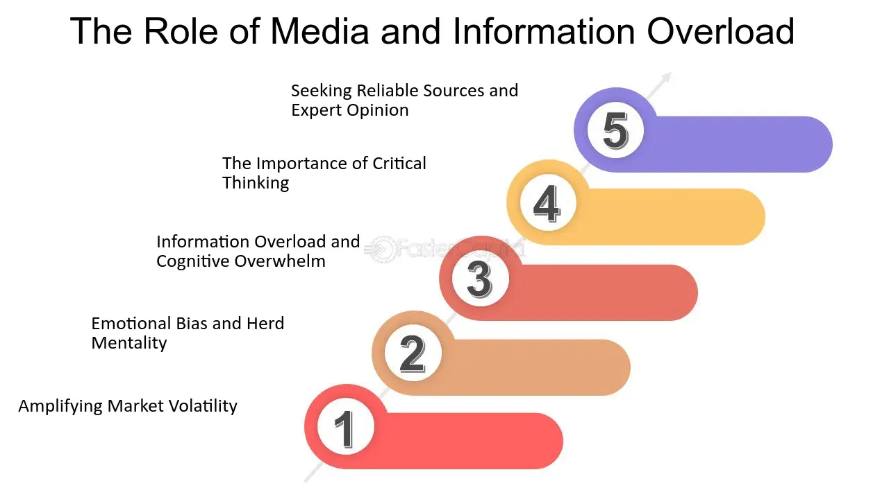

## Table of Contents

## What is information overload?

Information overload happens when there is too much information for someone to handle at one time. It can make people feel confused and stressed because they can't process everything. This often happens because of the internet and social media, where there is a lot of information available all the time.

When someone experiences information overload, it can be hard for them to make decisions or focus on important tasks. They might feel overwhelmed and tired, which can affect their work and personal life. To manage this, people can try to limit the amount of information they take in and take breaks to rest their minds.

## How does information overload affect decision-making?

Information overload can make decision-making really hard. When there is too much information, it's tough to figure out what is important and what isn't. People might feel confused and unsure because they can't see the big picture clearly. This can lead to taking a long time to make a decision or even making a bad choice because they missed key details.

Also, when someone is overwhelmed with information, they might start to feel stressed and tired. This can make it even harder to think clearly and make good decisions. Instead of focusing on the important parts, they might get stuck on small details or just give up and not decide at all. So, managing the amount of information we take in can help us make better choices.

## What are common sources of information overload for investors?

For investors, information overload often comes from the huge amount of financial news and data available every day. They have to deal with stock prices, company reports, economic indicators, and news articles all the time. It's hard to keep up with everything and know what is really important for making good investment choices.

Another big source of information overload is social media and online forums where people share their opinions and predictions about the market. Investors might feel pressured to read and react to all these different views, but it can be confusing and overwhelming. It's easy to get lost in all the noise and miss out on the key information that really matters for their investment strategy.

## Can information overload lead to analysis paralysis in investing?

Yes, information overload can lead to analysis paralysis in investing. When investors are faced with too much information, they might spend a lot of time trying to understand and analyze everything. This can make them feel stuck because they can't decide which information is important and which isn't. They might keep looking for more data, hoping to make the perfect decision, but this just makes things worse.

Because of this, investors might not make any decisions at all. They might miss out on good opportunities because they're too busy trying to process all the information. This can be frustrating and stressful, and it can hurt their investment results. It's important for investors to find a balance and learn how to focus on the key information that really matters for their decisions.

## How does information overload impact the mental health of investors?

Information overload can really affect the mental health of investors. When they have to deal with too much information every day, it can make them feel stressed and anxious. They might worry about missing important news or making bad investment choices because they can't keep up with everything. This constant pressure can lead to feelings of being overwhelmed and can even cause sleep problems or other health issues.

Over time, the stress from information overload can lead to burnout. Investors might feel tired all the time and lose interest in their work. They might also feel sad or hopeless because they can't seem to make good decisions. Taking breaks and finding ways to manage the amount of information they take in can help investors feel better and protect their mental health.

## What strategies can beginners use to manage information overload?

Beginners can manage information overload by setting limits on how much information they take in each day. They can choose a few reliable sources of information, like a couple of news websites or financial blogs, and stick to those instead of trying to read everything. It's also helpful to set specific times to check for updates, like once in the morning and once in the evening, so they don't feel like they have to be checking all the time.

Another good strategy is to focus on the most important information. Beginners should try to understand the big picture and not get lost in small details. They can ask themselves what really matters for their goals and ignore the rest. It's also okay to take breaks and step away from the information for a while. Doing something relaxing or fun can help clear their mind and reduce stress.

Lastly, beginners can talk to more experienced investors or join a community where they can share and discuss information. This can help them learn what's important and what's not. It's also a good way to get support and feel less alone in dealing with all the information. By using these strategies, beginners can manage information overload better and make smarter investment choices.

## How does information overload influence investment performance?

Information overload can hurt investment performance by making it hard for investors to make good choices. When there is too much information, investors might spend a lot of time trying to understand everything. This can lead to analysis paralysis, where they can't decide what to do because they're overwhelmed. They might miss good opportunities or make bad decisions because they can't see what's really important. This can lead to lower returns on their investments.

Over time, the stress from information overload can also affect an investor's mental health. Feeling stressed and anxious can make it even harder to think clearly and make smart choices. Investors might feel tired and lose interest in their investments, which can lead to poor performance. By managing the amount of information they take in and focusing on what really matters, investors can make better decisions and improve their investment results.

## What role does technology play in exacerbating information overload for investors?

Technology makes information overload worse for investors because it gives them too much information all the time. With the internet, smartphones, and apps, investors can see stock prices, news, and other data every second of the day. This means they feel like they have to keep checking everything, which can make them feel stressed and overwhelmed. It's hard to know what information is important when there's so much coming at them all the time.

Also, technology like social media and online forums adds to the problem. Investors can see what other people are saying about the market and their investments, and there are so many different opinions. It's easy to get lost in all these views and not know what to believe. This can make it hard for investors to focus on what really matters for their investment choices, and it can make them feel even more confused and stressed.

## How can experienced investors filter and prioritize information effectively?

Experienced investors can filter and prioritize information by focusing on what really matters for their investment goals. They can choose a few reliable sources of information, like well-known financial news websites or trusted analysts, and stick to those. By doing this, they can ignore the noise from less important sources and social media. It's also helpful for them to set specific times to check for updates, so they don't feel like they have to be looking at information all the time. This helps them stay calm and make better decisions.

Another way experienced investors can manage information is by using tools and technology to help them. They can use apps or software that filter out the less important news and highlight the key data they need. For example, they might use a stock screener to focus on specific stocks or sectors that interest them. By setting up alerts for important events or news, they can stay informed without being overwhelmed. This way, they can spend more time analyzing the information that really matters and less time sorting through everything else.

## What are the psychological biases that information overload can trigger in investors?

Information overload can make investors feel overwhelmed and confused, which can lead to psychological biases like confirmation bias. This happens when investors look for information that supports what they already believe and ignore information that doesn't fit with their views. For example, if an investor thinks a certain stock will go up, they might only pay attention to news that says the same thing and ignore any warnings about the stock going down. This can lead to bad investment choices because they're not seeing the whole picture.

Another bias that can be triggered by information overload is the anchoring bias. This is when investors focus too much on the first piece of information they see and use it as a reference point for all their decisions. When there's too much information, it's easy to get stuck on the first thing they read and not consider other important data. For instance, if an investor sees a stock price at a certain level first, they might keep thinking about that price even if other information shows the stock should be valued differently. This can make their investment decisions less flexible and less accurate.

## How do professional investors and financial advisors cope with information overload?

Professional investors and financial advisors cope with information overload by setting up systems to manage the huge amount of data they have to deal with every day. They choose a few reliable sources of information, like trusted financial news websites and expert analysts, and focus on those instead of trying to read everything. They also use technology to help them, like apps and software that filter out the less important news and highlight the key data they need. By setting up alerts for important events or news, they can stay informed without feeling overwhelmed. This way, they can spend more time analyzing the information that really matters and less time sorting through everything else.

Another way they manage information overload is by setting specific times to check for updates, so they don't feel like they have to be looking at information all the time. This helps them stay calm and make better decisions. They also know that it's important to take breaks and step away from the information for a while. Doing something relaxing or fun can help clear their mind and reduce stress. By using these strategies, professional investors and financial advisors can handle the huge amount of information they face every day and make smarter investment choices.

## What future trends might influence the impact of information overload on investors?

In the future, technology will keep making more information available to investors all the time. Things like [artificial intelligence](/wiki/ai-artificial-intelligence) and big data will make it easier to find and understand information, but there will also be even more of it. This can make information overload worse because investors will feel like they have to keep up with everything. New tools and apps might help by sorting through the information and showing investors only what they need to see, but it's still going to be a challenge to manage all the data.

Another trend that might change how information overload affects investors is the way people share information. Social media and online communities will keep growing, and investors will have more places to get advice and opinions. This can be helpful, but it can also make it harder to know what to believe. Investors will need to learn how to find good sources of information and ignore the noise. By using smart strategies and staying calm, investors can handle the information overload better and make good choices for their investments.

## References & Further Reading

[1]: Bergstra, J., Bardenet, R., Bengio, Y., & Kégl, B. (2011). ["Algorithms for Hyper-Parameter Optimization."](https://papers.nips.cc/paper/4443-algorithms-for-hyper-parameter-optimization) Advances in Neural Information Processing Systems 24.

[2]: ["Advances in Financial Machine Learning"](https://www.amazon.com/Advances-Financial-Machine-Learning-Marcos/dp/1119482089) by Marcos Lopez de Prado

[3]: ["Evidence-Based Technical Analysis: Applying the Scientific Method and Statistical Inference to Trading Signals"](https://www.amazon.com/Evidence-Based-Technical-Analysis-Scientific-Statistical/dp/0470008741) by David Aronson

[4]: ["Machine Learning for Algorithmic Trading"](https://github.com/stefan-jansen/machine-learning-for-trading) by Stefan Jansen

[5]: ["Quantitative Trading: How to Build Your Own Algorithmic Trading Business"](https://www.amazon.com/Quantitative-Trading-Build-Algorithmic-Business/dp/1119800064) by Ernest P. Chan