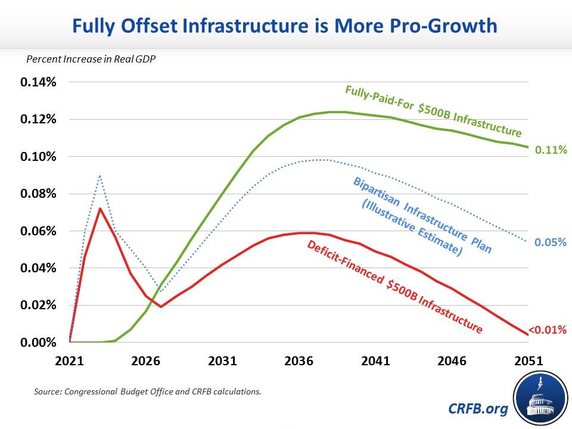

## Table of Contents

## What is infrastructure spending?

Infrastructure spending is when the government or private companies spend money to build or improve things that help the country run smoothly. These things include roads, bridges, schools, hospitals, and public transportation like buses and trains. The goal is to make life easier and better for people by giving them good services and ways to move around.

This kind of spending is important because it helps the economy grow. When new roads or schools are built, people can get to work or school more easily, and businesses can move their goods faster. This can lead to more jobs and more money for everyone. Also, good infrastructure can make a place more attractive for people to live and for businesses to set up, which helps the area grow even more.

## How is infrastructure spending typically funded?

Infrastructure spending is usually paid for by the government using money from taxes. This means that when people pay taxes, some of that money goes toward building roads, schools, and other public projects. Sometimes, the government might borrow money by selling bonds to investors. These bonds are like IOUs, and the government promises to pay back the money with interest over time. This way, they can start big projects even if they don't have all the money right away.

Private companies can also help fund infrastructure. They might build things like toll roads or airports and charge people to use them. This is called public-private partnerships. In these cases, the government and the company work together. The company gets to make money from the project, and the government gets a new piece of infrastructure without spending as much of its own money. This can be a good way to get things built faster, but it also means that people might have to pay to use certain services.

## What types of infrastructure projects are usually included in infrastructure spending?

Infrastructure spending often includes projects like building or fixing roads and bridges. These are important because they help people and goods move from one place to another. Another common type of project is public transportation, like buses, trains, and subways. These help people get to work, school, or other places without needing a car. Water systems are also included, like pipes that bring clean water to homes and businesses, and sewers that take away waste.

Another type of infrastructure project is energy, like power plants and electric grids that bring electricity to homes and businesses. Schools and hospitals are also part of infrastructure spending. They are important for education and health, and everyone needs them. Sometimes, projects like airports, ports, and broadband internet are included too. These help connect people to the rest of the world and make it easier to do business and communicate.

All these projects are meant to make life better and help the economy grow. When infrastructure is good, people can get to where they need to go more easily, businesses can work more efficiently, and everyone benefits.

## Can you explain the basic economic theory behind how infrastructure spending impacts economic growth?

Infrastructure spending can help the economy grow because it creates jobs and makes it easier for businesses to work. When the government spends money on building roads, bridges, or schools, it hires people to do the work. These people get paid and then spend their money on things like food, clothes, and houses. This means more money is moving around in the economy, which can lead to more jobs and more growth. It's like a chain reaction where one person's spending helps another person earn money.

Also, good infrastructure helps businesses run better. If there are good roads and bridges, it's easier for companies to move their goods from one place to another. This can make their products cheaper and more competitive. Better public transportation means workers can get to their jobs more easily, which can make them more productive. Schools and hospitals help make sure people are educated and healthy, which is good for the economy too. So, by spending on infrastructure, the government is helping the economy grow in many different ways.

## What are some historical examples of infrastructure spending boosting economic growth?

One famous example is the New Deal in the United States during the 1930s. During the Great Depression, the government spent a lot of money on building roads, bridges, and dams. This helped create jobs for millions of people who were out of work. The Tennessee Valley Authority (TVA) was one big project that brought electricity to many people in the South for the first time. This helped businesses grow and gave people a better life. The New Deal showed that spending on infrastructure could help the economy get better even during a very hard time.

Another example is the rebuilding of Europe after World War II with the Marshall Plan. The United States gave money to countries in Europe to help them rebuild their roads, factories, and homes. This helped these countries get their economies going again. People got jobs, and businesses could start making things again. The Marshall Plan showed that infrastructure spending could help a whole region recover and grow after a big disaster. It made Europe stronger and helped prevent more economic problems.

## How does infrastructure spending affect employment rates?

Infrastructure spending helps create jobs because it means the government is spending money on big projects like building roads, bridges, and schools. When the government starts these projects, they need to hire people to do the work. This means more jobs for construction workers, engineers, and other people who help build things. As these workers get paid, they spend their money on things like food, clothes, and houses. This spending helps other businesses grow and they might need to hire more people too. So, infrastructure spending can help lower unemployment by creating jobs directly on the projects and indirectly in other parts of the economy.

Also, good infrastructure can make it easier for businesses to work. If there are good roads and bridges, companies can move their goods more easily and quickly. This can help businesses grow and they might need to hire more workers. Better public transportation means more people can get to work without a car, which can help people who live far away from their jobs. When people can get to work more easily, they are more likely to have jobs. So, infrastructure spending not only creates jobs right away but also helps keep employment rates up by making the economy stronger over time.

## What are the short-term versus long-term effects of infrastructure spending on economic growth?

In the short term, infrastructure spending can quickly help the economy grow. When the government spends money on building roads, bridges, or schools, it hires people to do the work. This creates jobs right away, and those workers start [earning](/wiki/earning-announcement) money. They then spend their money on things like food, clothes, and houses, which helps other businesses grow. This can lead to more jobs in other parts of the economy too. So, in the short term, infrastructure spending can lower unemployment and get more money moving around in the economy.

In the long term, the effects of infrastructure spending can be even bigger. Good infrastructure, like good roads and bridges, helps businesses move their goods more easily and quickly. This can make their products cheaper and help them grow. Better public transportation means more people can get to work without a car, which can help people who live far away from their jobs. Schools and hospitals help make sure people are educated and healthy, which is good for the economy too. Over time, all these things can make the economy stronger and help it grow more steadily. So, while infrastructure spending helps right away, its benefits can last for many years.

## How does the effectiveness of infrastructure spending vary between developed and developing countries?

In developed countries, infrastructure spending often focuses on improving existing systems. These countries already have good roads, bridges, and public transportation, but they need to keep them in good shape or make them even better. For example, they might spend money on fixing old bridges or building new highways to reduce traffic. The effect on the economy can be strong because it keeps businesses running smoothly and helps people get to work easily. But since the basic infrastructure is already there, the immediate boost to the economy might not be as big as in developing countries.

In developing countries, infrastructure spending can have a huge impact. These countries often need to build basic things like roads, schools, and hospitals from scratch. When they do this, it creates a lot of jobs right away and helps the economy grow quickly. For example, building a new road can connect people in rural areas to cities, helping them get to jobs and markets. Over time, this can lead to more businesses and more growth. The long-term benefits can be even bigger because the new infrastructure can help lift people out of poverty and make the country's economy stronger for many years.

## What role do interest rates and inflation play in the impact of infrastructure spending on economic growth?

Interest rates can affect how much infrastructure spending helps the economy grow. When interest rates are low, it's cheaper for the government to borrow money to pay for big projects. This means they can start more projects without spending as much of their own money. More projects mean more jobs and more money moving around in the economy. But if interest rates are high, borrowing money costs more. The government might not be able to spend as much on infrastructure, so the boost to the economy might be smaller. So, low interest rates can make infrastructure spending more effective.

Inflation also plays a role in how infrastructure spending impacts economic growth. When there's a lot of inflation, the cost of building things goes up. This means the government might not be able to do as many projects with the same amount of money. If inflation is too high, it can also make people worry about the future, and they might spend less money. This can slow down the economy even if the government is spending on infrastructure. But if inflation is low and stable, infrastructure spending can help the economy grow without causing too many problems. So, keeping inflation in check can make infrastructure spending more effective.

## How can the multiplier effect be used to measure the impact of infrastructure spending on the economy?

The multiplier effect is a way to see how much infrastructure spending helps the economy grow. When the government spends money on things like roads or schools, it hires people to build them. These workers get paid and then spend their money on things like food and clothes. This spending helps other businesses, and they might hire more people too. The multiplier effect measures how much this chain reaction makes the economy grow. It shows that the first bit of spending can lead to even more spending and growth.

The size of the multiplier effect can be different depending on a few things. If the economy is not doing well, the multiplier might be bigger because people are more likely to spend any extra money they get. But if the economy is already doing well, the multiplier might be smaller because people might save their extra money instead of spending it. Also, if the government spends money on projects that help a lot of people, like public transportation, the multiplier effect can be bigger. So, the multiplier effect helps us understand how much infrastructure spending can really help the economy grow.

## What are the potential negative impacts or risks associated with large-scale infrastructure spending?

Large-scale infrastructure spending can sometimes cause problems. One big issue is that it can lead to more debt for the government. When the government borrows money to pay for big projects, it has to pay it back later with interest. If the economy doesn't grow as much as expected, the government might have a hard time paying back the money. This can lead to financial problems and might make people worried about the country's money situation.

Another risk is that inflation can go up. When the government spends a lot of money, it can make prices go up because there's more money chasing the same amount of goods. If inflation gets too high, it can make life harder for people because their money doesn't buy as much. Also, if the projects are not planned well, they might not help the economy as much as hoped. Sometimes, projects can be delayed or cost more than expected, which can waste money and slow down the benefits to the economy.

## How do different economic models and theories interpret the impact of infrastructure spending on economic growth?

Different economic models and theories have different ways of looking at how infrastructure spending helps the economy grow. Keynesian economics, for example, says that when the government spends money on things like roads and schools, it can help the economy a lot, especially during tough times. This is because the spending creates jobs and gets more money moving around, which can help the economy get better. Keynesians believe that this kind of spending can have a big multiplier effect, where the first bit of spending leads to even more spending and growth. They think it's a good way for the government to help the economy when it's not doing well.

On the other hand, some economists who believe in classical or neoclassical theories might be more careful about infrastructure spending. They think that the government should be careful about spending too much money because it can lead to more debt and higher taxes later. These economists might say that the private sector is better at deciding what projects to do because they have to make money from them. They worry that too much government spending can cause inflation and might not help the economy as much as people hope. So, they might want the government to spend less on infrastructure and let businesses do more of it.

## What is the understanding of infrastructure spending?

Infrastructure spending refers to the financial outlays by governments aimed at developing essential public assets such as transportation networks, power grids, water supply systems, and other vital public goods. This form of investment is integral to economic policy, as it serves a dual function: it not only revitalizes and enhances the productivity of a nation’s economic infrastructure but also acts as a catalyst for economic stimulus during downturns. 

By injecting capital into large-scale public works, infrastructure spending stimulates job creation. This is due to increased demand for labor both directly—through employment in construction and related industries—and indirectly—as workers spend their incomes, generating additional economic activity. This cascading effect is supported by the Keynesian economic theory, which advocates for increased government expenditure during economic recessions to boost aggregate demand. Keynesian economics posits that in periods of economic stagnation, private sector spending is insufficient to drive economic growth. Government spending on infrastructure can thus compensate for this shortfall, stimulating economic activity and bridging the output gap. 

Mathematically, the impact of infrastructure investment can be illustrated through the multiplier effect. The multiplier ($k$) quantifies the total economic impact of a change in fiscal policy, such as infrastructure spending. It is calculated as:

$$
k = \frac{1}{1 - MPC \times (1 - t) + MPI}
$$

where $MPC$ is the marginal propensity to consume, $t$ is the tax rate, and $MPI$ is the marginal propensity to import. A higher $MPC$ and lower $t$ typically enhance the multiplier effect, leading to a larger aggregate demand and, consequently, increased economic output.

Overall, infrastructure spending is a key instrument in the economic policy toolkit, capable of providing immediate relief during economic contractions while laying the groundwork for long-term productivity and growth.

## References & Further Reading

[1]: International Monetary Fund (2014). ["Is it Time for an Infrastructure Push? The Macroeconomic Effects of Public Investment."](https://www.imf.org/~/media/Websites/IMF/Imported/external/pubs/ft/weo/2014/02/pdf/_c3pdf.ashx)

[2]: World Bank (2017). ["Infrastructure: A Game-Changer for Growth and Shared Prosperity."](https://thedocs.worldbank.org/en/doc/908481507403754670-0330212017/original/AnnualReport2017WBG.pdf)

[3]: Flyvbjerg, B., Holm, M.K.S., & Buhl, S. (2002). ["Underestimating Costs in Public Works Projects: Error or Lie?"](https://papers.ssrn.com/sol3/papers.cfm?abstract_id=2278415) Journal of the American Planning Association.

[4]: Congressional Budget Office (2021). ["The Infrastructure Investment and Jobs Act: Macroeconomic Analysis."](https://www.cbo.gov/system/files/2021-08/hr3684_infrastructure.pdf)

[5]: ["American Recovery and Reinvestment Act (ARRA)."](https://www.congress.gov/bill/111th-congress/house-bill/1/text) 111th United States Congress.

[6]: ["Coronavirus Aid, Relief, and Economic Security (CARES) Act."](https://www.congress.gov/bill/116th-congress/house-bill/748) 116th United States Congress.