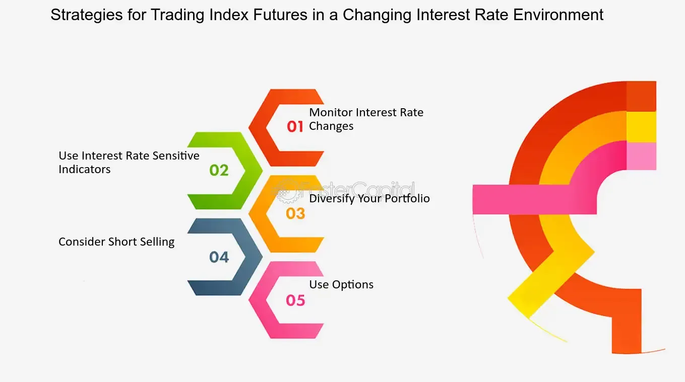

## Table of Contents

## What are interest rates and how do they function in the economy?

Interest rates are the cost of borrowing money, usually expressed as a percentage of the amount borrowed. When you take out a loan or use a credit card, you pay interest to the lender as a fee for using their money. Interest rates are set by banks and financial institutions, but they are influenced by the central bank of a country, like the Federal Reserve in the United States. The central bank uses interest rates as a tool to control the economy.

When interest rates are low, it's cheaper for people and businesses to borrow money. This can encourage spending and investment, which can help grow the economy. On the other hand, when interest rates are high, borrowing becomes more expensive, which can slow down spending and help control inflation. Interest rates affect everything from your mortgage and car loans to the interest you earn on your savings account. By adjusting interest rates, the central bank tries to keep the economy stable, balancing growth with inflation.

## What are futures and how are they used in financial markets?

Futures are contracts where people agree to buy or sell something at a set price on a specific future date. This "something" can be anything from oil and gold to financial products like stock indexes. People use futures to try to make money or to protect themselves from price changes. For example, a farmer might use futures to lock in a price for their crops before they are harvested, so they know how much money they will get, no matter what happens to the market price later.

In financial markets, traders use futures to bet on where they think prices will go. If someone thinks the price of oil will go up, they might buy an oil future. If the price does go up, they can sell the future for more than they paid for it and make a profit. But if the price goes down, they lose money. Futures can be risky because they often involve using borrowed money, which can magnify both gains and losses. They are important tools for managing risk and trying to make money, but they require a good understanding of the markets.

## How do interest rates influence the pricing of futures contracts?

Interest rates can have a big impact on how futures contracts are priced. When interest rates go up, it becomes more expensive to borrow money. This means that the cost of holding onto a futures contract until it matures can also go up. For example, if you're buying a futures contract, you might need to borrow money to do it. If interest rates are high, you'll have to pay more interest on that borrowed money, which can make the futures contract more expensive.

On the other hand, when interest rates are low, borrowing money is cheaper. This can make futures contracts less expensive because the cost of holding them until they mature is lower. Also, low interest rates can encourage more people to invest in futures because it's cheaper to borrow the money needed to buy them. So, interest rates can change the price of futures contracts by affecting how much it costs to hold them and how many people want to buy them.

## What is the relationship between interest rates and commodity futures?

Interest rates play a big role in how commodity futures are priced. Commodities are things like oil, gold, and wheat. When interest rates go up, it costs more to borrow money. If you're buying a futures contract for a commodity, you might need to borrow money to do it. So, if interest rates are high, it makes the futures contract more expensive because you have to pay more interest on the money you borrowed. This can make people less interested in buying commodity futures because it's more expensive to hold onto them until they mature.

On the flip side, when interest rates are low, borrowing money is cheaper. This can make commodity futures less expensive because the cost of holding them until they mature is lower. When interest rates are low, more people might want to invest in commodity futures because it's cheaper to borrow the money needed to buy them. So, the price of commodity futures can go up when interest rates are low because more people are buying them. In simple terms, interest rates can change the price of commodity futures by affecting how much it costs to hold them and how many people want to buy them.

## How do changes in interest rates affect the cost of carry for futures?

Changes in interest rates directly impact the cost of carry for futures. The cost of carry is what it costs to hold onto a futures contract until it matures. When interest rates go up, borrowing money becomes more expensive. If you need to borrow money to buy a futures contract, you'll have to pay more interest on that borrowed money. This makes the cost of carry higher because it's more expensive to keep the futures contract until it's time to settle it.

On the other hand, when interest rates go down, borrowing money is cheaper. This means the cost of carry for futures goes down too, because you're paying less interest on the money you borrowed to buy the futures contract. So, lower interest rates can make it cheaper to hold onto futures contracts until they mature. In short, the cost of carry for futures goes up when interest rates rise and goes down when interest rates fall.

## Can you explain the impact of interest rate hikes on bond futures?

When interest rates go up, it can really change the price of bond futures. Bond futures are contracts that let people buy or sell bonds at a set price in the future. When interest rates rise, new bonds start paying more interest. This makes the old bonds, which pay less interest, less valuable. So, the price of bond futures, which are based on those old bonds, goes down. People who own bond futures might lose money because the futures are now worth less than when they bought them.

But it's not just about the price going down. When interest rates go up, it also costs more to borrow money. If you need to borrow money to buy bond futures, you'll have to pay more interest on that borrowed money. This makes it more expensive to hold onto the bond futures until they mature. So, higher interest rates can make people less interested in buying bond futures because it's more costly to keep them. In simple terms, [interest rate](/wiki/interest-rate-trading-strategies) hikes can lower the price of bond futures and make them more expensive to hold, which can affect how much people want to invest in them.

## How do interest rate fluctuations impact currency futures?

Interest rate changes can have a big effect on currency futures. Currency futures are contracts that let people buy or sell a certain amount of one currency for another at a set price in the future. When interest rates in a country go up, it can make that country's currency more attractive to investors. They might want to invest in that country because they can earn more interest on their money. This demand for the currency can make its value go up compared to other currencies. So, if you have a currency future for that country's money, its price might go up too.

On the other hand, when interest rates go down, the opposite can happen. Lower interest rates can make a country's currency less attractive to investors because they can earn less interest on their money. This can make the value of the currency go down compared to other currencies. If you have a currency future for that country's money, its price might go down. So, interest rate changes can make currency futures more or less valuable, depending on whether rates are going up or down.

## What role do interest rates play in the valuation of stock index futures?

Interest rates can change how much stock index futures are worth. Stock index futures are contracts that let people buy or sell a stock index, like the S&P 500, at a set price in the future. When interest rates go up, it costs more to borrow money. If you need to borrow money to buy stock index futures, you'll have to pay more interest on that borrowed money. This can make the futures more expensive to hold onto until they mature. Also, when interest rates rise, people might move their money from stocks to bonds because bonds start paying more interest. This can make stock prices go down, which can also make the price of stock index futures go down.

On the other hand, when interest rates go down, borrowing money becomes cheaper. This can make stock index futures less expensive to hold onto because you're paying less interest on the money you borrowed to buy them. Lower interest rates can also make stocks more attractive to investors because they can't earn as much interest from bonds. This can push stock prices up, which can make the price of stock index futures go up too. So, interest rates can affect the value of stock index futures by changing how much it costs to hold them and by influencing whether people want to invest in stocks or bonds.

## How do traders use interest rate expectations to speculate in futures markets?

Traders use their guesses about future interest rates to make money in futures markets. They look at what the central bank might do with interest rates and then buy or sell futures based on those guesses. For example, if they think interest rates will go up, they might sell bond futures because they expect the price of those futures to go down. On the other hand, if they think interest rates will go down, they might buy bond futures because they expect the price to go up. By doing this, traders are trying to make money from the changes in futures prices that happen because of interest rate changes.

Interest rate expectations also affect how traders deal with currency and stock index futures. If traders think a country's interest rates will rise, they might buy that country's currency futures because they expect the currency to become more valuable. If they think interest rates will fall, they might sell those currency futures. For stock index futures, traders might buy them if they expect lower interest rates to boost stock prices, or sell them if they expect higher interest rates to make stocks less attractive. By using their predictions about interest rates, traders try to make smart moves in the futures market to earn profits.

## What are the historical trends showing the correlation between interest rates and futures performance?

Looking at history, we can see that when interest rates go up, the prices of many types of futures tend to go down. This is especially true for bond futures. When interest rates rise, new bonds start paying more interest, making old bonds less valuable. Since bond futures are tied to these bonds, their prices drop too. This pattern has been seen over and over again. For example, during times like the early 1980s, when the Federal Reserve raised interest rates to fight inflation, bond futures prices fell sharply. The same thing happened during other periods of rate hikes, showing a clear link between higher interest rates and lower bond futures prices.

On the other hand, when interest rates go down, futures prices often go up. This is because lower interest rates make borrowing cheaper, which can make futures less costly to hold onto. Also, lower rates can make stocks and commodities more attractive to investors, pushing up the prices of stock index and commodity futures. For instance, during the early 2000s and after the 2008 financial crisis, when central banks lowered interest rates to boost the economy, we saw strong performance in many futures markets. These historical trends show that interest rates have a big impact on how futures perform, with lower rates usually helping futures prices rise and higher rates causing them to fall.

## How do central bank policies on interest rates affect futures trading strategies?

Central bank policies on interest rates can really change how people trade futures. When a central bank says it will raise interest rates, traders might start selling bond futures because they expect the price of those futures to go down. This is because higher interest rates make new bonds more attractive, which makes old bonds less valuable. Traders might also buy currency futures of the country raising rates because they think that country's money will become more valuable as investors move their money there to earn more interest. So, traders use what they think the central bank will do with interest rates to decide whether to buy or sell futures.

On the flip side, when a central bank says it will lower interest rates, traders might start buying bond futures because they expect the price of those futures to go up. Lower rates make borrowing cheaper, which can make futures less costly to hold onto. They might also sell currency futures of the country cutting rates because they think that country's money will become less valuable as investors look for better returns elsewhere. Traders also pay attention to stock index futures when rates change. Lower rates can make stocks more attractive, so traders might buy stock index futures. By watching central bank policies, traders try to guess what will happen to interest rates and use that to make smart moves in the futures market.

## What advanced hedging techniques can be used to mitigate risks associated with interest rate changes in futures markets?

One advanced hedging technique that traders use to protect against interest rate changes is called a "stack hedge." This means buying or selling a bunch of futures contracts at different times to match the risk of the thing they are trying to protect. For example, if a company knows it will need to borrow money in the future, it can use a stack hedge to lock in today's interest rates. By doing this, the company can avoid the risk of rates going up later. It's like making a bet that spreads out over time, which can help smooth out the ups and downs caused by interest rate changes.

Another technique is called "duration matching." This is when traders try to make the time until their futures contracts mature match the time until their loans or investments mature. If interest rates go up, the value of the futures might go down, but the cost of the loan might go up by the same amount. By matching the times, traders can balance out these changes and reduce their risk. It's like making sure the timing of your protection matches the timing of your risk, so you're covered no matter what happens to interest rates.

## What is the relationship between futures markets and interest rates?

Futures markets serve as essential platforms for trading contracts that obligate the purchase or sale of financial instruments or commodities at a predetermined price on a future date. These contracts are primarily used for hedging risk and speculating on price movements. One of the pivotal factors influencing the pricing of these futures contracts is the prevailing interest rate environment.

Interest rates play a crucial role in shaping the cost of [carry](/wiki/carry-trading), which is integral to the pricing of futures. This cost of carry is determined by several components, notably the risk-free rate, interest income, storage costs, and convenience yield. The relationship can be expressed through the cost of carry model, given by the formula:

$$
F = S \times e^{(r+u-y)T}
$$

Where:
- $F$ is the futures price,
- $S$ is the spot price of the underlying asset,
- $r$ is the risk-free interest rate,
- $u$ represents storage costs,
- $y$ indicates the convenience yield,
- $T$ is the time to maturity of the futures contract.

1. **Risk-Free Rate**: The risk-free interest rate is a theoretical rate of return on an investment with zero risk, typically represented by government bonds. In the context of futures, a higher risk-free rate increases the cost of carry, thereby elevating the futures price relative to the spot price. For example, if interest rates rise, holding a futures contract becomes more expensive due to the increased opportunity cost of capital.

2. **Interest Income**: This pertains to income generated from interest-bearing components of the asset underlying the futures contract. If the underlying asset provides regular interest payments, it effectively reduces the futures price. Traders factor in these anticipated cash flows when valuing futures contracts.

3. **Storage Costs**: For physical commodities, storage costs can be a significant consideration. These are expenses incurred to store the commodity until the delivery date. High storage costs increase the cost of holding the spot commodity, thereby raising the futures price.

4. **Convenience Yield**: This represents the non-monetary benefits of holding the physical commodity rather than the futures contract. The convenience yield can be influenced by factors such as immediate access to the commodity in case of shortages. A high convenience yield reduces the relative advantage of holding a futures contract and thus lowers the futures price.

Understanding the interplay between these elements is crucial for participants in futures markets, as these factors collectively dictate the forward pricing of contracts and have significant implications for hedging strategies and speculative decisions. Interest rate fluctuations, therefore, require careful monitoring and analysis to adeptly navigate the pricing dynamics within futures markets.

## References & Further Reading

[1]: Bergstra, J., Bardenet, R., Bengio, Y., & Kégl, B. (2011). ["Algorithms for Hyper-Parameter Optimization."](https://papers.nips.cc/paper/4443-algorithms-for-hyper-parameter-optimization) Advances in Neural Information Processing Systems 24.

[2]: ["Advances in Financial Machine Learning"](https://www.amazon.com/Advances-Financial-Machine-Learning-Marcos/dp/1119482089) by Marcos Lopez de Prado

[3]: ["Evidence-Based Technical Analysis: Applying the Scientific Method and Statistical Inference to Trading Signals"](https://www.amazon.com/Evidence-Based-Technical-Analysis-Scientific-Statistical/dp/0470008741) by David Aronson

[4]: ["Machine Learning for Algorithmic Trading"](https://github.com/stefan-jansen/machine-learning-for-trading) by Stefan Jansen

[5]: ["Quantitative Trading: How to Build Your Own Algorithmic Trading Business"](https://www.amazon.com/Quantitative-Trading-Build-Algorithmic-Business/dp/1119800064) by Ernest P. Chan