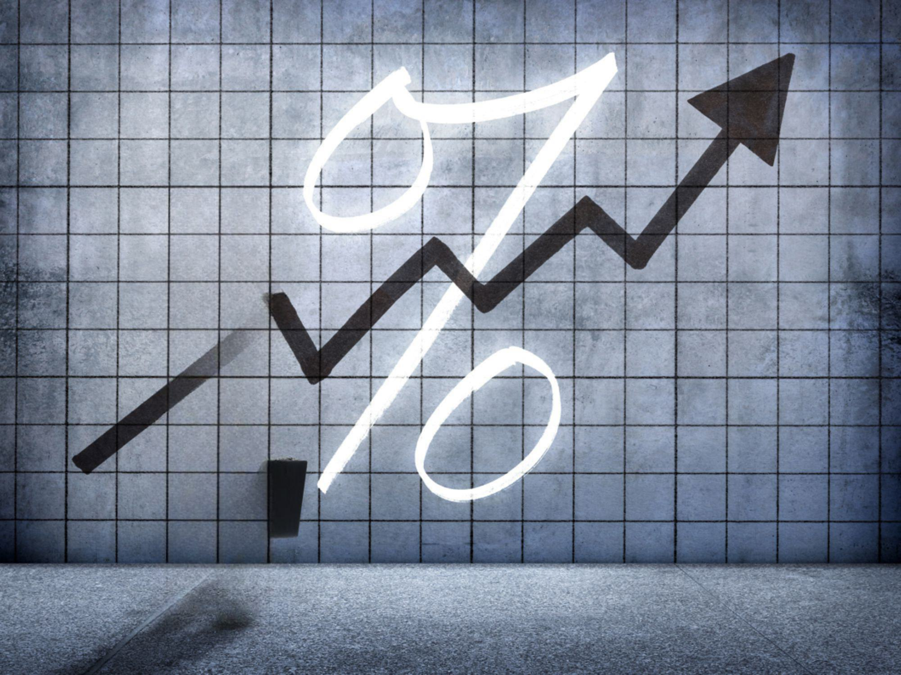

In the rapidly evolving landscape of financial markets, the interplay among futures markets, interest rates, and algorithmic trading plays a crucial role in shaping market dynamics, investment strategies, and financial stability. Understanding these relationships is essential for participants across the financial spectrum, from individual traders to institutional investors.

Futures markets, where contracts are traded to buy or sell assets at predetermined prices and dates, serve as essential tools for risk management and price discovery. Interest rates are a critical factor in these markets, influencing the pricing of futures contracts. Interest rate changes can affect the cost of carrying positions in future contracts, which in turn impacts the attractiveness of entering into these contracts.



Algorithmic trading, the use of computer algorithms to execute trades automatically and efficiently, has transformed the way futures markets operate. It has enhanced market efficiency by improving liquidity and reducing transaction costs, although it also introduces new complexities and challenges. Algorithmic trading strategies vary widely, employing sophisticated techniques including high-frequency trading and statistical arbitrage.

This article will explore the intricate ways interest rates influence futures markets and examine the role of algorithmic trading in navigating these changes. Understanding these dynamics is pivotal for investors seeking to optimize their strategies in an ever-changing financial environment. Through an exploration of these relationships, the article aims to provide insight into the evolving landscape of modern financial markets, underscoring the importance of continuous learning and adaptation.

## Table of Contents

## Understanding Futures Markets and Interest Rates

Futures markets serve as essential platforms for trading contracts that obligate the purchase or sale of financial instruments or commodities at a predetermined price on a future date. These contracts are primarily used for hedging risk and speculating on price movements. One of the pivotal factors influencing the pricing of these futures contracts is the prevailing interest rate environment.

Interest rates play a crucial role in shaping the cost of [carry](/wiki/carry-trading), which is integral to the pricing of futures. This cost of carry is determined by several components, notably the risk-free rate, interest income, storage costs, and convenience yield. The relationship can be expressed through the cost of carry model, given by the formula:

$$
F = S \times e^{(r+u-y)T}
$$

Where:
- $F$ is the futures price,
- $S$ is the spot price of the underlying asset,
- $r$ is the risk-free interest rate,
- $u$ represents storage costs,
- $y$ indicates the convenience yield,
- $T$ is the time to maturity of the futures contract.

1. **Risk-Free Rate**: The risk-free interest rate is a theoretical rate of return on an investment with zero risk, typically represented by government bonds. In the context of futures, a higher risk-free rate increases the cost of carry, thereby elevating the futures price relative to the spot price. For example, if interest rates rise, holding a futures contract becomes more expensive due to the increased opportunity cost of capital.

2. **Interest Income**: This pertains to income generated from interest-bearing components of the asset underlying the futures contract. If the underlying asset provides regular interest payments, it effectively reduces the futures price. Traders factor in these anticipated cash flows when valuing futures contracts.

3. **Storage Costs**: For physical commodities, storage costs can be a significant consideration. These are expenses incurred to store the commodity until the delivery date. High storage costs increase the cost of holding the spot commodity, thereby raising the futures price.

4. **Convenience Yield**: This represents the non-monetary benefits of holding the physical commodity rather than the futures contract. The convenience yield can be influenced by factors such as immediate access to the commodity in case of shortages. A high convenience yield reduces the relative advantage of holding a futures contract and thus lowers the futures price.

Understanding the interplay between these elements is crucial for participants in futures markets, as these factors collectively dictate the forward pricing of contracts and have significant implications for hedging strategies and speculative decisions. Interest rate fluctuations, therefore, require careful monitoring and analysis to adeptly navigate the pricing dynamics within futures markets.

## Algorithmic Trading: A Revolution in Futures Markets

Algorithmic trading has fundamentally transformed financial markets by leveraging technology to automate, optimize, and execute trading strategies. This process involves the use of computer algorithms to trade futures contracts and other financial instruments with enhanced efficiency and precision.

Algorithmic trading encompasses several strategies, each tailored to maximize returns and manage risk in different market conditions. High-frequency trading ([HFT](/wiki/high-frequency-trading-strategies)) is a prominent form, characterized by executing a large number of orders at extremely fast speeds. HFT strategies often capitalize on minimal price discrepancies to capture profits before the market adjusts. The speed at which HFT operates affords market participants the ability to capitalize on [arbitrage](/wiki/arbitrage) opportunities that would be imperceptible to human traders.

Another popular strategy is mean reversion, which assumes that asset prices will revert to their historical mean over time. Traders utilizing this strategy seek to identify and exploit deviations from the average price, anticipating a return to equilibrium. This kind of strategy often involves statistical analysis and [machine learning](/wiki/machine-learning) techniques to predict price movements and make informed trading decisions.

The advantages of [algorithmic trading](/wiki/algorithmic-trading) are numerous. Speed is a critical [factor](/wiki/factor-investing); algorithms can process vast datasets and execute trades at speeds that are impossible for human traders. This ability not only enhances the capacity to exploit fleeting trading opportunities but also improves overall market efficiency by tightening bid-ask spreads and increasing market [liquidity](/wiki/liquidity-risk-premium).

Precision is another significant advantage of algorithmic trading. By following predefined rules, algorithms can meticulously analyze market conditions and execute trades with high accuracy, reducing the likelihood of human error. This precision is particularly beneficial in managing large portfolios where small discrepancies can have substantial financial consequences.

Additionally, algorithmic trading minimizes the influence of human emotions on trading decisions. Emotional biases, such as fear and greed, often lead to irrational trading choices. Algorithms, devoid of human emotion, adhere strictly to logic-based strategies, ensuring consistency and objectivity in trading execution.

Overall, the advent of algorithmic trading represents a paradigm shift in the mechanics of financial markets, offering unparalleled efficiency, speed, and precision. This technological advancement not only enhances the potential for profit but also contributes to more stable and liquid markets, thereby benefiting investors and market participants worldwide.

## Impact of Algorithmic Trading on Interest Rate Futures

Algorithmic trading has fundamentally transformed the landscape of trading [interest rate](/wiki/interest-rate-trading-strategies) futures by introducing speed, precision, and efficiency in execution. Traditional trading methods, often reliant on human intuition and slower reaction times, have increasingly been supplanted by algorithmic systems capable of processing vast amounts of data and executing trades within milliseconds. This shift has altered market dynamics, notably in the way interest rate futures respond to economic data and policy announcements.

### Impact on Market Dynamics

Prior to the integration of algorithmic trading, interest rate futures markets were primarily driven by macroeconomic indicators, central bank policies, and the speculative positions of traders with diverse risk appetites. The introduction of algorithmic trading has added a new dimension, characterized by automated trading systems that react to news and market conditions almost instantaneously.

Algorithmic traders often employ high-frequency trading (HFT) strategies, which exploit small price discrepancies in the markets, executing trades in fractions of a second. This has resulted in increased market liquidity and reduced bid-ask spreads, making the markets more efficient. However, the same speed also leads to increased [volatility](/wiki/volatility-trading-strategies), particularly during volatile market conditions or when new, unexpected information is released.

### Case Studies

Several notable instances highlight the impact of algorithmic trading on interest rate futures. During unexpected interest rate announcements, algorithmic systems leveraging natural language processing (NLP) rapidly interpret central bank communications or economic releases, allowing them to adjust positions faster than human traders. This often results in sharp, albeit temporary, movements in futures prices.

For example, following a surprise announcement by the Federal Reserve concerning interest rate changes, algorithmic trading systems might swiftly buy or sell futures contracts based on pre-programmed decision-making criteria, such as sentiment analysis derived from the announcement's language. This initial flurry of trading activity typically subsides as human traders and analysts digest the full implications of the news.

### AI and Machine Learning in Adaptive Algorithms

The role of [artificial intelligence](/wiki/ai-artificial-intelligence) (AI) and machine learning (ML) in algorithmic trading cannot be overstated. These technologies enable the development of adaptive trading algorithms that learn and evolve with market conditions. By integrating AI, algorithms can enhance their predictive accuracy through pattern recognition, statistical analysis, and optimization techniques.

Machine learning models are capable of identifying complex correlations within datasets that are not immediately apparent to human analysts. These models can adapt to new data inputs and adjust their trading strategies in real-time, reducing the risk of obsolescence in dynamic market environments.

One common application of AI in trading interest rate futures is the use of [reinforcement learning](/wiki/reinforcement-learning), a type of machine learning where algorithms learn optimal trading strategies by trial and error, continually refining their approach to maximize returns. These adaptive systems are particularly advantageous in navigating the unpredictable effects of interest rate changes on futures prices.

In summary, algorithmic trading has substantially altered the dynamics of interest rate futures markets, fostering heightened efficiency while introducing new challenges in terms of market volatility. The advent of AI and machine learning further enhances the capability of trading algorithms, making them more adaptive and responsive to real-time changes, thus improving their ability to capitalize on market opportunities.

## Developing Algorithmic Strategies for Futures Markets

Developing algorithmic strategies for trading futures involves a systematic approach that integrates financial theory, quantitative analysis, and technology. Here's a step-by-step guide to creating basic algorithmic trading strategies, focusing on futures markets:

### Step 1: Define the Trading Strategy

1. **Identify Objectives**: Determine whether the strategy aims for arbitrage, hedging, or speculative profits.
2. **Select the Asset Class**: Choose the specific futures contract, e.g., commodities, indices, or interest rate futures.

### Step 2: Collect and Process Data

1. **Data Collection**: Gather historical price data, trading volumes, open interest, and macroeconomic indicators.
2. **Data Preprocessing**: Clean and normalize data to handle missing values and outliers. 

Python example for data loading:
```python
import pandas as pd

# Load historical futures data
data = pd.read_csv('historical_futures_data.csv')
data.fillna(method='ffill', inplace=True)  # Fill missing data
```

### Step 3: Develop Trading Logic

1. **Define Entry and Exit Signals**: Use technical indicators such as moving averages, RSI, or MACD.
2. **Algorithm Design**: Translate the strategy into algorithmic rules. This involves creating buy/sell conditions based on the selected indicators.

Example buy/sell condition in Python:
```python
data['SMA_50'] = data['Close'].rolling(window=50).mean()
data['Signal'] = 0
data['Signal'][50:] = np.where(data['Close'][50:] > data['SMA_50'][50:], 1, -1)
```

### Step 4: Implement Risk Management

1. **Position Sizing**: Determine the amount of capital to allocate to each trade using techniques like the Kelly Criterion.
2. **Set Stop-Loss and Take-Profit Levels**: Protect against adverse market moves by setting predefined exit points.

Example risk management:
```python
risk_per_trade = 0.01  # 1% of capital at risk per trade
position_size = capital * risk_per_trade / (entry_price - stop_loss_price)
```

### Step 5: Backtest the Strategy

1. **Backtesting**: Evaluate the strategy against historical data to test its performance metrics, such as return, volatility, and drawdown.
2. **Validate Results**: Use out-of-sample testing or cross-validation to ensure consistency and robustness.

Python [backtesting](/wiki/backtesting) example:
```python
from backtesting import Backtest, Strategy

class MyStrategy(Strategy):
    def init(self):
        self.signal = self.data.Signal

    def next(self):
        if self.signal == 1:
            self.buy()
        elif self.signal == -1:
            self.sell()

bt = Backtest(data, MyStrategy)
stats = bt.run()
bt.plot()
```

### Step 6: Execution and Monitoring

1. **Select Trading Platform**: Utilize platforms like MetaTrader, Interactive Brokers, or custom APIs for executing trades.
2. **Monitor Performance**: Continuously monitor the strategy's performance and make adjustments as necessary.

### Key Considerations and Risk Management Strategies

- **Market Liquidity**: Ensure the strategy accounts for slippage and transaction costs.
- **Technology Infrastructure**: Invest in high-performance computing resources to reduce latency and enhance execution speed.
- **Regulatory Compliance**: Ensure that the strategy complies with relevant trading regulations and guidelines.

### Tools and Platforms

- **Python Libraries**: Use libraries like Pandas, NumPy, and Backtrader for data analysis and strategy development.
- **Trading Platforms**: Platforms like MetaTrader or QuantConnect offer integrated environments for coding and backtesting strategies.

Developing algorithmic strategies requires a blend of analytics, programming, and financial acumen. By following these steps and considering risk and regulatory guidelines, traders can create robust strategies tailored to futures markets. Continuous adaptation through learning and refining strategies ensures sustainable trading success.

## Regulatory and Ethical Considerations

Regulatory frameworks governing algorithmic trading in futures markets are designed to ensure fair, transparent, and efficient trading practices while mitigating risks associated with high-speed and automated transactions. These frameworks often vary by jurisdiction but typically include essential components such as registration and reporting requirements, market surveillance, and risk management protocols.

A key aspect of regulation is preventing market manipulation, which can occur through practices like spoofing—placing buy or sell orders with the intention to cancel before execution to create misleading market sentiment. The Dodd-Frank Wall Street Reform and Consumer Protection Act in the United States, together with the Commodity Futures Trading Commission (CFTC), works to monitor and penalize such activities. Similarly, the European Markets in Financial Instruments Directive II (MiFID II) requires detailed reporting on algorithmic trading strategies and imposes obligations to ensure that trading systems are robust and adequately tested.

Ethical considerations in algorithmic trading involve ensuring fairness and transparency. Algorithms, due to their complexity, can inadvertently or deliberately disrupt market order, leading to a loss of trust among market participants. Ensuring ethical standards involves strict adherence to transparency rules where trading firms must clearly document their strategy operations and provide accessible audit trails for regulatory bodies. Fairness extends to providing equal market access, preventing information asymmetry, and avoiding exploitation of slower market participants through latency arbitrage.

Regulatory bodies play a crucial role in maintaining these standards. Institutions like the Securities and Exchange Commission (SEC) in the United States and the European Securities and Markets Authority (ESMA) in Europe enforce compliance through audits and penalties. These bodies also promote best practices such as the use of kill switches that allow traders to quickly [exit](/wiki/exit-strategy) the market during instability, and circuit breakers that pause trading to curb extreme volatility.

Best practices for compliance and ethical trading include thorough backtesting of algorithms against historical data, incorporating constraints to prevent excessive risks, and real-time monitoring to detect and address anomalies promptly. Moreover, employing ethical AI algorithms, which are programmed to reject engaging in unethical trading practices, can further align automated systems with regulatory expectations.

In conclusion, a comprehensive approach to regulatory and ethical considerations in algorithmic trading is essential. It not only maintains market integrity but also enhances the trust and reliability of futures markets as effective investment vehicles.

## Conclusion

The financial impact of integrating futures markets, interest rates, and algorithmic trading is profound, reshaping the way financial instruments are traded and priced. The synergy between these components enhances market responsiveness, allowing for more refined price discovery and risk management. Futures markets, which are inherently sensitive to interest rate fluctuations, are further optimized by algorithmic trading strategies that can handle vast amounts of data swiftly and accurately. 

Algorithmic trading significantly bolsters market efficiency and liquidity by executing trades at speeds unattainable by human traders, thereby narrowing bid-ask spreads and reducing transaction costs. Algorithms can swiftly incorporate information from interest rate movements into trading decisions, fostering more efficient capital allocation across markets. The real-time processing capabilities of algorithmic systems ensure that the incorporation of new information, such as interest rate changes, is both immediate and precise, enhancing the overall functioning of financial markets.

The continuous evolution of the financial markets demands that traders and institutions remain agile, leveraging new technologies and methodologies. Algorithmic trading systems are increasingly relying on advanced techniques such as machine learning and artificial intelligence to refine their strategies, offering a competitive edge in predicting market movements and managing risk. This requires a commitment to ongoing learning and adaptation, as financial professionals must stay abreast of regulatory changes and technological advancements to effectively navigate the complex landscape of modern financial markets. 

Ultimately, the integration of futures markets, interest rates, and algorithmic trading heralds a new era of financial innovation, promoting smoother market operations and offering new opportunities for risk mitigation and return enhancement. As these elements continue to evolve, they hold the potential to further transform global markets, underscoring the necessity for continuous development and education within the field.

## References & Further Reading

[1]: Bergstra, J., Bardenet, R., Bengio, Y., & Kégl, B. (2011). ["Algorithms for Hyper-Parameter Optimization."](https://papers.nips.cc/paper/4443-algorithms-for-hyper-parameter-optimization) Advances in Neural Information Processing Systems 24.

[2]: ["Advances in Financial Machine Learning"](https://www.amazon.com/Advances-Financial-Machine-Learning-Marcos/dp/1119482089) by Marcos Lopez de Prado

[3]: ["Evidence-Based Technical Analysis: Applying the Scientific Method and Statistical Inference to Trading Signals"](https://www.amazon.com/Evidence-Based-Technical-Analysis-Scientific-Statistical/dp/0470008741) by David Aronson

[4]: ["Machine Learning for Algorithmic Trading"](https://github.com/stefan-jansen/machine-learning-for-trading) by Stefan Jansen

[5]: ["Quantitative Trading: How to Build Your Own Algorithmic Trading Business"](https://www.amazon.com/Quantitative-Trading-Build-Algorithmic-Business/dp/1119800064) by Ernest P. Chan