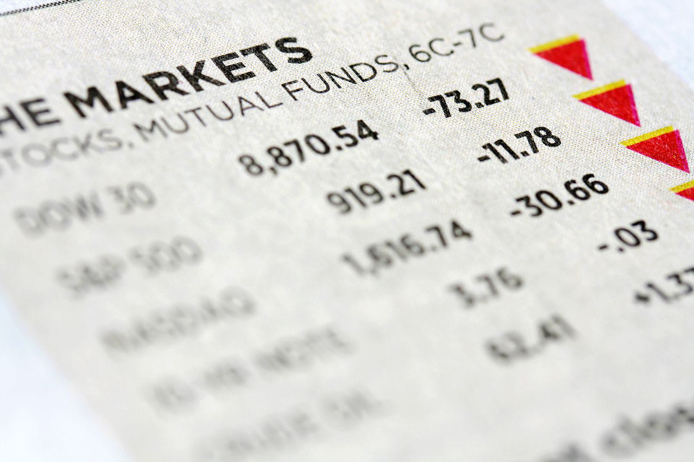

In today's dynamic financial environment, investors continuously seek methods to balance risk management and return maximization. This ongoing pursuit of optimization has fueled growing interest in mutual funds, interest rates, and algorithmic trading, which have become essential components of modern investment strategies.

Mutual funds offer investors a systematic way to access diversified portfolios managed by professional fund managers, thus aiding in risk mitigation and potentially enhancing returns. Interest rates, determined by central banks, are pivotal in shaping economic activity and exerting significant influence on various investment vehicles, including mutual funds. Changes in interest rates can impact borrowing costs and, consequently, the profitability of businesses and the valuation of debt securities.



Algorithmic trading, which involves using computer algorithms to execute trades based on predefined criteria, has revolutionized the investment landscape by enhancing trade efficiency and precision. This technological advancement minimizes human error and emotional biases, ensuring consistent execution of investment strategies.

Understanding the interplay among these components is crucial for investors seeking to optimize their portfolios. This article will explore how mutual funds, interest rates, and algorithmic trading interact, providing insights and strategies to aid investors in making informed financial decisions in an ever-evolving market landscape.

## Table of Contents

## Understanding Mutual Funds

Mutual funds are financial vehicles that consolidate capital from multiple investors to create a diversified portfolio of assets, which is managed by professional fund managers. This structure enables individual investors to invest in a wide range of securities, such as stocks, bonds, and other instruments, offering diversification that can reduce investment risk. By pooling resources, mutual funds provide access to market opportunities that might be beyond the reach of individual investors with limited capital.

The principle of diversification in mutual funds works by spreading investments across various assets, which helps mitigate the risk associated with individual security performance. This approach is based on the premise that the positive performance of some investments can potentially offset the negative performance of others within the portfolio, thereby stabilizing returns and reducing overall [volatility](/wiki/volatility-trading-strategies).

When investing in mutual funds, it is crucial to consider expense ratios and management fees. These costs are typically expressed as a percentage of the fund's average net assets and directly impact an investor's returns. Expense ratios cover a range of operational costs, including administrative fees, management fees, and other costs associated with running the fund. High expense ratios can erode a significant portion of the investor's return, while lower ratios can enhance net returns over time.

Mutual funds are categorized based on their investment objectives, risk profiles, and asset compositions. Stock funds, for example, primarily invest in equities and are suitable for investors seeking capital appreciation, though they generally come with higher risk. Bond funds, conversely, focus on fixed-income securities and may appeal to those seeking regular income and lower risk, albeit with potentially lower returns. Money market funds invest in short-term, high-quality debt instruments and are designed for investors who prioritize [liquidity](/wiki/liquidity-risk-premium) and capital preservation.

Understanding the distinct characteristics of these mutual funds helps investors align their portfolio choices with their financial goals, risk tolerance, and investment timelines.

## How Interest Rates Influence Mutual Funds

Interest rates, determined by central banks, are a critical determinant of economic and investment activities, influencing the performance of mutual funds substantially. When central banks adjust interest rates, they directly affect the cost of borrowing. As interest rates rise, borrowing becomes more expensive for businesses, often leading to reduced profits as companies incur higher interest expenses. This scenario can lead to a downward adjustment in stock prices, as investors recalibrate their expectations for future earnings and profitability. Consequently, mutual funds that heavily invest in equities may experience a decline in their net asset values (NAV).

For debt-oriented mutual funds, including bond funds, interest rates play an even more pivotal role. The relationship between interest rates and bond prices is inversely proportional. When interest rates increase, existing bonds with lower yields become less attractive, causing their market prices to drop. This depreciation negatively impacts the NAV of bond funds. Conversely, when interest rates fall, existing bonds with higher yields become more valuable, leading to an appreciation in bond prices and a positive effect on the NAV of bond funds.

Investors need to account for these dynamics when considering mutual fund investments. Understanding the sensitivity of a mutual fund's portfolio to [interest rate](/wiki/interest-rate-trading-strategies) changes is crucial. For instance, bond funds with longer durations are more susceptible to interest rate fluctuations compared to those with shorter durations. Duration measures a bond fund's sensitivity to changes in interest rates; a higher duration indicates greater sensitivity.

To exemplify, consider the formula for the price change of a bond in response to interest rate changes:

$$
\Delta P \approx -D \times \Delta y
$$

Where:
- $\Delta P$ is the change in the bond price,
- $D$ is the bond's duration,
- $\Delta y$ is the change in yield (interest rate).

By integrating this understanding, investors can mitigate potential losses or capitalize on positive shifts by adjusting portfolio allocations accordingly. For example, in an environment of rising interest rates, investors may choose to shift towards equities or opt for bond funds with shorter durations to reduce potential losses. Conversely, in a declining interest rate environment, longer-duration bond funds might offer better returns.

Incorporating such insights into mutual fund investment strategies can help investors optimize returns and manage risks in a fluctuating interest rate environment, thereby enhancing overall portfolio performance.

## Algorithmic Trading in Investment

Algorithmic trading, often referred to as algo trading, employs sophisticated computer programs to automate the trading process based on pre-defined criteria. This approach offers substantial improvements in trading speed and efficiency compared to traditional methods. By removing the possibility of manual errors and reducing emotional biases that can influence trading decisions, [algorithmic trading](/wiki/algorithmic-trading) facilitates precise trade execution at optimal times.

Algorithmic trading strategies are diverse, with some of the most prevalent ones including trend-following, [arbitrage](/wiki/arbitrage), and index fund rebalancing. Trend-following algorithms are designed to capitalize on market [momentum](/wiki/momentum) by identifying and following the direction of market trends. Arbitrage strategies exploit price discrepancies between different markets or securities, enabling traders to buy low in one place and sell high in another, often in a matter of seconds. Index fund rebalancing algorithms are utilized to maintain a desired allocation of assets in index funds, automatically adjusting the portfolio to reflect changes in market conditions or investment criteria.

To illustrate a simple algorithmic trading strategy, consider a basic trend-following model using two moving averages. In Python, this could be implemented as follows:

```python
import pandas as pd
import numpy as np

def compute_moving_average(data, window_size):
    return data.rolling(window=window_size).mean()

def simple_trading_strategy(prices, short_window, long_window):
    signals = pd.DataFrame(index=prices.index)
    signals['price'] = prices
    signals['short_mavg'] = compute_moving_average(prices, short_window)
    signals['long_mavg'] = compute_moving_average(prices, long_window)
    signals['signal'] = 0.0  

    # Buy signal
    signals['signal'][short_window:] = np.where(
        signals['short_mavg'][short_window:] > signals['long_mavg'][short_window:], 1.0, 0.0
    )

    # Generate trading orders
    signals['positions'] = signals['signal'].diff()

    return signals
```

Despite the clear advantages of algorithmic trading, its implementation is not without challenges. A robust technological infrastructure is essential to support the high-speed data processing and execution capabilities required for effective algo trading. Additionally, the reliance on technology introduces risks associated with system failures and errors, which can have significant financial implications.

Regulatory compliance is another critical consideration. Algorithmic traders must navigate complex regulatory frameworks to ensure adherence to legal standards designed to maintain fair and transparent markets. Regulatory bodies require algorithmic trading systems to be thoroughly tested and documented to prevent market manipulation and to ensure market stability.

In summary, while algorithmic trading provides multiple benefits in terms of efficiency and accuracy, these must be carefully balanced against the need for strong infrastructure and regulatory compliance. With the right technological support and adherence to established standards, algo trading can be a powerful tool in modern investment strategies.

## Integrating Mutual Funds with Algo Trading

Integrating algorithmic trading within mutual fund management practices has the potential to significantly enhance both portfolio performance and risk management. This synergy arises from the capacity of sophisticated algorithms to execute trades with precision, thereby minimizing transaction costs and market impact. Algorithmic trading systems utilize advanced mathematical models and high-speed computations to analyze vast arrays of market data and execute trades in fractions of a second.

Sophisticated algorithms are designed to [carry](/wiki/carry-trading) out order executions that align closely with pre-defined investment strategies. They are particularly effective in minimizing slippage—the difference between the expected price of a trade and the actual price—by anticipating market movements and adjusting execution tactics accordingly. This is achieved through techniques such as [volume](/wiki/volume-trading-strategy)-weighted average price (VWAP) or time-weighted average price (TWAP) strategies. These algorithms optimize order sizes and timing, thereby reducing market impact and ensuring favorable execution prices.

Furthermore, algorithmic trading facilitates data-driven strategies that allow fund managers to dynamically adapt to fluctuating market conditions. By analyzing real-time data, these algorithms can make immediate adjustments to asset allocation, leveraging opportunities or hedging against risks as they arise. Machine learning models are increasingly being incorporated to enhance predictive analytics, giving fund managers an edge in forecasting market trends and making informed decisions.

The integration of algorithmic trading with traditional mutual fund investment represents a significant advancement in investment strategies. For instance, algorithms can continuously monitor and rebalance a fund's portfolio in response to market movements, maintaining its strategic asset allocation without the delays inherent in manual processes. This capability ensures that the mutual fund can capitalize on short-term market inefficiencies while adhering to its long-term investment goals.

To illustrate the impact of algorithmic integration, consider the python code below which implements a simplistic moving average crossover algorithm, a common strategy used to identify potential buy or sell signals:

```python
import pandas as pd

def moving_average_crossover(prices, short_window=40, long_window=100):
    signals = pd.DataFrame(index=prices.index)
    signals['price'] = prices
    signals['short_mavg'] = prices.rolling(window=short_window, min_periods=1, center=False).mean()
    signals['long_mavg'] = prices.rolling(window=long_window, min_periods=1, center=False).mean()
    signals['signal'] = 0.0
    signals['signal'][short_window:] = np.where(signals['short_mavg'][short_window:] > signals['long_mavg'][short_window:], 1.0, 0.0)
    signals['positions'] = signals['signal'].diff()
    return signals

# Example usage with hypothetical 'price_data' DataFrame
# signals = moving_average_crossover(price_data['Close'])
```

This basic example demonstrates how algorithmic strategies can be employed to systematically generate trading signals based on technical analysis, maintaining objectivity and speed beyond human capabilities. While this model is simplified, real-world applications use far more complex algorithms that consider a multitude of factors and constraints.

As mutual fund managers increasingly adopt algorithmic trading technologies, they are achieving new efficiencies and capabilities that were previously unattainable. By merging traditional investment approaches with cutting-edge technology, these managers can optimize portfolio performance and risk management, positioning their funds to outperform in various market environments.

## Challenges and Considerations

Algorithmic trading, despite its many advantages, presents several challenges that need careful consideration by investors and fund managers. System failures and technical dependencies are among the primary concerns. The reliance on complex algorithms and technological infrastructure means that any malfunctions or disruptions can lead to significant financial losses. This vulnerability highlights the necessity for robust technical support systems and contingency plans to mitigate the impact of such failures. 

Regulatory compliance is another critical aspect of algorithmic trading. The trading environment is heavily regulated, and navigating these rules is essential to avoid legal and financial repercussions. Regulations may vary significantly across different jurisdictions, and staying updated with changes is vital for compliance. Incorporating a strong legal framework and expert consultation can help algorithmic trading operations adhere to current laws and reduce the risk of penalties.

Continuous [backtesting](/wiki/backtesting) and algorithm updates are imperative to maintain the efficacy of trading strategies amidst evolving market conditions. Backtesting involves simulating a strategy using historical data to evaluate its potential effectiveness. This process helps ensure that the algorithm can adapt to new patterns and shifts in market dynamics. An effective backtesting routine includes rigorous validation procedures to verify the reliability of the algorithm's performance predictions.

Understanding myths and realities surrounding algorithmic trading is crucial for investors. Common misconceptions, such as the belief that algorithmic trading guarantees profit or eliminates all risks, must be addressed. While algorithms can optimize trade execution and reduce human errors, they still operate within the market's inherent uncertainties. Educating investors about these complexities helps set realistic expectations and supports informed decision-making.

In summary, while algorithmic trading presents opportunities for enhanced performance, the associated challenges require careful management. Ensuring technical robustness, regulatory adherence, dynamic strategy updates, and investor education are key to successfully leveraging algorithmic trading in investment strategies.

## Conclusion

The interplay between mutual funds, interest rates, and algorithmic trading is a pivotal development in the investment landscape. This fusion allows investors to leverage diverse financial tools, optimizing both portfolio performance and strategic decision-making. Mutual funds offer an accessible means to diversify assets, reducing risk while maximizing returns. However, their performance is often sensitive to interest rate fluctuations, a critical [factor](/wiki/factor-investing) managed by central banks that influences borrowing costs and, consequently, asset valuations.

Algorithmic trading integrates technological advancements with financial practice, providing enhanced precision and efficiency in trade executions. Its capacity to process large datasets and make data-driven decisions in real-time offers significant advantages in dynamic markets. The application of algorithms in mutual fund management can significantly enhance the adaptability of investment strategies to ever-changing market conditions.

For investors, the key to success lies in balancing traditional strategies with these innovative technologies. Adopting algorithmic systems enables more sophisticated risk management and cost reduction. However, investors must remain vigilant about technological dependencies and regulatory requirements. Keeping abreast of financial trends and technological advancements is crucial for those seeking to capitalize on new opportunities.

In conclusion, the integration of mutual funds with algorithmic trading technology, within the context of shifting interest rates, provides a robust framework for optimizing investment strategies. As the financial environment evolves, a strategic combination of these elements can offer a competitive edge, underscoring the importance of continuous learning and adaptability in finance.

## References & Further Reading

Statman, Meir. "Investment Strategies and Performance: The Case of Index Funds and Index-Based Investment." This work explores the effectiveness and strategic deployment of index funds in investment portfolios. Statman analyzes the performance metrics that define successful strategies, offering insights into how index-based investments can minimize costs and improve returns through diversification. Understanding these principles is essential for investors seeking to enhance their strategies via mutual funds.

Sharpe, William F. "Capital Asset Prices: A Theory of Market Equilibrium Under Conditions of Risk." A foundational text in financial economics, Sharpe introduces the Capital Asset Pricing Model (CAPM), which describes the relationship between systematic risk and expected return. This theory is crucial for investors aiming to balance risk and return, particularly when considering interest rate impacts on mutual fund performance and risk management.

Elton, Edwin J., and Gruber, Martin J. "Modern Portfolio Theory and Investment Analysis." This book offers comprehensive coverage of portfolio theory, emphasizing the benefits of diversification to mitigate risk. It discusses various optimizing tools and formulas used for constructing efficient portfolios, critical for understanding mutual fund dynamics. The concepts outlined are beneficial for investor strategies that incorporate both traditional and algorithmic approaches.

Bergstra, J., et al. "Algorithms for Hyper-Parameter Optimization." This research addresses the optimization of algorithmic parameters, helping improve the performance of trading algorithms. By applying these techniques, fund managers can enhance algorithmic trading strategies, ensuring they adapt effectively to real-time market changes. The insights gained are vital for integrating these advancements into mutual fund management.

Lopez de Prado, Marcos. "Advances in Financial Machine Learning." Lopez de Prado's work investigates into the application of [machine learning](/wiki/machine-learning) techniques in finance, providing tools for algorithmic trading and portfolio optimization. His methodologies offer a cutting-edge approach to investment strategies, equipping investors and fund managers with the knowledge to refine their decision-making processes using data-driven insights.