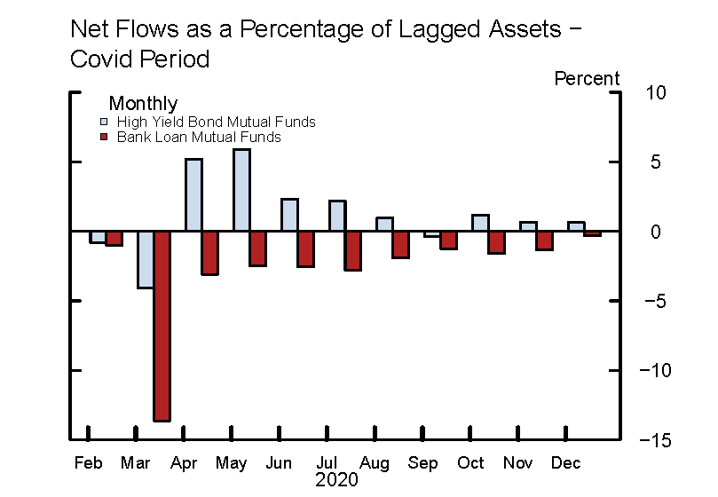

## Table of Contents

## What are interest rates and how do they work?

Interest rates are the cost of borrowing money or the reward for saving it. When you take out a loan, like a mortgage or a car loan, you pay interest to the lender for using their money. The interest rate is a percentage of the loan amount that you have to pay back over time. On the other hand, when you put money into a savings account, the bank pays you interest for letting them use your money. The interest rate here is a percentage of your savings that the bank adds to your account over time.

Interest rates are set by banks and financial institutions, but they are influenced by the overall economy and the actions of central banks, like the Federal Reserve in the United States. When the economy is doing well, interest rates might go up to control inflation. When the economy is struggling, central banks might lower interest rates to encourage people to borrow and spend more money, which can help the economy grow. So, interest rates are important because they affect how much it costs to borrow money and how much you can earn from saving it.

## What are mutual funds and how do they operate?

Mutual funds are a way for people to invest money by pooling it together with other investors. When you buy into a mutual fund, you're buying shares in a big collection of different investments, like stocks, bonds, or other assets. A professional manager runs the fund and decides which investments to buy and sell. This makes it easier for you because you don't have to pick the investments yourself.

The money you and other investors put into the mutual fund is used to buy the different investments. The value of your shares in the mutual fund goes up or down based on how well those investments are doing. If the investments do well, the value of your shares can go up, and you might make money. If they don't do well, the value of your shares can go down, and you might lose money. Mutual funds can be a good way to spread out your risk because you're investing in many different things at once.

## How do interest rates affect the economy?

Interest rates have a big impact on the economy. When interest rates are low, it's cheaper for people and businesses to borrow money. They might take out loans to buy houses, cars, or start new projects. This can make the economy grow because more people are spending and investing. On the other hand, when interest rates are high, borrowing money costs more. People might decide to save their money instead of spending it, which can slow down the economy.

Central banks, like the Federal Reserve in the United States, use interest rates to help control the economy. If they think the economy is growing too fast and prices are going up too much (inflation), they might raise interest rates to cool things down. If the economy is not doing well and they want to help it grow, they might lower interest rates to encourage more borrowing and spending. So, interest rates are a powerful tool that central banks use to keep the economy balanced.

## What is the relationship between interest rates and bond prices?

Interest rates and bond prices have an opposite relationship. When interest rates go up, bond prices go down. This happens because when new bonds are issued with higher interest rates, the older bonds with lower rates become less attractive to investors. So, to sell these older bonds, their prices have to be lowered to make them more appealing.

On the other hand, when interest rates go down, bond prices go up. This is because the older bonds with higher interest rates become more valuable compared to the new bonds with lower rates. Investors are willing to pay more for these older bonds because they offer better returns. So, the value of the bonds increases as interest rates decrease.

## How do rising interest rates impact bond mutual funds?

When interest rates go up, it can be bad news for bond mutual funds. These funds hold a bunch of bonds, and when interest rates rise, the prices of those bonds go down. This means the value of the mutual fund goes down too. People who own shares in the bond mutual fund might see the value of their investment drop. If they need to sell their shares during this time, they might get less money back than they put in.

But it's not all bad news. Bond mutual funds often pay out the interest they earn from the bonds to their investors. When interest rates rise, new bonds will have higher interest rates, which means the bond mutual fund can start earning more interest over time. This might help make up for the loss in the fund's value. So, while rising interest rates can hurt bond mutual funds in the short term, they might benefit in the long term if they hold onto the new bonds with higher rates.

## What effect do falling interest rates have on equity mutual funds?

When interest rates fall, it's usually good news for equity mutual funds. These funds invest in stocks, and lower interest rates make borrowing cheaper for companies. When it's easier for companies to borrow money, they can grow their businesses or start new projects. This can make their stocks go up in value, which is good for equity mutual funds because they own a lot of these stocks. So, when interest rates go down, the value of the equity mutual fund can go up too.

Also, when interest rates fall, people might decide to move their money from savings accounts or bonds to stocks. This is because they can't earn as much interest from savings accounts or bonds anymore. More money flowing into the stock market can push stock prices higher, which again helps the value of equity mutual funds. So, falling interest rates can make equity mutual funds do better because they make stocks more attractive to investors.

## How do interest rate changes influence the performance of money market funds?

When interest rates go up, money market funds usually do better. These funds invest in short-term, safe things like government bonds or bank certificates of deposit. When interest rates rise, the interest these funds earn on their investments goes up too. This means the money market fund can pay more interest to the people who invest in it. So, if you have money in a money market fund, you might see your earnings go up when interest rates increase.

On the other hand, when interest rates go down, money market funds don't do as well. The interest they earn on their investments goes down, which means they can't pay as much interest to their investors. People might not want to keep their money in money market funds if they're not earning much. But money market funds are still seen as a safe place to keep money because they invest in things that are less risky than stocks or long-term bonds.

## Can you explain the concept of duration and its relevance to interest rate risk in mutual funds?

Duration is a way to measure how sensitive a bond or a mutual fund is to changes in interest rates. It's kind of like a time measure that tells you how long it will take to get back the money you put into a bond or a mutual fund. The longer the duration, the more the value of the bond or mutual fund can change when interest rates go up or down. If a bond or a mutual fund has a long duration, it means it's more affected by interest rate changes.

When interest rates go up, bonds and bond mutual funds with longer durations lose more value than those with shorter durations. This is because the longer it takes to get your money back, the more time there is for interest rates to affect the bond's price. So, if you have a bond mutual fund with a long duration and interest rates rise, the value of your fund might go down a lot. On the other hand, if interest rates go down, a bond mutual fund with a long duration might see its value go up more than one with a short duration. Understanding duration can help you pick mutual funds that match how much risk you're willing to take with interest rate changes.

## How do central bank policies on interest rates affect mutual fund strategies?

When central banks change interest rates, it can make a big difference for how mutual funds work. If a central bank decides to raise interest rates, it might be because they want to slow down the economy a bit and keep prices from going up too fast. This can make bond mutual funds less valuable because the prices of the bonds they hold go down. On the other hand, it can be good for money market funds because they can earn more interest on their short-term investments. Mutual fund managers might then decide to change what they invest in, maybe moving some money from bonds to money market funds or other things that do better when rates are high.

When central banks lower interest rates, it's often to help the economy grow by making it cheaper for people and businesses to borrow money. This can be good news for equity mutual funds because lower rates can make stocks more attractive to investors. People might move their money from savings accounts and bonds into stocks, pushing stock prices up. Bond mutual funds might see their values go up too, especially if they have long-duration bonds. So, mutual fund managers might shift their strategies to take advantage of these changes, maybe by putting more money into stocks or long-term bonds when rates are low.

## What are some strategies mutual fund managers use to mitigate interest rate risk?

Mutual fund managers use a few tricks to help keep their funds safe from interest rate changes. One common trick is called "duration management." They try to guess where interest rates are going and then change how long their investments last. If they think rates will go up, they might choose shorter-term bonds so their fund doesn't lose as much value. If they think rates will go down, they might pick longer-term bonds to make more money when bond prices go up.

Another strategy is called "diversification." This means the managers spread out their investments across different types of bonds or other things. By doing this, they can lower the risk that comes from interest rate changes. If one type of bond doesn't do well because of rates going up or down, the other types might help balance things out.

Some managers also use something called "interest rate swaps" or other financial tools to protect their funds. These tools let them trade interest rate risks with others. For example, they might agree to pay a fixed interest rate and get a floating rate in return. This can help them make money even if rates move in ways they didn't expect.

## How can investors adjust their mutual fund portfolios in response to interest rate forecasts?

When investors think interest rates will go up, they might want to change their mutual fund portfolios to protect their money. They could move some of their money from bond mutual funds to money market funds or even short-term bond funds. These types of funds usually do better when interest rates rise because they can start earning more interest quickly. Investors might also think about putting more money into equity mutual funds because stocks can do well when the economy is strong, which often happens when rates go up.

On the other hand, if investors think interest rates will go down, they might want to keep or add more money to bond mutual funds, especially those with longer durations. These funds can go up in value when rates drop because the bonds they hold become more valuable. Investors might also consider shifting some of their money into equity mutual funds since lower rates can make borrowing cheaper for companies, which can help their stock prices go up. By making these changes, investors can try to make the most of their money no matter what happens with interest rates.

## What historical data exists on the correlation between interest rate movements and mutual fund returns?

Historical data shows that when interest rates go up, bond mutual funds usually do worse. This happens because the prices of the bonds in these funds go down when rates rise. For example, if you look at times like the early 1980s, when the Federal Reserve raised rates a lot to fight inflation, bond funds had a tough time. The higher rates made it harder for bond funds to do well because people wanted to buy new bonds with better rates instead of the old ones. On the other hand, money market funds did better during these times because they could quickly start earning more from their short-term investments.

When interest rates go down, like they did in the years after the 2008 financial crisis, bond mutual funds often do better. The prices of the bonds in these funds go up when rates drop, which makes the funds more valuable. During these times, equity mutual funds can also do well because lower rates make it cheaper for companies to borrow money and grow, which can help their stock prices go up. So, looking at history, it's clear that the way interest rates move can really change how different types of mutual funds perform.

## How do interest rates influence mutual funds?

Interest rates, determined by central banks, are a critical determinant of economic and investment activities, influencing the performance of mutual funds substantially. When central banks adjust interest rates, they directly affect the cost of borrowing. As interest rates rise, borrowing becomes more expensive for businesses, often leading to reduced profits as companies incur higher interest expenses. This scenario can lead to a downward adjustment in stock prices, as investors recalibrate their expectations for future earnings and profitability. Consequently, mutual funds that heavily invest in equities may experience a decline in their net asset values (NAV).

For debt-oriented mutual funds, including bond funds, interest rates play an even more pivotal role. The relationship between interest rates and bond prices is inversely proportional. When interest rates increase, existing bonds with lower yields become less attractive, causing their market prices to drop. This depreciation negatively impacts the NAV of bond funds. Conversely, when interest rates fall, existing bonds with higher yields become more valuable, leading to an appreciation in bond prices and a positive effect on the NAV of bond funds.

Investors need to account for these dynamics when considering mutual fund investments. Understanding the sensitivity of a mutual fund's portfolio to [interest rate](/wiki/interest-rate-trading-strategies) changes is crucial. For instance, bond funds with longer durations are more susceptible to interest rate fluctuations compared to those with shorter durations. Duration measures a bond fund's sensitivity to changes in interest rates; a higher duration indicates greater sensitivity.

To exemplify, consider the formula for the price change of a bond in response to interest rate changes:

$$
\Delta P \approx -D \times \Delta y
$$

Where:
- $\Delta P$ is the change in the bond price,
- $D$ is the bond's duration,
- $\Delta y$ is the change in yield (interest rate).

By integrating this understanding, investors can mitigate potential losses or capitalize on positive shifts by adjusting portfolio allocations accordingly. For example, in an environment of rising interest rates, investors may choose to shift towards equities or opt for bond funds with shorter durations to reduce potential losses. Conversely, in a declining interest rate environment, longer-duration bond funds might offer better returns.

Incorporating such insights into mutual fund investment strategies can help investors optimize returns and manage risks in a fluctuating interest rate environment, thereby enhancing overall portfolio performance.

## References & Further Reading

Statman, Meir. "Investment Strategies and Performance: The Case of Index Funds and Index-Based Investment." This work explores the effectiveness and strategic deployment of index funds in investment portfolios. Statman analyzes the performance metrics that define successful strategies, offering insights into how index-based investments can minimize costs and improve returns through diversification. Understanding these principles is essential for investors seeking to enhance their strategies via mutual funds.

Sharpe, William F. "Capital Asset Prices: A Theory of Market Equilibrium Under Conditions of Risk." A foundational text in financial economics, Sharpe introduces the Capital Asset Pricing Model (CAPM), which describes the relationship between systematic risk and expected return. This theory is crucial for investors aiming to balance risk and return, particularly when considering interest rate impacts on mutual fund performance and risk management.

Elton, Edwin J., and Gruber, Martin J. "Modern Portfolio Theory and Investment Analysis." This book offers comprehensive coverage of portfolio theory, emphasizing the benefits of diversification to mitigate risk. It discusses various optimizing tools and formulas used for constructing efficient portfolios, critical for understanding mutual fund dynamics. The concepts outlined are beneficial for investor strategies that incorporate both traditional and algorithmic approaches.

Bergstra, J., et al. "Algorithms for Hyper-Parameter Optimization." This research addresses the optimization of algorithmic parameters, helping improve the performance of trading algorithms. By applying these techniques, fund managers can enhance algorithmic trading strategies, ensuring they adapt effectively to real-time market changes. The insights gained are vital for integrating these advancements into mutual fund management.

Lopez de Prado, Marcos. "Advances in Financial Machine Learning." Lopez de Prado's work investigates into the application of [machine learning](/wiki/machine-learning) techniques in finance, providing tools for algorithmic trading and portfolio optimization. His methodologies offer a cutting-edge approach to investment strategies, equipping investors and fund managers with the knowledge to refine their decision-making processes using data-driven insights.

