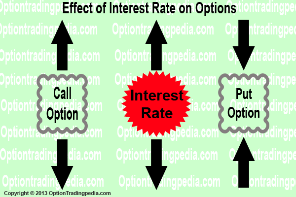

## Table of Contents

## What are interest rates and how do they function in the economy?

Interest rates are the cost of borrowing money, usually shown as a percentage of the amount borrowed. When you take a loan from a bank or use a credit card, you pay interest on the money you borrow. This rate can change based on things like the economy, the type of loan, and how risky the bank thinks you are. Banks also pay interest on money that people save with them, which is a way to encourage saving.

In the economy, interest rates are very important. They help control how much people spend and save. When interest rates are low, borrowing money is cheaper, so people and businesses might borrow more to buy things or invest in new projects. This can help the economy grow. But when interest rates are high, borrowing costs more, so people might save more and spend less. This can slow down the economy. Central banks, like the Federal Reserve in the U.S., change interest rates to keep the economy balanced, trying to avoid too much growth or too much slowdown.

## What are options and how do they work in financial markets?

Options are financial tools that give you the right, but not the obligation, to buy or sell an asset at a set price before a certain date. Think of them like a ticket that lets you decide if you want to make a trade later. There are two main types of options: calls and puts. A call option lets you buy an asset, like a stock, at a set price. A put option lets you sell an asset at a set price. People use options to bet on whether the price of something will go up or down, or to protect their investments from big price swings.

In financial markets, options work by setting up a contract between a buyer and a seller. When you buy an option, you pay a price called the premium. This premium is like the cost of the ticket. If the price of the asset moves in the way you expected, you can use your option to make a profit. For example, if you bought a call option on a stock and the stock price goes up, you can buy the stock at the lower set price and then sell it at the higher market price. But if the price doesn't move the way you thought, you can just let the option expire and only lose the premium you paid. Options can be complex, but they give investors more ways to manage risk and make money.

## How do interest rates affect the overall economy?

Interest rates play a big role in how the economy works. When interest rates are low, it's cheaper for people and businesses to borrow money. This means they might take out more loans to buy things like houses or cars, or to start new projects. More spending and investing can help the economy grow faster. But when interest rates are high, borrowing money costs more. People might decide to save their money instead of spending it, and businesses might hold off on new projects. This can slow down the economy because there's less spending and investing.

Central banks, like the Federal Reserve in the U.S., use interest rates to keep the economy balanced. If the economy is growing too fast and might cause inflation, the central bank might raise interest rates to cool things down. On the other hand, if the economy is slowing down too much, the central bank might lower interest rates to encourage more borrowing and spending. By adjusting interest rates, central banks try to avoid big ups and downs in the economy, keeping things stable for everyone.

## What is the relationship between interest rates and the price of options?

Interest rates can affect the price of options in a few ways. When interest rates go up, the cost of borrowing money increases. This can make call options more expensive because people expect higher returns from their investments. On the other hand, put options might become cheaper because people might be less willing to sell assets when they can earn more by keeping them and earning interest.

The other way interest rates affect option prices is through the time value of money. Options have an expiration date, and the money you pay for an option today could be earning interest if you held onto it. When interest rates are high, the cost of holding onto that money increases, which can make options more expensive. This is because the premium you pay for the option needs to account for the interest you could have earned. So, higher interest rates can lead to higher option prices, and lower interest rates can lead to lower option prices.

## How does the time value of money influence option pricing?

The time value of money is a big deal when it comes to figuring out how much options cost. Imagine you have some money right now. If you keep it, you could earn interest on it. So, when you buy an option, you're using money that could be earning interest somewhere else. This means the price of the option has to be high enough to make up for the interest you're missing out on. The longer the option lasts before it expires, the more interest you could have earned, so longer-term options tend to be pricier.

This idea also affects how people think about the future value of money. If interest rates are high, the money you'd get from an option in the future is worth less today because you could be earning more interest now. So, when interest rates go up, options can become more expensive because the premium needs to cover the higher potential interest you're giving up. On the flip side, if interest rates are low, the future money from the option is worth more today, and options might be cheaper because you're not missing out on as much interest.

## What is the impact of interest rates on call options versus put options?

When interest rates go up, call options usually become more expensive. This happens because higher interest rates mean people expect to earn more from their investments. If you buy a call option, you're betting that the price of the asset will go up. Since you could be earning more interest by keeping your money in the bank, the price of the call option needs to be higher to make up for the interest you're missing out on. So, higher interest rates can make call options cost more.

On the other hand, put options might get cheaper when interest rates go up. A put option lets you sell an asset at a set price, and when interest rates are high, people might not want to sell their assets as much. They could earn more by keeping the asset and getting interest on it. So, the demand for put options might go down, which can make them less expensive. When interest rates are low, the opposite happens: call options might be cheaper, and put options might cost more, because the interest you're giving up isn't as big of a deal.

## How do changes in interest rates affect the Black-Scholes model for option pricing?

The Black-Scholes model is a way to figure out how much options should cost. It uses a bunch of things like the price of the stock, how much the stock's price jumps around, how long until the option expires, and something called the risk-free interest rate. When interest rates go up or down, it changes the price of options in the Black-Scholes model. If interest rates go up, the model says call options should cost more because you could be earning more interest if you didn't buy the option. On the other hand, put options might get a bit cheaper because people might want to keep their money in the bank and earn that higher interest instead of selling their stocks.

This happens because the Black-Scholes model takes into account the time value of money. That's just a fancy way of saying that a dollar today is worth more than a dollar in the future because you could earn interest on it. When interest rates are high, the model says you should get more money today for the option because you're giving up the chance to earn that interest. So, the price of the option goes up to make up for it. When interest rates are low, the opposite happens: the price of the option doesn't need to be as high because you're not missing out on as much interest.

## Can you explain the effect of interest rate volatility on options trading strategies?

Interest rate volatility can shake things up in the world of options trading. When interest rates jump around a lot, it makes it harder for traders to predict what will happen to the price of options. Traders who use options to bet on or protect against changes in stock prices need to think about how these interest rate swings might affect their strategies. If interest rates go up and down a lot, the cost of options can change quickly, which means traders might need to adjust their plans more often to keep making money or to avoid losing too much.

For example, if a trader thinks interest rates will go up, they might buy call options because they expect the price of those options to go up too. But if interest rates are all over the place, it's tough to know if that's the right move. Traders might use more complex strategies, like straddles or strangles, to try to make money no matter which way interest rates move. These strategies involve buying both call and put options at the same time, hoping to profit from big moves in either direction. So, interest rate volatility can make options trading trickier but also open up new ways to make money if you're ready to handle the ups and downs.

## How do central bank policies regarding interest rates influence options markets?

Central bank policies on interest rates can really shake up the options markets. When a central bank, like the Federal Reserve, decides to change interest rates, it affects how much it costs to borrow money. If the central bank raises interest rates, borrowing gets more expensive, and this can make call options more pricey because people expect higher returns from their investments. On the other hand, if the central bank lowers interest rates, borrowing becomes cheaper, which might make call options less expensive and put options more costly. Traders in the options market have to keep a close eye on what central banks are doing because these changes can mess with their plans and the prices of the options they're trading.

These changes in interest rates also mess with the time value of money, which is a big deal in options pricing. When interest rates go up, the money you pay for an option today could be earning more interest if you didn't buy the option. This means options might cost more to make up for that lost interest. If interest rates go down, the money you're using to buy options isn't missing out on as much interest, so options might be cheaper. Central banks use interest rates to keep the economy balanced, but their moves can cause a lot of ups and downs in the options markets, making traders adjust their strategies to try to make money or avoid losing too much.

## What are the historical trends showing the impact of interest rate changes on options?

Looking back at history, we can see that when interest rates go up, the price of call options usually goes up too. This is because people expect to earn more from their investments when interest rates are high. For example, during the early 1980s, when the Federal Reserve raised interest rates to fight inflation, call options became more expensive. People wanted to buy stocks and other assets that could give them higher returns, so the demand for call options went up. On the other hand, put options often got cheaper because people were less likely to sell their assets when they could earn more by keeping them and getting interest.

When interest rates go down, the opposite happens. Call options tend to get cheaper, and put options might become more expensive. A good example is the period after the 2008 financial crisis when central banks around the world lowered interest rates to help the economy recover. During this time, call options were less pricey because borrowing money was cheaper, and people were more willing to buy assets. But put options became more in demand as investors looked for ways to protect their investments from falling prices. So, the ups and downs of interest rates have a clear impact on how much options cost and how people use them in their trading strategies.

## How can traders use interest rate forecasts to optimize their options trading?

Traders can use interest rate forecasts to make smarter choices in options trading. If they think interest rates will go up, they might buy call options because these will likely get more expensive. Higher interest rates mean borrowing costs more, so people might expect bigger returns from their investments. Traders can use this info to buy call options now, before the price goes up, and then sell them later for a profit. On the other hand, if traders expect interest rates to go down, they might buy put options. Lower interest rates make borrowing cheaper, so people might be more willing to sell their assets, making put options more valuable.

Using interest rate forecasts also helps traders plan their strategies better. For example, if a big change in interest rates is coming up, like a central bank meeting, traders can get ready for the options market to move. They might use strategies like straddles or strangles, which let them make money no matter which way the market goes. By keeping an eye on what central banks are saying and what experts think will happen with interest rates, traders can adjust their options trades to take advantage of these changes and try to make more money or lose less.

## What advanced strategies can be employed to hedge against interest rate risks in options trading?

One advanced strategy to hedge against interest rate risks in options trading is using interest rate swaps. An interest rate swap lets you exchange one type of interest payment for another. For example, if you think interest rates will go up, you might swap a fixed interest rate for a floating one. This way, if rates do go up, you'll pay less in interest because the floating rate will be lower than the fixed rate you swapped. Traders can use options on interest rate swaps to bet on or protect against these changes without actually swapping the payments. This can help them make money or lose less if their guess about interest rates is right.

Another strategy is using options on Treasury bonds or notes. These options let you bet on what will happen to the price of government bonds, which move a lot when interest rates change. If you think interest rates will go up, you might buy put options on Treasury bonds because their prices usually go down when rates go up. If rates do rise, the value of your put options will go up, helping you make money or lose less on your other investments. On the other hand, if you think rates will fall, you might buy call options on Treasury bonds because their prices usually go up when rates go down. This way, you can protect your portfolio from interest rate changes and maybe even make some extra money.

## How do interest rates impact options pricing?

Interest rates are a crucial [factor](/wiki/factor-investing) in the financial markets, profoundly impacting the pricing of options. The sensitivity of options to [interest rate](/wiki/interest-rate-trading-strategies) changes is primarily captured by the Greek parameter known as "Rho." Rho measures the rate at which the price of an option changes relative to a one-percentage-point change in interest rates. For call options, a rise in interest rates typically leads to an increase in the option's value, whereas for put options, the opposite is often true.

### The Role of Rho

Rho is an essential Greek in options pricing, representing the first derivative of the option's value with respect to the interest rate. It provides insights into how an option's value will change as interest rates move. Mathematically, Rho can be expressed as:

$$
Rho = \frac{\partial V}{\partial r}
$$

where $V$ is the option price, and $r$ is the risk-free interest rate.

For a European call option, Rho is typically positive. The increase in interest rates makes holding the underlying asset more expensive relative to holding the option, thus increasing the call option's price. Conversely, for a European put option, Rho is generally negative, indicating a decrease in the option's price as interest rates rise.

### Impact of Interest Rates on Black-Scholes Model

The Black-Scholes model, a widely used option pricing model, incorporates interest rates in its formula. Within this model, the interest rate affects both the present value of the expected payoff and the option's time decay. The model assumes that the rate $r$ remains constant over the option's life, which influences the option's pricing through the discounted expected value.

The call option pricing formula in the Black-Scholes model is expressed as:

$$
C = S_0 \cdot N(d_1) - X \cdot e^{-rt} \cdot N(d_2)
$$

where:
- $C$ is the call option price,
- $S_0$ is the current stock price,
- $X$ is the strike price,
- $t$ is the time to expiration,
- $r$ is the risk-free interest rate,
- $N(\cdot)$ is the cumulative distribution function of the standard normal distribution,
- $d_1$ and $d_2$ are calculated using $r$.

The negative exponential term $e^{-rt}$ represents the present value factor for the strike price, highlighting the interest rate's impact on an option's valuation.

### Practical Example

Consider a simple Python snippet that calculates Rho for a European call option using the Black-Scholes formula:

```python
from scipy.stats import norm
import numpy as np

def rho_call(S, X, t, r, sigma):
    d1 = (np.log(S / X) + (r + (sigma ** 2) / 2) * t) / (sigma * np.sqrt(t))
    d2 = d1 - sigma * np.sqrt(t)
    rho = X * t * np.exp(-r * t) * norm.cdf(d2)
    return rho

# Example parameters
S = 100  # Current stock price
X = 100  # Strike price
t = 1    # Time to expiration in years
r = 0.05 # Risk-free interest rate
sigma = 0.2  # Volatility

print("Rho for the call option:", rho_call(S, X, t, r, sigma))
```

The function `rho_call` calculates the Rho value for given parameters, helping traders assess the interest rate sensitivity of a call option.

In conclusion, interest rates play a significant role in options pricing. Understanding Rho and its implications helps traders anticipate how changes in interest rates can affect their options strategies, enabling better hedging and speculative decisions in fluctuating market conditions.

## What is the impact of interest rates on algo trading?

Fluctuations in interest rates have a significant impact on the algorithms used in trading options, primarily due to their influence on the present value of options' payoffs and volatility estimates. Algorithmic trading systems are designed to integrate variables such as interest rates into their decision-making processes. When interest rates change, these algorithms must adapt rapidly to maintain profitability and mitigate risks.

One of the primary ways interest rate changes affect algorithmic trading involves the recalibration of pricing models. Options pricing models like the Black-Scholes formula include an interest rate component to determine the option's theoretical value. A change in the interest rate alters the model's output, subsequently impacting the trading decisions made by the algorithm. The Black-Scholes model includes the interest rate ($r$) in the calculation for the present value of the option's expected payoffs:

$$
C = S_0 N(d_1) - X e^{-rT} N(d_2)
$$

Where:
- $C$ is the call option price,
- $S_0$ is the current stock price,
- $N(d_1)$ and $N(d_2)$ are values derived from the cumulative distribution function of a standard normal distribution,
- $X$ is the strike price of the option,
- $T$ is the time to expiration,
- $r$ is the annual risk-free interest rate.

Algorithmic trading systems use these adjustments in pricing to recalibrate their strategies continuously. For instance, with an interest rate increase, the cost-of-carry component in futures contracts becomes pricier, potentially signaling an adjustment in expected returns that algorithms can exploit.

In practice, algorithms that incorporate interest rates typically utilize a series of adaptive techniques. These might include real-time parameter updating, [machine learning](/wiki/machine-learning) models that adjust based on new data inputs, and [statistical arbitrage](/wiki/statistical-arbitrage) strategies that examine the relationships between different financial instruments and their changed pricing dynamics due to interest rate shifts.

Python can be utilized to implement such adaptability by incorporating dynamic modules that react to interest rate inputs:
```python
def update_option_price(stock_price, strike_price, time_to_expiration, risk_free_rate, volatility):
    # Black-Scholes formula
    from scipy.stats import norm
    from numpy import log, sqrt, exp

    d1 = (log(stock_price / strike_price) + (risk_free_rate + 0.5 * volatility**2) * time_to_expiration) / (volatility * sqrt(time_to_expiration))
    d2 = d1 - volatility * sqrt(time_to_expiration)

    call_price = stock_price * norm.cdf(d1) - strike_price * exp(-risk_free_rate * time_to_expiration) * norm.cdf(d2)
    return call_price

# Example: Update with new interest rate
new_rate = 0.05
option_price = update_option_price(100, 100, 1, new_rate, 0.2)
```

By continuously updating key parameters like the risk-free rate in trading algorithms, the system can remain responsive to market changes. Moreover, interest rate fluctuations can affect volatility estimates. Algorithms geared towards options trading often incorporate implied volatility, which is sensitive to interest rate movements, thereby requiring updates to assessments of volatility arbitrage opportunities.

In summary, algorithms in options trading are specifically designed to incorporate a multitude of economic variables, with interest rates being a critical factor. Systems are programmed to dynamically respond to rate changes by adjusting pricing models, recalibrating strategies, reassessing volatility, and identifying new trading opportunities to preserve and enhance profitability.

## References & Further Reading

[1]: Hull, J. C. (2017). ["Options, Futures, and Other Derivatives"](https://www.semanticscholar.org/paper/Options%2C-Futures%2C-and-Other-Derivatives-Hull/89bdee500c8623864fc9eb7a471546aa713acc44). Pearson Education.

[2]: Black, F., & Scholes, M. (1973). ["The Pricing of Options and Corporate Liabilities."](https://www.cs.princeton.edu/courses/archive/fall09/cos323/papers/black_scholes73.pdf) Journal of Political Economy, 81(3), 637-654.

[3]: Wilmott, P., Howison, S., & Dewynne, J. (1995). ["The Mathematics of Financial Derivatives: A Student Introduction."](https://www.cambridge.org/core/books/mathematics-of-financial-derivatives/7121345D07C5BCE4FBEC91A8A7E6F267) Cambridge University Press.

[4]: Varian, H. R. (1987). ["The Arbitrage Principle in Financial Economics."](https://www.jstor.org/stable/1942981) Journal of Economic Perspectives, 1(2), 55-72.

[5]: Jarrow, R., & Turnbull, S. (1996). ["Derivative Securities."](https://archive.org/details/derivativesecuri0000jarr_r8m0) South-Western College Pub.

[6]: Engel, E. (2006). ["The Efficiency of Financial Markets: A Dual Joint Hypothesis Test"](https://www.sciencedirect.com/topics/economics-econometrics-and-finance/financial-market-efficiency). University of California, Berkeley.

[7]: Aldridge, I. (2013). ["High-Frequency Trading: A Practical Guide to Algorithmic Strategies and Trading Systems"](https://www.amazon.com/High-Frequency-Trading-Practical-Algorithmic-Strategies/dp/1118343506). Wiley.

[8]: Kissell, R. (2013). ["The Science of Algorithmic Trading and Portfolio Management"](https://www.sciencedirect.com/book/9780124016897/the-science-of-algorithmic-trading-and-portfolio-management). Academic Press.