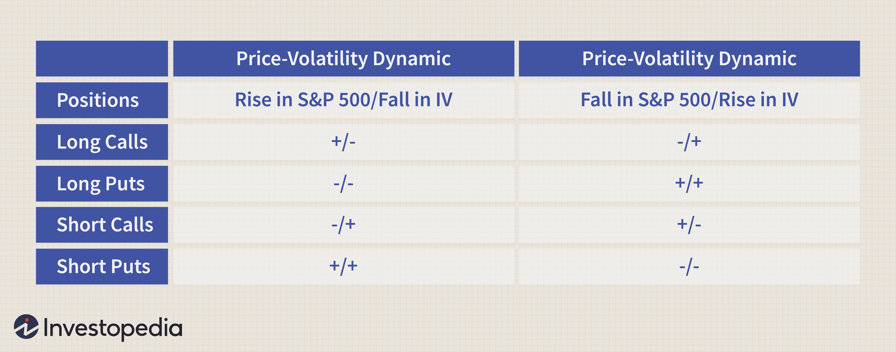

In the ever-evolving world of finance, options trading and algorithmic trading have emerged as pivotal components of modern market strategies, particularly as financial actors respond to fluctuating interest rates. Options trading, which allows investors to hedge risks or speculate on price movements through the purchase of contracts, has gained renewed attention as traders seek to capitalize on, or protect against, market volatility influenced by interest rate changes. Simultaneously, algorithmic trading—using computer algorithms to execute orders at speeds and scales impossible for human traders—has transformed the landscape by providing the ability to respond almost instantaneously to market shifts, such as interest rate fluctuations.

The intricate interplay between options trading, interest rates, and algorithmic trading underscores a complex dynamic within global financial markets. Each of these elements influences the others in profound ways. For example, changing interest rates can significantly impact options pricing, known through the options pricing model as 'Rho,' which measures an option's sensitivity to interest rate changes. In response, algorithmic trading systems are often programmed to account for such sensitivities, optimizing trading strategies to maintain profitability and manage risks efficiently.



By harnessing the power of algorithmic trading, traders can now implement sophisticated strategies that integrate options trading, allowing for enhanced decision-making processes that were once too cumbersome to execute manually. Such strategies often involve real-time data analysis, facilitating adaptive responses to the economic indicators that drive interest rate adjustments. Consequently, a well-informed understanding of these components is crucial for market participants looking to capitalize on the synergies between them. This article aims to explore these relationships, offering insights into how they connect and influence today's trading strategies, ultimately providing a roadmap for navigating the complexities of modern financial markets.

## Table of Contents

## Understanding Financial Markets

Financial markets are pivotal institutions within the global economic ecosystem, serving as platforms where financial instruments are created, traded, and valued. They facilitate the mobilization of capital, support investment activities, allocate risk, and enhance liquidity, thus forming the backbone for trading activities globally. 

### Functions of Financial Markets

Financial markets perform several critical functions that underlie economic stability and growth:

1. **Price Discovery**: Financial markets are where the prices of assets such as stocks, bonds, and commodities are determined. This process involves matching buyers with sellers, where supply and demand dynamics set the market prices.

2. **Liquidity Provision**: They provide a mechanism for investors to sell their assets quickly without substantially affecting the asset's price, hence ensuring liquidity in the market.

3. **Risk Management and Transfer**: Through derivatives and other instruments, financial markets offer tools for entities to hedge against potential risks and transfer those risks to others willing to assume them.

4. **Capital Formation**: By enabling companies to raise funds through the issuance of securities such as stocks and bonds, financial markets are crucial in facilitating capital formation, which drives investment and economic development.

5. **Efficient Allocation of Resources**: By directing funds to their most productive uses, financial markets contribute to economic efficiency. They channel financial resources from savers to borrowers who can utilize them for productive uses, thus optimizing the allocation of resources.

### Types of Financial Instruments

Financial instruments are the products that are traded in financial markets. They can be broadly categorized into three primary types: stocks, bonds, and derivatives.

#### Stocks

Stocks, or equities, represent ownership in a corporation. Stockholders are entitled to a proportion of the company's profits, which can be distributed as dividends. They also hold voting rights in corporate decisions, depending on the type of shares. Stocks are traded on various exchanges, with prices influenced by factors such as corporate performance, market trends, and macroeconomic indicators.

#### Bonds

Bonds are fixed-income instruments that represent a loan made by an investor to a borrower, typically corporate or governmental. Bonds involve periodic interest payments (coupon payments) and return the principal amount at maturity. They are instrumental for entities looking to raise capital for projects or to manage existing debts. Bond markets are sensitive to interest rates, as changes in these rates directly affect bond yields and prices.

#### Derivatives

Derivatives are financial contracts whose value is derived from the performance of underlying assets, such as stocks, bonds, currencies, interest rates, or market indexes. Common derivatives include options, futures, forwards, and swaps. Derivatives are used for hedging risks, speculating on future price movements, and leveraging positions in the market. They offer versatility and strategic advantages but also [carry](/wiki/carry-trading) a higher risk due to their complex nature and leverage effects. 

In conclusion, financial markets play an indispensable role in fostering global economic stability and growth. They provide mechanisms for pricing, [liquidity](/wiki/liquidity-risk-premium), risk management, capital formation, and resource allocation. Understanding the various financial instruments—such as stocks, bonds, and derivatives—enriches one’s ability to navigate these markets effectively. By grasping the fundamentals of financial markets, traders, investors, and policymakers can make informed decisions that contribute to the overall efficiency and stability of financial systems.

## Options Trading: A Comprehensive Overview

Options trading is a type of financial instrument that enables investors to buy or sell an asset at a predetermined price on or before a certain date. Options are derivative instruments, meaning their value is derived from the underlying asset, which could be stocks, indexes, or commodities.

Options are typically divided into two categories: call options and put options. A call option provides the holder with the right, but not the obligation, to purchase the underlying asset at a specified strike price within a defined timeframe. Conversely, a put option grants the holder the right, but not the obligation, to sell the underlying asset at the strike price within the same timeframe. The purchaser of an option pays a premium for this right, which is determined by factors such as the underlying asset's price, [volatility](/wiki/volatility-trading-strategies), time until expiration, and the prevailing interest rates.

The advantages of options trading are multifaceted. One of the primary benefits is leverage, as options allow traders to control a larger position with a relatively smaller investment. This is particularly attractive for investors who want to capitalize on price movements without committing to a full purchase of the underlying asset. Moreover, options offer strategic versatility. Traders can employ various strategies like covered calls, protective puts, and straddles to hedge risks or seek higher returns.

However, options trading also presents several risks. The most apparent is the potential for loss of the entire premium if the option expires worthless, which can happen if the market moves unfavorably relative to the position. Additionally, the complexity of options and their sensitivity to multiple variables make them challenging to manage effectively without comprehensive knowledge and careful attention. Volatility, while offering opportunities for profit, can also lead to unpredictable market behavior, amplifying risks. 

In summary, while options trading offers substantial opportunities for profit and strategic flexibility, it is accompanied by a set of risks that require thorough understanding and careful management to navigate effectively.

## Interest Rates and Their Impact on Options Pricing

Interest rates are a crucial [factor](/wiki/factor-investing) in the financial markets, profoundly impacting the pricing of options. The sensitivity of options to [interest rate](/wiki/interest-rate-trading-strategies) changes is primarily captured by the Greek parameter known as "Rho." Rho measures the rate at which the price of an option changes relative to a one-percentage-point change in interest rates. For call options, a rise in interest rates typically leads to an increase in the option's value, whereas for put options, the opposite is often true.

### The Role of Rho

Rho is an essential Greek in options pricing, representing the first derivative of the option's value with respect to the interest rate. It provides insights into how an option's value will change as interest rates move. Mathematically, Rho can be expressed as:

$$
Rho = \frac{\partial V}{\partial r}
$$

where $V$ is the option price, and $r$ is the risk-free interest rate.

For a European call option, Rho is typically positive. The increase in interest rates makes holding the underlying asset more expensive relative to holding the option, thus increasing the call option's price. Conversely, for a European put option, Rho is generally negative, indicating a decrease in the option's price as interest rates rise.

### Impact of Interest Rates on Black-Scholes Model

The Black-Scholes model, a widely used option pricing model, incorporates interest rates in its formula. Within this model, the interest rate affects both the present value of the expected payoff and the option's time decay. The model assumes that the rate $r$ remains constant over the option's life, which influences the option's pricing through the discounted expected value.

The call option pricing formula in the Black-Scholes model is expressed as:

$$
C = S_0 \cdot N(d_1) - X \cdot e^{-rt} \cdot N(d_2)
$$

where:
- $C$ is the call option price,
- $S_0$ is the current stock price,
- $X$ is the strike price,
- $t$ is the time to expiration,
- $r$ is the risk-free interest rate,
- $N(\cdot)$ is the cumulative distribution function of the standard normal distribution,
- $d_1$ and $d_2$ are calculated using $r$.

The negative exponential term $e^{-rt}$ represents the present value factor for the strike price, highlighting the interest rate's impact on an option's valuation.

### Practical Example

Consider a simple Python snippet that calculates Rho for a European call option using the Black-Scholes formula:

```python
from scipy.stats import norm
import numpy as np

def rho_call(S, X, t, r, sigma):
    d1 = (np.log(S / X) + (r + (sigma ** 2) / 2) * t) / (sigma * np.sqrt(t))
    d2 = d1 - sigma * np.sqrt(t)
    rho = X * t * np.exp(-r * t) * norm.cdf(d2)
    return rho

# Example parameters
S = 100  # Current stock price
X = 100  # Strike price
t = 1    # Time to expiration in years
r = 0.05 # Risk-free interest rate
sigma = 0.2  # Volatility

print("Rho for the call option:", rho_call(S, X, t, r, sigma))
```

The function `rho_call` calculates the Rho value for given parameters, helping traders assess the interest rate sensitivity of a call option.

In conclusion, interest rates play a significant role in options pricing. Understanding Rho and its implications helps traders anticipate how changes in interest rates can affect their options strategies, enabling better hedging and speculative decisions in fluctuating market conditions.

## Algorithmic Trading: The Future of Trading

Algorithmic trading, often referred to as algo trading, is a method of executing trades using automated pre-programmed trading instructions that account for variables such as time, price, and [volume](/wiki/volume-trading-strategy). At its core, [algorithmic trading](/wiki/algorithmic-trading) is designed to leverage advanced mathematical models and computational algorithms to make decisions and execute trades at a speed and frequency that would be impossible for human traders.

The inherent benefits of algorithmic trading over traditional trading methods are numerous. Firstly, it significantly reduces the possibility of human error in trading decisions, as algorithms are not influenced by emotions or subjective judgment. This results in more consistent and disciplined trading practices. Secondly, algo trading enables the execution of trades at extremely high speeds, which can capture market opportunities fleetingly available. This speed is particularly advantageous in markets where prices can change rapidly within milliseconds. Thirdly, algorithmic trading allows for the [backtesting](/wiki/backtesting) of trading strategies on historical data, providing a mechanism for optimizing and refining those strategies before actual capital is invested.

Several popular algorithmic trading strategies have gained prominence, including [trend following](/wiki/trend-following) and [arbitrage](/wiki/arbitrage). 

1. **Trend Following**: This strategy involves algorithms designed to identify and exploit trends in the market prices of securities. Trend-following algorithms typically use technical indicators, such as moving averages and momentum indicators, to determine the direction of market trends and execute trades accordingly. The primary goal of this strategy is to capitalize on sustained market movements, whether upward or downward, by riding the trend until it shows signs of reversal.

   ```python
   # Example of a simple moving average crossover strategy in Python
   def moving_average(data, window_size):
       return data.rolling(window=window_size).mean()

   def trend_follow(data, short_window, long_window):
       short_ma = moving_average(data['Close'], short_window)
       long_ma = moving_average(data['Close'], long_window)
       signals = (short_ma > long_ma).astype(int)
       signals = signals.diff().fillna(0)  # Signal 1 for buy, -1 for sell
       return signals
   ```

2. **Arbitrage**: Arbitrage strategies exploit price discrepancies of the same or similar financial instruments on different markets or in different forms. Algorithms can swiftly identify and act on these discrepancies before they are corrected by the market, generating risk-free profit in an ideal scenario. For instance, arbitrage opportunities may arise in cases where the same stock is listed at different prices on two separate exchanges.

   The sophisticated nature of algorithmic trading strategies requires robust infrastructure and precise execution algorithms to be effective. Market participants, including large financial institutions and hedge funds, predominantly utilize these strategies to achieve better risk-adjusted returns on their investments. With technological advancements continually enhancing computational power and data processing capabilities, algorithmic trading is poised to further shape the future landscape of trading.

## Synergy between Options Trading and Algo Trading

Combining options trading with algorithmic trading strategies can significantly enhance trading efficiency by leveraging technological advancements to access, process, and analyze vast amounts of market data at unprecedented speeds. This integration allows traders to execute complex strategies, capitalize on market opportunities, and manage risks effectively through quantitative analysis and automated processes.

Options trading involves a high degree of complexity, given the multi-dimensional nature of options pricing, which includes factors like the underlying asset's price, volatility, time until expiration, and interest rates. Algorithmic trading systems can efficiently handle this complexity by implementing mathematical models and quantitative techniques that inform decision-making processes. For instance, algorithms can be designed to calculate options pricing models like the Black-Scholes or simulate potential price movements using Monte Carlo simulations, thus assisting traders in making informed decisions.

Exploiting market volatility is one of the key advantages of combining options trading with algorithmic strategies. Algorithms can monitor market conditions continuously and execute trades based on predefined criteria, such as volatility thresholds. For example, during periods of high market volatility, an algorithm might dynamically adjust option positions by implementing delta-neutral strategies, which aim to balance the delta of a portfolio to make it less sensitive to small price movements in the underlying assets. This approach allows traders to profit from volatility rather than directional movements, enhancing flexibility and resilience in unpredictable markets.

Moreover, algorithms can manage risks in options trading by executing strategies that limit potential downsides while maximizing returns. One such strategy is the use of volatility arbitrage, where algorithms identify and exploit price differences between implied volatility (derived from option prices) and historical volatility or expected future volatility. By doing so, traders can capture profits from discrepancies in options pricing, thereby efficiently managing risk exposure.

In practical application, Python scripts can be employed to implement these strategies. For example, a Python-based algorithm might use libraries such as NumPy and pandas to process market data, while leveraging the SciPy library to solve stochastic differential equations that model option prices. Here is a simple Python snippet illustrating how you might begin setting up a basic options analysis tool:

```python
import numpy as np
import scipy.stats as stats

def black_scholes(S, K, T, r, sigma, option_type='call'):
    """Calculate the Black-Scholes option price."""
    d1 = (np.log(S / K) + (r + 0.5 * sigma ** 2) * T) / (sigma * np.sqrt(T))
    d2 = d1 - sigma * np.sqrt(T)

    if option_type == 'call':
        price = S * stats.norm.cdf(d1) - K * np.exp(-r * T) * stats.norm.cdf(d2)
    elif option_type == 'put':
        price = K * np.exp(-r * T) * stats.norm.cdf(-d2) - S * stats.norm.cdf(-d1)
    else:
        raise ValueError("Invalid option type. Must be 'call' or 'put'")

    return price
```

This script calculates the theoretical price of a call or put option using the Black-Scholes model, showcasing how algorithms can efficiently handle the computational elements of options trading.

In summary, the synergy between options trading and algorithmic trading not only enhances efficiency but also provides traders with sophisticated tools and strategies to navigate complex financial landscapes, ultimately leading to better-informed trading decisions and improved risk management.

## Impact of Interest Rates on Algo Trading

Fluctuations in interest rates have a significant impact on the algorithms used in trading options, primarily due to their influence on the present value of options' payoffs and volatility estimates. Algorithmic trading systems are designed to integrate variables such as interest rates into their decision-making processes. When interest rates change, these algorithms must adapt rapidly to maintain profitability and mitigate risks.

One of the primary ways interest rate changes affect algorithmic trading involves the recalibration of pricing models. Options pricing models like the Black-Scholes formula include an interest rate component to determine the option's theoretical value. A change in the interest rate alters the model's output, subsequently impacting the trading decisions made by the algorithm. The Black-Scholes model includes the interest rate ($r$) in the calculation for the present value of the option's expected payoffs:

$$
C = S_0 N(d_1) - X e^{-rT} N(d_2)
$$

Where:
- $C$ is the call option price,
- $S_0$ is the current stock price,
- $N(d_1)$ and $N(d_2)$ are values derived from the cumulative distribution function of a standard normal distribution,
- $X$ is the strike price of the option,
- $T$ is the time to expiration,
- $r$ is the annual risk-free interest rate.

Algorithmic trading systems use these adjustments in pricing to recalibrate their strategies continuously. For instance, with an interest rate increase, the cost-of-carry component in futures contracts becomes pricier, potentially signaling an adjustment in expected returns that algorithms can exploit.

In practice, algorithms that incorporate interest rates typically utilize a series of adaptive techniques. These might include real-time parameter updating, [machine learning](/wiki/machine-learning) models that adjust based on new data inputs, and [statistical arbitrage](/wiki/statistical-arbitrage) strategies that examine the relationships between different financial instruments and their changed pricing dynamics due to interest rate shifts.

Python can be utilized to implement such adaptability by incorporating dynamic modules that react to interest rate inputs:
```python
def update_option_price(stock_price, strike_price, time_to_expiration, risk_free_rate, volatility):
    # Black-Scholes formula
    from scipy.stats import norm
    from numpy import log, sqrt, exp

    d1 = (log(stock_price / strike_price) + (risk_free_rate + 0.5 * volatility**2) * time_to_expiration) / (volatility * sqrt(time_to_expiration))
    d2 = d1 - volatility * sqrt(time_to_expiration)

    call_price = stock_price * norm.cdf(d1) - strike_price * exp(-risk_free_rate * time_to_expiration) * norm.cdf(d2)
    return call_price

# Example: Update with new interest rate
new_rate = 0.05
option_price = update_option_price(100, 100, 1, new_rate, 0.2)
```

By continuously updating key parameters like the risk-free rate in trading algorithms, the system can remain responsive to market changes. Moreover, interest rate fluctuations can affect volatility estimates. Algorithms geared towards options trading often incorporate implied volatility, which is sensitive to interest rate movements, thereby requiring updates to assessments of volatility arbitrage opportunities.

In summary, algorithms in options trading are specifically designed to incorporate a multitude of economic variables, with interest rates being a critical factor. Systems are programmed to dynamically respond to rate changes by adjusting pricing models, recalibrating strategies, reassessing volatility, and identifying new trading opportunities to preserve and enhance profitability.

## Practical Applications and Case Studies

Algorithmic options trading has become a cornerstone of modern financial markets, allowing traders to execute large volumes of trades with speed and precision. These algorithms are designed to analyze vast amounts of data quickly and can react to market movements more efficiently than human traders. The applications of such technology in real-world scenarios highlight its transformative impact on trading strategies and outcomes.

One significant practical application of algorithmic options trading is in volatility trading. Algorithms can quickly assess implied volatility through market data and execute trades accordingly. For example, during the 2020 market volatility induced by the COVID-19 pandemic, many quantitative hedge funds successfully employed algorithms to manage their options portfolios. By continuously scanning for mispriced options, these algorithms executed trades that capitalized on volatility, providing returns even during unpredictable market conditions.

Another case study is the implementation of statistical arbitrage strategies in options markets. Options offer unique arbitrage opportunities due to their dependence on multiple factors, including the underlying asset's price, volatility, and time decay. Firms such as Bridgewater Associates and Renaissance Technologies are renowned for leveraging complex algorithms to identify and exploit these opportunities, often using machine learning techniques to refine their models and predict market movements.

Interest rates significantly affect options pricing, influencing both intrinsic and extrinsic values. A pertinent example is during periods of changing monetary policy, where interest rate changes can dramatically impact bond and currency options. For instance, following the 2008 financial crisis, central banks worldwide reduced interest rates to stimulate economic growth. Algorithmic traders adapted their strategies to these new conditions by recalibrating their models to account for the low-interest environments, thereby maintaining profitability.

An illustrative Python code snippet that could be used for options pricing under varying interest rates might involve calculating the option's price using the Black-Scholes model:

```python
from scipy.stats import norm
import numpy as np

def black_scholes_call(S, K, T, r, sigma):
    d1 = (np.log(S / K) + (r + 0.5 * sigma ** 2) * T) / (sigma * np.sqrt(T))
    d2 = d1 - sigma * np.sqrt(T)
    call_price = (S * norm.cdf(d1, 0.0, 1.0) - K * np.exp(-r * T) * norm.cdf(d2, 0.0, 1.0))
    return call_price

S = 100  # Underlying stock price
K = 100  # Strike price
T = 1    # Time to expiration in years
r = 0.05 # Risk-free interest rate
sigma = 0.2 # Volatility

call_price = black_scholes_call(S, K, T, r, sigma)
print(f"Call price: {call_price:.2f}")
```

This snippet demonstrates how changes in the interest rate (`r`) can impact the calculated call option price, thus showcasing one way in which algorithmic trading models might incorporate interest rate fluctuations.

Overall, algorithmic options trading presents traders with numerous opportunities to innovate and adapt to market changes caused by varying economic indicators, including interest rates. As these technologies continue to advance, their applications are expected to expand further, continually reshaping the landscape of options trading.

## Challenges and Risks in Algorithmic Options Trading

Algorithmic options trading, while offering vast potential for efficiency and profitability, is nuanced with specific challenges and risks that traders must navigate carefully. One of the most significant concerns is the susceptibility to technology failures. These can manifest as hardware malfunctions, software glitches, or connectivity issues, each of which can lead to substantial financial losses. For instance, a brief interruption in connectivity could prevent trade execution, while software bugs might result in incorrect pricing algorithms, leading to undesirable trades. High-frequency trading systems are particularly vulnerable to such issues due to the sheer volume and speed at which they operate.

Market volatility is another risk that cannot be overlooked. Options trading is inherently sensitive to market fluctuations, and when combined with algorithmic strategies, this sensitivity is amplified. Rapid price movements can trigger automated trading responses, potentially exacerbating market swings or leading to unintended market positions when algorithms misinterpret signals. Furthermore, in highly volatile markets, liquidity can evaporate quickly, making it difficult for algorithms to execute trades at desired prices, thus impacting profitability and increasing slippage.

Regulatory and ethical considerations also play a significant role in algorithmic options trading. From a regulatory standpoint, the complexity and speed of algorithmic trading have prompted financial regulators to impose rules to ensure market fairness and stability. For example, measures such as circuit breakers are designed to curb excessive volatility, while regulations mandating the testing of algorithms before deployment help mitigate risks associated with trading errors.

Ethically, concerns arise around market manipulation and fairness. Algorithmic trading can potentially lead to practices like spoofing, where traders place orders with no intention of executing them to deceive other market participants. This not only distorts genuine market supply and demand but can also undermine market integrity. There's also the issue of unequal access to trading technologies, which can create an uneven playing field favoring well-capitalized firms with advanced technological resources over smaller investors.

To address these challenges, traders and firms involved in algorithmic options trading must implement robust risk management frameworks. These include regular system testing, redundancy plans to handle technology failures, and real-time monitoring systems to detect abnormal trading patterns. Additionally, engaging with regulatory bodies to ensure compliance and adopting ethical trading practices are essential to maintaining trust and stability in the markets. As algorithmic options trading continues to evolve, staying vigilant about these risks and implementing appropriate safeguards remains crucial for sustainable success.

## Conclusion

In the ever-evolving landscape of financial markets, the interplay between options trading, interest rates, and algorithmic trading emerges as a critical factor for market participants aiming for enhanced trading strategies. A comprehensive understanding of this triad is vital for traders and investors seeking to navigate the intricacies of modern financial ecosystems. 

Options trading, with its inherent versatility, provides investors with the ability to hedge risks, speculate on market movements, or leverage positions. The pricing of these financial derivatives is significantly influenced by interest rates, underlining the importance of monitoring economic indicators and central bank policies. Interest rates affect the theoretical value of options through the metric known as Rho, which measures the sensitivity of an option’s price in response to interest rate changes. An increase in interest rates typically enhances the appeal of call options, while diminishing the attractiveness of put options, compelling traders to carefully balance their portfolios in response to economic shifts.

Algorithmic trading introduces a level of precision and efficiency unattainable in manual trading methods. By leveraging sophisticated algorithms, market participants can automate trading processes, exploit market inefficiencies, and respond swiftly to volatility. The integration of algorithmic strategies with options trading is particularly advantageous in capturing market opportunities and managing risks prompted by fluctuating interest rates. Algorithms can dynamically adjust trading parameters to optimize profitability, considering factors like time decay and volatility—vital for maintaining profitability amidst interest rate changes.

As the financial world becomes increasingly data-driven, the convergence of options trading and algorithmic strategies necessitates an in-depth understanding and continuous adaptation to technological advancements and market dynamics. Traders must be vigilant, integrating innovations like machine learning and AI to refine algorithms capable of evaluating complex patterns and forecasting market trends.

In conclusion, the synergy between options trading, interest rates, and algorithmic trading serves as a cornerstone of contemporary financial markets. Staying informed about these interconnections empowers traders and investors to make informed decisions, enhancing their strategic aptitude and competitiveness. Embracing innovation and maintaining agility in response to market changes will be essential for seizing opportunities and mitigating risks in an increasingly complex financial landscape.

## References & Further Reading

[1]: Hull, J. C. (2017). ["Options, Futures, and Other Derivatives"](https://www.semanticscholar.org/paper/Options%2C-Futures%2C-and-Other-Derivatives-Hull/89bdee500c8623864fc9eb7a471546aa713acc44). Pearson Education.

[2]: Black, F., & Scholes, M. (1973). ["The Pricing of Options and Corporate Liabilities."](https://www.cs.princeton.edu/courses/archive/fall09/cos323/papers/black_scholes73.pdf) Journal of Political Economy, 81(3), 637-654.

[3]: Wilmott, P., Howison, S., & Dewynne, J. (1995). ["The Mathematics of Financial Derivatives: A Student Introduction."](https://www.cambridge.org/core/books/mathematics-of-financial-derivatives/7121345D07C5BCE4FBEC91A8A7E6F267) Cambridge University Press.

[4]: Varian, H. R. (1987). ["The Arbitrage Principle in Financial Economics."](https://www.jstor.org/stable/1942981) Journal of Economic Perspectives, 1(2), 55-72.

[5]: Jarrow, R., & Turnbull, S. (1996). ["Derivative Securities."](https://archive.org/details/derivativesecuri0000jarr_r8m0) South-Western College Pub.

[6]: Engel, E. (2006). ["The Efficiency of Financial Markets: A Dual Joint Hypothesis Test"](https://www.sciencedirect.com/topics/economics-econometrics-and-finance/financial-market-efficiency). University of California, Berkeley.

[7]: Aldridge, I. (2013). ["High-Frequency Trading: A Practical Guide to Algorithmic Strategies and Trading Systems"](https://www.amazon.com/High-Frequency-Trading-Practical-Algorithmic-Strategies/dp/1118343506). Wiley.

[8]: Kissell, R. (2013). ["The Science of Algorithmic Trading and Portfolio Management"](https://www.sciencedirect.com/book/9780124016897/the-science-of-algorithmic-trading-and-portfolio-management). Academic Press.