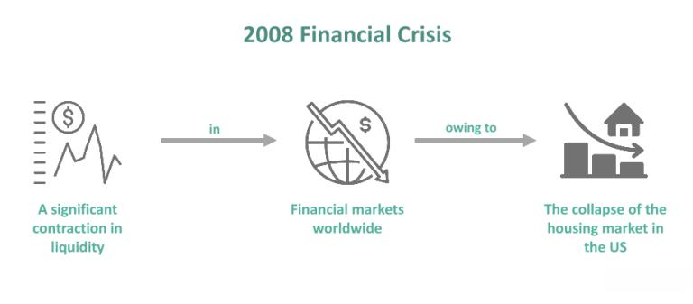

## Table of Contents

## What was the 2008 financial crisis?

The 2008 financial crisis, also known as the global financial crisis, was a severe worldwide economic downturn that started in the United States. It was caused by many banks and financial institutions making risky loans, especially for houses. These loans were bundled into investments and sold to other banks and investors. When people couldn't pay back their loans, the value of these investments dropped sharply, causing banks to lose a lot of money. This led to the failure of big banks like Lehman Brothers and a drop in the stock market.

The crisis spread quickly around the world because many countries were connected through trade and finance. Governments and central banks had to step in to save the failing banks and prevent a total collapse of the financial system. They did this by giving money to banks and lowering interest rates. The crisis caused many people to lose their jobs and homes, and it took years for the global economy to recover. It led to new rules and regulations to make the financial system safer in the future.

## What were the stock market lows during the 2008 financial crisis?

During the 2008 financial crisis, the stock market hit some of its lowest points. The Dow Jones Industrial Average, which is a big measure of the U.S. stock market, reached its lowest point on March 9, 2009. On that day, it closed at 6,547.05. This was a huge drop from its high of over 14,000 in October 2007, before the crisis started. The drop showed how bad the crisis was and how much money people were losing in the stock market.

The S&P 500, another important stock market index, also fell a lot during the crisis. Its lowest point was on the same day, March 9, 2009, when it closed at 676.53. Before the crisis, in October 2007, the S&P 500 was above 1,500. The big drop in the S&P 500 showed that many companies were struggling and that investors were very worried about the economy.

## How did the stock market perform immediately after the 2008 lows?

After hitting its low on March 9, 2009, the stock market started to recover. The Dow Jones Industrial Average began to climb back up. By the end of 2009, it had risen to over 10,000, which was a big jump from its low earlier that year. This showed that people were starting to feel more confident about the economy again. The government's actions to help banks and the economy were starting to work.

The S&P 500 also started to recover after its low in March 2009. By the end of 2009, it had climbed to over 1,100. This was still below where it was before the crisis started, but it was a big improvement from the low point. The recovery of the stock market was slow and uneven, but it showed that the worst of the financial crisis was over and things were getting better.

## What would be the impact of investing $10,000 at the 2008 market lows?

If you invested $10,000 in the stock market at its lowest point on March 9, 2009, your money would have grown a lot over time. Let's say you put that money into an index fund that tracks the S&P 500. By the end of 2009, your investment would have been worth about $14,800. That's a 48% increase in just a few months! This shows how quickly the market can recover after hitting a low point.

Over the long term, your investment would have continued to grow. By the end of 2020, that same $10,000 investment would have grown to over $40,000. This is because the stock market tends to go up over time, even after big drops like the one in 2008. Investing at the bottom of the market can be scary, but it can also lead to big rewards if you are patient and hold onto your investments for the long term.

## What are the key indices to consider when analyzing this investment?

When you want to understand how your investment did, you should look at the S&P 500. This is a big group of 500 companies that shows how the overall U.S. stock market is doing. If you put your money into an S&P 500 index fund at the bottom of the market in 2008, you would see how your investment grew as the market recovered. The S&P 500 is a good way to see the general health of the economy because it includes so many different companies.

Another important index to consider is the Dow Jones Industrial Average. This index tracks 30 big companies in the U.S. It's not as broad as the S&P 500, but it's still a good way to see how some of the biggest and most important companies are doing. If you invested at the market low in 2008, watching the Dow Jones would give you another view of how your investment was doing as the market went up and down. Both the S&P 500 and the Dow Jones can help you understand the big picture of your investment's performance.

## How did different sectors of the market perform post-2008 crisis?

After the 2008 financial crisis, different parts of the stock market had different experiences. The financial sector, which includes banks and insurance companies, was hit the hardest during the crisis. Many big banks failed or needed help from the government. But after the crisis, the financial sector started to recover slowly. By 2010, banks were doing better, and their stocks started to go up again. This was because the government made new rules to make banks safer, and people started to trust banks again.

The technology sector did pretty well after the crisis. Companies like Apple and Google kept growing and making new products. People were still buying computers, phones, and other tech stuff even during the crisis. So, the tech sector's stocks went up faster than other parts of the market. By 2010, tech companies were doing really well, and their stocks were worth a lot more than they were at the bottom of the market in 2008.

The energy sector, which includes oil and gas companies, had a mixed time after the crisis. At first, energy stocks went up because oil prices were high. But then, around 2014, oil prices started to fall a lot, and energy stocks went down too. So, while the energy sector did okay right after the crisis, it had some ups and downs in the years that followed. Overall, different sectors of the market had different journeys as the economy got better after the 2008 crisis.

## What are the long-term effects of investing at market lows?

Investing at market lows can lead to big rewards over the long term. If you put money into the stock market when it's at its lowest point, like during the 2008 financial crisis, you buy stocks when they are very cheap. As the market recovers and grows, the value of your investment can go up a lot. For example, if you invested $10,000 in the S&P 500 at the bottom of the market in 2008, your money would have grown to over $40,000 by the end of 2020. This shows how powerful it can be to buy low and hold onto your investments for many years.

However, investing at market lows also comes with risks. It can be scary to put money into the market when it's at its lowest because no one knows for sure when it will start to go up again. You might feel nervous and want to sell your investments if the market goes down even more before it starts to recover. But if you can be patient and keep your money in the market, you are likely to see good returns over time. The key is to stay calm and not panic, even when the market is going through tough times.

## How does dollar-cost averaging compare to a lump sum investment during the 2008 lows?

Dollar-cost averaging means you put money into the market little by little over time, instead of all at once. If you used dollar-cost averaging during the 2008 lows, you would have spread out your investment over several months or years. This can be less scary because you're not putting all your money in at one time when the market is at its lowest. It also means you buy some stocks when they are really cheap, but also some when they start to go up. This can help smooth out the ups and downs of the market and might make you feel safer.

On the other hand, a lump sum investment means you put all your money into the market at once, like right at the bottom of the 2008 lows. If you did this, you would have bought stocks when they were at their cheapest. As the market recovered, your investment would have grown a lot. For example, if you invested $10,000 at the market low in March 2009, it could have grown to over $40,000 by the end of 2020. But this can be risky because if the market goes down even more after you invest, you might lose a lot of money before it starts to go up again.

Both strategies have their pros and cons. Dollar-cost averaging can help you feel more comfortable and reduce some risk, but you might not get as big of a reward as if you had put all your money in at the very bottom. A lump sum investment at the market low can lead to big gains, but it's also more of a gamble because you're betting that the market will start to go up right away. The best choice depends on how much risk you're willing to take and how you feel about investing.

## What are the tax implications of such an investment over time?

When you invest money and it grows over time, you have to think about taxes. If you put money into the stock market at the 2008 lows and then sold your investments later, you would have to pay taxes on the profit you made. This profit is called a capital gain. If you held onto your investments for more than a year before selling, you would pay a lower tax rate on those gains, called the long-term capital gains tax. But if you sold your investments within a year, you would pay a higher tax rate, called the short-term capital gains tax, which is the same as your regular income tax rate.

Another thing to think about is dividends. Some companies pay out part of their profits to their shareholders as dividends. If you own stocks that pay dividends, you have to pay taxes on that money too. The tax rate on dividends can be lower if you hold the stocks for a certain amount of time. Also, if you put your money into a retirement account like an IRA or a 401(k), you might not have to pay taxes on your investment growth or dividends right away. But when you take money out of these accounts later, you will have to pay taxes on it. So, it's important to think about taxes when you're planning your investments over the long term.

## How did global markets react to the 2008 financial crisis and what was the impact on a $10,000 investment?

The 2008 financial crisis affected markets all over the world. In the United States, the stock market fell a lot, but it wasn't the only place. In Europe, stock markets in countries like the UK, Germany, and France also went down a lot. In Asia, markets in Japan, China, and India dropped too. This happened because many countries' economies are connected, so when the U.S. had problems, it affected other places too. Governments and central banks around the world tried to help by giving money to banks and making rules to stop the crisis from getting worse.

If you invested $10,000 in the U.S. stock market at its lowest point in March 2009, your money would have grown a lot over time. By the end of 2009, your investment could have been worth about $14,800. This is because the market started to recover quickly after hitting its low. If you kept your money in the market for a longer time, like until the end of 2020, your $10,000 could have grown to over $40,000. This shows how powerful it can be to invest when the market is at its lowest and then wait for it to go back up. But remember, the same thing might not happen in every country's market, because each one can recover at a different speed.

## What risk management strategies could have been employed to optimize returns from a 2008 investment?

One way to manage risk during a 2008 investment would be to diversify your portfolio. This means not putting all your money into one type of investment, like just stocks. Instead, you could spread your money across different kinds of investments, like stocks, bonds, and maybe even some real estate. By doing this, if one part of your investment goes down a lot, the other parts might not go down as much or might even go up. This can help protect your money and make your investment safer.

Another strategy is to use stop-loss orders. A stop-loss order is like a safety net for your investment. You set a price at which you want to sell your stocks if they go down to that level. This can help you limit how much money you lose if the market keeps going down after you invest. But you have to be careful with stop-loss orders because if the market goes down a little and then goes back up, you might sell your stocks too early and miss out on the recovery. So, you need to think carefully about where to set your stop-loss orders.

## How would the performance of a $10,000 investment at the 2008 lows compare to other major financial crises?

If you invested $10,000 at the market lows during the 2008 financial crisis, you would have seen big gains over time. By the end of 2009, your investment could have grown to about $14,800, a 48% increase. If you held onto your investment until the end of 2020, it could have been worth over $40,000. This shows how powerful it can be to buy stocks when they are very cheap and wait for the market to recover. The 2008 crisis was tough, but the market bounced back strongly over the years.

During other major financial crises, the results of a $10,000 investment at the market lows could be different. For example, during the 1929 stock market crash that led to the Great Depression, if you invested at the lowest point in 1932, it would have taken a long time to see big gains. By 1954, your $10,000 could have grown to about $35,000, but it was a slow and bumpy ride. The Dot-com bubble burst in 2000 is another example. If you invested at the market low in 2002, your investment could have grown to around $25,000 by 2010. Each crisis is different, and how well your investment does depends on how quickly the economy recovers and how long you hold onto your investment.

## What were the investment gains in a retrospective analysis?

The 2008 financial crisis, characterised by a severe downturn in global markets, offered a reflective point on the efficacy of long-term investment strategies. During the tumultuous period, investors who maintained their positions in financial markets witnessed substantial returns as the economy gradually stabilized and expanded. Despite the prevailing panic that led many to withdraw their investments, those with a foresight into the cyclical nature of markets discovered significant benefits in adhering to long-term investment principles.

One of the most marked aspects of the post-crisis recovery was the remarkable gains observed in major indices. For instance, the S&P 500, which had plummeted to a low of 676 points in March 2009, achieved substantial recovery by the following decade, surpassing previous all-time highs. The Dow Jones Industrial Average (DJIA) followed a similar trajectory, demonstrating the potential for robust recovery even after severe market depressions. Historical data indicated that maintaining investment positions through market turbulence allowed portfolios to rebalance naturally over time, leveraging the eventual market resurgence.

Success stories from the recovery period provide concrete examples of strategic investments made during the market's nadir. Renowned investors like Warren Buffett capitalized on the opportunity to acquire undervalued assets, guided by a principle of investing in quality companies with sustainable business models at reduced prices. This approach not only mitigated potential losses but also maximized gains once normal market conditions resumed. The strategy underscores the importance of identifying intrinsic value and the potential of reaping benefits from market corrections.

Moreover, mathematical models, such as the Compound Annual Growth Rate (CAGR), illustrate the impact of staying invested through volatile phases. The formula for CAGR is:

$$
\text{CAGR} = \left( \frac{\text{Ending Value}}{\text{Beginning Value}} \right)^{\frac{1}{n}} - 1
$$

where $n$ represents the number of years. This approach helps investors understand the average annual return of investments over a specified period, smoothing out the effects of volatility.

In conclusion, the financial crisis of 2008 and the subsequent recovery period provided empirical evidence that validated long-term investment strategies. Investors who persevered through the downturn were ultimately rewarded with substantial gains, reinforcing the notion that patience and strategic planning are indispensable elements of successful investing. These lessons continue to provide a foundation for contemporary investment philosophies, advocating for resilience and informed decision-making in an unpredictable market landscape.

## References & Further Reading

[1]: Bernanke, B. S. (2015). ["The Courage to Act: A Memoir of a Crisis and Its Aftermath."](https://archive.org/details/couragetoactmemo0000bern) W. W. Norton & Company.

[2]: Geithner, T. F. (2014). ["Stress Test: Reflections on Financial Crises."](https://www.amazon.com/Stress-Test-Reflections-Financial-Crises/dp/0804138613) Crown.

[3]: Lewis, M. (2010). ["The Big Short: Inside the Doomsday Machine."](https://books.google.com/books/about/The_Big_Short_Inside_the_Doomsday_Machin.html?id=eParwQ0YdrcC) W. W. Norton & Company.

[4]: Reinhart, C. M., & Rogoff, K. S. (2009). ["This Time Is Different: Eight Centuries of Financial Folly."](https://www.nber.org/system/files/working_papers/w13882/w13882.pdf) Princeton University Press.

[5]: Sornette, D. (2003). ["Why Stock Markets Crash: Critical Events in Complex Financial Systems."](https://www.amazon.com/Why-Stock-Markets-Crash-Financial/dp/0691175950) Princeton University Press.

[6]: Vaitilingam, R. (2009). ["Guide to Financial Market Trends: Money-market and Bond-market Developments in G-10 Countries, 2007-2008,"](https://www.elibrary.imf.org/view/journals/002/2016/169/article-A001-en.xml) OECD Publications.